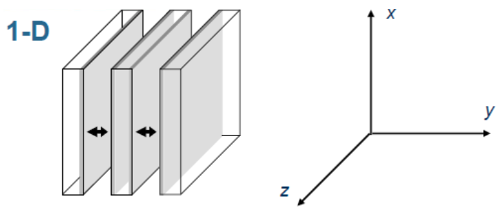
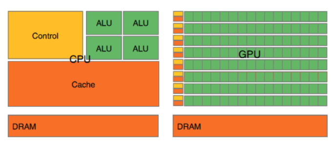
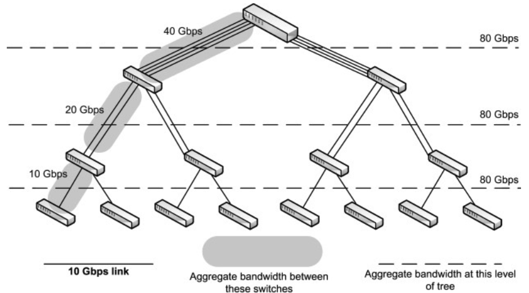

# CS402 High Performance Computing
# Fundamentals
* One big processor isn't enough
   * Expensive to make and maintain
   * Difficult to design efficiently
   * Hard to handle thermal output
   * Single point of failure
* Instead, we connect multiple computers together

   * Jobs are run from the login nodes
   * Compute nodes do the computation - minimal OS, lightweight, but contain the required software
   * Compute nodes are not connected directly to the file system, but go through a network that manages as file system distributed across multiple server nodes
      * May add in RAM or SSDs if the file system is a bottleneck for code (acting as an intermediary)
   * Network is very high bandwidth, with switches spreading out nodes across servers and racks
      * May buy bespoke NICs to deal with high bandwidth traffic
* How do we make a supercomputer fast?
   * Improve the computer architecture (the processors in the compute nodes)
   * Improve the interconnects between the compute nodes and the file system
      * Can be a bottleneck if writing out to multiple files
   * Improve how the compiler interprets the program
   * Improve what the algorithm actually does (make as much parallel as possible)
   * Allow for multiple jobs and resources to be used at the same time

### Computer Architecture:
* Many CPUs rely on similar tricks to improve performance:
   * Increasing clock speed (but this requires more power and cooling)
   * More/smaller transistors on a processor (but Moore's Law is reaching its limit)
   * More cores (greater level of parallelism)
   * Multiple processors (increase levels of parallelism without having to develop bigger chips)
      * Most nodes will have 2, 4 or 8 processors (which are treated as one large processor)
   * Use of GPUs in HPC

### Networking:
* Data needs to be passed between nodes, and to and from file systems
* Bandwidth of interconnects and how we organise data (switches, nodes) are important - each 'hop' adds additional latency
* In order to reduce network time:
   * Utilise faster communication methods
   * Reduce number of network switches
   * Reduce the amount of buffer time on network cards
   * Reduce the amount of congestion on the network
* Common interconnect types:
   * 100 Gigabit Ethernet:
      * 100Gb per second
      * Relatively new
      * Based on the (much older) Ethernet standard
      * Fibre optics
   * Infiniband:
      * Around 80GB per second
      * Older, but much more common
      * Proprietary connectors
      * Fibre optics
* Different networking models allow for different communication styles:
   * Dragonfly - multiple interconnected groups, can be expensive to design and implement
   * Fat tree - tree structure (leaves - compute nodes, internal nodes - network switches), can have a large amount of congestion
   * Torus - nodes connected in a looping cube, hugely complex and expensive

### Compilers:
* Compilers need to constantly develop to:
   * Better optimise code
   * Make the best use of new architectures and instructions
   * Exploit hardware optimisations

### Algorithms:
* Processors have been designed to be highly parallel
* Algorithms need to be designed to exploit this
* Loops should ideally have no dependencies, so each processor can run different iterations of the loop
   * Loop dependencies and control dependencies (branching statements)
* Design so different loops can be ran together, with different processors working on different parts of the algorithm
* Sometimes there is no way to parallelise an algorithm

### Workload and Resource Manager:
* Inefficient for a single person to be the only person allowed on a machine
   * May not need to use the entire machine
   * May not disconnect promptly, wasting time, power and money
* Don't want free access for all permitted users - may impact performance of other programs
* Need something to manage access to nodes, e.g. SLURM

# Thread Level Parallelism
* A thread is an execution context for a processor, including a stream of instructions
* A thread is limited to a particular Non Uniform Memory Access (NUMA) region
   * Most processors will only have one NUMA region
* We can have multiple threads per process
* Often, processors will run one thread per core

### Dependencies:
* Sometimes the ordering of operations is important
* Control dependencies occur when the action of further instructions is dependent on the current state, e.g.
```c
for (i = 0; i < N; i++) {
    float a = rand();
    if (a < 0.5f) {
        b[i] += 1.0f;
    }
}
```
* Easiest way to remove this is to design the algorithm to remove branches
* Or use masking - run both sides of the branch at the same time, and only keep the results that actually occur at the end
* Data dependencies occur when multiple instructions act on the same piece of data
* Flow dependency:
```c
for (i = 0; i < N; i++) {
    a[i] = x[i] + y[i];
}
for (i = 0; i < N; i++) {
    b[i] = a[i] + c[i];
}
```
* Variable depends on the previous instruction - in this example `b` is dependent on the calculations for `a`
* Anti-dependency:
```c
for (i = 0; i < N; i++) {
    b[i] = a[i] + c[i];
}
for (i = 0; i < N; i++) {
    a[i] = x[i] + y[i];
}
```
* Variable depends on a future instruction - in this example `b` is dependent on `a` not being updated
* Output dependency:
```c
for (i = 0; i < N; i++) {
    a[i] = 2;
}
for (i = 0; i < N; i++) {
    x[i] = a[i] + 1;
}
for (i = 0; i < N; i++) {
    a[i] = 5;
}
```
* Ordering of instructions affects output - in this example `a` could be 2 or 5
* Some of these dependencies can be fixed by having multiple names for the same variable (e.g. `a1` and `a2`)
   * This doesn't work for flow dependencies, as we need to compute a value before it is used in another instruction

### Compilers:
* Compilers can try to detect parallelisable code
* Can often detect simple cases, e.g. loops that set data to a static value
* May not always pick up on possible optimisations - will be overly cautious, and struggle with complex loops
* We can help the compiler be reducing the complexity of loops and removing dependencies
   * Can also add flags to code, e.g. `__attribute__((unused))`, use libraries such as OpenMP or set specific compiler flags

### Synchronisation:
* Threads run asynchronously - any thread could be running at any given time
* Sometimes need to access global data
   * Need to make sure data isn't altered, and that all threads have the same data
   * Race condition - threads update data at the same time, and only the last update is actually effective
* Mutex locks stop other threads from accessing some data
* However need to be careful with:
   * Deadlock - threads lock each other out
   * Starvation - low priority threads are not scheduled
      * To fix - switch threads explicitly

### Multihreading vs Multiprocessing:
* A process records running state, and a thread is just concerned with the memory stack
* Threads exist within a process
* Threads don't get time slices
   * They usually switch faster than processes
   * They can starve other threads

### Pipelining:
* Instructions can be split into multiple stages/functional units
* Therefore, directly connect these functional units together so that ideally each functional unit is doing something at any given clock cycle
* Aim is to completely fill the pipeline, however:
   * Dependencies across instructions - horizontal waste
   * Long instructions/latency - vertical waste
   * Branches ruin the pipeline
   
* Superthreading:
   * Aim: reduce vertical waste
   * Each clock cycle contains the instructions of only one thread
   * Switch between threads each cycle
   * Sometimes referred to as fine-grained multithreading
   
* Hyperthreading:
   * Aim: reduce all waste
   * Each clock cycle can contain the instructions of multiple threads
   * Sometimes referred to as simultaneous multithreading (SMT)
      * Can have multiple threads per core if both can be in different functional units of the pipeline
   * Found in many modern processors
   

### OpenMP:
* OpenMP (OMP) is a pragma based multithreading library
   * Compiler manages threads
   * Programmer writes specialised comments where they want the code to be multithreaded
* Different ways threads can be managed:
   * Thread pool - a collection of persistent threads that work can be allocated to
      * Have to manage thread pool - which threads are doing work and which ones aren't?
      * This adds overhead
   * Fork-join - threads are created (forked) and destroyed (joined) once they have completed their work
      * OMP uses this model - the threads only exist inside a parallel region
* OMP is most often utilised through `pragma` comments
   * `#pragma omp parallel {...}` - creates OMP threads and executes the region in parallel
   * `#pragma omp parallel for` - specifies a `for` loop to be ran in parallel over all OMP threads
   * `#pragma omp parallel do` - equivalent to `parallel for` for `do {...} while` loops
   * `#pragma omp parallel loop` - allows for multiple loops to be run concurrently
   * `#pragma omp simd` - indicates that a loop can be transformed into a SIMD loop

### Private Variables:
* Specifies a list of variables that are local to a thread
   * Everything else is global
* Variables can be set and reset in different ways:
   * `private` - initialised inside a thread with the default value for the type, returns to its original value after the parallel region 
   * `firstprivate` - initialised to the value of the variable, also returns to that value after the parallel region
   * `lastprivate` - same initialisation as `firstprivate`, but set to its value in the master thread after the parallel region

### Schedules:
* Ideally we want each thread to run the same length of time
* We can specify how the work is split up between threads
   * `static` - workload is split evenly between threads before compute
      * Some threads could have more to do than others e.g. if a different branch is taken by different threads with some branches requiring more compute
   * `dynamic` - workload is split into equally sized chunks, with threads requesting chunks when required
   * `guided` - same as `dynamic`, but successive chunks get smaller
* Great for load balancing and/or reducing overhead

### Synchronising OMP Threads:
* `#pragma omp critical` - runs the code in the region in a single thread
   * Moves all data to the master thread so that the master thread can run the code before splitting into multiple threads again
* `#pragma omp atomic` - ensures a memory location is accessed without conflict
   * Can be faster (lower overhead) but must be done per instruction

### Reductions:
* Allows for some operation to be applied to the same variable over multiple threads
* Often faster than `atomic` and `critical`
* Limited to a certain number of operations: `min`, `max`, `+`, `-`, `*`, `&`, `|`, `^`, `&&`, `||`
* Works by creating a local variable for each thread, performing the operation and combining the results using the specified operation
* E.g.
```c
int i;
int resultShared = 0;
#pragma omp parallel for reduction(+:resultShared)
for (i = 0; i < N; i++) {
    resultShared += i;
}
```

### Performance Analysis:
* Usually performance of a program is dictated by a single part of the code
   * Often the main compute part of the application
* Other things can increase the runtime, such as:
   * Passing data from main memory/hard drive to cache
   * Process communication
* We often ignore the initialisation and finalisation steps of the program
* CPU performance:
   * Are there extra instructions that aren't requireD?
   * Are we maximising the performance of a core?
* Memory bandwidth:
   * Are we maximising the amount of data we are passing into the CPU?
   * Are we hiding the cost of memory movement?
* Communication bandwidth:
   * Are we sending only necessary data via our network/file system?
   * Is there congestion on the network?
   * Are we waiting on data to be sent or received?
* Different tools to analyse functions/CPU performance/process communication etc. will help with different aspects of performance analysis
* Almost never get 100% utilisation of CPU and/or memory bandwidth (things may not fit into memory well)
* Different systems will behave differently - could optimise code for one system, but it isn't guaranteed to work as well on other systems
* Different characteristics will present themselves with different parameters, e.g. bigger problem size means more reliance on memory bandwidth

# Message Passing Interface
* OpenMP parallelises on shared memory (cache and RAM)
   * Not so useful on supercomputers, where data may be shared on another computer (distributed systems)
* OpenMP implemented at compile-time
   * Makes writing code easier, but very little fine-grained control
* Message Passing Interface (MPI) allows us to pass messages between processors
* Processors don't need to be on the same computer
   * Messages sent over network if to a remote processor
   * Or stored in shared memory if to a local processor
* MPI is an **interface**
   * Many different implementations exist
* Requires a specialised compiler
* Include the header file `#include <mpi.h>`

### MPI Initialisation and Finalisation:
* 3 key elements required for an MPI program (outside of computation):
   * Initialise environment
   * Gain some basic info about the parallel environment
   * At the end, stop the environment

```c
#include <mpi.h>

int main() {
    int world_size, world_rank;

    // Initialise MPI environment/world
    MPI_Init(NULL, NULL);

    // Get no. processors
    MPI_Comm_size(MPI_COMM_WORLD, &world_size);

    // Get processor number/rank
    MPI_Comm_rank(MPI_COMM_WORLD, &world_rank);

    /* Do some computation here */

    // Finish MPI environment
    MPI_Finalize();
}
```

* `MPI_COMM_WORLD` is created by `MPI_Init()`
   * Static value that represents all processors
* MPI allows you to split the processors up into different sections (`MPI_Comm_split()`)
   * Can in theory limit what ranks talk to other ranks
   * By default, all ranks can talk to all other ranks (`MPI_COMM_World`) - this will be the case most of the time

### Sending Messages:
* Packets of data may need to be sent across a network from one processor to another
   * Packet consists of payload and 'envelope' (message length, tag, rank etc.)
* We can send data using `MPI_Send()`
   * This packages data in the envelope, and sends it to the communications device (network card)
   * Communications device manages the routing
   * Receiving processor will send an acknowledgement
* Parameters of function: `MPI_Send(void* data, int count, MPI_Datatype datatype, int destination, int tag, MPI_Comm communicator)`
   * `data` - a pointer to the data being sent
   * `count` - the number of data elements to be sent (e.g. 5 for a 5-element array)
   * `datatype` - the datatype of the data to be sent, as an MPI type
   * `destination` - the processor ID to send the data to
   * `tag` - an identifier tag
      * Most of the time not needed, but used for identifying particular messages
   * `communicator` - the communicator to be used (usually `MPI_COMM_WORLD`)

### Receiving Messages:
* A processor needs to know when it should expect data - we can receive using `MPI_Recv`
* The receiving processor will send an acknowledgement, containing a status marker
* Parameters of function: `MPI_Recv(void* data, int count, MPI_Datatype datatype, int source, int tag, MPI_Comm communicator, MPI_Status* status)`
   * `source` - the processor ID where the data is being received from
   * `status` - the status to be sent back
   * The rest of the parameters are the same as in `MPI_Send()`

### Example MPI Program:
```c
#include <mpi.h>

int main() {
    /* Initial setup */

    /* Computation */
    if (world_rank == 0) {
        int i, data;
        for (i = 1; i < world_size; i++) {
            MPI_Recv(&data, 1, MPI_INT, i, 0, MPI_COMM_WORLD, MPI_STATUS_IGNORE);
            printf("Processor 0 received value %d from processor %d\n", data, i);
        }
    } else {
        int data = world_rank * world_rank;
        MPI_Send(&data, 1, MPI_INT, 0, 0, MPI_COMM_WORLD);
        printf("Processor %d sent %d to processor \n", world_rank, data);
    }

    /* Finalise */
}
```

### Issues with MPI Functions:
* Both `MPI_Send()` and `MPI_Recv()` are blocking functions
   * `MPI_Send()` waits until an acknowledgment is received, and `MPI_Recv()` waits until the message is received
   * Possible deadlock, e.g. if processor 0 is waiting to send a message to processor 1 while processor 1 is waiting to send a message to processor 0
* We have non-blocking versions of both - `MPI_ISend()` and `MPI_IRecv()`
   * Each has an additional parameter - `MPI_Request *request` - which is used to query whether or not the request has been completed (using `MPI_Wait` and `MPI_Test`)

### Communication Modes:
* MPI has flexibility in how communications are carried out
   * **B**uffered - send instructions can start at any point and may complete before a corresponding receive instruction is executed
   * **S**ynchronous - send instructions can start at any point, but can only complete successfully when a receive instruction is executed
   * **R**eady - send can only start if the receive has been executed
* Can be incorporated into blocking or non-blocking
* Prepend the letter of the mode to the instruction
   * E.g. `MPI_Bsend()`. `MPI_IBsend()`, `MPI_Rsend()`, `MPI_Ssend()` where `I` denotes non-blocking

### MPI Types:
* MPI messages need to be common between different processors
* They may require different sizes, so need a unified interface
* Say we wanted to send 4 floats from processor 0 to 1

* Data shown in the previous example is contiguous
   * All the data is uniform with no gaps
* Sometimes our data is not in contiguous memory
   * Could be (an array of) structs or custom classes, or blocks of memory manually addressed
* Call an `MPI_Send()` for each data block occupying contiguous blocks?
   * Lots of messages sent - lots of congestion
   * Lots of confusion if not managed well
   * Lots of overhead, with the envelope being a large proportion of each packet
* Copy all the data into a contiguous block?
   * Only one message being sent
   * Lots of time spent copying memory
   * Not great if dealing with large amounts of data, where memory is limited
* Solution: derived datatypes
   * We can send a single message with different types of data and/or non-contiguous memory
   * Can improve performance, but not a guarantee
   * Derived types need to be committed using `MPI_Type_commit()`
   * Blocks of memory associated with the type are freed using `MPI_Type_free()`

### MPI Derived Types:
* `MPI_Type_contiguous()`:
   * Specifiy a collection of elements with a variable amount of counts
   * Allows for better reuse and less calculations
   * `int MPI_Type_contiguous(int count, MPI_Datatype oldtype, MPI_Datatype *newtype)`
      * Return value 0 if successful, otherwise error number (as with pretty much every other function here)
      * `count` - number of blocks (non-negative)
      * `oldtype` - the old data type
      * `newtype` - the new data type
* Example code:
```c
MPI_Datatype floatContiguous;
MPI_Type_contiguous(3, MPI_FLOAT, &floatContiguous);
MPI_Type_commit(&floatContiguous);
/*
floatContiguous = {(MPI_FLOAT, 0), (MPI_FLOAT, 4), (MPI_FLOAT, 8)}
*/
MPI_Type_free(&floatContiguous);
```
* `MPI_Type_vector()`:
   * Consecutive blocks of contiguous data
   * Each block between contiguous blocks needs to be equally spaced, the same size, and all the same type
   
   * `int MPI_Type_vector(int count, int blocklength, int stride, MPI_Datatype oldtype, MPI_Datatype *newtype)`
      * `blocklength` - number of elements in each block (non-negative)
      * `int stride` - number of elements between the start of each block
* `MPI_Type_create_indexed_block()`:
   * Sometimes the data doesn't start at the beginning, or might have multiple offsets
   * Requires the same number of elements in each, block, all of which should be the same type
   
   * `int MPI_Type_create_indexed_block(int count, int blocklength, const inst offsets[], MPI_Datetype oldtype, MPI_Datatype *newtype)`
      * `offsets[]` - array of offsets, in multiples of `oldtype`
* `MPI_Type_indexed()`:
   * Sometimes the data blocks aren't the same size
   * Requires all of the elements to be the same type
   
   * `int MPI_Type_indexed(int count, const int blocklengths[], const int offsets[], MPI_Datatype oldtype, MPI_Datatype *newtype)`
      * `blocklengths[]` - array of block lengths (all elements must be non-negative)
* `MPI_Type_create_struct()`:
   * Sometimes even the blocks are different types
   * Requires the elements within each individual block to be the same type
   
   * `int MPI_Type_create_struct(int count, const int blocklengths[], const int offsets[], const MPI_Datatype oldtypes[], MPI_Datatype *newtype)`
      * `oldtypes[]` - array of data types for each block

### MPI Types Summary:
|     | Same type in each block | Same no. elements in each block | Same distance between consecutive blocks |
| --- | ----- | ----- | ----- |
| `MPI_Type_vector()` | Yes | Yes | Yes  |
| `MPI_Type_create_indexed_block()` | Yes | Yes| No |
| `MPI_Type_indexed()` | Yes | No | No |
| `MPI_Type_create_struct()` | No | No | No

### Collective Communications:
* Sometimes we need to sync up parts of the together
* Sometimes, all the ranks want to send a message to the same rank (all-to-1 mapping)
* Sometimes, a rank needs to send a message to all other ranks (1-to-all mapping)
* Sometimes, everyone needs to come together to share all their data with everyone else (all-to-all mapping)
* Note that all of these can be blocking or non-blocking

### Barriers:
* Making all the processors sync **can** allow for large blocks of communications to work more efficiently
* We need to set up a barrier to stop all the ranks at the same time
* Only proceed when all the ranks have hit the barrier
* `int MPI_Barrier(MPI_Comm comm)`

### Broadcasting:
* Send some data to every other rank
* `int MPI_Bcast(void *data, int count, MPI_Datatype datatype, int root, MPI_Comm comm)`
   * `data` - the data block to be broadcast
   * `count` - the number of elements in the data block
   * `datatype` - the data type of the data block
   * `root` - the rank where the broadcast originates from
   * `comm` - the communicator where the message will be broadcasted to

### Scattering and Gathering:
* A rank wants to share some different data with each rank

* `int MPI_Scatter(const void *sendbuf, int sendcount, MPI_Datatype sendtype, void* recvbuf, int recvcount, MPI_Datatype recvtype, int root, MPI_Comm comm)`
   * `sendbuf` - the data block to be scattered (only required by the root rank)
   * `sendcount` the number of elements to be scattered (non-negative, only required by the root rank)
   * `sendtype` - the data type to be sent (only required by the root rank)
   * `recvbuf` - pointer to where the received data should be
   * `recvcount` - the number of elements available in the receive pointer
   * `recvtype` - the data type to be received
* Sometimes we want to do the opposite of scattering - in this case we gather (`MPI_Gather()`) the data
   * Same interface as `MPI_Scatter()`, but all send parameters are required by all ranks and all receive parameters are required only by the root rank

### 'All' Communications:
* We can combine broadcasts, scatters and gathers together if needed
* Each of the functions take the same parameters as `MPI_Scatter()` or `MPI_Gather()`, but all parameters are required by all ranks
* `MPI_Allgather()` is a gather, and then a broadcast of the result
* `MPI_Alltoall()` is an all-gather, but where different ranks receive different data

### Reductions:
* Just like OpenMP, we may need to apply an operation over multiple ranks
* We have a reduction function for this, `MPI_Reduce()`
* Full function signature is `int MPI_Reduce(const void *sendbuf, void* recvbuf, int count, MPI_Datatype datatype, MPI_Op op, int root, MPI_Comm comm)`
* `op` - the reduction operator
   * MPI library has a collection of different predefined operations
   * Usually only work with MPI basic types 
   * Examples: `MPI_MAX`, `MPI_SUM`, `MPI_BAND` (binary AND)
   * `MPI_MAXLOC` and `MPI_MINLOC` are more complex, and require a custom `struct`
   * Can also make custom operators: 
      * `int MPI_Op_create(MPI_User_function *user_fn, int commute, MPI_Op *op)`
      * `int MPI_Op_free(MPI_Op *op)`
* Sometimes, the result is required in each of the ranks
   * We can use `MPI_Reduce()` followed by `MPI_Bcast()`, or we can use `MPI_Allreduce()` - which has the same interface as `MPI_Reduce()` but all parameters are required by all ranks
   * `MPI_Allreduce()` is one of the most expensive instructions in MPI - good way of benchmarking network latency

### Packets:
* Data needs to be sent as a collection of packets, but MPI does not specify how the data should be sent
   * Different protocols may be required for different situations
* MPI does not specify how big packets of data should be
   * Dependent on the network card, interface, interconnects, memory, etc.
* Small packets:
   * Copying data from memory to the network card can be interspersed with compute
   * Packets can be made available more quickly
   * More congestion on the network however, as bandwidth is taken up by sending data that isn't needed for compute (envelope)
* Large packets:
   * Ratio of data to metadata (envelope) is better
   * Lower congestion on the network
   * Cost of copying memory is higher, and can't hide it in compute as well
* Not really an optimal packet size - as many factors affect this, including the application algorithm, the data location in memory and hardware (network cards, interconnects etc.)
* MPI interface treats all the messages the same

### Domain Decomposition:
* Each processor needs its own block of data to operate on
* We can split up the mesh so that each processor has a relatively similarly sized block of data
* Data is only sent when required, which minimises the amount of data movement
* How exactly this is done depends on the algorithm and the mesh itself
* 1D composition:
   * 4 processors/ranks, each with an equal strip of data
   
   * Each cell needs data from from direct neighbouring cells
   * Edge data needs to be sent to neighbouring processors (0 and 3 send 8 cells, and 1 and 2 send 16 (all) cells)
      * This isn't ideal - each processor should send an equal amount of data
* 2D composition:
   * Now 4 equal blocks of data
   
   * Each rank now has to send 2x4 pieces of data
* Halos:
   * Trying to merge data can be difficult and expensive, due to the additional computation and synchronisation issues
   * Each block has a halo - duplicate of data from neighbouring ranks
   
      * Flexible sizing, depending on access patterns
   * Priniciple of halos can be applied on many decomposition types
   
      * More complex as you decompose in more dimensions
      * The halos' size and complexity also depends on the access pattern

# Programming Models
* Key aim in HPC is to implement parallel programs with as little cost (time, developers etc.) as possible, as well as to build code that will work for new systems and architectures
   * E.g. getting rid of boilerplate code to make life easier
* Abstract away the need to hard code parallelisation through different methodologies
   * Libraries
   * Domain-Specific Languages
   * Compiler-Based
   * Specialised Languages

### Libraries:
* Imported (and often pre-compiled) code to allow for the abstracttion of a computing concept
* Allows for different backends to be developed, without changing the frontend
* Issues include:
   * Much larger binary files
   * If not developed well, may require some specialised knowledge
   * Extra computation required - can lead to slower performance than hand-optimising
   * When we want the library to be generalised, this may add unnecessary computation in some cases
      * Certain assumptions cannot be made
   
### Domain-Specific Languages (DSL):
* Specialise a library for a particular group of problems
* A DSL extends a language with interpretable functions
   * Usually involves some way of translating from the DSL to compilable code
   * Allows for the DSL to be converted into multiple different variations

### Compiler-Based Parallelisation:
* Libraries can be large and complex to build
* DSLs only work with the correct interpreters
* With both libraries and DSLs, the functionality and some level of specialisation usually has to be written by a developer
* Instead, we can get the compiler to handle a wider range of systems
   * Minimal effort from the developer
* Calculations done at compile time - less runtime overhead
* E.g. OpenMP

### Programming Languages
* Each of the other approaches incur an overhead for utilising them
   * Libraries - larger binary files mean less cache reuse, bigger libraries means more additional compute
   * DSLs - additional compilation steps that may go wrong
   * Compiler - compilers have to be safe so may not optimise as far as possible
* What if the entire language was built on parallelisation and performance from the ground up?

### Performance Portability:
* Comparing different parallelisation methods is difficult:
   * How does it affect the compile time?
   * How does it affect the runtime?
   * How does it translate beteween different hardware/software models?
   * What is the overhead/cost of utilising a parallelisation model?
   * How easy is it to develop in?
   * How easy is it to incorporate into my already-existing code?
* Performance portability is a measurement of an application's performance efficiency for a given problem that can be executed correctly on all platforms in a given set
* Application efficiency: achieved time divided by fastest time
* Architecture efficiency: achieved GFLOPs divided by theoretical peak GFLOPS
* $P(a,e,H) = \begin{cases} \frac{|H|}{\sum_{i \in H}\frac{1}{e_i(a,p)}} \text{ if } i \text{ is supported } \forall i \in H \\ 0 \text{ otherwise}  \end{cases}$
   * $H$ is a set of platforms
   * $a$ is the application
   * $p$ is the parameters for $a$
   * $e$ is the performance efficiency measure
   * Between 0 and 1 - 0 means we can't move the code from one platform to another and 1 means we get the best performance no matter the platform

# Performance Modelling
* Modelling execution time example - atmospheric model:
   * Used in weather forecasting
   * Capture relation among attributes such as velocity of air, temperature, pressure, moisture, etc.
   * Established by physical laws and represented by a set of partial differential equations
* Too complicated to be solved by mathematical derivation, so we resort to numerical methods
* Cannot generate the solution for every physical point, so approximate a continuous space by a finite set of regularly spaced points
   * Calculate the solution at these discrete points
* Communication pattern: each point uses the nine-point stencil to calculate its horizontal motion and the three-point stencil to calculate its vertical motion


### 1D Decomposition:

* If we assume a grid of size $N \times N \times Z$ points and we partition the grid among $P$ processors (along the $y$-axis), then each processor is responsible for a subgrid of size of size $N \times (N/P) \times Z$
   * The computation time $T_{comp}$ for each subgrid can be calculated as $T_{comp} = t_c N (N/P) Z$ where $t_c$ is the average time to calculate a single grid point
* The time spent sending one message $T_{msg}$ can be modelled as $T_{msg} = t_s + t_w L$ where $t_s$ is the message startup time, $t_w$ is the transfer time per byte (both constants given a computing platform) and $L$ is the size of the message
   * If we plot the function of $T_{msg}$ over $L$ as a graph, the graph is a straight line
* Communication time $T_{comm}$ for calculating a subgrid can be computed as $T_{comm} = 2(t_s + t_w 2NZ)$
   * $2NZ$ items on the boundary of the adjacent subgrid that each processor needs, and there are 2 adjacent subgrids
* Hence the performance model for the execution time is:
   * $T_P = T_{comp} + T_{comm} = t_c N (N/P) Z + 2(t_s + t_w 2NZ)$
* Communication time is the overhead of parallelisation
* We know that when we increase $P$ the execution time decreases, but the proportion of communication cost increases
* Execution time increases with increasing $N, Z, t_c, t_s, t_w$

### 2D Decomposition:

* Execution time can be modelled as:
   * $T_{comp} = t_c N (N/P) Z$ (the same as before)
   * $T_{comm} = 4(t_s + t_w 2\frac{N}{\sqrt{P}}Z)$
      * $\frac{N}{\sqrt{P}}$ is the length of the boundary in the $x$ and $y$ directions
   * $T_P = T_{comp} + T_{comm} = \frac{t_c N^2 Z + t_s 4P + t_w 8NZ\sqrt{P}}{P}$
* Note that this model is an oversimplification:
   * Bandwidth might have to be shared between multiple processes
   * Communication could be blocking/non-blocking - computation and communication may overlap

### Decomposition Analysis:
* Data on boundary surfaces needs to be communicated
* The lower surface-to-volume ratio, the better
   * Surface - communication
   * Volume - computation
   * Lower ratio means lower proportion of communication time in total execution time
   * We can use this as a metric to determine the best decomposition strategy
* Consider a 3D grid and assume the grid is a cube with volume $V$
   * The length of each dimension is $V^{\frac{1}{3}}$
   * $V$ is partitioned over $n$ processors
   * The volume of each partition is $\frac{V}{n}$


|    | Subgrid Volume | i | j | k | Subgrid Surfaces | Surface to Volume Ratio
| --- | ---- | ---- | --- | --- | --- | --- |
| 1D  | $V/n$ | $V^{\frac{1}{3}}/n$ | $V^{\frac{1}{3}}$ | $V^{\frac{1}{3}}$ | $2V^{\frac{2}{3}}$ | $2n/V^{\frac{1}{3}}$
| 2D | $V/n$ | $V^{\frac{1}{3}}/n^{\frac{1}{2}}$ | $V^{\frac{1}{3}}/n^{\frac{1}{2}}$ | $V^{\frac{1}{3}}$ | $4V^{\frac{2}{3}}/n^{\frac{1}{2}}$ | $4n^{\frac{1}{2}}/V^{\frac{1}{3}}$
| 3D | $V/n$ | $V^{\frac{1}{3}}/n^{\frac{1}{3}}$ | $V^{\frac{1}{3}}/n^{\frac{1}{3}}$ | $V^{\frac{1}{3}}/n^{\frac{1}{3}}$ | $6(V/n)^{\frac{2}{3}}$ | $6n^{\frac{1}{3}}/V^{\frac{1}{3}}$

### Speedup:
* The performance improvement from parallelising code can be measured by speedup
   * Speedup is the ratio of execution time of a serial implementation to the execution time of a parallel implementation
* If $P$ processors are used, then $S(P) = \frac{t_1}{t_P}$
   * In practice, we run the serial program and parallel program multiple times and obtain the average execution time of multiple runs
* Linear speedup is regarded as optimal
* Maximum speedup for a parallel program with $P$ processors is $P$
   * The workload of an application is split evenly among $P$ processes
   * Assume no overhead such as communication, synchronisation etc.
   * The least execution time of the parallel version is $\frac{t_1}{P}$
   * So the maximum speedup is $S(n) = \frac{t_1}{(\frac{t_1}{P})} = P$
* Speedup increases as the number of processors increases, but the gap with the maximum speed also increases
* After speedup reaches a maximum speedup, adding further processors is of no benefit and may harm performance

   * Our performance model is $T_P = T_{comp} + T_{comm} = t_c N (N/P) Z + 2(t_s + t_w 2NZ)$ - eventually the application becomes limited by $T_{comm}$ and the parallelisation becomes less and less efficient
   * Surface-to-volume ratio becomes even larger
* Parallel efficiency:
   * $E(n) = \frac{S(P)}{P}$
   * Parallel programs are usually not 100% efficient, and $S(P) \ll P$

### Iso-Efficiency:
* How the amount of computation performed $N$ must scale with the number of processors $P$ to keep parallel efficiency $E$ constant
* Parallel application becomes less efficient with more processes as the computation volume allocated to each process becomes less and less, hence increasing the proportion of execution time that is communication overhead
* $N$ as a function of $P$ is called an algorithm's iso-efficiency function
   * Lower order of $P$ means more scalable
* An algorithm with an iso-efficiency function of $N = O(P)$ is highly scalable
   * E.g. if we multiply $P$ by 5, then we only need to multiply $N$ by 5 to maintain efficiency
* An algorithm with a quadratic of exponential iso-efficiency function is less scalable
* 1D decomposition:
   * $S(P) = \frac{t_cN^2ZP}{t_cN^2Z + 2t_sP + t_w4NZP}$
   * Parallel efficiency can be computed as $E = \frac{t_cN^2Z}{t_cN^2Z + 2t_sP + t_w4NZP}$
   * $E$ can be reduced to $E = \frac{t_c}{t_c + \frac{t_s2P}{ZN^2} + \frac{t_w4P}{N}}$
   * When $N=P$, $E$ remains approximately constant as $P$ changes (except when $P$ is small)
* 2D decomposition:
   * Parallel efficiency can be computed as $E = \frac{t_cN^2Z}{t_cN^2Z + t_s4P + t_w8NZ\sqrt{P}}$
   * When $N = \sqrt{P}$, $E$ remains constant as $P$ increases
   * Thus, for this particular communication pattern applying 2D decomposition will achieve better scalability than 1D decomposition

### Speedup Approach:
* We can say something like 'this algorithm achieved a speedup of $S$ on $P$ processors with problem size $N$'
* This approach can give us some ideas about the algorithm quality, but we cannot judge its quality on a single example of speedup data
* Consider a sequential algorithm and its optimal execution time $T = N + N^2$, where $N$ is the problem size
   * Parallel algorithm 1: $T = N + \frac{N^2}{P}$ (partitions the computationally expensive $O(N^2)$ part with no other costs)
   * Parallel algorithm 2: $T = \frac{N + N^2}{P} + 100$ (partitions the whole computation with a fixed overhead cost of 100)
   * Parallel algorithm 3: $T = \frac{N + N^2}{P} + 0.6P^2$ (partitions the whole computation with a variable overhead cost of $0.6P^2$)
* The speedup achieved by these algorithms becomes noticeably different when $P$ becomes large


### Amdahl's Law:
* Let the serial fraction of an application (i.e. the part not amenable to parallelisation) be $f$
* If we make the remaining part $n$ times faster by running it on $n$ processors, the time taken $T_n$ is $T_n = \frac{(1-f)T_1}{n} + fT_1$
* Hence speedup is $S(n) = \frac{n}{(1-f) + nf} \leq \frac{1}{f}$
* Amdahl's Law shows us the limitation of parallelising code (the upper bound of the speedup for a particular algorithm)
* It cannot tell if other algorithms with greater parallelism exist for the problem

### Asymptotic Analysis:
* In this approach, we can say something like 'the algorithm takes time $O(n\log n)$ on $n$ processors'
* Ignores the lower-order terms
* Only tells us the order of execution time of a program, not the actual execution time

# GPUs and CUDA
### GPU Architecture:

* Consists of a number of streaming multiprocessors (SMs), across which a number of threads are shared by the thread execution control unit
* Each SM has a number of GPU cores with units for performing typical operations, as well as a unit for performing special functions (e.g. sin, cos, sqrt)

* Integer, floating point and tensor core (performs matrix multiplications)
* Cores share registers and L0 cache
* Warp scheduler schedules threads across cores

### Design of CPUs and GPUs:
* GPU is typically 100x faster than a multicore CPU, due to the design differences between CPUs and GPUs
* The design objective of a CPU is to optimise the performance of sequential code
   * CU obtains instructions, figures out what data is needed and where it is stored and signals the functional units (ALUs) to run the instructions
   * CU is complicated - it may execute instructions out of their sequential order (single core) or in parallel (multicore), perform branch prediction and data forwarding (where data is made immediately available for subsequent instructions instead of having to write to and read from memory)
   * It also has a large cache to reduce data access latencies, and a powerful ALU
* A CPU has a latency-oriented design - minimise the average latency of instructions in sequential code
   * Applications with one or very few threads achieve higher performance with a CPU
* A GPU aims to use as much of the chip area as possible for floating point an integer calculations
   * Each calculation is simple - simple CU and simple ALUs
   * Calculation is more important than cache - small cache allows data access to have long latency
* Throughput-oriented design - maximise the total throughput (instructions completed per unit time) of a large number of threads, allowing individual threads to take a longer time
   * The application runs with a large number of threads
   * While some threads are waiting for long-latency operations (e.g. memory access) the GPU can always find other threads to run
* CPU vs GPU architecture:


### CUDA:
* CUDA is the most popular programming model for writing parallel programs on a GPU
* A CUDA program has two parts:
   * Host code: the part run on the CPU
   * Device code: the part run on the GPU
* The functions that are run on the GPU are marked with CUDA keywords
* A function that is run on a GPU is called a kernel function
* Keywords in function declaration:
   * `__global__` - a kernel function to be run on the GPU
   * `__host__` - run on the host (all functions are host functions by default if they do not have any CUDA keywords)
* CPU program example:
```c
void vecAdd(float* h_A, float* h_B, float* h_C, int n) {
    for (int i = 0; i < n; i++) {
        h_C[i] = h_A[i] + h_B[i];
    }
}

int main() {
    // Memory allocation for h_A, h_B, h_C and I/O to read in h_B and h_C, N elements each
    vecAdd(h_A, h_B, h_C, N);
}
```
* Outline of a `vecAdd()` function for a GPU:
   1. Allocate device memory for A, B and C and copy A and B from the host memory to the device memory
   2. Launch kernel code to perform the actual operation on the GPU
   3. Copy the result C from the device memory to the host memory and free the device vectors

### Memory Management in CUDA:
* `cudaMalloc(void** devPtr, size_t size)`
   * Allocate the device memory
   * `devPtr` - a pointer to the address of the allocated memory
   * `size` - size of the allocated memory
* `cudaMemcpy(dst, src, count, kind)`
   * For memory data transfer
   * `dst` - the destination location of the data to be copied
   * `src` - the source location of the data
   * `count` - the size of the data
   * `kind` - the kind of memory copying occurring (host to host, host to device, device to device or device to host)
* `cudaFree(data)`
* `vecAdd()` function with CUDA memory management:
```c
void vecAdd(float* A, float* B, float* C, int n) {
    int size = n * sizeof(float);
    float *d_A, *d_B, *d_C;
    cudaMalloc(&d_A, size);
    cudaMemcpy(d_A, A, cudaMemcpyHostToDevice);
    cudaMalloc(&d_B, size);
    cudaMemcpy(d_B, B, cudaMemcpyHostToDevice);
    cudaMalloc(&d_C, size);

    // Launch kernel code to perform the actual operation on the GPU

    cudaMemcpy(d_C, C, cudaMemcpyDeviceToHost);
    cudaFree(d_A);
    cudaFree(d_B);
    cudaFree(d_C);
}
```

### Execution Model:
* The execution starts with host (CPU) execution
* When a kernel function is called, it is executed by a large number of threads on the GPU
   * All the threads are collectively called a grid
* When all threads of a kernel complete their execution, the corresponding grid terminates (like OpenMP)
* The execution continues on the host until another kernel is called
* When a host launches a kernel, CUDA generates a grid of thread blocks
   * Each block contains the same number of threads
   * Each thread runs the same kernel function
   * Example: each block contains 256 threads
   
* The grid and blocks can be multi-dimensional

   * `gridDim(x, y, z)` - the dimensions of the grid
   * `blockDim(x, y, z)` - the dimensions of the block
   * `blockIdx(x, y, z)` - the coordinates (ID) of the block in the grid, can be accessed by the calling thread to obtain which block it is in
   * `threadIdx(x, y, z)` - the local coordinates (ID) of a thread in a block, can be accessed by the thread to obtain its local position in the block
   * These values are pre-initialised by the CUDA runtime library when invoking the kernel function

### Execution Configuration:
* Set two parameters between `<<<` and `>>>` before the function parameters, for example:
   * `dim3 grid(3, 2, 4), block(128, 1, 1);` (here we define `dim3` as a data type)
   * `vecAdd <<<grid, block>>>(A, B, C);` - first parameter defines the grid dimension, and the second parameter defines the block dimension
* The dimensions are then stored in `gridDim` and `blockDim`
* If single values are specified in the execution configuration, it means the grid or the block is specified as 1D. Example:
```c
int vectAdd(float* A, float* B, float* C, int n) {
    // Allocate memory and copy to device
    vecAddKernel<<<ceil(n / 256.0), 256>>>(d_A, d_B, d_C, n);
    // Copy from device to host and free device memory
}
```

### Workload Distribution:
* Multiple threads run the same kernel functions simultaneously
* Use different threads to process different data items
* Workload distribution: which threads process which data items?
* Assume the following grid of blocks are generated to compute `C_d = A_d + B_d`

   * `gridDim(x, y, z) = (N, 1, 1)`, `blockDim(x, y, z) = (256, 1, 1)`, `blockIdx = (x, 0, 0)`, `threadIdx = (x, 0, 0)`
* We want to allocate a thread to compute each `A_d[i] + B_d[i]`
* The threads use their indices (`blockIdx` and `threadIdx`) to:
   * Distinguish themselves from each other
   * Identify the part of the data that they are to process
* Kernel function for a 1D grid and block:
```c
__global__
void vecAddKernel(float *A, float* B, float* C, int n) {
    int i = threadIdx.x + blockDim.x * blockIdx.x;
    if (i < n) C[i] = A[i] + B[i]
}
```
* Local variables in the kernel function are private to each thread
   * Will not interfere with another thread performing operations on the same variable
* `if` statement used as only the first `n` threads perform the addition
   * Number of threads may be bigger than the data items
   * Allows the kernel to process vectors of any lengths

### Compilation Process of a CUDA Program:

* NVCC (NVIDIA CUDA Compiler) uses the CUDA keywords to separate the host code and the device code
* The host code is further compiled with a standard C compiler and run as a CPU process
* The device code is first compiled by NVCC to PTX code (assembly language)
* The PTX code is further compiled by NVCC to an executable
   * Just-in-time compiler when we run the device code
   * Enables the CUDA program to achieve the best performance across various GPU architectures without requiring a pre-compiled executable for each possible architecture

### Timing GPU Code:
```c
cudaEvent_t start, stop;
// Create events in the GPU memory
cudaEventCreate(&start);
cudaEventCreate(&stop);

// Issue commands to GPU, which are placed in a queue (CPU and GPU run asynchronously). GPU runs commands in order that they are in the queue

// cudaEventRecord() records a timestamp for the event when this function is reached in the program
cudaEventRecord(start, 0);
vecAddKernel<<<ceil(n / 256.0), 256>>>(dA, dB, dC, n);
cudaEventRecord(stop, 0);
cudaEventSynchronize(stop);

cudaEventElapsedTime(&time, start, stop);
cudaEventDestroy(start);
cudaEventDestroy(stop);
```
* We need to use these special timing functions because of the asynchronous execution between the CPU and the GPU
   * After the CPU launches the kernel function, it continues to perform subsequent tasks
   * It does not wait for the GPU to complete the kernel function
* To synchronise the CPU and GPU, use:
   * `cudaDeviceSynchronize()`
   * `cudaEventSynchronize(event_object)`

# Parallel I/O
* Parallel I/O is when multiple processes of a parallel program access different parts of a common file at the same time

* Assume 4 processes compute the elements in a matrix in parallel and the results need to be written to the disk
* First solution: all processes send data to process 0, which then writes to a file

* Advantages:
   * I/O system only needs to deal with I/O from one process
   * Do not need a specialised I/O library
   * Results in one file, which is easy to manage
* Disadvantages:
   * Single node bottleneck and point of failure
   * Poor performance
   * Poor scalability
* Now suppose we have each process writing to a separate file

* Advantages:
   * Does I/O in parallel
   * Much better performance
* Disadvantages:
   * We now have lots of small files to manage
   * How do we read the data back when the number of processes changes?
   * Does not interoperate well with other applications
* Now suppose we have multiple processes of a parallel program accessing data from a common file

* Advantages:
   * Simultaneous I/O from any number of processes
   * Excellent performance and scalability
   * Results in a single file which is easy to manage and interoperates well with other applications
   * Maps well onto collective operations
* Disadvantages:
   * Requires more complex I/O library support
   * When one process is accessing a file, it locks it and other processes cannot access it
   * Need the support of simultaneous access by multiple processes (which a traditional I/O library doesn't support)

### Data Sieving:
* Data sieving is used to combine lots of small accesses into a single larger one
   * Reducing the number of I/O operations
* Suppose we have a file in which different processes desire to access different regions

* Using data sieving for writes is more complicated:

   * Read the entire region first
   * Make the changes
   * Write the block back
* Requires locking in the file system
   * Can result in false sharing (processor 1 can't read data that is locked by processor 0, even if processor 0 doesn't need that data)

### Collective I/O:
* Problems with independent, non-contiguous accesses (everyone accesses their part of the file from each disk)
   * Lots of small accesses (9 separate accesses in the example below)
* Collective operations:
   * Underlying I/O layers know what data is being requested by each process
   * First phase reads the entire block
   * Second phase moves data to final destinations
* In the below example, p0 wants to read red, p1 wants to read green and p2 wants to read orange

* Collective I/O is coordinated access to storage by a group of processes
   * Collective I/O functions must be called by all processes participating in I/O at the same time
   * Allows I/O layers to know more as a whole about the data to be accessed

### Parallel I/O Example and MPI Functions:
* Consider a 16x16 array that is stored in the disk in row-major order
* Each of 16 processes access a 4x4 subarray

* Corresponding access patterns in the file:

* `int MPI_File_seek(MPI_File mpi_fh, MPI_Offset offset, int whence)`
   * `mpi_fh` - file handle
   * `offset` - file offset
   * `whence` - update mode
   * Updates the individual file pointer according to `offset` and `whence`, the latter of which has the following possible values:
      * `MPI_SEEK_SET` - the pointer is set to `offset`
      * `MPI_SEEK_CUR` - the pointer is set to the current pointer position plus `offset`
      * `MPI_SEEK_END` - the pointer is set to the end of the file plus `offset`
* `int MPI_File_read(MPI_File mpi_fh, void *buf, int count, MPI_Datatype datatype, MPI_Status *status)`
   * `buf` - the initial address of the buffer (where the data is to be read to)
   * `count` - the number of elements in the buffer
   * `datatype` - the datatype of each buffer element
   * `status` - status object

### Access Pattern 1:
```c
MPI_File_open(..., filename, ..., &fh);
for (int i = 0; i < n_local_rows; i++) {
    // Set offset
    MPI_File_seek(fh, offset, ...);
    MPI_File_read(fh, row[i], 4, ...);
}
```
* Individual file pointer per process per file handle
* Each process sets the file pointer with some suitable offset
* The data is then read into the local array
* 64 independent I/O operations (4 for each process)

### Access Pattern 2:
`int MPI_File_read_all(MPI_File mpi_fh, void *buf, int count, MPI_Datatype datatype, MPI_Status *status)`
   * A collective version of `MPI_File_read` (with the same parameters)

```c
MPI_File_open(..., filename, ..., &fh);
for (int i = 0; i < n_local_rows; i++) {
    // Set offset
    MPI_File_seek(fh, offset, ...);
    MPI_File_read_all(fh, row[i], 4, ...);
}
```
* Similar to access pattern 1 but using collectives
* All processes that opened the file will read data together (with each having their own access information)
   * Each process reads a row all in one go
* This is a blocking read
* 16 independent I/O operations (1 for each process)

### Access Pattern 3:
* File view:
   * The set of data visible to a process in a file, defined by displacement, etype, and filetype
* Displacement:
   * Defines the location where a view begins
   * Position relative to the beginning of a file
* etype (elementary datatype):
   * Unit of data access and positioning
   * Can be a pre-defined or derived datatype
   * Displacement is expressed as a multiple of etypes
* Filetype:
   * Defines a template/pattern in a file accessible by a process
* Example:

* View is a repeated pattern defined by filetype (in units of etypes), beginning at the displacement
* In our example, to construct the derived datatype for the filetype use `MPI_Type_vector(count, blocklen, stride, oldtype, newtype)`
* Groups of processes use complementary views to achieve global data distribution

* `int MPI_File_set_view(MPI_File mpi_fh, MPI_Offset disp, MPI_Datatype etype, MPI_Datatype filetype, char *datarep, MPI_Info info)`
   * Describes a part of the file accessed by a MPI process
   * `datarep` - data representation (string)
   * `info` - info object

```c
MPI_Type_vector(4, 4, 16, ..., &subarray);
MPI_Type_commit(&subarray);
MPI_File_open(..., filename, ..., &fh);
MPI_File_set_view(fh, disp, MPI_INT, subarray, ...);
MPI_File_read(fh, local_array, 1, subarray, ...);
MPI_File_close(&fh);
```
* Note there is no `for` loop anymore
* Each process creates a derived datatype to describe the non-contiguous access pattern
* We thus have a file view and independent access
* Change each process' view of the data in the file using `MPI_File_set_view()`
* The reads are still independent
* 16 independent requests, but 4 non-contiguous accesses
   * So there are 64 accesses in total

### Access Pattern 4:
```c
MPI_Type_vector(4, 4, 16, ..., &subarray);
MPI_Type_commit(&subarray);
MPI_File_open(..., filename, ..., &fh);
MPI_File_set_view(fh, disp, MPI_INT, subarray, ...);
MPI_File_read_all(fh, local_array, 1, subarray, ...);
MPI_File_close(&fh);
```
* The same as before, but now using the collective `MPI_File_read_all()` function
* Creates and commits the datatype as before
* `MPI_File_set_view()` is collective
* Reads are now collective

### Access Patterns Summary:
* Choose depending on the application
* Combine multiple I/O requests into a bigger request
* Collectives perform better than individual reads
* Pattern 4 offers (potentially) the best performance

### Data Access Routines:
* There are different forms of data access routines
* According to positioning methods, there are:
   * Explicit offset
   * Individual file pointer
   * Shared file pointer
* According to synchronism, there are:
   * Blocking
   * Non-blocking
* According to coordination, there are:
   * Collective
   * Non-collective

### Positioning:
* When a file is opened by a process, a file pointer is created and owned by the process
   * `int MPI_File_open(MPI_Comm comm, char *filename, int amode, MPI_Info info, MPI_File *mpi_fh)`
* The names of the individual file pointer routines contain no positional qualifier (`MPI_File_read` and `MPI_File_write`)
* The data access routines that accept explicit offsets contain `_at`, e.g.
   * `int MPI_File_write_at(MPI_File mpi_fh, MPI_Offset offset, void *buf, int count, MPI_Datatype datatype, MPI_Status *status)`
* When a file is opened collectively by a group of processes, a shared file pointer is created and shared by these processes
* The data access routines that use shared file pointers contain `_shared`, e.g.
   * `int MPI_File_write_shared(MPI_File mpi_fh, void *buf, int count, MPI_Datatype datatype, MPI_Status *status)`
* When calling `MPI_File_open`:
   * An individual file pointer is created by each process in the communicator
   * A shared file pointer is created and shared by these processes
   * A process can open a file independently of other processes by using the `MPI_COMM_SELF` communicator
* The three positioning methods do not affect each other

### Synchronism:
* A blocking I/O call (default) will not return until the I/O request is completed
* A non-blocking I/O call initiates an I/O operation and then immediately returns
   * Format: `MPI_File_i<xxx>(MPI_File mpi_fh, void *buf, int count, MPI_Datatype datatype, MPI_Request *request)`
* Use `MPI_Wait`, `MPI_Test`, or any of their variants to test whether the I/O operation has been completed (using the `request` handle)
* It is erroneous to access the application buffer of a non-blocking data access operation between the initiation and completion of the operation, e.g. 
```c
MPI_File_iwrite(..., &buf, ..., &request);
buf[0] = 1;
```
* Instead do:
```c
MPI_File_iwrite(..., &buf, ..., &request);
MPI_Wait(&request, &status);
buf[0] = 1;
```

### Coordination:
* Every non-collective data access routine as a collective counterpart
* Blocking I/O: `MPI_File_write()`, `MPI_File_write_at()`
   * Collective: `MPI_File_write_all()`, `MPI_File_write_at_all()`
* Non-blocking I/O: `MPI_File_iwrite()`, `MPI_File_iwrite_at()`
   * Collective: `MPI_File_iwrite_all()`, `MPI_File_iwrite_at_all()`
* Blocking I/O with shared file pointer: `MPI_File_write_shared()`
   * Collective: `MPI_File_write_ordered()`
   * The processes access the shared pointer in a particular order (usually in increasing order of rank)

### I/O Consistency:
* When one or more processes write to a file, we need to make sure consistency is maintained in the following cases:
   * One process writes some data, and the same process reads the data later
   * One processes writes some data, and another process reads the data later
   * Two processes write to the same file
* The I/O routine is considered 'completed' when the application buffer is copied to the system buffer (a holding place for data to be written to a disk), but the system will only write to disks when necessary
* MPI can automatically guarantee consistency in some cases
* When MPI does not automatically do so, the user should take steps to ensure consistency
* Example - Process 0:
```c
MPI_File_open(MPI_COMM_WORLD, ...);
MPI_File_write_at(off=0, cnt=100);
MPI_File_read_at(off=0, cnt=100);
```
* Process 1:
```c
MPI_File_open(MPI_COMM_WORLD, ...);
MPI_File_write_at(off=0, cnt=100);
MPI_File_read_at(off=100, cnt=100);
```
* In this case, MPI guarantees that the data will be read correctly
   * Each process checks first if the data is in the system buffer, and if this is the case it will not have to go to the disk
* Suppose now that each process wants to read what the other process wrote (overlapping accesses)
* Process 0:
```c
MPI_File_open(MPI_COMM_WORLD, ...);
MPI_File_write_at(off=0, cnt=100);
MPI_Barrier();
MPI_File_read_at(off=100, cnt=100);
```
* Process 1:
```c
MPI_File_open(MPI_COMM_WORLD, ...);
MPI_File_write_at(off=100, cnt=100);
MPI_Barrier();
MPI_File_read_at(off=0, cnt=100);
```
* In this case, MPI does not guarantee that the data will be read correctly - each process is not guaranteed to read the data written by the other process
* To ensure consistency:
   * Set atomicity to true: the step of writing the data to the system buffer and the step of transferring data to storage devices becomes an atomic step
   * Close the file and reopen it: closing a file will force all previous writes to be transferred to storage devices
   * Use `MPI_File_sync()`: all previous writes are transferred to storage devices
* Maintaining consistency example:
* Process 0:
```c
MPI_File_open(MPI_COMM_WORLD, ..., &fh1);
// Do this
MPI_File_set_atomicity(fh1, 1);
// Or this
MPI_File_close(&fh1);
// Or this
MPI_File_sync(fh1);
MPI_File_write_at(off=0, cnt=100);
MPI_Barrier();
MPI_File_read_at(off=100, cnt=100);
```
* Process 1:
```c
MPI_File_open(MPI_COMM_WORLD, ..., &fh2);
// Do this
MPI_File_set_atomicity(fh2, 1);
// Or this
MPI_File_close(&fh2);
// Or this
MPI_File_sync(fh2);
MPI_File_write_at(off=100, cnt=100);
MPI_Barrier();
MPI_File_read_at(off=0, cnt=100);
```

### MPI File Info:
* `MPI_Info` is an unordered set of (key, value) pairs
   * Each key can only have one value
* For example:
   * `(access_style, read_once)`
   * `(striping_unit, 512)`
* Provides hints which may enable an implementation to deliver increased I/O performance or minimise the use of system resources
* An implementation is also free to ignore all hints
* All file info keys are specified in the MPI standard
* Hints can be passed via:
   * `MPI_File_set_view()`
   * `MPI_File_open()`
* `MPI_Info_set` adds a (key, value) pair to the `MPI_info`
   * E.g. `MPI_Info_set(info, 'striping_unit', '1024')`

### Data Representation:
* In the `MPI_File_set_view()` there is also a `char* datarep` parameter
* There are three data representations which are related to file interoperability, i.e. the ability to read data previously written to a file
* Native:
   * Data is stored in a file exactly as it is in memory
   * Better data precision and I/O performance (used in a homogeneous environment)
   * However, cannot be used in a heterogeneous environment (loss of transparent interoperability)
* Internal:
   * Data is stored in an implementation-dependent format
   * Perform type conversions if necessary
   * Can be used in a heterogeneous environment
* External32:
   * The data on the storage medium is always in the standard representation (big-endian IEEE format)
   * Can be recognised by other applications
   * As with internal, need to perform type conversions

# Clusters
* Connecting standalone computers with high-speed cable networks
   * Commodity off-the-shelf computers
   * High-speed network: infiniband, gigabit ethernet, Intel omni-path
* High-performance CPU and high-speed network has improved significantly in recent decades
* Before, HPC systems were hosted on custom-designed mainframe computers
* However, clusters are more scalable:
   * Add more interconnected nodes to increase processing power
   * In a mainframe, it is more difficult to increase the processing power beyond the initial specification
* Also better code portability:
   * A cluster system uses standalone computers, which all follow the same architecture
   * Mainframe often uses custom-designed architecture
* Clustering gained interest when 3 technologies converged:
   * Very high performance microprocessors
   * High-speed networking
   * Standard tools for parallel/distributed programming

### Cluster Architecture:

* Middleware is also called a cluster manager - it represents the system as a single entity
   * It also manages availability - don't allocate anything to nodes that have gone down

### Cluster Manager:
* Allocates resources to jobs, subject to jobs' resource requirements and policy restrictions in the cluster
* Three parties in a cluster:
   * Users: submit the job and the job requirements
   * Administrators: describe policy restrictions in the cluster
   * Cluster manager: monitor the state of the cluster, schedule the jobs and track resource usage
* Five activities typically performed:
   * Queueing, scheduling, monitoring, resource management and accounting
* Queueing:
   * Job submission usually consists of two primary parts:
      * Job description (e.g. job name, location of the required input files)
      * Resource requirements (e.g. number of CPUs, amount of memory)
   * Once submitted, the jobs are held in the queue until the job is at the front of the queue and the required resources are available
* Scheduling:
   * Determining at what time a job should be executed on which resources
   * There are a variety of metrics to measure scheduling performance:
      * System-oriented metrics (e.g. throughput, utilisation, average response time of all jobs)
      * User-oriented metrics (e.g. response time of a job submitted)
   * These two can have very different values, and there needs to be a balance between them
* Monitoring:
   * Providing information to administrators, users and the cluster manager on the status of jobs and resources
   * The method of collecting the information may differ between different cluster managers, but the general purpose is the same
* Resource Management:
   * Handing the details of:
      * Starting the job execution on the resources
      * Stopping a job
      * Cleaning up the temporary files generated by the jobs after the jobs are completed or aborted
      * Removing or adding resources
   * For the batch system, the jobs are put into execution in such a way that the user doesn't have to be present during execution
   * For the interactive system, the user has to be present to supply information during the execution
* Accounting:
   * Accounting for which users are using what resources for how long
   * Collecting resource usage data (e.g. job owner, resources requested by the job, resource consumption by the job)
   * Accounting data can be used for:
      * Producing system usage and user usage reports
      * Tuning the scheduling policy
      * Anticipating future resource requirements by users
      * Determining the areas of improvement within the cluster
   
### Benchmarking Clusters:
* Many scientific applications solve linear equations
   * Calculating real numbers
   * Data to be processed is often stored in a matrix
   * High data locality (spatial and temporal locality)
   * Cache is critical in performance
      * If we have a cache line of 64 bytes and the CPU has to fetch an 8 byte number, it will also fetch the next 7 numbers
      * These 7 numbers will be probably needed at some point too
* FLOPS is used to measure the ability of a computer system to process floating point (real) numbers
* High Performance Linpack (HPL) benchmark is used to rank the supercomputers in the Top500 list
   * Involves solving a dense system of linear equations

### Graph Data:
* In some applications, data is best stored in a graph data structure
   * If a matrix is used, too much space is wasted
* Have to store and access a large amount of data
* Unlike a matrix, data locality is low
   * Cache now has a limited impact on performance
* A computer with high FLOPS performance may not perform well on a graph-based application
* Graph500: measures how fast a computer can traverse the edges of a graph
   * Metric used is 'gigateps', meaning 'billions of traversed edges per second'
   * Represents how fast a computer accesses its global memory
   * Uses BFS as a benchmark
   * Using gigateps, supercomputers have been slowing down

### Communication Performance:
* Communication is a significant overhead in parallel computing
* An increase in compute power typically demands a proportional increase in communication performance
* Improving communication performance from different perspectives:
   * Hardware
   * Software:
      * Maintain data locality
      * Overlap communication with computation
      * Combine small messages into a large message
   * Network topology
* Two general structures for standard LANs:
   * Shared network (bus):
      * All processors are connected to and share the bus
      * Each processor listens to every message
      * Requires complex protocols to access the bus, e.g. Carriers Sense Multiple Access with Collision Detection (CSMA/CD)
      * Collisions can occur: requires back-off policies and retransmissions
      * Suitable when the communication load is low - inappropriate for high performance applications
      * Very little reason to use this form of network today
   * Switched network:
      * Permits point-to-point communications between the sender and the receiver
      * Simultaneous internal transport provides a high aggregate bandwidth
      * Multiple messages are sent simultaneously

### Evaluating a Topology:
* Switch scalability: the number of switches needed to interconnect a given number of nodes
   * Cost per node
* Degree: the number of links to/from a node
   * Aggregate bandwidth
* Diameter: the shortest path between the furthest nodes
   * Measure latency
* Bisection width: the minimum number of links that must be cut in order to divide the topology into two independent networks of the same size (+/- one node)
   * Measures bottleneck bandwidth - if higher, the network will perform better under heavy loader

### Crossbar:

* Multiple buses running side by side, each processor listens on its own buses
* Low resource contention
* Switch scalability is poor - $O(N^2)$
* Lots of wiring - cost is high

### Linear Array and Ring:
* We can interconnect the nodes into a linear array 

* Switch scalability: $O(N)$
* Diameter: $O(N)$ - latency is high
* Bisection width: $O(1)$ - large bottleneck in each connection
* Wrap around the end nodes to make a 1D torus (ring)

* Diameter: $O(N/2)$
* Bisection width: $O(2)$

### 2D Mesh and Torus:
* 2D Mesh:

* Every node is connected to its own switch
* Switch scalability: $O(N)$
* Average degree: $4$
* Diameter: $O(2N^{1/2})$ (traverse each dimension with size $O(N^{1/2})$)
* Bisection width: $O(N^{1/2})$ when $N$ is an even number, and $O(N^{1/2}+1) = O(N^{1/2})$ when $N$ is an odd number
* 2D Torus:

* Like the 2D mesh, but with a wrap around
* Diameter: $O(N^{1/2})$
* Bisection width: $O(2N^{1/2})$

### Hypercube:

* Hypercube in $K$ dimensions - number of switches $N = 2^K$
* Diameter: $O(K)$
* Bisection width: $O(2^{K-1})$ or $O(N/2)$

### Binary Tree:

* Has a depth of $d$ (from the root down to the lowest switch)
   * $2^d$ processors
* Switch scalability: $O(2^{d+1}-1)$
* Degree: $3$
* Diameter: $O(2d)$
* Bisection width: $O(1)$

### Fat Tree:

* Branches near the top of the tree are 'fatter' than branches further down the tree, to improve the poor bisection width
* Add links such that the number of down links of a switch is the  same as the number of up links of the switch
* Switch scalability: still $O(2^{d+1}-1)$
* Degree: $O(2^{k+1})$, where $k$ is the level from the bottom
* Diameter: still $O(2d)$
* Bisection width: $O(2^{d-1})$

### Store-and-forward Switching:
* Each switch receievs an entire packet before it forwards it onto the next switch
* Useful in a non-dedicated environment, i.e. a LAN
* Since buffer size is limited, packets will be dropped under heavy load
* Imposes a larger in-switch latency
* Can detect errors in packets
* Performance model:
   * Startup time $T_s$: the time required to handle a message at the sending nodes
   * Per-hop time $T_h$: the time to examine the head of a message
   * Transfer time $T_w$ per byte: if the link bandwidth is $r$, then $T_w = \frac{1}{r}$
   * Suppose we are sending a message of size $L$ bytes through $D$ links
   * Communication time: $T_{comm} = T_s + (T_h + T_w \cdot L) \cdot D$

### Wormhole Routing (or Cut-through Switching):
* Packet is divided into small 'flits' (flow control digits)
* Switch examines the first flit (header) which contains the destination address, sets up a circuit and forwards the flit
* Subsequent flits are forwarded as they arrive (near wire speed, i.e. at a speed close to direct connection)
* Reduces latency and buffer overhead
* Less error detection
* Performance mode:
   * Let the size of a flit be $f$
   * The first flit that contains the destination is examined, and the rest of the flits follow the same established path
   * Communication time: $T_{comm} = T_s + (T_h + T_w \cdot f) \cdot D + T_w \cdot (L - f)$