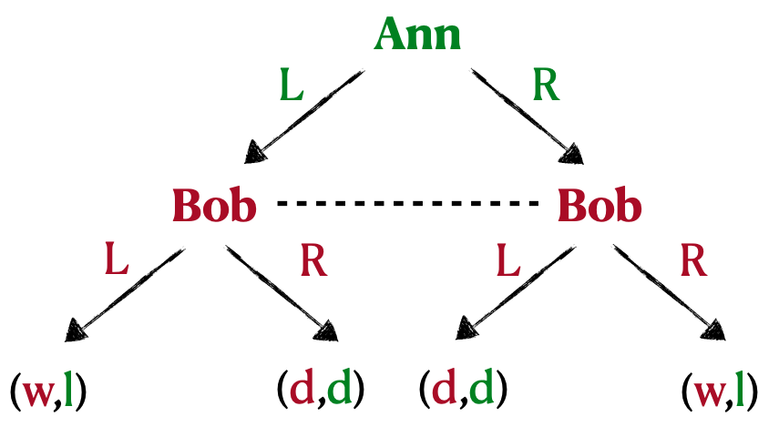

# CS404 Agent Based Systems
# Strategy
* In chess, our set of states is the set of all possible board positions
* A position might be reached in different ways - we call these ways histories
* Formally, a history is a sequence $(x_0,x_1,...,x_K)$ such that:
   * $x_0$ is the opening position
   * For each **even** integer $k$ with $0 \leq k \leq K$, going from position $x_k$ to $x_{k+1}$ can be achieved by a single legal move by player 1 (white)
   * For each **odd** integer $k$ with $0 \leq k \leq K$, going from board position $x_k$ to $x_{k+1}$ can be achieved by a single legal move by player 2 (black)
* Let $H_k$ be the set of histories up to time-step $k$

### Strategy Definition:
* A strategy for white $\sigma_W$ maps each history $(x_0,...,x_K) \in H_K$, with $K$ **even**, to a board position $x_{K+1}$ reachable by a legal move
* A strategy for black $\sigma_B$ maps each history $(x_0,...,x_K) \in H_K$, with $K$ **odd**, to a board position $x_{K+1}$ reachable by a legal move

### Winning Strategies:
* A play of the game $(\sigma_W, \sigma_B)$ ends in either:
   * A victory for white
   * A victory for black
   * A draw
* A strategy for white is winning if no matter what strategy is chosen by black, it guarantees a win for black
   * Formally, $\sigma_W$ is winning for white iff $\forall \sigma'_B$, $(\sigma_W, \sigma'_B)$ wins for white
   * The inverse of this definition applies for black
* Theorem: in chess, one of the following must be true:
   * White has a winning strategy
   * Black has a winning strategy
   * Both players have an at-least drawing strategy
* Proof:
   * Let us first call that the game is finite, i.e. there is a natural number $K$ such that every play of the game concludes after $2K$ turns ($K$ by white, $K$ by black)
   * Assume that there are exactly $2K$ turns in every play of the game (note that if some plays are shorter, we can make the number of turns $2K$ by adding 'do nothing' moves)
   * For every $k$ with $1 \leq k \leq K$ denote by:
      * $a_k$ the move implemented by white at its turn
      * $b_k$ the move implemented by black at its turn
   * Denote by W the fact that white wins (after $2K$ turns)
   * Then the event that white has a winning strategy can be written as $\exists a_1 \forall b_1 \exists a_2 \forall b_2 ... \exists a_K \forall b_K (W)$
   * Then the event that white doesn't have a winning strategy can be written as $\neg \exists a_1 \forall b_1 \exists a_2 \forall b_2 ... \exists a_K \forall b_K W$
   * Which is equivalent to $\forall a_1 \exists b_1 \forall a_2 \exists b_2 ... \forall a_K \exists b_K (\neg W)$
   * This says that black is guaranteed at least a draw
   * The same argument applies for black, and hence one of the three alternatives must hold
* If white has a winning strategy, he can always win without repeating a position. Proof:
   * Suppose there exists a board position $P$ that is repeated at step $i$ and at step $j$
   * There are two situations to consider:
      * White plays after $P$. Then white can immediately play $a_j$ after step $i$ to avoid the repetition
      * Black plays after $P$. Black can play $b_i$ after step $j$ to repeat the position $P$ again. In fact, it can be repeated more than $\frac{50}{(j-i)/2}$ times and by the 50-move rule, this game is a draw which contradicts the fact that white has a winning strategy
* We still don't know which of the three possibilities is true, however
* The theorem applies to any two-player finite game where each player has full knowledge of what they are playing and what their opponent is playing (finite two-person games of perfect information)

# Knowledge
* The main underlying assumption behind the theory of knowledge in multi-agent systems is that we live in one world and this world collects all relevant facts (e.g. events that are true now, were true in the past and will be true in the future)
   * However, we are not typically able to fully determine them
* Let $W$ be a set of worlds
   * It may be possible to distinguish some combination of them
* Call any $E \subseteq W$ a fact, i.e. a fact is a subset of the possible worlds

### Knowledge Relation:
* We model knowledge as a relation over the set of worlds
* Let us start with one agent $i$ and the knowledge relation $\sim_i \subseteq W \times W$
* Intuitively, $(w_1,w_2) \in \sim_i$ means that agent $i$ cannot distinguish between worlds $w_1$ and $w_2$
   * So if $i$ is in $w_1$ he considers it possible that the real world is actually in $w_2$
   * We call this relation the indistinguishability relation
* The relation is reflexive, symmetric and transitive, i.e. it is an equivalence relation
   * It is therefore a partition of the set of all states $W$
* Let $\sim_i[w] = \{w' : (w,w') \in \sim_i\}$ be what $i$ cannot distinguish from $w$
* We say that $i$ knows fact $E$ at $w$ whenever $\sim_i[w] \subseteq E$
* We denote by $K_iE = \{w : \sim_i[w] \subseteq E\}$ the worlds which $i$ knows $E$

### Multi-Agent Knowledge:
* We can talk about the knowledge of many agents (in isolation), but we can also talk about what they know together
   * We need to make choices and restrict our study to some interesting forms of group knowledge
* Let $N$ be the set of agents and $W$ be the set of worlds. Let $E$ be a fact
* General Knowledge: 
   * $E$ is a general knowledge at $w$, if everyone knows $E$ at $w$
   * $\forall i, \sim_i[w] \subseteq E$
   * $KE = \bigcap_{i \in N}K_iE = \bigcap_{i \in N}\{w : \sim_i[w] \subseteq E\}$ is the set of worlds where everyone knows $E$
* Distributed Knowledge:
   * $E$ is a distributed knowledge at $w$ if every agent knew $E$ by intersecting their indistinguishability relation
   * $DKE = \{w : (\bigcap_{i \in N} \sim_i[w]) \subseteq E\}$ is the set of worlds where $E$ is distributed knowledge
   * Distributed knowledge is the implicit knowledge the agents have together, which all of them would know if they could communicate
* Common Knowledge:
   * $E$ is a common knowledge at $w$ if every agent knows $E$ at $w$, and knows that everyone knows, and knows that everyone knows that everyone knows, and so on
   * Common knowledge is what is experienced by everyone, e.g. as a result of conversation
      * This is an idealised setting, but some approximation of it can be assumed in practice
   * $CE = \bigcap_{j=1}^{\infty} K^jE = KE \cap KKE \cap KKKE \cap ...$ is the set of worlds where $E$ is a common knowledge

### Uniform Strategies:
* Given the game tree:

* There are 2 worlds that Bob cannot distinguish:
   1. The one in which Ann has chosen to go left
   2. The one in which Ann has chosen to go right
* Bob knows he has a winning strategy, but doesn't know which one
   * It makes sense to assume that players will choose the same actions in situations that they cannot distinguish
* Definition (Uniform Strategy):
   * Let $H$ be the set of histories of a game, and let $\sim_i$ be a relation over these histories. A strategy $\sigma_i$ is uniform if $\sigma_i(h) = \sigma_i(h')$ whenever $h \sim_i h'$
* It doesn't make much sense to choose either L or R in the two states that Bob cannot distinguish - need randomisation

# Knowledge Representation
* Recall Wumpus World - squares adjacent to Wumpus have a stench, squares adjacent to a pit are breezy
* Knowledge base (KB) is a set of logical sentences representing what the agent thinks about the world
* The agent uses the KB to take actions in the world
* We could use propositional logic to represent the Wumpus world: e.g. $P_{i,j}$ denotes there being a pit in location $[i,j]$ and $B_{i,j}$ denotes it being breezy in location $[i,j]$
* This is fine as long as we are dealing with finite objects, although we might have to enumerate a large number of possibilities
   * However, this lacks expressive power - we need first order logic so we can use existential and universal quantification
   * But there are some costs re. decidability - don't always have a way to establish if a sentence is true or false

### First Order Logic:
* Rules:
   * Universal instantiation can be used to **add** new sentences to the KB, where the new KB is logically equivalent to the old
   * Existential instantiation can be applied once to **replace** the existential sentence, where the new KB is **not** equivalent to the old
      * However, it is satisfiable iff the old KB was satisfiable
* Wumpus World example:
   * Starting KB: $\neg\mathrm{AtGold}(0)$ ($0$ is a time value $t$)
   * Axioms to generate new knowledge from percepts, e.g. $\forall s,b,b',s',t \space \mathrm{Percept}([s,b,\mathrm{Glitter},b',s'],t) \implies \mathrm{AtGold}(t)$
   * Axioms to generate actions from the KB, e.g. $\forall t \space \mathrm{AtGold}(t) \land \neg\mathrm{Holding}(\mathrm{Gold},t) \implies \mathrm{Action}(\mathrm{Grab},t)$
   * Axioms to generate new knowledge, e.g. $\forall t \space \mathrm{AtGold}(t) \land \mathrm{Action}(\mathrm{Grab},t) \implies \mathrm{Holding}(\mathrm{Gold},t+1)$
   * Define rules, e.g. adjacent squares $\forall x,y,a,b \space \mathrm{Adjacent}([x,y],[a,b]) \iff (x=a \land (y=b-1 \lor y=b+1)) \lor (y=b \land (x=a-1 \lor x=a+1))$
* Inference with FOL:
   * $\forall x \space \mathrm{King}(x) \land \mathrm{Greedy}(x) \implies \mathrm{Evil}(x)$
   * Instantiate with $\mathrm{John}$ or $\mathrm{Father()}$ ($\mathrm{Father}(\mathrm{John})$, $\mathrm{Father}(\mathrm{Father}(\mathrm{John}))$, etc.
      * If a sentence is entailed by the KB, then there is a proof of finite depth
   * Formally, substitute variable $v$ by ground truth term $g$ in a formula $\alpha$:
      * $\forall v,a$ 
      * $\mathrm{SUBST}(\{v/g\},\alpha)$
* Propositionalisation:
   * Generate all substitutions with ground terms
   * For $k=1,2,...$, generate all terms at depth $k$ and the corresponding substitutions
   * This is inefficient (number of terms grows exponentially with depth) and we cannot say if a sentence is **not** entailed by the KB (semi-decidable)

### Generalised Modus Ponens (GMP):
* We are given $p_1,p_2,...,p_n$, $p_1',p_2',...,p_n'$ and $(p_1 \land p_2 \land ... \land p_n) \implies q$
* Required precondition: $\mathrm{SUBST}(\theta,p_i) = \mathrm{SUBST}(\theta,p_i')$
   *  $p_1,p_2,...,p_n, (p_1 \land p_2 \land ... \land p_n) \implies q$
   * $\mathrm{SUBST}(\theta,q)$
* Proof of soundness of GMP:
   * $(p_1 \land p_2 \land ... \land p_n) \implies q \models (\mathrm{SUBST}(\theta,p_1) \land ... \land \mathrm{SUBST}(\theta,p_n)) \implies \mathrm{SUBST}(\theta,q)$ 
   * From the precondition, $(p'_1 \land p'_2 \land ... \land p'_n) \implies q \models (\mathrm{SUBST}(\theta,p'_1) \land ... \land \mathrm{SUBST}(\theta,p'_n)) \implies \mathrm{SUBST}(\theta,q) \models (\mathrm{SUBST}(\theta,p_1) \land ... \land \mathrm{SUBST}(\theta,p_n))$ 
   * $\mathrm{SUBST}(\theta,q)$ follows by ordinary Modus Ponens
* GMP requires us to identify $\mathrm{SUBST}(\theta,p_i) = \mathrm{SUBST}(\theta,p'_i)$ for all $i$
   * $\mathrm{Unify}(\alpha,\beta) = \theta$ if $\mathrm{SUBST}(\theta,\alpha) = \mathrm{SUBST}(\alpha,\beta)$

### Forward Chaining Algorithm:
* Repeat until `new` is empty
* Set `new` to $\varnothing$
* For each rule in KB:
   * Standardise rule to obtain $(p_1 \land p_2 \land ... \land p_n) \implies q$
   * For each $\theta$ such that $\mathrm{SUBST}(\theta,p_i) = \mathrm{SUBST}(\theta,p'_i)$ for all $i$
      * Set $q'$ to $q' = \mathrm{SUBST}(\theta,q)$
      * If `q'` is new or doesn't identify with any rule in the kB
         * Add `q` to `new`

# Risk and Decisions
* The universe in which the agent moves is a finite set of states $W = \{w_1,...,w_n\}$
   * E.g. possible grid configurations in the Wumpus World
   * States can also contain a description of:
      * The inner state of the agent, e.g. the KB
      * Relevant changes
      * The history of the game so far

### States and Lotteries:
* A lottery is a probability distribution over the set of states
   * E.g for states $w_1, w_2$ and $p \in [0,1]$, lottery $L_1 = [p,w_1;(1-p,w_2)]$
* Consider the set $L$ of lotteries over $W$
   * $L = [q_1,L_1;q_1,L_2]$
   * $=[q_1,[p_1,w_1;p_2,w_2;...;p_n,w_n];q_2[r_1,w_1;r_2,w_2;...;r_n,w_n]] = [q_1p_1,w_1;q_1p_2,w_2;...;q_1p_n,w_n;q_2r_1,w_1;q_2r_2,w_2;...;q_2r_n,w_n] = [(q_1p_1+q_2r_1),w_1;(q_1p_2+q_2r_2),w_2;...;(q_1p_n+q_2r_n);w_n]$
   * Observation: a lottery over $L$ is a lottery over $W$ - compound lotteries can be reduced to simple lotteries

### Preferences:
* A preference is a relation $\succcurlyeq \subseteq L \times L$ over the set of lotteries
* $A \succcurlyeq B$ means that $A$ is weakly preferred to lottery $B$
* $A \succ B \iff (A \succcurlyeq B \land \neg B \succcurlyeq A)$ means that lottery $A$ is strictly preferred to lottery $B$
* $A \sim B \iff (A \succcurlyeq B \land B \succcurlyeq A)$ means that lottery $A$ is the same as lottery $B$
* Properties of preferences:
   * Orderability: exactly one of $A \succ B$, $B \succ A$ or $A \sim B$ holds
   * Transitivity: $(A \succ B) \land (B \succ C) \implies (A \succ C)$
   * Continuity: $A \succ B \succ C \implies \exists p [p,A;(1-p),C] \sim B$
      * If $A$ is better than $B$, and $B$ is better than $C$, then the right mix of $A$ and $C$ is equivalent to $B$
   * Substitutability: $A \sim B \implies [p,A;(1-p),C] \sim [p,B;(1-p),C]$
      * If $A$ is the same as $B$, thn don't care how likely they are
   * Monotonicity: $A \succeq B \implies (p \geq q \iff [p,A;(1-p),B] \succcurlyeq [q,A;(1-q);B])$
      * If $A$ is better than $B$, then I prefer when $A$ is more likely than $B$
* Violating the constraints can lead to self-evident irrationality, e.g. with transitivity can get a circular set of preferences

### Expected Utility:
* Theorem: a preference relation $\succcurlyeq$ satisifes the five properties iff there exists a real function $u: L \rightarrow \mathbb{R}$ such that:
   * $u(A) \geq u(B) \implies A \succ B$
   * $u([p_1,w_1;p_2,w_2;...;p_n q_n]) = \sum_{i=1}^np_i u_i(w_i)$
* Proof:
   * $(\implies)$
   * We can order the set $W$ so that $r_1 \succ r_2 \succ ... \succ r_n$
   * Define $u(r_1) = 1$ and $u(r_n) = 0$
   * By continuity for any $r_j$ there exists $p_j$ such that $r_j \sim [p_j,r_1;(1-p_j)r_n]$
   * Define $u(r_j) = p_j$ 
   * ($\impliedby$)
   * Suppose some property is violated (e.g. transitivity). Then we cannot have a consistent $u$
* An expected utility is a function $u : W \rightarrow \mathbb{R}$ that associates a real number to each state
   * They are just a mathematical tool to represent comparisons between outcomes
* Whether or not to take an action that could result in a negative utility is dependent on risk attitudes/preferences, starting amount, and probabilities
   * An agent should exhibit monotonic preferences over money, but need to define preferences between lotteries involving money

### Measures of Risk Aversion:
* Absolute Risk Aversion:
   * $A(w) = -\frac{u''(w)}{u'(w)}$
   * Suppose $u(w) = b_0 + b_1\log(w)$
   * $A(w) = -\frac{-b_1/w_2}{b_1/w} = \frac{1}{w}$
   * Decreasing risk attitude with increasing wealth
* Relative Risk Aversion:
   * $R(w) = -\frac{w \cdot u''(w)}{u'(w)} = -\frac{A(w)}{w}w$ (normalised version of the above)
   * Suppose $u(w) = b_0 + b_1\log(w)$
   * $R(w) = -\frac{-wb_1/w^2}{b_1/w} = 1$

# Game Theory
### Strategic Games in Normal Form:
* A normal form game is a tuple $\langle N, \textbf{A}, \textbf{u} \rangle$ where:
   * $N = \{1,2,...,n\}$ is a finite set of players (or agents)
   * $\textbf{A} = A_1 \times A_2 \times ... \times A_n$ is a finite set of action profiles, where $A_i$ is the set of actions available to player $i$
      * $\textbf{a} = (a_1 \times a_2 \times ... \times a_n)$ describes the simultaneous moves by all players
   * $\textbf{u} = (u_1,...,u_n)$ is a profile of utility functions $u_i : A_i \rightarrow \mathbb{R}$
* Each player $i$ chooses an action $a_i$ simultaneously and receives utility $u_i(\textbf{a})$

### Equilibrium in Pure Strategies:
* Suppose players play pure strategies (one action from a set of choices)
* We say $a_i^* \in A_i$ is a best response for player $i$ to the partial action profile $\textbf{a}_{-i}$ if $u_i(a_i^*, \textbf{a}_{-i}) \geq u_i(a'_i, \textbf{a}_{-i}) \forall a'_i$
* We say $\textbf{a} = (a_1,...,a_n)$ is a pure Nash equilibrium if $a_i$ is a best response to $\textbf{a}_{-i}$ for each $i$
* No player has the incentive to unilaterally deviate from their assigned strategy
* Examples:

|     | L   | R   |
| --- | --- | --- |
| T   | 2,2 | 2,1 |
| B   | 1,3 | 3,2 |
* 2,2 is a Nash equilibrium because neither the row or column player can deviate to achieve a higher utility

|     | L   | R   |
| --- | --- | --- |
| T   | 2,2 | 2,2 |
| B   | 2,2 | 2,2 |
* All profiles are Nash equilibria

|     | L   | R   |
| --- | --- | --- |
| T   | 1,2 | 2,1 |
| B   | 2,1 | 1,2 |
* No profiles are Nash equilibria - either player can achieve a higher utility by deviating from their strategy
* A two-player zero-sum game is a normal form game $\langle N,\textbf{A},\textbf{u}\rangle$ where $u_1(\textbf{a}) + u_2(\textbf{a}) = 0$ for all action profiles $\textbf{a}$
* Example:

|     | R     | P     | S     |
| --- | ----- | ----- | ----- |
| R   | 0,0   | -1,1  | 1,-1  |
| P   | 1,-1  | 0,0   | -1,1  |
| S   | -1,1  | 1,-1  | 0,0   |

### Mixed Strategies:
* We now allow player $i$ to play any action in $A_i$ with certain probability
* For any finite set $X$, let $\Pi(X) = \{p: X \rightarrow [0,1] | \sum_{x \ in X} p(x)=1\}$ be the set of all probability distributions over $X$
* A mixed strategy $s_i$ is a probability distribution in $\Pi(A_i)$
* The set of all mixed strategies is $S_i = \Pi(A_i)$
* A mixed strategy profile $\textbf{s} = (s_1,s_2,...,s_n)$ is an element of $S_1 \times S_2 \times ... \times S_n$
* The expected utility of player $i$ for the mixed strategy profile $\textbf{s}$ is $u_i(\textbf{s}) = \sum_{\textbf{a} \in \textbf{A}}(u_i(\textbf{a})\prod_{j \in N} s_j(a_j))$
* The support of strategy $s_i$ is the set of actions $\{a_i \in A_i | s_i(a_i) > 0\}$
   * A mixed strategy $s_i$ for player $i$ is **pure** iff its support is a singleton
   * A mixed strategy $s_i$ for player $i$ is **truly mixed** if it is not pure
   * A mixed strategy $s_i$ for player $i$ is **fully mixed** if its support is the full set $\textbf{A}$
* Example:
   * Suppose Alice prefers ballet and Bob prefers auto racing
   * Alice chooses to go to ballet with 75% probability, while Bob chooses to go to auto racing with certainty ($s_1=(\frac{1}{4},\frac{3}{4})$ and $s_2=(1,0)$)
   * $u_1(s) = 2 \cdot (\frac{1}{4} \cdot 1) + 0 \cdot (\frac{1}{4} \cdot 0) + 0 \cdot (\frac{3}{4} \cdot 1) + 8 \cdot (\frac{3}{4} \cdot 0) = \frac{1}{2}$

|     | A   | B   |
| --- | --- | --- |
| A   | 2,4 | 0,0 |
| B   | 0,0 | 8,3 |

### Mixed Nash Equilibrium:
* Consider a game $\langle N,\textbf{A},\textbf{u} \rangle$ with associated mixed strategies $s_i \in S_i = \Pi(A_i)$
* We say $s_i^* \in S_i$ is a best response for player $i$ to the (partial) strategy profiles $\textbf{s}_{-i}$ if $\mathbb{E}[u_i(s_i^*,\textbf{s}_{-i})] \geq \mathbb{E}[u_i(s'_i,\textbf{s}_{-i})] \forall s'_i$
* We say a strategy profile $\textbf{s} = (s_1,...,s_n)$ is a mixed Nash equilibrium if $s_i$ is a best response to $\textbf{s}_{-i}$ for each $i$
* Theorem: every finite normal form game has at least one (mixed or pure) Nash equilibrium
* Example:
   * All strategies in the support must yield the same utility
   * For the row player, $u_1(A) = 2q$ and $u_1(B) = 8(1-q)$. Therefore, $2q = 8(1-q)$ and $q = \frac{4}{5}$
   * For the column player, $u_2(A) = 4p$ and $u_2(B) = 3(1-p)$. Therefore, $rp = 3(1-p)$ and $p = \frac{3}{7}$

|             | A ($p$) | B ($1-p$) |
| ----------- | ------- | --------- |
| A ($q$)     | 2,4     | 0,0       |
| B ($1-q$)   | 0,0     | 8,3       |

* In general, we don't know the support and might have to enumerate all

### Minmax Theorem:
* Given a matrix game $u$:
   * Maxmin value $\bar{v} = \max_s\min_{s'} u(s,s')$
   * Minmax value $v = \max_{s'}\min_s u(s,s')$
* Theorem: in any finite, two-player zero-sum game, the maxmin value $\bar{v}$ equals the minmax value $v$, and also equals the utility in any Nash equilibrium
* Proof:
   * Let $w$ be the expected utility at a NE
   * If $\bar{v} > w$, i.e. $\max_s\min_{s'} u(s,s') > w$, it's possible to deviate and get more than $w$
   * Suppose $\bar{v} < w$. Let $(s_1^*, s_2^*)$ be a NE. The second player's payoff is $-w$
   * It must be that $-w = \max_{s'}-u(s_1^*,s') = -\min_{s'}u(s_1^*,s')$
   * Then $\bar{v} < w = \min_{s'}u(s_1^*,s')$, a contradiction
* As a result of this theorem, given a matrix game $u$:
   * Maxmin strategy: $\argmax_s\min_{s'}u(s,s')$
   * Minmax strategy: $\argmin_s\max_{s'}u(s,s')$
* $\bar{v}=v=w$ - all equilibria have the same payoff
* The set of maxmin strategies or equivalent (or equivalent minmax strategies) coincides with the set of NE strategies
   * We can find the NE efficiently using a linear program

### Finding NE using Minmax Theorem:
* We want to compute $\max_{s\in\Pi(A_1)}\min_{s'\in\Pi(A_2)}u(s,s')$
* Which is equivalent to $\max_{s\in\Pi(A_1)}\min_{a_j \in A_2}u(s,s')$
* We can formulate this as:
   * $\max_s z$ s.t.
   * $z = \min_{a_j \in A_j}\sum_{a_i \in A_i}s(a_i)\cdot u(a_i,a_j)$
      * Or $z \geq \sum_{a_i \in A_i}s(a_i)\cdot u(a_i,a_j) \forall a_j \in A_j$
   * $s(a_i) \geq 0$
   * $\sum_{a_i \in A_i}s(a_i) = 1$

### Dominant Strategies:
* You should play the action $a_i^*$ that gives you a better payoff than any other action $a'_i$, no matter what other do (such as playing $\textbf{s}_{-i}$)
   * $u_i(a_i^*, \textbf{s}_{-i}) > u_i(a'_i, \textbf{s}_{-i}) \forall a'_i \in A_i, \forall \textbf{s}_{-i} \in \textbf{S}_{-i}$
* Action $a_i^*$ is called a stricly dominant strategy for player $i$
* Profile $\textbf{a}^* = (a_1^*, ..., a_2^*)$ is called an equilibrium in a strictly dominant strategy if action $a_i^*$ is stricly dominant for each player $i$
   * This doesn't always exist
   * Equilibria don't change if we define this concept in terms of mixed strategies
* An equilibrium in a strictly dominant strategy is also a Nash equilibrium
* Example: here D is a dominant strategy for the row player

|     | C      | D       |
| --- | ------ | ------- | 
| C   | -10,10 | -25,0   | 
| D   | 0,-25  | -20,-20 | 

### Elimination of Dominated Strategies:
* Action $a_i$ is strictly dominated by a strategy $s_i^*$ if for all $\textbf{s}_{-i} \in \textbf{S}_{-i}$, $u_i(s_i^*,\textbf{s}_{-i}) > u_i(a_i, \textbf{s}_{-i})$
* Then if we assume $i$ is rational, action $a_i$ can be eliminated
* We can repreat this process as many times as we can
* This is called iterated elimination of strictly dominated strategies (IESDS)
* Example:

|    | L   | R   |
| -- | ----| ----| 
| T  | 4,4 | 1,6 | 
| B  | 6,1 | 2,2 | 

For the column player, action R stricly dominates action L

|    | R   | 
| -- | ----| 
| T  | 1,6 |
| B  | 2,2 |

For the row player, action B now strictly dominates action T

|    | R   | 
| -- | ----| 
| B  | 2,2 |

* Let $G_t$ be the game after $t$ deletions of strictly dominated strategies
* IESDS says that players will play the reduced game $G^{\infty}$
* Theorem: any order of eliminating strictly dominated strategies leads to the same reduced game
* Proof (sketch):
   * Suppose $\exists s_i^* u_i(s_i^*, \textbf{s}_{-i}) > u_i(a_i, \textbf{s}_{-i}) \forall s_{-i}$ and $\exists s_j^* u_j(s_j^*, \textbf{s}_{-j}) > u_j(b_j, \textbf{s}_{-j}) \forall s_{-j}$ in a game $G$
   * If we delete action $a_i$ from $G$ to form game $G_1$ we can delete $b_j$ from $G_1$, since the choices of $\textbf{s}_{-j}$ have reduced

### Correlated Equilibrium:
* Consider the following game:

|    | L   | R   |
| -- | ----| ----| 
| T  | 4,1 | 0,0 | 
| B  | 3,3 | 1,4 |

* (T,L) and (B,R) are pure Nash equilibria
* $s_1 = (\frac{1}{2},\frac{1}{2}), s_2 = (\frac{1}{2},\frac{1}{2})$ is a mixed Nash equilibrium
   * Payoff is $u_1(s_1,s_2) = 2, u_2(s_1,s_2) = 2$
* Suppose a trusted mediator flips a coin:
   * Recommends (T,L) if heads and (B,R) if tails
   * If recommended T, the row player believes that the column player plays L
   * If recommended B, the row player believes that the colimn player plays R
   * Same argument for the column player
* A joint distribution $\mu \in \Pi(A) = \Pi(A_1 \times A_2 \times ... \times A_n)$
   * Mediator samples a tuple $(a_1, a_2, ..., a_n) \sim \mu$
   * Suppose agent $i$ chooses a strategy $\delta_i: A_i \rightarrow A_i$
   * Expected utility under deviation: $\sum_{\textbf{a}=(a_1,...,a_n)}\mu(\textbf{a}) \cdot u_i(\delta_i(a_i),\textbf{a}_{-i})$
* $\mu$ is a correlated equilibrium if there is no gain under deviation
* Every Nash equilibrium (mixed or pure) is a correlated equilibrium
* Solving using LP:
   * Variables $\mu(\textbf{a})$ for each $\textbf{a}$
   * Constraints for each agent $i$, $a_i$ and $a'_i$
   * Constraints are equivalent to $\sum_{\textbf{a}}\mu(\textbf{a})(u_i(a_i,\textbf{a}_{-i})-u_i(a'_i,\textbf{a}_{-i})) \geq 0$ for each $a_i$, $a'_i$ and $i$
   * Also have $\sum_{\textbf{a}}\mu(\textbf{a}) = 1$ and $\mu(\textbf{a}) \geq 0 \forall \textbf{a}$
   * Objective  an be any linear objective, e.g. $\sum_i \mathbb{E}_\mu[u_i] = \sum_i\sum_{\textbf{a}}\mu(\textbf{a}) \cdot u_i(\textbf{a})$
   * Suppose there are $n$ agents and $k$ actions
      * $k^n$ variables
      * $nk^2+1$ constraints
      * In general, can't solve except for very small games

# Extensive Form Games
* Games where agents play in a sequence are called extensive form games
* Example:

* Player 1 chooses a division of a given amount of money
* Player 2 accepts this division or rejects it (in which case both get nothing)
* We need to describe:
   * Nodes: choices and leaf/terminal
   * Who takes their turn at each choice node
   * Which actions are available at each choice node
   * Utility at the leaf nodes

### Formal Definition:
* An extensive form game is a tuple $\langle N, A, H, Z, \chi, \rho, \sigma, \textbf{u} \rangle$ where:
   * $N$ is the set of agents
   * $A$ is the set of actions
   * $H$ is the set of choice nodes
   * $Z$ is the set of leaf nodes
   * $\chi : H \rightarrow 2^A$ is the action function (set of possible actions at a choice node)
   * $\rho : H \rightarrow N$ is the player function (who plays at a choice node)
   * $\textbf{u} = (u_1,...,u_n)$ where $u_i : Z \rightarrow \mathbb{R}$ is the utility function of agent $i$
   * $\sigma : H \times A \rightarrow H \cup Z$ is defined to be the successor function which given a history/choice node and an action, assigns a new choice node or a terminal node
* If for any $h_1, h_2 \in H$ and $a_1, a_2 \in A$ we have $\sigma(h_1,a_1) = \sigma(h_2,a_2)$ then $h_2 = h_2$ and $a_1 = a_2$ (only one path from the root to each intermediate node)
* Each node has exactly one parent
* There is exactly one root node $h_0 \in H$

### Pure Strategy:
* Let $\textbf{H}_i = \{h : \rho(h) = i\}$ be the set of nodes where agent $i$ plays
* A pure strategy for agent $i$ maps nodes $h \in H_i$ to actions in $\chi(h)$
   * Thus it is a function $s_i$ that respects $s_i(h) \in \chi(h) \forall h \in H_i$
* Given a profile of strategies $(s_1,s_2,...,s_n)$, the outcome can be computed as:
   * While $h_0 \notin Z$, set $h$ to $\sigma(h,\alpha_{\rho(h)}(h))$
   * Return $h$
* Note: a strategy describes what to do at each choice node when it's your turn, even though the game might never reach there

### Translation to Normal Form:
* An extensive form game $\langle N, A, H, Z, \chi, \rho, \sigma, \textbf{u} \rangle$ can be translated into a normal form game $\langle N, \textbf{A}^*, \textbf{u}^* \rangle$ where:
   * $\textbf{A}^* = A_1^* \times A_2^* \times ... \times A_n^*$ where each $A_i^* = \{\alpha_i : H_i \rightarrow A | \alpha_i(h) \in \chi(h)\}$, i.e. the set of actions in the normal form game is the set of actions in the extensive form game
   * $\textbf{u}^* = (u_1^*,...,u_n^*)$ where $u_i^* = u_i(\mathrm{out}(\alpha))$ and $\mathrm{out}(\alpha)$ is the outcome of the extensive form of the game under the pure strategy
* Thus the full machinery of normal form games is also available for the extensive form game

### Pure Nash Equilibrium:
* Theorem: every finite extensive form game has at least one pure Nash equilibrium
* Proof:
   * Work your way up, from the lowest choice nodes to the root. Label each node $h \in H$ with an action $a^*(h) \in \chi(h)$ and a vector $(u_1^h, u_2^h, ..., u_n^h)$
   * Find a best action for the selected player $i^* = \rho(h)$: $a^* \in \argmax_{a \in \chi(h)} u_{i^*}(\sigma(h,a))$
   * Compute the utility labels for all agents $i$: $u_i^h = u_i(\sigma(h,a^*))$
   * This process is well-defined and terminates (also known as backward induction)
* Example: 

   * Applying backward induction to this game leads to the NE (90:10, Acc-Acc-Acc)
   * No player has an incentive to unilaterally change their strategy, but this is not a reasonable solution for the game
   * Player 2's threat to reject is not credible

### Subgame Perfect Equilibrium:
* Every internal node $h \in H$ introduces a subgame
* A strategy profile $\textbf{s}$ is a subgame-perfect equilibrium if for an extensive form game $G$ if for every subgame $G_s \subseteq G$, the restriction of $\textbf{s}$ to $G$ is a NE
* Theorem: every finite extensive-form game has at least one subgame-perfect equilibrium

# Games with Imperfect Information
* Imperfect information: uncertainty about the current state of the play, such as the actions taken by others
* A strategic imperfect information game (in extensive form) is a type $\langle N, A, H, Z, \rho, \chi, \sigma, \textbf{u}, \sim \rangle$ where:
   * $\langle N, A, H, Z, \rho, \chi, \sigma, \textbf{u} \rangle$ is a finite extensive form game with perfect information
   * $\sim = (\sim_1, ..., \sim_n)$ is a profile of equivalence relations $\sim_i$ on $H$ for which $h \sim_i h'$ implies that $\chi(h) = \chi(h')$ and $\rho(h) = \rho(h')$, i.e. $h$ and $h'$ are indistinguishable in terms of the agent playing and the set of actions
* We only really need to know $\sim_i$ on $H_i$ (not $H \setminus H_i$)
* Thus, for every player $i$, $\sim_i$ is an equivalence relation on $H_i$ such that $h \sim_i h'$ implies $\chi(h) = \chi(h')$
* Remark: constraints on $\rho$ and $\chi$ are needed to ensure indistinguishability. Otherwise, might infer extra information from them
* Example: player 1 cannot tell apart the two lower nodes in which it is their turn

### Equivalence Classes:
* The indistinguishability relation $\sim_i$ partitions the space $H_i$
* The set of all choice nodes that are indistinguishable from node $h$ far as player $i$ is concerned is denoted by $[h]_{sim_i} = \{h' \in H_i | h \sim_i h'\}$
* The set of all such equivalence classes for player $i$ (quotient set) is $H_i / \sim_i = \{[h]_{\sim_i} | h \in H_i\}$

### Pure Strategies:
* A pure strategy for player $i$ maps any given equivalence class $[h]_{\sim_i}$ to an action that is playable in all of the choice nodes in $[h]_{\sim_i}$
   * Formally, a function $\alpha_i : H_i / \sim_i \rightarrow A$ with the property $\alpha_i([h]_{\sim_i}) \in \chi(h') \forall h' \in [h]_{\sim_i}$
* Play the same pure strategy at all indistinguishable nodes
* Alternatively, we can consider a pure strategy as mapping choice nodes to actions:
   * A pure strategy is a function $\alpha_i : H_i \rightarrow A$ with $\alpha_i(h) \in \chi(h)$ for all $h \in H_i$ such that $\alpha_i(h) = \alpha_i(h')$ whenever $h \sim_i h'$
   * Thus we can think of an imperfect information game as a standard extensive form game where ceertain strategies are not permitted
* We can transform an imperfect information game into a normal form game by considering the transformation as with an extensive form game, but with restricted pure strategies
   * Every normal form can be translated into an imperfect information extensive form game (but not necessarily a perfect information extensive form game)

### Perfect Recall:
* Consider the following game: 

* In the final round, player 1 is assumed to forget the action they played in the first round
* An imperfect information game has perfect recall for $i$, if for all $h, h' \in H$ and all actions $a, a' \in A$:
   * If $\sigma(h,a) \sim_i \sigma(h',a')$ then $h \sim_i h'$
   * If $\sigma(h,a) \sim_i \sigma(h',a')$ and $\rho(h) = i$, then $a = a'$
* Thus in a perfect recall game, no player can resolve indistinguishability by inspecting the history of nodes visited and the actions they played
* Remark: every perfect information extensive form game has perfect recall

### Mixed vs Behavioural Strategies:
* Let $H_i / \sim_i = \{[h_i^1]_{\sim_i},...,[h_i^m]_{\sim_i}\}$ be the set of equivalence classes of choice nodes where it is player $i$'s turn
* A pure strategy for $i$ is some $\alpha_i \in \chi(h_i^1) \times ... \times \chi(h_i^m)$
* So, a mixed strategy for $i$ is some $s_i \in \Pi(\chi(h_i^1) \times ... \times \chi(h_i^m))$
* More natural to assume players mix locally in each choice node. A behavioural strategy for $i$ is some $s_i \in \Pi(\chi(h_i^1)) \times ... \times \Pi(\chi(h_i^m))$ (randomise over each equivalence class)
* Consider the following one-player game, where Ann is asked to play two actions and assumed to forget what she did after the first action was played. She wins (utility 1) if she chooses the same action twice

* Pure strategues: LL, LR, RL, RR
* Mixed strategy $(\frac{1}{2},0,0,\frac{1}{2})$ gives expected utility $1$
* Any behavioural strategy must be of the form $((p,1-p),(q,1-q))$
   * Expected utility: $pq + (1-p)(1-q) < 1$ unless pure (i.e. $p = 0$ or $p = 1$)

### Outcome Equivalence:
* Two strategies for player $i$ are called outcome-equivalent if, under every partial profile of pure strategies chosen by the other players, the resulting probability distributuons over the outcomes are the same
   * From player $i$'s perspective, the strategies lead to the same expected outcome, regardless of the strategies chosen by the other players
* Kuhn's theorem: in a finite imperfect-information game with perfect recall, for any given mixed strategy of a player, there exists an outcome-equivalent behavioural strategy of the same player
* Proof (sketch):
   * Given a mixed strategy $s_i$ of player $i$, we can find an outcome-equivalent behavioural strategy $s_i^*$
   * Use conditional independence, i.e. $s_i^*(h)(a) = \frac{P(s_i,\sigma(h,a))}{P(s_i,h)}$
   * Use perfect recall to argue that $h \sim_i h' \implies s_i^*(h)(a) = s_i^*(h')(a)$

# Counterfactual Regret Minimisation
* For an action profile $\textbf{a} = (a_i, \textbf{a}_{-i})$, the regret of player $i$ for not playing $a'_i$ is $u_i(a'_i,\textbf{a}_{-i}) - u_i(\textbf{a})$
   * E.g. if you play paper and I play rock (utility -1 for me), my regret for not playing scissors is 2 (utility 1 for me)
   * If you play paper and I play paper (utility 0 for me), my regret for not playing scissors is 1 (utility 1 for me)
* Idea is to take actions that the agent wishes it had played in the past
   * But, if its opponent knows what it is doing then it would be exploitable
   * Need to minimise regret without being predictable

### Regret Matching:
* Choose actions at random, with probability proportional to positive regrets
* Consider the profile (scissors, rock) and the row player:
   * Regret for not playing paper is 2
   * Regret for not playing rock is 1
   * Choose paper with probability 2/3 and rock with probability 1/3
* Cumulative regret: suppose the column player plays paper (i.e. action profile (rock, paper))
   * Regret is 2 for scissors and 1 for paper
   * Cumulative regret of the row player in two rounds: 2 for scissors, 3 for paper, 1 for rock
   * Choose scissors with probability 2/6, paper with probability 3/6 and rock with probability 1/6
* Cumulative regret is good, but not very good
* If our opponent knows we are using cumulative regret, they can always best respond
* The key idea is to play against ourselves and exploit this hypothetical game to simulate our opponents and strengthen our strategies

### Fictitious Play:
* Suppose we have a two-player zero-sum game
* Compute the frequency at which player $i$ plays $a_i$
   * A good hypothesis is that this is approximately
* You always best respond, and everyone else does the same - this is called fictitious play
* Take any action profile $\textbf{a}^0 \in A$
* Fictitious play starting at $\textbf{a}^0$ is the following process:
   1. In round $t = 0$, each player $i \in N$ plays action $a_i^0$
   2. In round $t > 1$, each player $i \in N$ plays a best pure response to their opponent's empirical mixed strategies (look at the distribution of actions that the opponent has played)
      * $a_i^t \in \argmax_{a_i \in A_i} u_i(a_i, \textbf{s}_{-i}^t)$
* Ties are broken deterministically according to a fixed rule
* Example - consider the following game:

|     | H    | T    |
| --- | ---- | ---- | 
| H   | 1,-1 | -1,1 | 
| T   | -1,1 | 1,-1 | 

* Any strategy can be represented by a single probability of playing H (and break ties in favour of H):
   * HH $(1,1)$ -> HT $(1,\frac{1}{2})$ -> HT $(1,\frac{1}{3})$ -> TT $(\frac{3}{4},\frac{1}{4})$ -> TT $(\frac{3}{5},\frac{1}{5})$ -> TT $(\frac{3}{6},\frac{1}{6})$ -> TH $(\frac{3}{7},\frac{2}{7})$ 
* The process yields a sequence $(\textbf{a}^0,\textbf{a}^1,\textbf{a}^2,...)$ with a correspond sequence of empirical mixed strategies $(\textbf{s}^0,\textbf{s}^1,\textbf{s}^2,...)$
* In general, $\lim_{t \rightarrow \infty} \textbf{s}^t$ does not exist (no guaranteed convergence), but:
* Lemma: if fictitious play converges, then it converges to a Nash equilibrium
* Proof idea:
   * Suppose $\textbf{s}^* = \lim_{t \rightarrow \infty} \textbf{s}^t$ exists. We need to show that $\textbf{s}^*$ is a NE
   * $\textbf{s}^*$ is the strategy that player $i$ seems to be playing and it is a best response to $\textbf{s}^*_{-i}$, which is the strategy profile of other players
* Note that this lemma is true for arbitrary (not just zero-sum) games
* Theorem: for any zero-sum game and initial action profile, fictitious play will converge to a Nash equilibrium
   * Proof uses an inductive argument on the number of actions available
   * Doesn't provide a bound on the speed of convergence

### Regret Matching Framework:
* Steps:
   1. For each player, initialise cumulative regret to 0
   2. Compute a regret-matching strategy profile
   3. Add the strategy profile to history
   4. Compute regrets and add player regrets to the cumulative regrets
   5. Repeat
   6. Return the average strategy profile
* It has been shown that this procedure converges to a correlated equilibrium
* We can extend this to extensive-form games with imperfect information 

### Counterfactual Regret Minimisation (CRM):
* For games of imperfect information, compute regret at an information set
* Let $\sigma = (\sigma_1, ..., \sigma_n)$ be a strategy that reaches $h$ 
* For an information set $h \in F_i$ and action $a \in \chi(h)$, regret of not taking action $a$ at $h$ is $r_i(h,a) = u_i(\sigma|_{h \rightarrow a}) - u_i(\sigma)$ 
* Given a sequence of strategy profiles $\sigma^1, ..., \sigma^T$, cumulative regret $R_i^T(h,a) = \sum_{t=1}^T P(\sigma_{-i}^t \space \mathrm{reaches} \space h) \cdot (u_i(\sigma^t|_{h \rightarrow a}) - u_i(\sigma^t))$
* Let $R_i^{T,+}(h,a) = \max(0,R_i^T(h,a))$ be the positive regret
* Take action proportional to positive regret
   * Define $\sigma_i^{t+1}$ as $\sigma_i^{t+1}(h')(a) = \frac{R_i^{T,+}(h',a)}{\sum_{b \in \chi(h')}R_i^{T,+}(h',b)}$ if $|\chi(h')| > 0$
* Theorem: the average strategy profile approaches Nash equilibrium as $T$ approaches infinity
* Theorem: regret of player $i$ goes to 0 at a rate $\frac{|F_i|}{\sqrt{T}}$
* In practice, games are huge
   * Reduce the size of the game by abstraction, e.g. grouping similar sequences of states in the same information set

# Markov Decision Processes
* Markovian environment: the probability of reaching a state only depends on the current state and action
* We assume that the environment is fully observable, like a game of perfect information
* Plan: a finite set of intended moves, from the start

### Policies and Rewards:
* Let $S$ be the set of all states (e.g. histories in a game)
* Let $A$ be the set of all actions 
* A policy $\pi$ is a mapping $\pi : S \rightarrow A$
   * A protocol that specifies an action at every state
   * This is a strategy
* A reward $r$ is a utility function of the form $r : S \times A \rightarrow \mathbb{R}$
   * All states, not just the terminal ones, get rewards
   * If we only care about terminal states, can just give zero reward to every non-terminal state

### Utility of State, Action Sequences:
* Discounted utility function: $u([s_0,a_0,s_1,a_1,...]) = r(s_0,a_0) + \gamma r(s_1,a_1) + \gamma^2 r(s_2,a_2) + ...$ where $\gamma \in [0,1]$ is the discounting factor
* Note: additive utility function $u([s_0,a_0,s_1,a_1,...]) = r(s_0,a_0) + r(s_1,a_1) + r(s_2,a_2) + ...$ is just a discounted utility function with $\gamma = 1$
* $\gamma$ is a measure of agent patience - how much more they value some reward tomorrow vs today
   * Measures the agent's risk attitude towards the future
* Fixed $\gamma$ is known as time-invariant geometric discounting
   * $\gamma = 1$ - today is just another day
   * $\gamma = 0$ - today is all that matters
* A Markov Decision Process (MDP) is a tuple $\langle S,A,P,\gamma,r \rangle$
   * $P$ is a Markovian transition function $P(s'|s,a)$, which is a probability distribution over $S$ for each $s,a$

### Optimal Policy:
* The expected utility (or value) of a policy $\pi$ from state $s$ is $V^{\pi}(s) = \mathbb{E}(\sum_{t=0}^{\infty} \gamma^t \cdot r(s_t) | s_0 = s)$
   * Induced by the policy $\pi$ (the actions we are actually going to make), the initial state $s$ and the transition model (where we can go to)
* An optimal policy (from a state $s$) is the policy with the highest expected utility, starting from that state
   * $\pi^*_s \in \argmax_\pi V^{\pi}(s)$
* With discounted rewarfs and infinite horizon, $\pi_s^* = \pi_{s'}^* \forall s' \in S$
* Optimal policy doesn't depend on the sequence of states, but on the states only (a state-based policy)

### Value of States:
* The value of a state is the value of the optimal policy from that state
* If we know the value of the states, choosing the best action is just maximisation of expected utility
   * This is equivalent to maximisation of current reward + expected utility of the immediate successors

### Bellman Equation:
* The optimal value function satisfies the following equation:
   * $v(s) = \max_a(r(s,a) + \gamma \cdot \sum_{s'}P(s'|s,a)v(s'))$
* We can use this equation to compute the optimal policy
* This equation also implies the following identity:
   * $V^{\pi^*} = r(s,\pi^*(s)) + \gamma \cdot \sum_{s'}P(s'|s,\pi^*(s)) V^{\pi^*}(s')$

### Value Iteration Algorithm:
* Start with $v_0 = 0$
* Set $\delta_s = \epsilon\frac{1-\gamma}{\gamma}$ for all $s$
* While $\delta_{s'} \geq \epsilon\frac{1-\gamma}{\gamma}$ for some $s'$, do:
   * $v_{t+1}(s) = \max_a(r(s,a) + \gamma \cdot \sum_{s'}P(s'|s,a) \cdot v_t(s'))$
   * $\delta_s = |v_{t+1}(s) - v_t(s)|$
* Now we have a value function, we can pick an action $a$ that maximises the expected cumulative reward

### Convergence of Value Iteration:
* Let us write $v_{t+1} = \textbf{B}v_t$, where $\textbf{B}$ is called the Bellman operator
* Then we have a sequence of updates:
   * $v_0 = 0$
   * $v_1 = \textbf{B}v_0$
   * $v_2 = \textbf{B}v_1$
   * ...
* We want to measure the distance between two vectors $v_t$ and $v_{t+1}$
* Let us choose the following norm: $||v_{t+1} - v_t|| = \max_s|v_{t+1}(s) - v_t(s)|$
* The optimal $v^*$ satisifies the Bellman equation, i.e. $v^* = \textbf{B}v^*$
* Because of value iteration $v_{t+1} = \textbf{B}v_t$
* Then we have $||v_{t+1} - v^*|| = ||\textbf{B}v_t - \textbf{B}v^*|| \leq \gamma||v_t - v^*||$
* Expanding, we get $||v_{t+1} - v^*|| \leq \gamma||v_t - v^*|| \leq \gamma^2||v_{t-1} v^*|| \leq ... \leq \gamma^{t+1}||v_0 - v^*||$
* Recall that $v_0(s) = 0$ for all $s$, and $v^*(s) \leq 1 + \gamma + \gamma^2 + ... = \frac{1}{1-\gamma}$
* Therefore, $||v_{t+1} - v^*|| \leq \frac{\gamma^{t+1}}{1-\gamma}$
* if we choose $t \geq O(\frac{\log(1/(1-\gamma)\epsilon)}{\log(1/\gamma)})$ we have $||v_t - v^*|| = \max_s|v_t(s) - v^*(s)| \leq \epsilon$

### Policy Iteration Algorithm:
* It is not necessary to obtain the 'perfect' value function to obtain the optimal policy
* May converge faster to an optimal policy
* Start with any policy $\pi_0$
* For $t = 0,1,2,...$:
   * Policy evaluation: obtain value function under $V^{\pi_t}$
   * Policy improvement: obtain a new policy $v^{t+1}$ that improves over $V^{\pi_1}$
* For policy evaluation, we need to solve a system of equations in $S$ variables (i.e. the value of the value function for a given state is determined by the other states we can move to under the deterministic policy $\pi$)
* Policy improvement:
   * Given a value function $v$, obtain a deterministic policy $\pi'$ with improved value
   * Use Bellman update: $\pi'(s) \in \argmax_a(r(s,a) + \gamma \sum_{s'} P(s'|s,a)v(s'))$
* Overall algorithm is: for $t=0,1,2,...$:
   * Solve a system of linear equations to obtain $v_t = V^{\pi_t}$
   * Set $\pi_{t+1}(s) \in \argmax_a(r(s,a) + \gamma \sum_{s'} P(s'|s,a)v(s'))$

### Convergence of Policy Iteration:
* Given a value function $\pi$, let $V^{\pi}$ be its value function
* Policy iteration generates a sequence of value functions $V^{\pi_0}, V^{\pi_1}, V^{\pi_2}, ...$
* It is easy to show that $V^{\pi_t} \rightarrow v^*$
* We can also show that $\pi_t \rightarrow \pi^*$
* Progress Lemma: Let $\pi, \pi'$ be two policies such that $\pi'$ is obtained from one policy improvement step over $\pi$. Then we have $\textbf{B}V^{\pi} \leq V^{\pi'}$
* For any $t$, $\pi_{t+1}$ is obtained from one policy improvement step over $\pi_t$. Then we have $\textbf{B}V^{\pi_t} \leq V^{\pi_{t+1}}$
* Recall that $v^* = \textbf{B}v^*$
* Then $0 \leq v^* - V^{\pi_{t+1}} \leq \textbf{B}v^* - \textbf{B}V^{\pi_t}$
* Therefore $\max_s|v^*(s) - V^{\pi_{t+1}}(s)| \leq \max_s|\textbf{B}v^*(s) - \textbf{B}V^{\pi_t}(s)|$
* In terms of norm, $||v^* - V^{\pi_{t+1}}|| \leq ||\textbf{B}v^* - \textbf{B}V^{\pi_t}||$
* Expanding, $||v^* - V^{\pi_{t+1}}|| \leq \gamma||v^* - V^{\pi_t}|| \leq ... \leq \gamma^{t+1}||v^* - V^{\pi_0}|| \leq \frac{2\gamma^{t+1}}{1-\gamma}$
* Similar to value iteration we obtain geometric convergence

# Reinforcement Learning
* Model-based RL:
   * Build a model of the transition or reward (e.g. deep network)
   * Sample efficient if the model is correct
* Model-free RL:
   * Directly estimate policy, i.e. $\pi(a|s)$ or state, action function $Q(s,a)$
   * Might require many samples
* Prediction Problem:
   * Given a policy $\pi$, determine the value function $V^{\pi}$
   * MDP is unknown
* Control Problem:
   * Optimise the value function, i.e. $\max_{\pi}V^{\pi}$
   * MDP is unknown

### Monte-Carlo RL:
* Given an episode that terminates, use the empirical mean return as the value
* Model-free - need no knowledge of MDP transition/rewards
* Goal: learn $V^{\pi}$ from episodes of experience under policy $\pi$
   * $s_1, a_1, r_2, ..., s_{T-1}, a_{T-1}, r_T, s_{T+1} \sim \pi$
* Suppose $s_t = s$ and let $G_t$ be the remaining discounted term
   * $G_t = r_{t+1} + \gamma r_{t+2} + \gamma^2 r_{t+3} + ... + \gamma^{T-t-1}r_T$
* Value function is the expected return
   * $V^{\pi}(s) = \mathbb{E}[G_t | s_t = s]$
* When state $s$ is visited at time $t$:
   * Increment counter $N(s) = N(s) + 1$
   * Increment total return $S(s) = S(s) + G_t$
   * Value is estimated by mean return $\hat{V}(s) = \frac{S(s)}{N(s)}$
      * Or simply calculate as an incremental mean: $\hat{V}(s_t) = \hat{V}(s_t) + \frac{1}{N(s_t)}(G_t - \hat{V}(s_t))$
      * More general update rule: $\hat{V}(s_t) = \hat{V}(s_t) + \alpha(G_t - \hat{V}(s_t))$ 
   * $\hat{V}(s) \rightarrow V^{\pi}(s)$ as $N(s) \rightarrow \infty$

### Temporal-Difference Learning:
* Learns from incomplete episodes
* As with Monte-Carlo, model-free
* Updates a guess towards a guess
* Simplest TD learning algorithm:
   * $\hat{V}(s_t) = \hat{V}(s_t) + \alpha(r_{t+1} + \gamma\hat{V}(s_{t+1}) - \hat{V}(s_t))$
   * Use $r_{t+1} + \gamma\hat{V}(s_{t+1})$ as an estimated return
* TD learns online after every step, unlike MC which must wait until the end of the episode before the return is known
   * Can learn from incomplete sequences, and non-terminating sequences
* True TD target is an unbiased estimate of $V^{\pi}(s_t)$
   * However, TD target is a biased estimate of $V^{\pi}(s_t)$
   * Variance of the TD target is much lower
   * More sensitive to initial values
* MC has high variance, and zero bias
   * Not very sensitive to initial values

### Generalising TD:
* TD uses one-step return: $G_t^{(1)} = r_{t+1} + \gamma\hat{V}(s_{t+1})$
* MC uses $n = \infty$ step return: $G_t = r_{t+1} + \gamma r_{t+2} + \gamma^2 r_{t+3} + ... + \gamma^{T-t-1}r_T$
* It is possible to use $n$-step return: $G_t^{(n)} = r_{t+1} + \gamma r_{t+2} + ... + \gamma^{n-1}r_{t+n} + \gamma^n\hat{V}(s_{t+n})$
   * This is called $TD(n)$
* In fact, one can consider a weighted combination $G_t^w = \sum_{n=1}^{\infty} w_n G_t^{(n)}$
   * When $w_n = (1-\lambda)\lambda^{n-1}$ we get $TD(\lambda)$

### On-Policy vs Off-Policy Learning:
* On-Policy Learning: 
   * Learn about the policy $\pi$ from experience sampled from $\pi$
* Off-Policy Learning:
   * Learn about policy $\pi$ from experience sampled from another policy $\mu$

### On-Policy Learning in an Unknown MDP:
* Given a policy $\pi$, let $Q^{\pi}(s,a) = \mathbb{E}_{\pi}[\sum_{t=0}^{\infty}\gamma^t r(s_t,a_t) | s,a]$ be its action, value function
* Greedy policy improvement over $Q^{\pi}(s,a)$: $\pi'(s) = \argmax_a Q^{\pi}(s,a)$
   * We can estimate $q = Q^{\pi}$ using Monte-Carlo control
* $\epsilon$-greedy exploration: 
   * All $m$ actions are tried with non-zero probability 
   * With probability $1-\epsilon$ choose the greedy action
   * With probability $\epsilon$ choose an action at random
* For any $\epsilon$-greedy policy $\pi$ the $\epsilon$-greedy policy $\pi'$ with respect to $Q^{\pi}$ is an improvement, i.e. $V^{\pi'} \geq V^{\pi}$
   * $Q^{\pi}(s,\pi'(s)) = \sum_a \pi'(a|s)Q^{\pi}(s,a)$
   * $=\frac{\epsilon}{m}\sum_a Q^{\pi}(s,a) + (1-\epsilon)\max_a Q^{\pi}(s,a)$
   * $\geq \frac{\epsilon}{m} \sum_a Q^{\pi}(s,a) + (1-\epsilon)\sum_a\frac{\pi(a|s) - \frac{\epsilon}{m}}{1 - \epsilon}Q^{\pi}(s,a)$
   * $=\sum_a \pi(a|s)Q^{\pi}(s,a) = V^{\pi}(s)$
* For each episode $t$, perform $\epsilon$-greedy policy improvement and then Monte-Carlo policy evaluation 
* We choose $\epsilon$ such that all state-action pairs are explored infinitely often, i.e. $\lim_{t \rightarrow \infty} N_t(s,a) = \infty$ and the policy converges to a greedy policy
   * This is known as GLIE (Greedy in the Limit with Infintie Exploration)
   * One choice is $\epsilon_t = \frac{1}{t}$
* Monte-Carlo control:
   * For each state $s_t$ and action $a_t$ oin the episode:
      * $N(s_t,a_t) = N(s_t,a_t) + 1$
      * $Q(s_t,a_t) = Q(s_t,a_t) + \frac{1}{N(s_t,a_t)}(G_t - Q(s_t,a_t))$
   * Improve policy based on new action-value function: $\epsilon = \frac{1}{h}$, $\pi = \epsilon(Q)$
* Theorem: GLIE Monte-Carlo control converges to the optimal action value function, i.e. $Q(s,a) \rightarrow Q^*(s,a)$

### Off-Policy Learning (Q-Learning):
* Evaluate target policy $\pi(a|s)$ to compute $V^{\pi}(s)$ or $Q^{\pi}(s,a)$
* Follow behaviour policy $\mu$ to collect data
   * Learn from observing humans or other agents, and reuse experience generated from their policies
* Next action $a_{t+1}$ is chosen using behavioural policy: $a_{t+1} \sim \mu(\cdot | s_t)$
* We consider alternative successor action $a' \sim \pi(\cdot | s_t)$
* Update $Q(s_t,a_t)$ towards value of alternative action:
   * $Q(s_t,a_t) = Q(s_t,a_t) + \alpha(r_{t+1} + \gamma Q(s_{t+1},a') - Q(s_t,a_t))$
* We allow both behavioural and target policies to improve
* The target policy $\pi$ is greedy with respect tot $Q(s,a)$, i.e. $\pi(s_{t+1}) = \argmax_a Q(s_{t+1}, b)$
* Q-learning update rule becomes:
   * $Q(s_t,a_t) = Q(s_t,a_t) + \alpha(r_{t+1} + \gamma Q(s_{t+1},a') - Q(s_t,a_t))$
   * $= Q(s_t,a_t) + \alpha(r_{t+1} + \gamma Q(s_{t+1},\argmax_b Q(s_{t+1}, b)) - Q(s_t,a_t))$
   * $= Q(s_t,a_t) + \alpha(r_{t+1} + \gamma \max_b Q(s_{t+1},b) - Q(s_t,a_t))$
* Theorem: Q-learning control converges to the optimal action value function, i.e. $Q(s,a) \rightarrow Q^*(s,a)$

### Deep Q Network:
* Parameterise Q-function using a neural network
   * $Q(s,a) \approx Q(s,a;\theta)$
* Replae Q-learning update with update of NN parameters
* Hindsight experience replay

# Cooperative Game Theory
* Non-cooperative games:
   * Each agent chooses their own action
   * Payoffs accrue to individual agents
* Cooperative games (transferable utility (TU)):
   * Agents form groups
   * Groups take actions
   * Payoffs accrue to groups and need to be distributed somehow
* We assume that the actions of one group do not affect payoffs of other groups
   * Then each group's payoff is fully determined by its action
   * Can assume that the group chooses the action with the max payoff
   * Thus we can abstract away actions and associate each group with the max payoff it can earn
* Even though agents work together, they are still selfish
   * The partition of agents into groups and the payoff distribution should be such that no player (or group of players) has an incentive to deviate
   * We also want to ensure that the outcome is fair - the payoff of each agent is proportional to their contribution

### Formalisation:
* A cooperative game is a pair $(N,v)$ where:
   * $N = \{1,...,n\}$ is the set of players
   * $v : 2^N \rightarrow \mathbb{R}$ is the characteristic function
      * For each subset of players $C \subseteq N$, $v(C) is the amount that the members of $C$ can earn by working together
      * Usually it is assumed that $v$ is:
         * Normalised: $v(\empty) = 0$
         * Non-negative: $v(C) \geq 0$ for any $C \subseteq N$
         * Monotone: $v(C) \subseteq v(D)$ for any $C,D$ such that $C \subseteq D$
   * A coalition is any subset of $N$
      * $N$ is called the grand coalition

### Transferable Utility Games: Outcome:
* An outcome of a TU game $G = (N,v)$ is a pair $(CS,\textbf{x})$ where:
   * $CS = \{C_1,...,C_k\}$ is a coalition structure, i.e. a partition of $N$ into coalitions:
      * $\bigcup_i C_i = N$, $C_i \cap C_j = \empty$ for $i \neq j$
   * $\textbf{x} = (x_1,...,x_n)$ is a payoff vector, which distributes the value of each coalition in CS:
      * $x_i \geq 0$ for all $i \in N$
      * $\sum_{i \in C}x_i = v(C)$ for each $C \in CS$
      * Notation: we denote $\sum_{i \in C}x_i$ by $x(C)$
* An outcome is called an imputation if it satisfies individual rationality:
   * $x_i \geq v(\{i\})$ for all $i \in N$
   * Essentially, the player receives a utility of at least what they would receive if they played alone

### Superadditive Games:
* Definition: a game $G = (N,v)$ is called superadditive if $v(C \cup D) \geq V(C) + V(D)$ for any two disjoint coalitions $C$ and $D$
* Example: $v(C) = |C|$
   * $v(C \cup D) = |C| + |D| = v(C) + v(D)$
* Example: $v(C) = |C|^2$
   * $v(C \cup D) = (|C| + |D|)^2 \geq |C|^2 + |D|^2 = v(C) + v(D)$
* In superadditive games tow coalitions can always merge without losing payofff, hence we can assume that players form the grand coalition

### Induced Subgraph Games:
* Players are vertices of a weighted graph $(N,E)$
   * A more  compact representation of a game (instead of storing all $2^N$ possible coalitions)
* Value of a coalition = total weight of internal edges
* Example:

   * $v(T) = x + y$
   * $v(S) = x + y + z + t$
* Superadditive iff the weight of each edge is non-negative

### Weighted Voting Games:
* $n$ parties in the parliament
* Party $i$ has $w_i$ representatives
* A coalition of parties can form a government only if its total size is at least $q$
   * Usually $q \geq \lfloor \sum_{i=1}^n w_i / 2 \rfloor + 1$
   * $q$ is called the quota
* Notation: $w(C) = \sum_{i \in C} w_i$
* This setting can be described by a game $G = (N,v)$ where:
   * $N = \{1,...,n\}$
   * $v(C) = 1$ if $w(C) \geq q$ and $v(C) = 0$ otherwise
* Notation: $G = [q;w_1,...,w_n]$

### Simple Games:
* Definition: a game $G = (N,v)$ is simple if:
   * $v(C) \in \{0,1\}$ for any $C \subseteq N$
   * $v$ is monotone: if $v(C) = 1$ and $C \subseteq D$, then $v(D) = 1$
* A coalition $C$ in a simple game is said to be winning if $v(C) = 1$ and losing if $v(C) = 0$
* Definition: in a simple game, a player $i$ is a null player if $v(C) = v(C \cup \{i\})$ for any $C \subseteq N \setminus \{i\}$
* Definition: in a simple game, a player $i$ is a veto player if $v(C) = 0$ for any $C \subseteq N \setminus \{i\}$
   * Equivalently, by monotonicity, $v(N \setminus \{i\}) = 0$
* Weighted voting games (WVGs) are simple games, but not every simple game can be represented as a WVG
   * WVGs are succint: $n+1$ numbers
* Consider the game $G = (N,v)$ with $N = \{1,2,3,4\}$ and $v(C) = 1$ iff $C \cap \{1,3\} \neq \empty$ and $C \cap \{2,4\} \neq \empty$
   * Suppose $G = [q;w_1,w_2,w_3,w_4]$, i.e. it can be represented as WVG
   * We have that $w_1 + w_2 \geq q$, $w_3 + w_4 \geq q$ and $w_1 + w_2 + w_3 + w_4 \geq 2q$
   * We also have that $w_1 + w_3 < q$, $w_2 + w_4 < q$ and $w_1 + w_2 + w_3 + w_4 < 2q$
   * This is a contradiction

### Stability:
* Definition: the core of a TU game is the set of all stable outcomes, i.e. outcomes that no coalition wants to deviate from
   * Each coalition earns at least as much as it can make on its own
* $core(G) = \{(CS,\textbf{x}) | \sum_{i \in C} x_i \geq v(C) \forall C \subseteq N\}$
* Example:
   * Suppose $v(\{1,2,3\}) = 9$, $v(\{4,5\}) = 4$, $v(\{2,4\}) = 7$
   * Then $(\{\{1,2,3\},\{4,5\}\}, (3,3,3,3,1))$ is not in the core since $\{2,4\}$ can deviate to earn 7 compared to their current earning of 6

### Games with Empty Core:
* Some TU games have empty cores
* Consider the WVG $[2;1,1,1]$ with $N = \{1,2,3\}$ and $v(C) = 1$ if $|C| \geq 2$ and $v(C) = 0$ otherwise
   * Consider an outcome $(CS, \textbf{x})$
   * If $CS = \{\{1\},\{2\},\{3\}\}$ the grand coalition can deviate
   * If $CS = \{\{1,2\},\{3\}\}$ then either 1 or 2 gets less than 1, so can deviate with 3
      * Same argument for $\{\{1,3\},\{2\}\}$ or $\{\{2,3\},\{1\}\}$ 
   * Finally suppose $CS = \{\{1,2,3\}\}$
      * $x_i > 0$ for some $i$, so $x(N \setminus \{i\}) < 1$, yet $v(N \setminus \{i\}) = 1$

### Convex Games:
* Definition: a TU game $G = (N,v)$ is convex if $v(\empty) = 0$ and $v(A \cup B) + v(A \cap B) \geq v(A) + v(B)$ for all $A, B \subseteq N$ (not necessarily disjoint)
   * Any convex game is superadditive, but the converse is not true
* Proposition: a TU game $G = (N,v)$ is convex iff $v(T \cup \{i\}) - v(T) \leq v(S \cup \{i\}) - v(S)$ for all $T \subseteq S$ and $i \in S$
   * A player is more useful to a bigger coalition
* Example: $v(C) = |C|^2$ is convex
   * Suppose $T \subseteq S$, $|T| = t$, $|S| = s$, $t < s$
   * Consider a player $i \in N \setminus S$
   * $v(S \cup \{i\}) - v(S) = (s+1)^2 - s^2 = 2s+1$
   * $v(T \cup \{i\}) - v(T) = (t+1)^2 - t^2 = 2t+1$
* If the edge weights of an induced subgraph game are non-negative, the game is convex
* Theorem: any convex game has a non-empty core
* Proof:
   * Set $x_1 = v(\{1\})$, $x_2 = v(\{1,2\}) - v(\{1\})$, ..., $x_n = v(N) - v(N \setminus \{n\})$ (i.e. pay each player their marginal contribution to the coalition formed by their predecessors)
   * $x_1 + x_2 + ... + x_n = v(\{1\}) + v(\{1,2\}) - v(\{1\}) + ... + v(N) - v(N \setminus \{n\}) = v(N)$
   * Pick any coalition $C = \{i,j,...,s\}$ where $i < j < ... < s$
   * We will prove that $v(C) \leq x_i + x_j + ... + x_s$, i.e. $C$ cannot deviate
   * $v(C) = v(\{i\}) + v(\{i,j\}) - v(\{i\}) + ... + v(C) - v(C \setminus \{s\})$
   * The following inequalities hold due to convexity:
      * $v(\{i\}) = v(\{i\}) - v(\empty) \leq v(\{1,...,i-1,i\}) - v(\{1,...,i-1\}) = x_i$
      * $v(\{i,j\}) - v(\{i\}) \leq v(\{1,...,j-1,j\}) - v(\{1,...,j-1\}) = x_j$
      * ...
      * $v(C) - v(C \setminus \{s\}) \leq v(\{1,...,s-1,s\}) - v(\{1,...,s-1\}) = x_s$
   * Thus $v(C) \leq x_i + x+j + ... + x_s$
* This proof suggests a simple algorithm for constructing an outcome in the core:
   * Order the players as $1,...,n$
   * Compute $v(\{1\})$, $v(\{1,2\})$, ..., $v(N)$
   * Set $x_i = v(\{1,...,i-1,i\}) - v(\{1,...,i-1\})$
* For convex games an outcome in the core can be constructed in time polynomial in $n$ given oracle access to the characteristic function

### Stability in Simple Games:
* Theorem: a simple game has a non-empty core iff it has a veto player
* Proof ($\impliedby$):
   * The case $v(N) = 0$ is easy, so suppose $v(N) = 1$
   * Suppose $i$ is a veto player
   * Consider a payoff vector $\textbf{x}$ with $x_i = 1$, $x_k = 0$ for $k \neq i$
   * If $i \in C$, we have $\sum_{k \in C}x_k = 1 \geq v(C)$
   * If $i \notin C$, we have $v(C) = 0$
   * Hence no coalition $C$ can deviate from $\textbf{x}$
* Proof ($\implies$):
   * The case $v(N) = 0$ is easy, so suppose $v(N) = 1$
   * We show that if there is no veto player, then the core is empty
   * Suppose there is no veto player
   * Consider an arbitrary payoff vector $\textbf{x}$
   * We have $\sum_{k \in N}x_k = v(N) = 1$, thus $x_i > 0$ for some $i \in N$
   * But then $N \setminus \{i\}$ can deviate:
      * Since $i$ is not a veto, $v(N \setminus \{i\}) = 1$, yet $x(N \setminus \{i\}) = 1 - x_i < 1$
* Corollary: in a simple game $G$ that has a veto player, a payoff vector $\textbf{x}$ is in the core iff $x_i = 0$ for any non-veto player $i$
* Checking if a player $i$ is a veto player is easy
   * Use a single query to compute $v(N \setminus \{i\})$
* Thus, in simple games, checking non-emptiness of the core or checking if a given outcome is in the core is easy given oracle access to the characteristic function

### Fairness:
* Outcomes in the core may be unfair
* Example:
   * $G = (N,v)$ with $N = \{1,2\}$, $v(\empty) = 0$, $v(\{1\}) = v(\{2\}) = 5$, $v(\{1,2\}) = 20$
   * $(15,5)$ is in the core: player $2$ cannot benefit by deviating
   * However, this is unfair since $1$ and $2$ are symmetric
* Average marginal contribution:
   * A fair payment scheme would reward each agent according to their contribution: $x_i = v(\{1,...,i-1,i\}) - v(\{1,...,i-1\})$
   * Key idea: to remove the dependence on ordering, can average over all possible orderings
   * Example (from above):
      * $1,2$: $x_1 = v(1) - v(\empty) = 5$, $x_2 = v(\{1,2\}) - v(\{1\}) = 15$
      * $2,1$: $y_2 = v(2) - v(\empty) = 5$, $y_1 = v(\{1,2\}) - v(\{2\}) = 10$
      * $z_1 = \frac{x_1 + y_1}{2} = 10$, $z_2 = \frac{x_2 + y_2}{2} = 10$ - the resulting outcome is fair

### Shapley Value:
* Let $P(N)$ denote the set of all permutations of $N$
* Let $S_{\pi}(i)$ denote the set of all predecessors of $i$ in $\pi \in P(N)$
* For $C \subseteq N$, let $\delta_i(C) = v(C \cup \{i\}) - v(C)$
* Definition: the Shapley value of player $i$ in a game $G = (N,v)$ with $|N| = n$ is:
   * $\phi_i(G) = \frac{1}{n!}\sum_{\pi \in P(N)}\delta_i(S_{\pi}(i))$
   * In our previous example we had $\phi_1 = \phi_2 = 10$
* Probabilistic interpretation:
   * $\phi_i$ is $i$'s average marginal contribution to the coalition of its predecessors, over all permutations
   * Suppose that we choose a permutation of players uniformly at random, among all possible permutations of $N$
      * Then $\phi_i$ is the expected marginal contribution of player $i$ to the coalition of their predecessors

### Shapley Value Properties:
* Proposition: in any game $G$, $\phi_1 + ... + \phi_n = v(N)$
   * $(\phi_1, ..., \phi_n)$ is a payoff vector for the grand coalition
* Proof:
   * For a permutation $\pi$, let $\pi_i$ denote the player in position $i$. Then
   * $\sum_{i=1}^n \phi_i = \frac{1}{n!}\sum_{i=1}^n\sum_{\pi \in P(N)}(v(S_{\pi}(i) \cup \{i\}) - v(S_{\pi}(i)))$
   * $= \frac{1}{n!}\sum_{\pi \in P(N)}\sum_{i=1}^n(v(S_{\pi}(i) \cup \{i\}) - v(S_{\pi}(i)))$
   * $= \frac{1}{n!}\sum_{\pi \in P(N)}\sum_{i=1}^n(v(\{\pi_1\}) - v(\empty) + ... + v(N) - v(N \setminus \{\pi_n\}))$
   * $= \frac{1}{n!} \sum_{\pi \in P(N)} v(N) = v(N)$
* Proposition: if a player $i$ is a null player in a game $G = (N,v)$ then $\phi_i = 0$
* Proof:
   * If $i$ is a null player, then all summands in $\sum_{\pi \in P(N)}(v(S_{\pi}(i) \cup \{i\}) - v(S_{\pi}(i)))$ equal 0
   * Converse is only true if the game is monotone:
      * $N = \{1,2\}$, $v(\{1\}) = v(\{2\}) = 1$, $v(\empty) = v(\{1,2\}) = 0$
      * $\phi_1 = \phi_2 = 0$, but $1$ and $2$ are not null players
* Definition: given a game $G = (N,v)$, two players $i$ and $j$ are said to be symmetric if $v(C \cup \{i\}) = v(C \cup \{j\})$ for any $C \subseteq N \setminus \{i,j\}$
* Proposition: if $i$ and $j$ are symmetric then $\phi_i = \phi_j$
* Proof sketch:
   * Given a permutation $\pi$, let $\pi'$ denote the permutation obtained from $\pi$ by swapping $i$ and $j$
   * Mapping $\pi \rightarrow \pi'$ is a one-to-one mapping
   * We can show $\delta_i(S_{\pi}(i)) = \delta_j(S_{\pi'}(j))$
* Definition: let $G_1 = (N,u)$ and $G_2 = (N,v)$ be two games with the same set of players. Then $G = G_1 + G_2$ is the game with the set of players $N$ and characteristic function $w$ given by $w(C) = u(C) + v(C)$ for all $C \subseteq N$
   * Break down complicated games into smaller games
* Propostion: $\phi_i(G_1 + G_2) = \phi_i(G_1) + \phi_i(G_2)$
* Proof:
   * $\phi_i(G_1 + G_2) = \frac{1}{n!} \sum_{\pi \in P(N)}(u(S_{\pi}(i) \cup \{i\}) + v(S_{\pi}(i) \cup \{i\}) - u(S_{\pi}(i)) - v(S_{\pi}(i)))$
   * $= \frac{1}{n!} \sum_{\pi \in P(N)}(u(S_{\pi}(i) \cup \{i\}) - u(S_{\pi}(i))) + \frac{1}{n!} \sum_{\pi \in P(N)}(v(S_{\pi}(i) \cup \{i\}) - v(S_{\pi}(i))) = \phi_i(G_1) + \phi_i(G_2)$

### Axiomatic Characteriation:
* Properties of Shapley value:
   1. Efficiency: $\phi_1 + ... + \phi_n = v(N)$
   2. Null player: if $i$ is a null player, $\phi_i = 0$
   3. Symmetry: if $i$ and $j$ are symmetric, $\phi_i = \phi_j$
   4. Additivity: $\phi_i(G_1 + G_2) = \phi_i(G_1) + \phi_i(G_2)$
* Theorem: Shapley value is the only payoff distribution scheme that has these properties

### From Permutations to Coalitions:
* $\phi_i(G) = \frac{1}{n!}\sum_{\pi \in P(N)}\delta_i(S_{\pi}(i))$
   * $n!$ terms
* Equivalent definition: $\phi_i(G) = \sum_{C \subseteq N \setminus \{i\}}\frac{|C|!(n-|C|-1)!}{n!} \delta_i(C)$
   * All of the permutations where $i$ appears right after $C$
   * There are $|C|!(n-|C|-1)!$ such permutations
   * $2^{n-1}$ terms 
* We have $C$, followed by $i$, followed by $N \setminus (C \cup \{i\})$

### Shapley Value in Weighted Voting Games:
* In a simple game $G = (N,v)$, a player $i$ is said to be pivotal:
   * For a coalition $C \subseteq N$ if $v(C) = 0$, $v(C \cup \{i\}) = 1$
   * For a permutation $\pi \in P(N)$ if they are pivotal for $S_{\pi}(i)$
* In simple games, $i$'s Shapley value is equal to the probability that $i$ is pivotal for a random permutation
   * Measure of voting power

# Auction Theory
* Mechanism design: given a desired outcome, how can we design the rules of a game such that rational behaviour of the agents leads to this outcome?
   * Reverse game theory
* A mechanism is a general procedure for making a decision when agents have private information
* An auction is a special case of a mechanism that is designed for the exchange of goods
* In the context of auctions, we often refer to the agents as bidders

### Single Item Auctions:
* Set of $N$ bidders
* Each bidder has a valuation for the item $v_i$ for $i \in N$
* Each bidder has a sealed bid (not necessarily to do with their valuation) $b_i$ for $i \in N$
   * We want to design our auctions so that bidders bid what they value the item
* Each bidder hands in their sealed bid - two decisions:
   * Assignment: who gets the item?
      * $x_i = 1$ is $i$ gets the item, otherwise $x_i = 0$
   * Payment: what price should everyone pay?
      * Bidder $i$ pays price $p_i$
      * Bidder $i$'s utility: $v_i x_i - p_i$
* First-price auction:
   * Assignment: give the item to the bidder with the highest bid
   * Let the winner $i^*$ pay their bid $b_{i^*}$
   * Problem: optimal bid depends on the other bidders' bids
      * Hard to predict
      * Leads to strategising

### Dominant-Strategy Incentive Compatibility (DSIC):
* We want to incentivise truthful bidding ($b_i = v_i$)
* Auction induces a strategic game:
   * $u_i(b) = v_ix_i(b) - p_i(b)$
   * This is a game with incomplete information
* Definition: an auction is strategy-proof (DSIC) if:
   * Truthful bidding is a (very weakly) dominant strategy
   * Truthful bidding never leads to negative utility
* First-price auction is not strategy-proof:

* Second-price auction:
   * Let the winner $i^*$ pay the second-highest bid
      * $p_{i^*} = \underset{i \in N \setminus 
      \{i^*\}} \max b_i$
* Theorem: the second-price auction is strategy-proof
* Proof:
   * Fix $i \in N$. We want to show that $b_i = v_i$ is a dominant strategy
   * Fix all $b_j$ for all $j \in N \setminus \{i\}$ and let $s = \underset{j \in N \setminus \{j\}} \max b_j$
   * Case 1: $v_i < s$:
      * If $i$ doesn't win, then $u_i = 0$
      * If $i$ wins and pays $s$, then $u_i = v_i - s < 0$
      * Therefore bidding $b_i = v_i$ is optimal
   * Case 2: $v_i \geq s$:
      * If $i$ doesn't win, then $u_i = 0$
      * If $i$ wins and pays $s$, then $u_i = v_i - s \geq 0$
      * Therefore bidding $b_i = v_i$ is optimal
* Second-price auction payoff matrix:

### Auction Objectives:
* We want to find strategy-proof auctions maximising one of the objectives:
   * Welfare: $\max \sum_{i \in N} v_i x_i$ (item goes to the bidder with the highest valuation)
   * Revenue: $\max \sum_{i \in N} p_i$ (auctioneer gets the most money)
* Note that it is hard to analyse non-strategy-proof auctions, as we cannot assume that bidders bid their valuations
* Second-price auction is strategy-proof and maximises welfare when bids are truthful

### Sponsored-Search Auctions:
* Slots:
   * $c_j$: click-through rate at position $j$ (probability that someone clicks through each position)
   * $c_1 \geq ... \geq c_m$
* Bidders:
   * $v_i$: value per click (private)
   * $b_i$: bid per click
* Auction assigns slots to bidders, at prices $\bar{p}_i$ per click for bidder $i$
* Bidder $i$'s utility for position $j$: $c_j(v_i - \bar{p}_i)$
* Assign slot $j$ to the $j$-th highest bidder
* Charge bidder $i$ payment $b_i$ per click
* If a bidder permanently fixes their bid to some value:
   * The other bidders get stuck in a bidding war, slightly increasing their bid each time until bidding higher no longer leads a higher utility
   * Then they both go back to just above the fixed bid value, and so on...

### Single-Parameter Environments:
* A framework to generalise everything
* Setting:
   * $N$: set of bidders
   * $v_i$: bidder $i$'s valuation for 'one unit of stuff'
   * $X \subseteq \mathbb{R}^N$: set of feasible allocations
* Examples:
   * Single item auction: $X = \{x \in \{0,1\}^n : \sum_{i \in N} x_i \leq 1\}$
   * $k$ identical items: $X = \{x \in \{0,1\}^n : \sum_{i \in N} x_i \leq k\}$ 
   * Public project (can be used by everyone): $X = \{(0,...,0), (1,...,1)\}$
   * Sponsored-search auction: $x_i = \begin{cases} c_j & \text{if} & i & \text{gets slot} & j \\ 0 & \text{if} & j & \text{gets no slot} \end{cases}$
* Sealed-bid auction (aka direct-revelation mechanism):
   * Input: bid $b_i$ from each bidder
   * Output: allocation $x(b) \in X$ and payments $p(b) \in \mathbb{R}^N$
   * Utility for bidder $i$: $v_i x_i(b) - p_i(b)$
   * Completely defined by:
      * Allocation rule $x : \mathbb{R}^N \rightarrow X$
      * Payment rule $p : \mathbb{R}^N \rightarrow \mathbb{R}^N$

### Myerson's Lemma:
* An allocation rule $x$ is implementable if there is a payment rule $p$ such that $(x,p)$ is strategy-proof
* An allocation rule $x$ is monotone if for every agent $i$ and bid vector $b_{-i}$ by the other agents, $x_i(z, b_{-i})$ is non-decreasing in $z$ ('bidding more cannot result in less stuff')
   * $b_{-i}$ is fixed, $x_i$ is a function that returns the allocation for $i$ given a $z$ that is bid
* Examples:
   * 'Give item to the highest bidder' (single item) - monotone and implementable
   * 'Give item to the second-highest bidder' (single item) - not monotone
   * 'Assign $j$-th highest bidder to slot $j$' (sponsored search) - monotone
* At first glance, it is not easy to reason about implementability
* Myerson's Lemma: fix a single-parameter environment. Then:
   * An allocation rule $x$ is implementable iff it is monotone
   * If $x$ is monotone, then there is a unique payment rule for which the direct-revelation mechanism $(x,p)$ is strategy-proof and $p_i(b) = 0$ whenever $b_i = 0$
   * The payment rule is given by an explicit formula: $p_i(b_i, b_{-i}) = b_i x_i(b) - \int_0^{b_i} x_i(z, b_{-i}) \mathrm{d}z$
   * For piecewise constant functions (most cases), the payment formula simplifies to: $p_i(b_i, b_{-i}) = \sum_{j=1}^{\ell}z_j \cdot [\mathrm{jump} \space  \mathrm{in} \space x_i(\cdot, b_{-i}) \space \mathrm{at} \space z_j]$ 
      * Where $z_1, ..., z_{\ell}$ are the breakpoints of the function $x_i(\cdot, b_{-i})$ in the range $[0,b_i]$
* $p_i(b_i, b_{-i})$ corresponds to payment, $b_i x_i(b)$ to valuation and $\int_0^{b_i} x_i(z, b_{-i}) \mathrm{d}z$ to utility
   * Recall that utility = valuation - payment
   
* Myerson payments imply strategy-proofness:

### Recipe for Welfare-Maximising Strategy-Proof Auctions:
* Choose an allocation rule that maximises welfare when bids are truthful:
   * $\max_{x \in X} \sum_{i \in N} b_i x_i$
   * Note: allocation rule is monotone
* Choose payment rule according to Myserson's Lemma:
   * $p_i(b_i, b_{-i}) = b_i x_i(b) - \int_0^{b_i} x_i(z, b_{-i}) \mathrm{d}z$
* Single item auactions:
   * The only monotone and social welfare maximising allocation function assigns the item to the highest bidder
   * Payment: fix $b_1$ (highest bidder), allocation jumps after $b_2$
   
* Sponsored-search auction:
   * Maximise welfare for truthful bidding: assign $j$-th highest bidder to $j$-th slot
   * Payment: let $b_j$ be the $j$-th highest bid ($b_1 \geq ... \geq b_n$ and $b_{n+1} = 0$), and $c_j$ be the $j$-th highest click-through rate ($c_1 \geq ... \geq c_m$ and $c_{m+1} = 0$)
   
   * Payment for bidder 1: $b_2(c_1 - c_2) + b_3(c_2 - c_3) + b_4 c_3$
   * In general, if bidder $i$ gets slot $k$ then $p_i = \sum_{j=k}^m b_{j+1}(c_j - c_{j+1})$ (total) and $\bar{p}_i = \frac{1}{c_j} \sum_{j=k}^m b_{j+1}(c_j - c_{j+1})$ (per click)

### Revenue-Maximising Auctions:
* Consider an environment where we have one item and one bidder with valuation $v$
   * The space of sealed-bid and strategy-proof auctions equals posted-price auctions
      * Fix a posted price $r$
      * Sell item at price $r$ iff bid $\geq r$
   * How should we set $r$?
      * Maximising welfare: always sell the item, $r = 0$
      * Maximising revenue: cannot do much if we don't have any information about $v$
* Assume that $v$ is a random variable, and we know its distribution $D$
   * $f_D$ is the probability density function and $F_D(z) = P(v \leq z)$ is the cumulative density function
   * Suppose $v$ has the uniform distribution $v \sim U[0,10]$
   * Choose auction that maximises expected revenue
   * $\mathbb{E}_{v \sim D}[p(v)] = r \cdot P(v \geq r) = r \cdot (1 - F_D(r))$
      * $rev(r) = r(1 - \frac{r}{10}) = r - \frac{r^2}{10}$
      * $rev'(r) = 1 - \frac{r}{5}$
      * $r = 5$
      * $rev(5) = 2.5$
   * Optimal price is $r = 5$, with expected revenue $\mathbb{E}[p(v)] = 2.5$
* Now suppose we have one item and two bidders with valuations $v_1, v_2 \sim U[0,10]$
   * $\mathbb{E}_{v_1, v_2 \sim U[0,10]}[p_1(v) + p_2(v)] = \frac{10}{3}$
   * Reserve price: don't sell the item if the bid is below reserve price $r$, otherwise sell it at price $\max(r, b_2)$ where $b_2$ is the second highest bid
   * With reserve price $5$: $\mathbb{E}_{v_1, v_2 \sim U[0,10]}[p_1(v) + p_2(v)] = \frac{25}{6}$
   * Can we do better?
* Goal: for any single-parameter environment and regular distributions $D_1, ..., D_n$, describe a strategy-proof auction that maximises expected revenue among all strategy-proof auctions

### Virtual Valuations:
* Assume that all $D_i$ have positive density on the interval $[0,v_{max}]$
* The virtual valuation of bidder $i$ with $v_i \sim D_i$ is:
   * $\phi_i(v_i) = v_i - \frac{1 - F_{D_i}(v_i)}{f_{D_i}(v_i)}$
   * The revenue that we lose due to information constraints
* Lemma: if $(x,p)$ is strategy-proof, then the expected payment of a truthful agent equals the expected virtual value earned by the agent:
   * $\mathbb{E}_{v \sim D}[p_i(v)] = \mathbb{E}_{v \sim D}[\phi_i(v_i)x_i(v)]$
* Theorem: if $(x,p)$ is strategy proof, then the expected revenue of truthful bidding is:
   * $\mathbb{E}_{v \sim D}[\sum_{i \in N}p_i(v)] = \mathbb{E}_{v \sim D}[\sum_{i \in N}\phi_i(v_i)x_i(v)]$

### Recipe for Revenue-Maximising Strategy-Proof Auctions:
* Choose an allocation that maximises virtual welfare when bids are truthful:
   * $\max_{x \in X}\sum_{i \in N}\phi_i(b_i)x_i$
   * Note: monotone if all $\phi_i$ non-decreasing
      * We call distributions regular when $\phi_i$ is non-decreasing
* Choose payment rule according to Myerson's Lemma:
   * $p_i(b) = b_i x_i(b) - \int_0^{b_i} x_i(z, b_{-i}) \mathrm{d}z$
* One item, one bidder ($v \sim U[0,10]$):
   * Virtual valuation: $\phi(b) = b - \frac{1 - \frac{b}{10}}{\frac{1}{10}} = 2b - 10$
      * In general, when $v \sim [0,c]$ then $\phi(b) = 2b - c$
   * Allocate the item iff $\phi(b) \geq 0$
   * By Myerson's lemma, this implies a payment of $\phi^{-1}(0) = 5$
* One item, two bidders ($v_1, v_2 \sim U[0,10]$):
   * $\phi(b) = 2b - 10$
   * Allocate the item iff $\max(\phi(b_1), \phi(b_2)) \geq 0$
   * Allocate item to $\argmax_{i \in \{1,2\}}$ (this is the highest bidder since $\phi$ is monotone)
   * Let $1$ be the highest bidder
   * By Myerson's lemma, this implies a payment of $p_1 = \max(\phi^{-1}, b_2)$
   * This is exactly the reserve price auction with price $5$
   * Hence an expected revenue of $\frac{25}{6}$ is optimal
* Single-item auction ($N$ bidders):
   * Assign item to bidder with highest $\phi_i(b_i) = b_i - \frac{1 - F_i(b_i)}{f_i(b_i)}$ unless $\max_{i \in N} \phi_i(b_i) < 0$
   * If bidders have IID valuations (with CDF $F$ and PDF $f$) the optimal reserve price fulfills: $\phi(r) = r - \frac{1 - F(r)}{f(r)} = 0$
   * If bidders have different distributions, different reserve prices for different bidders: $\phi_i(r_i) = r_i - \frac{1 - F_i(r_i)}{f_i(r_i)} = 0$
* Selling an item to three potential buyers: Alice, Bob and Charlie:
   * Bob and Charlie are roommates, $X = \{(0,0,0),(1,0,0),(0,1,1)\}$
   * Valuations: $v_a, v_b \sim U[0,10]$ and $v_c \sim U[0,20]$
   * Bids: $b_A = 8$, $b_B = 6$ and $v_C = 11$
   * $\phi_A(8) = 2 \cdot 8 - 10 = 6$, $\phi_B(6) = 2 \cdot 6 - 10 = 2$ and $\phi_C(11) = 2 \cdot 11 - 20 = 2$
   * The allocation is $(1,0,0)$
   * To find the payment $p_A$, find $b^*$ such that $\phi_A(b^*) = 4$ (Bob and Charlie have a combined virtual valuation of $2 + 2 = 4$)
   * $\phi_A^{-1}(4) = 7$, therefore $p_A = 7$

# Information Elicitation
* The design of methods to promote effective information elicitation, and consider two different kinds of information tasks:
   * Predictions about future events that are verifiable
      * The event will be resolved in the future, with the answer known to everyone
   * Information about something that is not easily verifiable
      * No verifiably correct answer, only subjective opinions
* We are interested in ways to incentivise users to invest effort and contribute useful (and truthful) information
   * We achieve this by providing an explicit reward for contributions

### Setting:
* Let $O = \{o_1, ..., o_m\}$ denote a set of possible outcomes
   * If $m = 2$, then we say it is a binary event
   * One example is about a binary event with $O = \{L, U\}$
* The outcome $o$ is a random variable, and we suppose that the forecaster has a belief $p \in \Delta(O)$ about the event
   * $\Delta(O)$ denotes the probability simplex on the outcome space (the set of all lotteries over $O$)
   * $p_k$ is the probability the forecaster assigns to the outcome taking on the value $o_k$
   * We think about $p$ as the forecaster's 'true belief', representing their subjective viewpoint about what will happen

### Scoring Rules:
* A scoring rule $s$ takes a reported belief, and defines an outcome-contingent payment to the forecaster
* Definition: given the set of possible outcomes $O$, a scoring rule is a function $s : \Delta(O) \times O \rightarrow \mathbb{R} \cup \{-\infty\}$
   * In particular, $s(q, o_k)$ is the score for report $q$ in the event the outcome is $o_k$
* Definition: the linear scoring rule is defined by $s_{lin}(q, o_k) = q_k$
   * In this rule, the payment is equal to the forecaster's reported probability for the realised outcome
   * In our example, if a forecaster reports $(q_L, q_U) = (0.3, 0.7)$ and the outcome is $U$, the scoring rule assigns a payment of $q_U = 0.7$ to the forecaster

### Forecaster Incentives:
* We are interested in the design of scoring rules that incentivise forecasters to report their true beliefs
* Definition: the expected payment for a forecaster with belief $p$ who reports belief $q$ (possibly $q \neq p$) is $S(q,p) = \mathbb{E}_{o \sim p}[s(q,o)] = \sum_{k=1}^m p_k \cdot s(q,o_k)$
   * $o \sim p$ denotes that the outcome is distributed according to probability $p$
   * That is, the expectation is taken with respect to the forecaster's true belief $p$, and depends on the report $q$ and the realised outcome $o$
   * In our example, we would have $S(p,q) = p_L \cdot s(q,L) + p_U \cdot s(q,U)$
* Definition: a scoring rule with expected payment $S$ is strictly properly iff, for all true beliefs $p$, $S(p,p) > S(q,p)$ for all $q \neq p$
   * A strictly proper scoring rule makes reporting a forecaster's true belief the unique way to maximise their expected payment
   * A positive affine transformation of a strictly proper scoring rule is strictly proper
* The linear scoring rule is not strictly proper:
   * The expected payment for report $q$, given belief $p$, is $S(q,p) = \sum_k p_k s_{lin}(q,o_k) = \sum_k p_k q_k$
   * Suppose a forecaster with true belief $(p_L, p_U) = (0.3, 0.7)$ reports belief $q = (q_L, q_U)$
   * The expected payment in the linear scoring rule is $p_L q_L + p_U q_U = 0.3q_L + 0.7q_U$
   * To maximise this expected payment, the forecaster should report $(q_L, q_U) = (0, 1)$ which means the scoring rule is not strictly proper

### Logarithmic Scoring Rule:
* Definition: the logarithmic scoring rule is defined by $s_{\log}(q, o_k) = \ln(q_k)$
* Theorem: the logarithmic scoring rule is strictly proper
* Observe that the payments can be unboundedly negative
   * A practical remedy to this problem is to limit reports to $q(o_k) > \epsilon$ for some small $\epsilon > 0$, and add $|\ln(\epsilon)|$ to the payments
   * In this way, scores are positive and bounded, and the good incentive properties are retained except for extreme beliefs that put probability smaller than $\epsilon$ on some outcome
* The logarithmic rule is local, meaning that the payment conditioned on outcome $o_k$ only depends on the beleif reported for that outcome
   * Important for computational reasons where the number of possible outcomes is very large

### Quadratic Scoring Rule:
* For two integers $i$ and $j$, let $\delta_{ij} = 1$ if $i = j$ and $\delta_{ij} = 0$ if $i \neq j$ (Kronecker delta)
* Definition: the quadratic scoring rule on $m$ outcomes is defined by: $s_{quad}(q,o_k) = 1 - \sum_{j=1}^m (\delta_{jk} - q_j)^2$
   * Not local - need to know belief of all outcomes
* Theorem: the quadratic rule is strictly proper
   * Proof idea: first show that $s_{quad}(q,o_k) = 2q_k - \sum_{j=1}^m q_j^2$ and then show that $S(q,p) = \sum_k p_k^2 - \sum_k (q_k - p_k)^2$
      * If $q = p$ then the second term is 0
* The quadratic scoring rule has range $s_{quad}(q,o_k) \in [-1,1]$

### Information Elicitation without Verification:
* We now consider the problem of eliciting information where it is not possible to verify the answers that are provided by participants
* Imagine there is a group of agents who have each observed some information
   * We would like to collect that information truthfully, but we cannot directly verify whether they are being truthful or not
* Goal: incentivise participants to give truthful reports
   * Problem: we cannot score a report against an objectively correct answer
* Idea: let multiple agents report their observations and score them against each other (peer prediction)

### Peer Prediction Setting:
* Suppose the $m$ possible answers to an information task are $[m] = \{0,1,...,m-1\}$
   * For example, possible answers for a hotel review could be $\{good, bad\}$ or $\{1,2,3,4,5\}$
* For concreteness, we assume two agents, agent 1 and agent 2
   * For more than two agents, we can match each agent randomly with another agent (referred to as a peer)
* We refer to an agent's viewpoint about the answer as their signal
* We model these signals as random variables, and use this to model the uncertainty the agents have about the answer of the other agent, as well as their own answer before they invest effort

### Correlated Signals:
* Important assumption: there is correlation between the answers of the agent
   * E.g. in grading, it is more likely that agent 2 will assign grade 2.0 if we know that agent 1 has assigned grade 2.0
* Let $X_1$ and $X_2$ denote the random variables that correspond to the signals of agents 1 and 2 respectively
* Let $P(X_1, X_2)$ denote the pairwise signal distribution
   * We can write down a pairwise signal distribution as a matrix whose entries sum to 1
   * Allows us to compute conditional probabilities
   
* We assume that the distribution is symmetric: $P(X_1 = j, X_2 = \ell) = P(X_1 = \ell, X_2 = j)$
* By symmetry, the marginal probabilities do not depend on the identities of the agents: $P(X_1 = j) = \sum_{\ell \in [m]}P(X_1 = j, X_2 = \ell) = P(X_2 = j)$
   * The $j$-th row sum and the $j$-th column sum of the matrix are equal
* Agents do not exhibit systematic differences in opinion
   * The probability that an agent receives a signal does not depend on the agent

### Peer Prediction Mechanisms:
* Definition: a peer prediction mechanism on $m$ signals:
   * Receives signal reports $r_1 \in [m]$ and $r_2 \in [m]$ from agents 1 and 2, and
   * Uses payment rules $t_i$ to pay amounts $t_1(r_1, r_2)$ and $t_2(r_1, r_2)$ to agents 1 and 2
      * We only consider peer prediction mechanisms with symmetric payments, i.e. $t_1(r_1, r_2) = t_2(r_2, r_1)$ for all reports $r_1$ and $r_2$
* Paying agents when their reports match:
   * We use $\textbf{1}(z)$ to denote the indicator functuon, which returns $1$ is $z = T$ and $0$ if $z = F$
   * Definition: the payment rule in the output agreement (OA) mechanism is $t_i(r_1, r_2) = \textbf{1}(r_1 = r_2)$ for $i \in \{1,2\}$
   * Both agents get paid $1$ if their reports match, and $0$ otherwise

### Game-Theoretic Interpretation:
* The timing of the game is as follows:
   1. The signals $s_1, s_2$ are drawn jointly from the probability distribution $P$
   2. Each player $i$ observes their signal $s_i \in [m]$
   3. Each player $i$ makes a report $r_i \in [m]$, possibly different from $s_i$
   4. Each player $i$ gets a utility $t_i(r_1, r_2)$
* Goal: design payment functions $t_i$ so that players want to report truthfully ($r_i = s_i$)
* We need a new equilibrium concept to capture this setting
   * Signals are randomly drawn
   * Each player is not completely certain what information the others hold
* Let $p(\ell|j)$ denote the conditional probability of signal $\ell$ for agent 2, given signal $j$ for agent 1
   * By symmetry, the same notation can also be used for the conditional probability of a signal for agent 1, given a signal for agent 2: $p(\ell|j) = P(X_1 = \ell|X_2 = j) = P(X_2 = \ell|X_1 = j)$
* Definition: a peer prediction mechanism with payment rule $(t_1, t_2)$ is strictly proper iff truthful reporting is a strict (Bayes-Nash) equilibrium, i.e.
   * $\mathbb{E}_{\ell \sim p(\ell|j)}[t_1(j,\ell)] > \mathbb{E}_{\ell \sim p(\ell|j)}[t_1(j',\ell)]$ for all $j \in [m]$ and all $j' \in [m] \setminus \{j\}$ (and similarly for agent 2)

### Strictly Properness of OA:
* OA is not strictly proper. Consider the following pairwise signal distribution:

|     | 0   | 1   |
| --- | --- | --- |
| 0   | $0.5$ | $0.2$ |
| 1   | $0.2$ | $0.1$ |
* Suppose agent 2 is truthful, agent 1's signal is $s_1 = 1$
   * The expected payment for reporting $r_1 = 1$ is $\frac{0.1}{0.3} = \frac{1}{3}$
   * This is less than the expected payment for $r_2 = 0$, which is $\frac{0.2}{0.3} = \frac{2}{3}$
* Definition: a signal distribution satisifies ths strong-diagonalisation property if $P(X_2 = j|X_1 = j) > P(X_2 = j'|X_1 = j)$ for all $j \in [m]$ and $j' \in [m] \setminus \{j\}$, and similarly with the roles of the agents reversed
   * In words: if agent 1 has signal $j$, then it is more likely that agent 2 has signal $j$ than any other signal
   * Equivalently, the diagonal entries of the pairwise signal distribution are strictly greater than every other entry in the same row (or column)
* Theorem: the OA mechanism is strictly proper iff the signal distribution satisifies the strong-diagonalisation property

### 1/Prior Mechanism:
* Idea: scale payments for matching on a signal by the prior probability of that signal
* Recall that $P(X_1 = j) = P(X_2 = j)$ for all $j \in [m]$ and define $P(j) = P(X_1 = j) = P(X_2 = j)$
* Definition: the payment rule in the 1/Prior mechanism is $t_i(r_1, r_2) = \frac{1}{P(r_1)} \cdot \textbf{1}(r_1 = r_2)$ for $i \in \{1,2\}$
   * That is, agents are only paid in the case that their reports agree, and they are paid $\frac{1}{P(j)}$ where the agreement is on signal $j$
   * Agents are rewarded when they match on a priori less likely signals

|     | 0   | 1   |
| --- | --- | --- |
| 0   | $0.5$ | $0.2$ |
| 1   | $0.2$ | $0.1$ |
* Example: consider again the previous pairwise signal distribution:
   * The prior probabilities of signals are $P(0) = 0.7$ and $P(1) = 0.3$
   * The payments are $\frac{1}{0.7}$ if the agents match on signal $0$, and $\frac{1}{0.3}$ if they match on $1$
   * Suppose agent 2 is truthful and consider the expected payment of agent 1
   * If agent 1's signal is $s_1 = 0$, then:
      * Expected payment for report $r_1 = 0$ is $\frac{0.5}{0.7} \cdot \frac{1}{0.7} \approx 1.02$
      * Expected payment for report $r_1 = 1$ is $\frac{0.2}{0.7} \cdot \frac{1}{0.3} \approx 0.95$
   * If agent 1's signal is $s_1 = 1$, then:
      * Expected payment for report $r_1 = 1$ is $\frac{0.1}{0.3} \cdot \frac{1}{0.3} \approx 1.11$
      * Expected payment for report $r_1 = 0$ is $\frac{0.2}{0.3} \cdot \frac{1}{0.7} \approx 0.95$
   * Therefore, truthful reporting is a strict equilibrium of the 1/Prior mechanism in this example
* Definition: a signal distribution is self-predicting if $P(X_2 = j|X_1 = j) > P(X_2 = j|X_1 = j')$ for all $j \in [m]$ and all $j' \in [m] \setminus \{j\}$ and similarly with the roles of the agents reversed
   * In words, agent 1 should believe, for any signal $j$, that agent 2 is most likely to think the answer is $j$ when agent 1 thinks the answer is $j$
   * Equivalently, the diagonal entries of the conditional probability matrix with entries $(p(j|j'))_{j,j' \in [m]}$ are strictly greater than every other entry in the same row
* Theorem: the 1/Prior mechanism is strictly proper iff the signal distribution is self-predicting

### Scoring-Rule Based Peer Prediction:
* The 1/Prior mechanism makes use of some information about the signal distribution
   * It is strictly proper in more settings than the OA mechanism
* By making full use of the signal distribution, we can use scoring rules to design strictly proper peer prediction mechanisms for even more general settings
* Definition: the scoring-rule based peer prediction mechanism is defined as follows:
   * Let $r_1$ and $r_2$ denote the reports from agents 1 and 2 respectively
   * The payment to agent 1 is determined by $t_1(r_1, r_2) = s(q, r_2)$ where:
      * $s$ is any strictly proper scoring rule
      * $q = P(X_2|X_1 = r_1)$ is defined as the signal posterior distribution on the signal for agent 2, given that agent 1's signal is $r_1$
   * The payment $t_2(r_1, r_2)$ is determined analagously, using the signal posterior on the signal for agent 1 given that agent 2's signal is $r_2$

|     | 0   | 1   |
| --- | --- | --- |
| 0   | $0.5$ | $0.2$ |
| 1   | $0.2$ | $0.1$ |
* Example: consider again the previous pairwise signal distribution, and the logarithmic scoring rule

|     | 0   | 1   |
| --- | --- | --- |
| 0   | $\ln(5/7)$ | $\ln(2/7)$ |
| 1   | $\ln(2/3)$ | $\ln(1/3)$ |
* The payment rule for agent 1 above is normalised so that the payments are in the range $[0,1]$

|     | 0   | 1   |
| --- | --- | --- |
| 0   | $1$ | $0$ |
| 1   | $0.925$ | $0.168$ |
* Suppose agent 2 is truthful and consider the expected payment for agent 1
* If agent 1's signal is $s_1 = 0$, then:
   * Expected payment for report $r_1 = 0$ is $\frac{5}{7} \cdot 1 \approx 0.714$
   * Expected payment for report $r_1 = 1$ is $\frac{5}{7} \cdot 0.925 + \frac{2}{7} \cdot 0.168 \approx 0.709$
* If agent 1's signal is $s_1 = 1$, then:
   * Expected payment for report $r_1 = 1$ is $\frac{2}{3} \cdot 1 \approx 0.667$
   * Expected payment for report $r_1 = 0$ is $\frac{2}{3} \cdot 0.925 + \frac{1}{3} \cdot 0.168 \approx 0.672$
* Definition: a signal distributuion satisfies stochastic relevance if the signal-conditional distribution $P(X_2|X_1 = j)$ is distinct from the signal-conditional distribution $P(X_2 | X_1 = j')$ for all $j \in [m]$ and $j' \in [m] \setminus \{j\}$
   * Two probability distributions are distinct if they differ on (at least) one event
   * Equivalently, the conditional probability matrix has pairwise distinct columns
   * By symmetry, this holds for conditioning on the signal of agent 2 whenever it holds for conditioning on the signal of agent 1
* Theorem: the scoring-rule based peer prediction mechanism is strictly proper iff the signal distribution satisfies stochastic relevance

### Summary of Peer Prediction Mechanisms:
| Mechanism  | Knowledge required on the part of the mechanism   | Domain property required for strict properness  |
| --- | --- | --- |
| OA  | - | Strong diagonalisation |
| 1/Prior   | Signal prior | Self-predicting |
| Scoring-rule based | Signal conditionals | Stochastic relevance

* Each successive design requires more knowledge of the signal distribution, but is able to align incentives in a larger set of domains