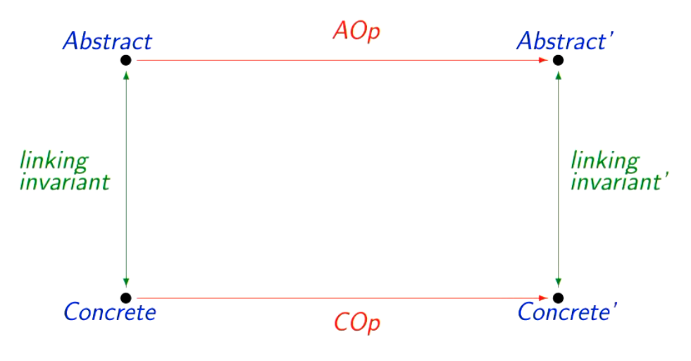

---
header-includes:
  - \usepackage{amssymb}
  - \usepackage{cancel}
  - \usepackage{stix}
---

# CS412 Formal Systems Development
# Abstract Machines
* Specification (model) is written as an abstract machine
* General approach is to define the system state and then define operations on that state

### System State:
* Variables - dynamic components of interest
* Types of variables
* Invariant - properties of interest about the variables and the relationship between them
   * These properties must always be maintained
* Initialisation - gives possible starting values for variables
* Operations - described in terms of how the state changes when that operation is called
   * State transformation should respect the invariant (proof obligation)
   * An operation is atomic
* Example:
   * $xx, yy : \mathrm{N}$ with invariant $xx = yy \land xx \leq 3$
   * Initialisation: $xx, yy := 1$
   * Reset operation: $xx, yy := 1,1$
* State space - all the combinations of values that the state components might take
   * Depending on the operations, some legal states may never be reached
* Various opportunities for verification: machine consistency, proof of required properties, proof of refinement
* Tool will generate and attempt to prove these conditions

### Example B Specification:
```
MACHINE entrysys
SETS PID
VARIABLES inside, maxin
INVARIANT inside <: PID & maxin: NAT1 & card(inside) <= maxin
INITIALISATION inside := {} || maxin := 500
OPERATIONS
enter(pp) = PRE pp: PID & pp /: inside & card(inside) < maxin THEN inside := inside \/ {pp} END;

ww <-- howmany = ww := card(inside)
END
```
* `MACHINE` - unique identifier for the machine, used to refer to it when composed with others
   * Can have parameters, e.g. `MACHINE name(params)`
   * Restrictions on parameters are stated in `CONSTRAINTS`
* `SETS` - introduces sets of interest to the specification
   * Can be a deferred set like PID (given a value later) or an enumerated set
   * Name is often upper case by convention
* `VARIABLES` - declare local state components
   * 2 letter names or more
* `INVARIANT` - restricts the acceptable values of variables
   * Includes type information
   * Initialisation should make it true to start with
   * Must be preserved by each operation
   * It is an assertion (needs proving)
* `OPERATIONS`
   * General syntax is `out1, out2 <-- opname(in1, in2) = ...`
   * May have neither inputs nor outputs (just changes internal state)
   * Describe the changes between before and after states
   * Description rather than sequential programming, e.g. `mm := max(ran(arr))`
   * Can be concrete and easily implementable, or a very abstract description which needs refining
   * If an operation does several things, can use multiple assignment or the parallel composition operator (`||`) where two statements are written on the same line
   * Preconditions:
      * Describes the set of starting states from which we guarantee that the operation will perform correctly
* Can also have `CONSTANTS` whose invariants are expressed in the `PROPERTIES` section
* If we need to delimit statements, can use `BEGIN... END`
   * Acts like brackets
* A precondition (`PRE`) is a constraint which describes the set of states from which it's safe to call an operation 
   * Operation guarantees correct behaviour if called when the precondition is true
   * Describes conditions on state or inputs
   * Generally includes: types of inputs, things we must ensure (e.g. no divison by 0), discounting things we don't want to make provision for
* Conditional statements: `IF... THEN... END` or `IF... THEN... ELSE... END`
* Can also use selection via a `CASE` statement:

`CASE expr OF`

&nbsp;&nbsp;&nbsp;&nbsp;`EITHER val1 THEN op1`

&nbsp;&nbsp;&nbsp;&nbsp;&nbsp;&nbsp;&nbsp;&nbsp;&nbsp;&nbsp;&nbsp;&nbsp;`OR val2 THEN op2`

&nbsp;&nbsp;&nbsp;&nbsp;&nbsp;&nbsp;&nbsp;&nbsp;&nbsp;&nbsp;&nbsp;&nbsp;`OR ...`

&nbsp;&nbsp;&nbsp;&nbsp;&nbsp;&nbsp;&nbsp;&nbsp;`ELSE opn`

&nbsp;&nbsp;&nbsp;&nbsp;`END`

`END`
* `LET` statement:
   * `LET xx BE xx = expr IN s END`

# Relations
* Powerset $\mathbb{P}(X \times Y)$ gives all possible subsets of the set of pairs $X \times Y$ - i.e. all possible relations between sets $X$ and $Y$
   * There are $2^{xy}$ possible relations with domain $X$ and range $Y$

### Basic Types in B:
* Integer (in practice numbers have to be between `MININT` and `MAXINT`)
* Boolean (`BOOL`) - values are `TRUE` or `FALSE`
* Deferred or enumerated sets
   * E.g. `Ben : CHILD`, `broccoli : VEG`
   * Sets of pairs:
      * E.g. $eats \in CHILD \leftrightarrow VEG$, or in B notation `eats : CHILD <-> VEG`
      * $X \leftrightarrow Y$ is shorthand for $\mathbb{P}(X \times Y)$
      * Can also declare as $eats \subseteq CHILD \times VEG$, or in B notation `eats <: CHILD * VEG`
      * The basic type of $eats$ is $\mathbb{P}(X \times Y)$, since this is the largest set that $eats$ is a member of
* A basic type only uses basic sets (inbuilt or declared) and the basic set constructors ($\times$, $\mathbb{P}$, record type)
* Set comprehension notation in B: `vvs := {vv | vv : VEG & cc |-> vv : eats}`
   * `cc |-> vv` means a pair `(cc, vv)`

### Relational Operators:
* `dom(R)` and `ran(R)` - domain and range of `R`
* Domain restriction - $S \lhd R$, `S <| R` (restricts domain of $R$ to $S$)
* Range restriction - $R \rhd T$, `R |> T` (restricts range of $R$ to $T$)
* Similarly, domain subtraction `S <<| R` and range subtraction `R |>> T` removes from the relation pairs whose domain or range element is in a given set
   * No LaTeX for this, but imagine the domain and range restriction symbols with horizontal lines through them
* Relational image `R[S]` - what set of range elements a particular set of domain elements are related to 
* Relation inverse $R^{-1}$, `R~`
* Relational composition $R_1 \circ R_2$, `(R1;R2)`
   * If $R_1$ has type $X \leftrightarrow Y$ and $R_2$ has type $Y \leftrightarrow Z$, $R_1 \circ R_2$ has type $X \leftrightarrow Z$
* Relational overriding - allows us to replace the mappings for a particular set of domain values with some new ones
   * If the domain value wasn't in the old relation, just add the new one
   * Suppose $R \in X \leftrightarrow Y$ and $S \in X \leftrightarrow Y$. Then $R \space \mathrm{relationaloverride} \space S = (\mathrm{dom}(S) \space \mathrm{domainsubtraction} \space R) \cup S$
   * `R1 <+ R2`
* Identity relation $id(X) = \{xx, xx | xx \in X\}$,
   * `id(R)`
* $R^n$ - $R$ composed with itself $n$ times
   * `iterate(R,n)`
* $R^+ = R \cup R^2 \cup R^3 \cup...$ - transitive closure of $R$
   * `closure1(R)`
* $R^* = R^+ \cup id(X)$ - reflexive transitive closure of $R$
   * `closure(R)`

# Non-determinism
* From a given starting state, the system may move to a number of possible end states
* Not controlled by the user
* Underspecification or "don't care" specification - e.g. saying than an element of a certain type will be chosen, but not which one
* Details filled in with refinement
* Allows us to leave out details we don't really care about at this stage, making proofs more manageable and allowing for separation of concerns

### Non-deterministic Assignment:
* Selects one unspecified element from a given set
* $xx : \in X$ 
   * `xx :: X`
* Can be used in initialisation

### ANY Statement:
* Allows the selection of a value satisfying certain constraints, and then using it in the operation body
* `ANY xx WHERE C THEN B END`
   * `xx` is the name of the variable to be used
   * `C` is the condition that `xx` must satisfy - must at least give the type
   * `B` is an AMN description of the operation
* The `ANY` statement generalises the `LET` statement, as `LET` is a specific case where the value of the variable is deterministic
   * A `LET` can always be expressed as an `ANY`

### CHOICE Statement:
* Allows different possible actions
* `CHOICE S1 OR S2 OR ... OR Sn END`

### Implementing Non-determinism:
* Non-determinism must be resolved as we move towards implementation
* A non-deterministic statement means we don't care which value is chosen, as long as it satisfies our generic requirements
* When we refine/implement the specification we can pick any way we choose - could vary depending on other values
* If we give the specification to someone else to implement, they can choose any value they like
   * And then we can't complain it's the wrong one

### SELECT Statement:
* Like an `IF` statement but the conditions can overlap:

`SELECT P1 THEN S1`

`WHEN P2 THEN S2`

`...`

`WHEN Pn THEN Sn`

`ELSE S`

`END`
* We have to not care about which path is executed

# Functions
* A function relates each domain element to exactly one range element
* Partial function - doesn't have to relate each domain element: $S \space \large \char"21F8 \normalsize \space T = \{R | R \in S \leftrightarrow T \land \forall ss, t_1, t_2 ((ss \in S \land t_1 \in T \land t_2 \in T \land ss \rightarrow t_1 \in R \land ss \rightarrow t_2 \in R) \implies t_1 = t_2)\} $
   * `S +-> T`
* Can use all operations from relations, e.g. $f \cup g$ or $f^{-1}$
   * Can't guarantee the result will also be a function
* Total function - the domain is the whole of the source set: $S \rightarrow T = \{f | f \in S \space \large \char"21F8 \normalsize \space T \land \mathrm{dom}(f) = S\}$
   * `S --> T`
* Injective functions:
   * Partial injection - $S \space \mathrm{partialinjection} \space T = \{f | f \in S \space \large \char"21F8 \normalsize \space T \land f^{-1} \in T \space \large \char"21F8 \normalsize \space S\}$
      * No LaTeX symbol here - imagine $\rightarrowtail$ but with a vertical line through it like a partial function
      * `S >+> T`
   * Total injection $S \rightarrowtail T = (S \space \mathrm{partialinjection} \space T) \cap (S \rightarrow T)$ 
      * `S >-> T`
* Surjective functions:
   * Partial surjection - $S \space \mathrm{partialsurjection} \space T = \{f | f \in S \space \large \char"21F8 \normalsize \space T \land \mathrm{ran}(f) = T\}$
      * Again, no LaTeX symbol here - imagine $\twoheadrightarrow$ but with a vertical line through it like a partial function
      * `S +->> T`
   * Total surjection - $S \twoheadrightarrow T = (S \space \mathrm{partialsurjection} \space T) \cap (S \rightarrow T)$ 
      * `S -->> T`
* Bijective functions:
   * $S \space \mathrm{bijection} \space T = (S \rightarrowtail T) \cap (S \twoheadrightarrow T)$
      * No LaTeX symbol for this either - imagine the surjection symbol but with an injection tail
* Function override operation:
   * Useful for updating a value in a function
   * No LaTeX - symbol is: 
   * `class := class <+ {dd |-> cc}`
   * For a single update can also use the shorthand notation `class(dd) := cc`
* Lambda notation:
   * Is useful for quick inline function description
   * E.g. $\mathrm{smallfun} = \lambda xx \cdot (xx\in \mathbb{N} \land 1 \leq xx \land xx \leq 3 | xx * xx)$
      * In B notation: `smallfun = %xx . (xx : NAT & 1 <= xx & xx <= 3 | xx * xx)`
      * Constraint before the bar describes the  domain
      * Expression after the bar gives the value that each domain value maps to

# Sequences
* Each element has a position
* Can therefore model a sequence as a function from position to value
   * An $n$-long sequence s modelled as a function from $1..n$ to the elements of the sequence
   * Has the special property that the domain is exactly $1..n$
* Reordering or repeating the elements in the set gives exactly the same set and same sequences
* A sequence is a relation with the functionality property and the sequence property
* Formal definitions:
   * The set of all finite sequences with elements of type $X$: $\mathrm{seq}(X) = \{f | f \in \mathbb{N}_1 \space \large \char"21F8 \normalsize \space X \land \mathrm{dom}(f) = 1..\mathrm{card}(f)\}$
   * The set of all non-empty sequences with elements of type $X$: $\mathrm{seq}_1(X) = \mathrm{seq}(X) - \{[]\}$
   * The set of all injective sequences with elements of type $X$: $\mathrm{iseq}(X) = \mathrm{seq}(X) \cap (\mathbb{N} \space \mathrm{partialinjection} \space X)$
   * The set of all sequences in which each element of $X$ occurs exactly once (i.e. all permutations of $X$): $\mathrm{perm}(X) = \mathrm{seq}(X) \cap (\mathbb{N} \space \mathrm{partialsurjection} \space X)$
* Can use all previous operators which work for sets of pairs (such as relational overriding and function application)

### Sequence Operations:
* Let $s$ and $t$ be sequences
* $s \frown t$ - concatenation
   * `s ^ t`
* $x \rightarrow s$ - prepend $x$ to $s$
   * `x <- s`
* $s \leftarrow x$ - append $x$ to $s$
   * `s <- x`
* `rev(s)` - reverse
* `size(s)` - cardinality of sequence
* `first(s)` - first element
* `last(s)` - last element
* `tail(s)` - removes the first element
* `front(s)` - removes the last element
* $s \uparrow n$ - take, just the first $n$ elements
   * `s /|\ n`
* $s \downarrow n$ - drop, removes the first $n$ elements
   * `s \|/ n`
* Example: defining prepend
   * $vv \rightarrow ss = \{1 \mapsto vv\} \cup \{nn, ii | nn \in 2..\mathrm{size}(ss) + 1 \land ii = ss(nn - 1)\}$

# Arrays and Records
### Arrays:
* Can model fixed length arrays as total functions
* We map from a fixed domain such as $1..n$ for fixed $n$ or other concrete type
* Atelier B treats it as one of its basic concrete structures if domain is $0..n$ for some $n$
* May have a situation where not all positions are in use - can either just keept track of relevant domain positions, or use a null value
* As usual, can use set, relation and function operators

### Records:
* Set up record types using `struct`
* An element of that type is made using `rec`
* Example:
   * `persondata : struct(p_name : NAME, p_age : NAT)`
   * `persondata := rec(p_name : myname, p_age : 21)`
* Can refer to individual fields, e.g. `persondata'p_name`

# Verification
* How can we mathematically connect the precondition/postcondition to the operation?

### Substitution:
* Replaces all free (not including bound) occurrences of a given variable with a new expression
* E.g. $(x + y > 10)[3/x] = 3 + y > 10$
* Notation is [new/old]

### Formal Semantics - Hoare Triples:
* $\{P\} Q \{R\}$
* Suppose $P$ and $R$ are statements and $Q$ is an operation
* If $Q$ is executed in a state satisfying $P$, is it guaranteed to terminate in a state satisfying $R$?
   * The Hoare triple is an assertion that this is the case
* E.g. $\{xx = 5\} xx := xx + 1 \{xx > 3\}$
* As a specification: we need to find a $Q$ such that, when executed in a state satisfying $P$, will terminate in a state satisfying $R$

### Weakest Precondition:
* For a program $Q$ and postcondition $R$ the weakest precondition is a predicate describing the set of all states from which the execution of $Q$ is guaranteed to terminate in a state satisfying $R$. It is denoted by $[Q]R$
* Any condition that is satisified by the execution of $Q$ implies the weakest precondition
* Captures how the operation behaves
* Example: $[xx := xx + 1]xx > 3$
   * Many preconditions would satisfy this, e.g. $xx = 100$, $xx = 5$, etc.
   * The weakest precondition is $xx > 2$, which can be calculated using definitions for each operation construct
* wp definition for assignment:
   * $[x := E]R = R[E/x]$
      * If you want to be sure that $x := E$ will establish postcondition $R$, you need to know that $R$ would hold initially with $E$ substituted for $x$
   * E.g. $[xx := xx + 1]xx > 3 = (xx > 3)[xx + 1 / x] = xx + 1 > 3 = xx > 2$
   * Multiple assignment - same, but use simultaneous substitution. $[x_1, ..., x_2 := E_1, ..., E_n]R = R[E_1, ..., E_n / x_1, ..., x_n]$
* Trivial cases:
   * $[\mathrm{skip}]R = R$
   * $[\mathrm{BEGIN} \space P \space \mathrm{END}] R = [P]R$
* Conditional:
   * $[\mathrm{IF} \space G \space \mathrm{THEN} \space P_1 \space \mathrm{ELSE} \space P_2 \space \mathrm{END}] R = (G \land [P_1]R) \lor (\lnot G \land [P_2] R)$
   * If there's no else, treat it as a skip. $[\mathrm{IF} \space G \space \mathrm{THEN} \space P_1 \space \mathrm{END}] R = (G \land [P_1]R) \lor (\lnot G \land R)$
   * Example: $[\mathrm{IF} \space xx \geq yy \space \mathrm{THEN} \space mm := xx \space \mathrm{ELSE} \space mm := yy \space \mathrm{END}] mm \geq yy $
      * $= (xx \geq yy \land [mm := xx]mm \geq yy) \lor (xx < yy \land [mm := yy] mm \geq yy)$
      * $= (xx \geq yy \land (mm \geq yy)[xx / mm]) \lor (xx < yy \land (mm \geq yy)[yy / mm])$
      * $= (xx \geq yy \land xx \geq yy) \lor (xx < yy \land yy \geq yy)$
      * $= xx \geq yy \lor xx < yy$
* Case:
   * $[\mathrm{CASE} \space vv \space \mathrm{OF} \space \mathrm{EITHER} \space v_1 \space \mathrm{THEN} \space P_1 \space \mathrm{OR} \space v_2 \space \mathrm{THEN} \space P_2... \mathrm{OR} \space v_n \space \mathrm{THEN} \space P_n \space \mathrm{ELSE} \space P \space \mathrm{END}] R =$
      * $vv = v_1 \implies [P_1]R \land vv = v_2 \implies [P_2]R \land ... \land vv = v_n \implies [P_n]R \land (vv \neq v_1 \land vv \neq v_2 \land ... \land vv \neq v_n) \implies [P]R$
* Pre:
   * $[\mathrm{PRE} \space C \space \mathrm{THEN} \space P \space \mathrm{END}] R = C \land [P]R$
   * We guarantee the desired postcondition only when $C$ is true and the body of the statement establishes $R$

# Machine Consistency
### Non-deterministic Operators:
* We don't know which of the possible end states will result, so all possible choices must establish the postcondition
* Non-deterministic assignment:
   * $[x :\in E]R = \forall s(s \in E \implies R[s/x])$
   * Example:
      * $[x :\in S]x \in T$
      * $= \forall s(s \in S \implies x \in T[s/x])$
      * $= \forall s(s \in S \implies s \in T)$
      * $= S \subseteq T$
* One point rules:
   * $\forall xx (xx = val \implies P) \equiv P[val/xx]$
   * $\exists xx (xx = val \land P) \equiv P[val/xx]$
* Example:

$[\mathrm{PRE} \space yy = xx + 1 \space \mathrm{THEN} \space xx :: \{1,2\} \space \mathrm{END}] yy > xx$

$ = yy = xx + 1 \land [xx :\in \{1,2\}]yy > xx$

$ = yy = xx + 1 \land \forall ss (ss :\in \{1,2\} \implies (yy > xx)[ss/xx])$

$ = yy = xx + 1 \land \forall ss (ss :\in \{1,2\} \implies (yy > ss))$

$ = yy = xx + 1 \land \forall ss ((ss = 1 \lor ss = 2) \implies (yy > ss))$

$ = yy = xx + 1 \land \forall ss ((ss = 1 \implies yy > ss) \land (ss = 2 \implies yy > ss))$

$ = yy = xx + 1 \land \forall ss (ss = 1 \implies yy > ss) \land \forall ss (ss = 2 \implies yy > ss)$

$ = yy = xx + 1 \land yy > 1 \land yy > 2$

$ = yy = xx + 1 \land yy > 2$
* ANY:
   * $[\mathrm{ANY} \space x \space \mathrm{WHERE} \space Q \space \mathrm{THEN} \space P \space \mathrm{END}]R = \forall x (Q \implies [P]R)$
   * Must guaranteed to establish the required postcondition for every possible value of $x$
   * By extension: $[\mathrm{LET} \space x \space \mathrm{BE} \space x = E \space \mathrm{IN} \space P \space \mathrm{END}]R = \forall x (x = E \implies [P]R)$
      * Can be simplified with one point rules
* CHOICE:
   * $[\mathrm{CHOICE} \space P_1 \space \mathrm{OR} \space ... \space \mathrm{OR} \space \mathrm{P_n} \space \mathrm{END}]R = P_1[R] \land ... \land P_n[R]$
* SELECT:
   * $[\mathrm{SELECT} \space C_1 \space \mathrm{THEN} \space P_1 \space \mathrm{WHEN} \space C_2 \space \mathrm{THEN} \space \mathrm{P_2} \space ... \space \mathrm{WHEN} \space C_n \space \mathrm{THEN} \space \mathrm{P_n} \space \mathrm{ELSE} \space P \space \mathrm{END}]R$
   * $=(C_1 \implies [P_1]R) \land (C_2 \implies [P_2]R) \land ... \land (C_n \implies [P_n]R) \land ((\lnot C_1 \land \lnot C_2 \land ... \land \lnot C_n) \implies [P]R)$

### Machine Consistency Conditions (Simplified):
* Whatever specification we write, there are basic checks that can be made to ensure it makes sense
* These are called consistency conditions
* For a basic specification, these are associated with the initialisation and each operation
* Generated automatically by the toolkit, and proved automatically if possible
* The invariant states the important properties which we are demanding our specification should ensure
   * It should be established by the initialisation
   * If it is true before an operation is called, it should be true after the operation
* Basic initialisation condition: for initialisation $init$ and invariant $I$: $[init]I$
   * Example: 
      * $[inside := \{\} || maxin := 500](inside \subseteq PID \land maxin \in \mathbb{N}_1 \land card(inside) \leq maxin) = \{\} \subseteq PID \land 500 \in \mathbb{N}_1 \land 0 \leq 500 = true$
* Basic operation condition: for invariant $I$, precondition $Pre$ and operation body $S$: $I \land Pre \implies [S]I$

### Consistency for Basic Abstract Machines:
* Initialisation condition:
   * For initialisation $init$, invariant $I$, properties $P$ and constraint $C$: $P \land C \implies [init]I$
* Operation condition:
   * To be proved for each operation $\mathrm{PRE} \space Pre \space \mathrm{THEN} \space S \space END$
   * For invariant $I$, properties $P$ and constraint $C$: $P \land C \land I \land Pre \implies [S]I$
* Assertions:
   * These are useful facts that follow from the invariant
   * We must then show that they do follow from the invariant
   * For invariant $I$, properties $P$, constraint $C$ and assertions $J_1,...,J_n$ it must be shown for each $J_i$ that: $P \land C \land I \land J_1 \land ... \land J_{i-1} \implies J_i$

### Not Checked at this Stage:
* Atelier B does not check that you have written satisfiable constraints and properties
* Could end up with something that is not implementable
* Existence proofs are difficult but possible to do
* Example:
```
MACHINE TestMachine
SETS PID
CONSTANTS privileged, maxval
INVARIANT privileged : FIN(PID) & maxval : NAT & maxval = 0 & card(reg) < maxval
```
   * `card(reg)` can't be less than 0 - it is unsatisfiable but proves ok

### Finite Sets:
* Built in number types have finite interpretations
   * For example, if we have `bnum : NAT` it is interpreted as `bnum : INTEGER & 0 <= bnum & bnum <= 2147483647`
   * Will sometimes need to be careful with operations such as `bnum := bnum + 1`
* If we have:
```
VARIABLES reg
INVARIANT reg : POW(PID) & card(reg) < maxval
```
* The prover generates the following well-definedness condition: `reg : FIN(reg)`
   * Using `FIN` instead of `POW` may prevent this

### What Can Go Wrong:
* Suppose we are trying to prove $P \land C \land I \land Pre \implies [S]I$. What if the conditions can't be proved?
   * Does the operation say it's safe to be invoked when it isn't?
   * Operation body is wrong
   * $I$ could be too strong - rules out some states which are actually ok
   * $I$ could be too weak - there's more that we could say which would actually help to show that the operation reestablishes it
   * $I$ is just wrong
   * $P$ or $C$ may not be right

# Structuring Specifications
* For large specs, modularity is crucial
* Abstract machines can be combined in different ways - implications for exactly what is visible/usable
* Encapsulation and separation of concerns - applies to both specification and proof
   * Modularise both proof and specification

### Incorporating One Machine in Another:
* Three different structuring mechanisms, each with different levels of access and conditions
   * `M2 SEES M1`
   * `M2 USES M1`
   * `M2 INCLUDES M1`

### M2 SEES M1:
* Allows M2 to have read access to M1
* M2 can refer to any sets and constants defined in M1
* M2 can query (or just use) the values of M1's variables
* M2 can't use operations of M1 other than query operations
* M2 can't refer to variables of M1 in its invariant
   * M1 could changes these variables
* A machine can be SEEN by many different machines
* If M1 has parameters, M2 has no control over the values chosen
* M2 does not automatically SEE any machine M1 SEES
* M2 cannot make any promises or claims about any particular values from M1

### M2 INCLUDES M1
* M2 has complete control over M1
* M2 can use all of M1's variables and constraints
* M1's initialisation is automatically included in M2
* M2 can refer to these in its invariant and operations
* M2 can alter the values of M1's variables, but only using M1's operations
* M2 has access to all of M1's operations
   * A single M2 operation can't combine two operations from M1
   * To call an operation from an included machine, instantiate its parameters:
      * `oo1, oo2, ... <-- small_machine_op(val1, val2, ...)`
* No other machine can INCLUDE M1
* Must choose different names for all operations
* Operations of the included machine are not automatically available as operations of the including machine
   * Another keyword, `PROMOTES`, is used for this
   * Promoted operations are now operations of the larger machine
   * Must check they preserve its invariantd
   * Can still use promoted operations in definitions of other operations
* If a calling machine promotes all the operations of a machine, we can use the `EXTENDS` keyword (`EXTENDS included_machine`)
* Nested `INCLUDES`: suppose M3 `INCLUDES` M2 and M2 `INCLUDES` M1
   * Visibility of state (constants, variables) is transitive - M3 can see state of M1
   * Visibility of operations is not transitive - M3 can't see M1's operations unless M2 `PROMOTES` them

### M2 USES M1
* Similar to `SEES` - M2 accesses values from M1 but doesn't alter them
* With `USES`, M2 can use M1's variables in its invariant
* So, M2 can make claims about variables it has no control over
   * Should be used with caution, and only when it is needed

### Proof Obligations:
* M1 has been verified as consistent
* Normal conditions for M2 are tweaked slightly to take into account presence of M1
* For `INCLUDES` only:
   * If M1 has parameters, must show the instantiations provided by M2 satisfy M1's constraints: $C_1[actuals/p_1]$
* Initialisation condition:
   * Initialising first M1 and then M2 establishes $I_2$
   * $C_1 \land C_2 \land B_1 \land B_2 \implies [T_1;T_2]I_2$ where:
      * $C_1, C_2$ are constraints
      * $B_1, B_2$ are properties
      * $T_1, T_2$ are initialisations
      * $I_1, I_2$ are invariants
* Operation condition:
   * To be proved for each operation in M2 (including all promoted ones) `PRE P THEN S END`
   * $C_1 \land C_2 \land B_1 \land B_2 \land I_1 \land I_2 \land P \implies [S]I_2$ where $P$ is the precondition
* M1 can only be updated by its own operations - we already know they preserve $I_1$
* For `USES`, full verification is not possible at this stage
   * M1 may get INCLUDED in another machine that we don't know about yet
   * Full verification is deferred until later in the development (when all relevant machines are brought together)
   * This is managed by the tool

### DEFINITIONS:
* Can be used to set up useful syntactic definitions
* These named definitions may have parameters
* References to defined names located throughout the specification are replaced during the lexical analysis phase
* We can share definitions across machines by putting them into a separate file named `xxx.def`
   * Machines that SEE another don't get access to its definitions
   * A spec that needs to use these defintions should state `DEFINITIONS "xxx.def"`

# Refinement Machines
* Refinement:
   * Resolves non-determinism
   * Changes to concrete data structures
   * Moves towards implementable programming constructs which say how the required results should be achieved
* General idea: $Abstract \sqsubseteq LessAbstract \sqsubseteq ... \sqsubseteq Concrete$
* At each step, change some things and show that the refinement relationship holds between one level and the next
   * Smaller steps easier to verify, but can go straight to implementation
* Keyword in B is `REFINEMENT` 
* Implementation is the final machine in the process - it can be directly coded
   * Some constructs are not allowed
   * Can use LIBRARY machines which have associated code

### Data Refinement:
* Data refinement replaces abstract data structures with concrete structures (e.g. replace set with an array)
* Operations must change accordingly to provide a service to the user which is as good as promised in the specification
   * Same inputs and outputs, results agree with specificaation
   * Operations are at least as available
* Refinement conditions are generated by the toolkit
* Proof obligations to ensure that the refinement is 'as good as' the specification

   * This 'sameness' is described and maintained via a linking invariant

### Refinement Machine Example:
* Consider the following machine:
```
MACHINE Forms
SETS CLASS; RESP = {yes, no}
CONSTANTS cmax
PROPERTIES cmax : NAT1 & card(CLASS) <= cmax
VARIABLES returns
INVARIANT returns <: CLASS
INITIALISATION returns := {}
OPERATIONS
   ret_form(cc) = PRE cc : CLASS & cc /: returns
                  THEN returns := returns \/ {cc}
                  END;

   oo <-- query(cc) =   PRE cc : CLASS
                        THEN  IF cc : returns
                              THEN oo := yes
                              ELSE oo := no
                              END 
                        END
END
```
* We can refine it as follows:
```
REFINEMENT Forms_r
REFINES    Forms
VARIABLES  returnsarr
INVARIANT  returnsarr : CLASS --> RESP & returns = dom(returnsarr |> {yes})
INITIALISATION returnsarr := CLASS * {no}
OPERATIONS
   ret_form(cc) = returnsarr(cc) := yes;

   oo <-- query(cc) = oo := returnsarr(cc)
END
```
* Construct a mapping between related states in the abstract machine and more concrete machine
   * In this example state is now an array mapping from `CLASS` to `{yes, no}`
* Refinement machines simplify in a number of ways:
   * Don't need to repeat info like sets and concrete constants
   * Preconditions have vanished - we assume from previous level
      * Can make them more inclusive, but not any more restrictive
   * Don't need old invariant info
   * Can leave out type info
* Must add:
   * Any new sets and constants (and properties)
      * Not usual to have any new deferred sets
   * (More) concrete variables and invariant info about them
   * Linking invariant
   * Operations must match one for one with spec
   * Do have to repeat any structuring info, e.g. `SEES Mach`
* A refinement need only maintain enough information to perform its operations in accordance with the specification. E.g.
   * Abstract:
      * State: set of numbers
      * Op1: add number
      * Op2: output max
   * Concrete:
      * State: number (current max)
      * Op1: swap or forget
      * Op2: output number
   * We need to consider the states from the abstract machine and what we do with them
* What is not a refinement?
   * Operations which have more non-determinism than the original
   * Operations which don't work for all cases within the original specification
   * Operations which don't agree with the original specification
   * Included and seen machines must be abstract
      * Cannot have `USES` as refinement - regarded as a constraint between abstract states
      * For included machines, relationship between state variables should be included in the linking invariant

### Useful Things in Refinement Machines:
* Sequencing:
   * `S; T` 
   * $[S; T]P = [S]([T]P)$
   * E.g. `BEGIN pos := pos + 1; arr(pos) := val END`
   * Simplifying weakest precondition example:

$[tt:=xx;xx:=yy;yy:=tt]xx = aa \land yy = bb$

$=[tt:=xx]([xx:=yy;yy:=tt]xx = aa \land yy = bb)$

$=[tt:=xx]([xx:=yy]([yy:=tt]xx = aa \land yy = bb))$

$=[tt:=xx]([xx:=yy]xx=aa \land tt=bb)$

$=[tt:=xx](yy=aa \land tt=bb)$

$=yy=aa \land xx=bb$
* Local variables:
   * `VAR vv IN S END`
   * $[\mathrm{VAR} \space vv \space \mathrm{IN} \space S \space \mathrm{END}]P = \forall vv . [S]P$
   * E.g. `VAR tt IN tt := xx; xx := yy; yy := tt END`

### Linking Invariant:
* Relationship between abstract and concrete states can be quite complex
* Example 1:
   * Abs: `returns : POW(CLASS)`, Conc: `returnarr : CLASS --> RESP`
   * Invariant: `returns = dom(returnarr |> {yes})`
   * This is a one-to-one relationship
* Example 2:
   * Abs: `returns : POW(CLASS)`, Conc: `retarr : (1..card(CLASS)) --> RESP` and `len : 1..card(CLASS)`
   * Invariant: `returns = retarr[1..len]`
   * Each concrete state is related to one abstract state (but not vice versa)
* Example 3:
   * Abs: `nums : seq(NAT)`, Conc: `count, sum : NAT`
   * Invariant: `sum = SIGMA(xx).(xx : dom(nums) | nums(xx))`
   * Each abstract state is related to one concrete state (but not vice versa)
* Many-to-many possible but not very common

### Operation Refinement:
* Don't have to change the data structures at a refinement step
* Changes to operations can be done separately, or with data refinement
* Can (partially) remove non-determinism
* Can assume precondition and leave it at that, or can decide what to do outside precondiiton
* Can add structure, develop algorithm to carry out operation
* Whenever the refinement machine allows a step from before to after state via one of its operations, it must be something that the abstract machine allows

### Structure in Refinement Machines:
* Don't have to map structure of previous level exactly
* Do have to provide the same interface
* One abstract state component can be refined by several concrete state components and vice versa
* Non-determinism may move across as long as it doesn't increase overall

# Proof Obligations for Refinement
* Informally: anything the refinement can do, the abstract machine must allow
   * Applies to initialisation as well as operations
* Have to consider the two machines in the light of the linking invariant
* Refinement must do enough things (same ops in at least as many circumstances)
* Informally, consider an operation which maps state to state
   * Each before value mapped by abstract machine operation $AOp$ must also be mapped by $COp$ (applicability)
      * $dom(AOp) \subseteq dom(COp)$
   * Each value in the domain of $AOp$ when mapped by $COp$ must give a result that agrees with $AOp$ (correctness)
      * $dom(AOp) \lhd COp \subseteq AOp$
   * $COp$ may resolve nondeterminism
   * $COp$ may do anything for values outside precondition

### Initialisation:
* Concrete initialisation must end up in a state related to an abstract initial satte
* Could relate to several abstract states - this is fine as long as at least one of these is an abstract initial satte
* Proof condition should ensure that refinement initialisation will lead to one of these acceptable starting states
* We require that the execution of the concrete initialisation $T_1$ will lead to a state for which the execution of the abstract initialisation $T$ leads to a state related by the linking invariant $J$
   * $[T_1]\lnot[T]\lnot J$
      * $\lnot[prog]\lnot P$ represents the states from which $prog$ **can** establish $P$
   * Example: 
     * $[\mathrm{CHOICE} \space myset := \{0\} \space \mathrm{OR} \space myset := \{1\} \space \mathrm{OR} \space myset := \{2\} \space OR \space myset := \{1,2\} \space \mathrm{END}]num \in myset$
     * $\lnot[T]\lnot[J] = \lnot([\mathrm{CHOICE}...](num \notin myset))$
     * $=\lnot (num \notin \{0\} \land num \notin \{1\} \land num \notin \{2\} \land \notin \{1,2\})$
     * $=num \in \{0\} \lor num \in \{1\} \lor num \in \{2\} \lor \in \{1,2\}$
     * $=num = 1 \lor num = 1 \lor num = 2$
     * $[T_1]\lnot[T]\lnot J = [num :\in \{0,1\}](num = 1 \lor num = 1 \lor num = 2)$
     * $=(num = 1 \lor num = 1 \lor num = 2)[0/num] \land (num = 1 \lor num = 1 \lor num = 2)[1/num] = true$
* Initialisation condition: for abstract machine $T$, properties $B$ and constraint $C$, and refinement machine with initialisation $T_1$, properties $B_1$ and invariant $J$: $C \land B \land B_1 \implies [T_1]\lnot[T]\lnot J$

### Operation Consistency:
* An operation in a refinement must do something allowed by the abstract machine
* Proof condition should ensure that refinement operation will lead to acceptable after states
* Basic correctness condition: for abstract operation $S$, concrete operation $S_1$ and linking invariant $J$: $[S_1]\lnot[S]\lnot J$
* For abstract invariant $I$ and abstract precondition $P$: $I \land J \land P \implies [S_1]\lnot[S]\lnot J$
* To show operation is fully correct must also check that the output from the refined operation is allowed according to the abstract specification
   * Problem: both abstract and concrete outputs have the same name - we need a way of distinguishing them
   * Suppose the output variable is $oo$, then:
      * Rename the refinement output variable to $oo'$
      * Check refinement ensures that $oo'$ will have a value corresponding to a possible value of $oo$
* New correctness condition: $I \land J \land P \implies [S_1[oo/oo']]\lnot[S]\lnot (J \land oo' = oo)$
   * If operation doesn't have outputs we can ignore this bit

### Applicability for Operations:
* The correctness condition is fine if the refinement operation has no stated precondition - we can assume the abstract pre must hold
* But if it does have a separate stated precondition then we must show that it is not too strict
   * Refinement machine has to allow everything the abstract machine allows
* If $P_1$ is the refinement operation's precondition, then the applicability condition is: $I \land J \land P \implies P_1$

### Proof Condition for Operations:
* For each abstract operation $AOp$ with pre $P$ and output $oo$, and corresponding refinement operation $COp$ with pre $P_1$ and output $oo$:
   * For abstract machine with invariant $I$, properties $B$, constraint $C$, and refinement machine with linking invariant $J$ and properties $B_1$:
      * Correctness condition: $C \land B \land B_1 \land I \land J \land P \implies [COp[oo'/oo]]\lnot[AOp]\lnot(J \land oo' = oo)$
      * Applicability condition: $C \land B \land B_1 \land I \land J \land P \implies P_1$

# Loops
### Loops in B:
```
WHILE E
DO S
END
```
* Example:
   * PRE: $arr \in [1..n] \rightarrow \mathbb{N} \land nn \geq 0$
   * POST: $sum = \sum ii.(1 <= ii \land ii <= nn | arr(ii))$
```
xx := 0; sum := 0;
WHILE xx /= nn
DO xx := xx + 1; sum := sum + arr(xx)
END
```

### Weakest Precondition for a Loop:
* A wp definition of the form $[LOOP]R=...$ is difficult to work with because we don't know in advance how many iterations are needed, so we would need something of the form $\exists bb . (bb \in \mathbb{N}...)$
* 2 important properties for a loop:
   * When execution ends is the required postcondition guaranteed (correctness)?
   * Does execution end (termination)?
* The loop variant is a function which, while the loop is executing, always returns an element of $\mathbb{N}$
   * Strictly decreased by each execution of the loop body
   * Provides a bound on the number of executions still to go
   * E.g. for our summing program above a suitable variant would be $nn-xx$
* The loop invariant is a predicate stating an important relationship between the state variables which does not change as the loop execute
   * At any point in the loop execution it should be able to explain the useful work (towards our postcondition) that the loop has carried out so far
   * A **suitable** loop invariant is one which we choose that can help us establish that the postcondition must be true when the loop terminates
   * For a property to be invariant for the loop: if it's true at the start of a single execution of the loop body then it's true at the end
   * Some invariants of our summing program loop are: $xx \geq 0$, $yy = 3$, $\sum ii.(1 \leq ii \land ii \leq xx | arr(ii)) > 100$
   * None of these are very helpful in establishing that the program sums the array - a more suitable invariant would be $sum = \sum ii.(1 \leq ii \land ii \leq xx | arr(ii))$
      * When the loop ends, the guard is no longer true and $xx=nn$ - now the invariant tells us $sum = \sum ii.(1 \leq ii \land ii \leq nn | arr(ii))$, which is our required postcondition

### Properties of the Invariant:
1. The invariant $I$ should be chosen such that it, together with the negation of the guard, implies the postcondition
2. If $I$ is true before an execution of the loop body, it's true after the executuon of the loop body
3. $I$ must be true as the loop starts (perhaps because of the initialisation)

### Properties of the Variant:
1. Whenever the loop body executes, the value of the variant must be $\geq 0$
2. If the value is $v_0$ before the loop body executes and $v_1$ afterwards then $v_1 < v_0$

### Loop Syntax:
* We record the invariant and variant when we write the loop so that the toolkit can generate conditions according to those above
   * The toolkit **cannot** automatically generate the variant or invariant for us
```
xx := 0; sum := 0
WHILE xx /= nn
DO xx := xx + 1; sum := sum + arr(xx)
INVARIANT sum = SIGMA(ii).(1 <= ii & ii <= xx | arr(ii)) \land 0 <= xx <= nn
VARIANT nn - xx
END
```

### Conditions for Verifying a Loop:
```
WHILE E DO S INVARIANT I VARIANT v END
```
* If:
   1. $\forall vars.(I \land \lnot E \implies P)$
   2. $\forall vars.(I \land E \implies [S]I)$
   3. $[init]I$
   4. $\forall vars.(I \land E \implies v \in \mathbb{N})$
   5. $\forall vars.(I \land E \land v = v_0 \implies [S]v < v_0)$
* Then: $[WHILE]P$

# Implementation Machines
* An implementation machine is the final step towards producing code which is correct with respect to an abstract specification
* Same refinement relation - same proof obligation
* Two ways to write an implementation machine: ensure everything is B0 or import other machines (which themselves will have to be implemented)
   * Imported machines can either be own machines which are implemented separately, or a library machine which is implemented within the B environment

### B0 Language:
* B0 is the concrete subset of the B language, used for describing structures and operations ready for translation to code
* B0 requires all date to be concrete:
   * Machine parameters
   * Concrete constants
   * Concrete variables
   * Operation inputs/outputs
   * Local variables
   * Deferred sets
   * Enumerated sets
* `CONCRETE_VARIABLE` are used at the implementation level
   * They can have the following types:
      * `INT` (from `MININT` to `MAXINT`)
      * `BOOL` (`TRUE` and `FALSE`)
      * Enumerated sets (e.g. `{on,off}`)
      * Deferred sets (these themselves have to be defined)
   * Can have a single value of any of these, or an array or record of them
   * There is also a `STRING` type used for operation inputs
* Not B0: sets, partial functions, relations, sequences
   * These need to be refined to concrete structures
* If an implementation passes a B0 check - good to go to generate code

### Example:
* Abstract machine:
```
MACHINE CarPark
SETS Resp = {yes,no}
CONSTANTS capacity
PROPERTIES capacity : NAT1
VARIABLES inuse
INVARIANT inuse : NAT & inuse <= capacity
INITIALISATION inuse := 0
OPERATIONS
oo <-- spacequery = IF inuse = capacity THEN oo := no ELSE oo := yes END;

enter = PRE inuse < capacity THEN inuse := inuse + 1 END;

leave = PRE inuse > 0 THEN inuse := inuse - 1 END;
END
```
* Implementation:
```
IMPLEMENTATION CarPark_i
REFINES CarPark
VALUES capacity = 500
CONCRETE_VARIABLES inuse
INITIALISATION inuse := 0
OPERATIONS
oo <-- spacequery = IF inuse = capacity THEN oo := no ELSE oo := yes END;

enter = PRE inuse < capacity THEN inuse := inuse + 1 END;

leave = PRE inuse > 0 THEN inuse := inuse - 1 END;
END
```
* `VALUES` section gives the value for any constants
   * `VARIABLES` in an abstract machine assumed to be abstract and we are required to repeat the info as `CONCRETE_VARIABLES` in the implementation
   * However, if we know it's a concrete variable right from the start we can declare it as such in the abstract machine 
* Don't have to restate `SET` as its already concrete
* Only concrete constructs and operations allowed - `PRE`s must therefore go

### Adding Output:
* If we want to do something more robust about dealing with `PRE`s, need to think about adding structure
* Can't suddenly add extra output parameters (i.e. error messages) - this is not a refinement
* Writing an abstract machine wrapper with error outputs for the `CarPark` machine:
```
MACHINE TotCarPark
SEES Resp
SETS {ok,noroom,empty}
OPERATIONS
ee,oo <-- tot_spacequery = BEGIN ee :: ERRORS || oo :: RESP END;

ee <-- tot_enter = BEGIN ee :: ERRORS || oo :: RESP END;

ee <-- tot_leave = BEGIN ee :: ERRORS END
END
```
* We have to do this at the abstract machine level - can't suddenly add new parameters at the refinement level
* In order for this to have the right type to output (`Resp`) we have to change the `CarPark` specification slightly and put `Resp` in a separate machine
* Now we need an implementation for `TotCarPark`:
```
IMPLEMENTATION TotCarPar_i
REFINES TotCarPark
IMPORTS CarPark
SEES Resp
OPERATIONS
ee, oo <-- tot_spacequery = BEGIN oo <-- spacequery; ee := ok END;

ee <-- tot_enter = IF inuse < capacity THEN BEGIN ee := ok; enter END ELSE ee := noroom END;

ee <-- tot_leave = IF inuse > 0 THEN BEGIN rr := ok; leave END ELSE ee := empty END
END
```
* When implementing a structured machine need to repeat relevant structuring, e.g. `SEES`
* At the refinement level `IMPORTS` is used instead of `INCLUDES`
* Machines referred to in the structuring are the abstract machines

### Generating an Interface:
* Atelier B is also supposed to provide support for generating a `main` function
   * Need to write a top-level machine with just a `main` operation
* If we want the user to be able to select an operation, we need to be able to communicate with the user
   * Atelier B has some library machines to do this
* 2 sorts of library machines: the first are the basic machines
   * Provide some useful additional functionality that we need
   * Translations have been manually coded
   * They are kept to the minimum - everything else is built on top of these
* `BASIC_IO` - provides simple terminal I/O functionality with a basic way of writing simple strings/numbers to the screen and obtaining simple user inputs from the screen
   * `CHAR_WRITE(cc)` - writes the char `cc`
   * `INT_WRITE(vv)` - writes the int `vv`
   * `STRING_WRITE(ss)` - writes the string `ss`
   * `BOOL_WRITE(bb)` - writes the boolean `bb`
   * `bb <-- BOOL_READ` - reads the boolean `bb`
   * `cc <-- CHAR_READ` - reads the char `cc`
   * `ii <-- INTERVAL_READ(mm,nn)` - reads an input `NAT` between `mm` and `nn`
* `STRING_WRITE` example:
```
MACHINE Hello
OPERATIONS
firstoutput = skip
END
```
```
IMPLEMENTATION Hello_i
REFINES Hello
SEES BASIC_IO
OPERATIONS
firstouput = STRING_WRITE("Hello World\n")
END
```
* We still need a `main` function:
``` 
MACHINE Top
OPERATIONS
main = skip
END
```
```
MACHINE Top_i
REFINES Top
IMPORTS Hello, BASIC_IO
OPERATIONS
main = firstoutput
END
```
* This should now generate an executable program
* We can have a loop to continually prompt a user for input, but we don't need an invariant or variant (other than a dummy one to stop Atelier B from complaining)

### Library Machines:
* Library machines - provided with the tool, have full development from abstract machine to code
   * Our implementations can make use of these
* User defined library machines - extensible so could start to develop own trusted libraries
* Library machines can take care of data structures required by implementation (more than just the simple values, arrays and records of B0)
   * We can use the interface operations provided by the library machine