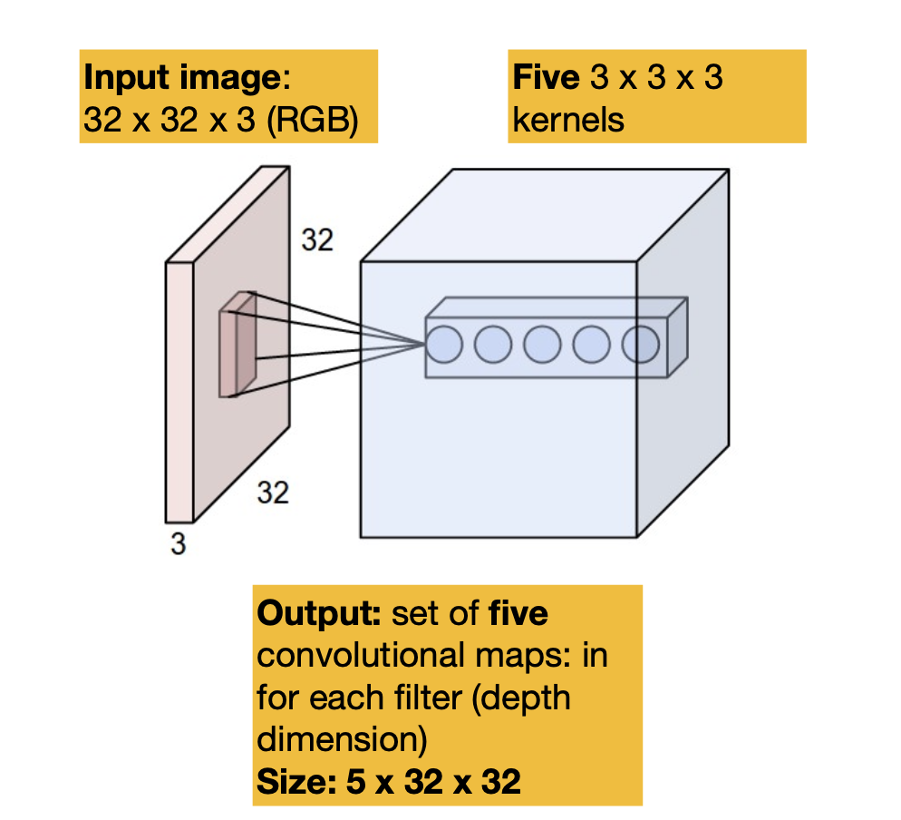

# CS413 Image and Video Analysis
# Visual Perception
### The Perceptual Process:

* There is feedback from perception, recognition and action
* Knowledge is applied to perception and our actions on interpreting stimuli
   * Separate parts of the brain are used for perception and knowledge
* Receptors transduce environmental stimuli such as light, sound and pressure into electrical signals
* Nerves carry these electrical signals to the brain
* Processing in the brain gives us the experience of perception

### Neurons:
* Made up of:
   * Soma - contains nucleus and other metabolic structures
   * Dendrites - receive electrical signals from other neurons
   * Axon - sends electrical signals to other neurons, insulated with a myelin sheath
* Receptor neurons are special neurons with a transducer (receptor) in place of the soma
   * Transforms a stimulus into an electrical signal
* Nerves are cable-like bundles of axons
   * Afferent nerves conduct signals from sensory neurons to the CNS
   * Efferent nerves conduct signals from the CNS along motor neurons to muscles and glands
* Electrical signals are passed chemically across the synapse 
   * If the presynaptic neuron is not firing, a low electrical potential exists at the axon
   * If the presynaptic neuron stimulus is strong enough, an action potential is reached
   * The electrical signals trigger chemical activity in the form of neurotransmitters coded by shape
   * Neurotransmitters cross the gap and arrive at the receptor sites of the postsynaptic neuron
   * If the shapes match, the postsynaptic neuron is triggered
   
* Neural firing can be excitatory or inhibitory, depending on the nature of the neurotransmitters and the cell body
* The magnitude of the action potential is constant (~40mV) and does not represent the strength of the stimulus
   * The strength of the stimulus is indicated by the firing rate
   * Action potential duration varies across a wide range
   * A refractory period of 1ms prevents the neuron from re-firing, bounding the firing rate to 800Hz
   

### Processing in the Brain:
* Cerebral cortex (grey matter):
   * A 2mm thick layer that covers the surface of the brain
   * Where all the neurons are
   * Responsible for perception, language memory and thinking
   * The white matter below consists of interconnections - axons and myelin sheath
* Specific areas of the brain have specific functions:
   * Occipital lobe - vision
   * Parietal lobe - touch
   * Temporal lobe - hearing, taste and smell
   

### Eye Structure and Optical Sensing:

* Light enters the eye and is focussed by the cornea and lens
   * Cornea and sclera are the outer cover
   * Sphincter muscles control the size of the pupil (hole in iris), which allows varying amounts of light to reach the lens
   * Ciliary body changes the shape of the lens
   * Accommodation is the ability of the eye to change focusing power
      * Cornea is responsible for 80% of focusing, but is fixed
      * Lens provides 20% of focusing ability, which adapts to stimuli at different distances because its shape can be changed
         * Flattened for more distant objects, thickened for closer objects
      * Each eye has a near and far point beyond which it cannot focus
         * Long-sightedness (presbyopia) is when you cannot focus on close objects
         * Short-sightedness (myopia) is when the eyeball is too big to focus on far objects, requires spectacles with concave lenses
* The retina is a light-sensitive layer at the back of the eye, convering 65% of the interior surface
   * Light focusses onto the macula
   * Fovea is where the colour receptors are concentrated
      * Located on the optical axis
      * Subtends about 2 degrees of the central field of view
      * It has the best colour and spatial acuity (ability to perceive fine details and distinguish between closely spaced objects in a scene)
      * Most densely populated with photoreceptors
      * The area around it is called the periphery
* Two types of photoreceptor cells: rods and cones
   
   * Photo-chemical reactions trigger rods and cones to fire
   * Rods:
      * Monochrome, good for dim-light (scotopic) vision
      * Reach maximum sensitivity after 30 minutes in the dark
      * 120 million
      * Only on the periphery
   * Cones:
      * Colour-sensitive, bright-light (photopic) vision
      * Reach maximum sensitivity after 10 minutes in the dark
      * 3 types, with different light sensitivities
         * S cones - sensitive to short wavelengths, M cones - sensitive to medium wavelengths, L cones - sensitive to long wavelengths
      * 6 million
      * Majority in fovea, rest in periphery
   * 20:1 ratio of rods to cones in periphery
   
   * Eyes have blind-spots
      * Axons of ganglion cells in nerve bundle exit the eye to send signals to the visual cortex - no photoreceptors here
      * The brain can fill this gap in the perception process
* The receptors are at the back of the retina with layers of neural processing in front
* Light passes through several layers of (transparent) neurons (ganglion, amacrine, bipolar and horizontal cells) in the retina before it is sensed at the retinal pigment epithelium at the back
* Once the light is sensed, it is passed through several layers of neural cells ending with the ganglion cells
   * Ganglion cells pass the information along the surface of the retina into the optic nerve
   * Optic nerve is the axons of the ganglion cells

### Receptive Field of Ganglion Cells:
* A receptive field is an area on the retina which can influence the firing rate of a ganglion cell

* Receptive fields of ganglion cells have a centre-round shape as above
   * On-centre - firing rate increases when light fallss on the centre of its receptive field
   * Off-centre - firing rate increases when light falls on the surround of its receptive field
* Arrangement of receptive fields allows for edge detection - when there is a sharp contrast between light and dark areas, this is detected by the ganglion cells

   * Insensitive to the illumination of the scene 

### Light:
* Light consists of small packets of energy called photons
   * Behaves like a wave (light can interfere with itself)
* Wavelengths of photons are perceived as colour
* When light illuminates a surface, some photons are:
   * Transmitted (e.g. throught transparent objects)
   * Absorbed (100% absorption if the surface is black)
   * Reflected (this is what we see)
* Light reflected from one surface can illuminate an other
* Light reverberates in different amounts in all directions, allowing us to perceive shapes and surfaces
* Ambient Optical Array (AOA) is the pattern of light reaching the viewer from all directions, changing with viewpoint

   * The motion of the light field across the eye allows us to judge motion, depth and size
      * Referred to as optical-flow
      * Eyes are very rarely static, constantly moving

### Image Formation in the Eye:
* The eye is like a pinhole camera
* 3D objects reflect light and are projected onto a 2D surface
   * Depth information is lost in monocular vision
   * The object size depends on its distance
* Objects in the world (distal stimuli) produce images on the retina (proximal stimuli)
* What we see in the scene is projected upside-down, right-to-left on the retinal surface (effectively rotated 180 degrees)

   * The brain sees gravity as pulling downwards and flips it back... or perhaps we see the world as upside-down?
* Photons from occluded (hidden) surfaces don't reach the eye - we infer their surfaces from our experience
* 3D scene reconstruction is an inverse problem and ill-posed - we don't have enough data to solve it with one eye
   * There are still monocular depth cues: shading, shadows, texture, perspective effect (size), parallax (things closer to us moving faster)
* With two eyes, we can use disparity - the difference between the view that each eye receives of a scene - to infer depth

### Visual Pathway:

* Left and right visual fields end up in opposite hemispheres
* The Lateral Geniculate Nucleus (LGN) is the grand junction
   * Performs initial visual processing - retinotopic map
      * A mapping of the retina onto the visual cortex
      * Locality of the sensor information we get from the eye is maintained
* Optic radiation connects to the visual cortex
* The left and right are combined at the primary visual cortex
   * Has multiple layers with a hypercolumnar, retinotopic organisation
      * Each column is dedicated to a local part of the retinotopic map
   * Simple, complex and end-stopped cells adapted to extracting different features from the retinotopic map

### Lateral Geniculate Thalamus (LGN):
* LGN is inside the thalamus
* Primary relay centre for visual information from the retina
* Information in the LGN is organised to facilitate efficient access
   * Bilateral structure with 6 layers
   
   * Each layer receives signal from one eye
      * Layers 2, 3, 5 from the ipsilateral eye (same-side)
      * Layers 1, 4, 6 from the contralateral eye (opposite-side)
   * Purpose is to compare the same information from the left and the right field
      * Solves the stereopsis (3D vision) problem
      * For any given position, what is the shift in the other image
      * Objects further away will be shifted less
   * Depth and edge information is encoded in the signals before they reach the visual cortex
* Retinotopic mapping in the LGN:
   * Neural processing cells topology same as the retinal ganglion cells
   * The axons of ganglion cells entering the LGN are arranged such that an area in the retina is mapped to an area in the LGN and adjacent areas in the retina map to adjacent areas in the LGN

### Visual Cortex:
* Hypercolumnar organisation - cells on the same column are stimulated by the same area of the retina and adjacent columns are stimulated by adjacent areas of the retina
* Has more cells dedicated to the central region of the retina than the peripheral region 
* Cells in the visual cortex respond to visual features selctively:
   * Simple cells: respond to features (edges) at different orientations
      * Each hypercolumn has a response to one direction
      
   * Complex cells: respond non-linearly to orientation and are motion-sensitive
   
   * End-stopped cells: more specific than complex cells, responding to moving lines and corners at specific orientations and sizes
* From visual field to hyper-complex cells:

* Further study of the primary visual cortex visual area 1 (V1) has revealed functional separation as well as anatomical:
   * Processing of shape (form), colour, motion
   * Form systems work at a high spatial and low temporal resolution
   * Colour systems work at a low spatial and temporal resolution
   * Motion systems work at a low spatial and high temporal resolution

# Sampling and Quantisation
* Image data can be of different dimensions:
   * Spatial: 2D, 3D
   * Spatial and time: 2D+t (video), 3D+t (dynamic MRI)
   * Spatial with depth: 2D+depth (Kinect, time-of-flight: radar, lidar)
   * Stereo: 2D cameras or multiple cameras
   * Multi-spectral: e.g. satellite images, biomedical imagery
* Pixels represent real-world dimensions
   * In satellite data, pixels represent positions on a map in latitude and longitude, so pixels are calibrated land-area
   * Medical data is calibrated:
      * Pixels are known as volume elements or voxels in 3D, with each voxel having a specific dimension e.g. 0.25mm x 0.25mm x 1mm
   * Cameras can be calibrated
      * Image formation is a process of projection from 3D onto 2D
      * Can use alibration patterns, e.g. checker board where each pixel is compared to where it is in the 3D scene
      * Also: multiple cameras (moving camera) or a depth/range image
* Analogue data is acquired using a sensor, sampled at specific points and quantised in binary form
   * Data sizes can be huge and need compression (WSI images are 150k x 150k pixels)
   * Data can be noisy and need cleaning up (denoising)
* Expressing image values mathematically:
   * $f(x,y)$, $f: \mathbb{R}^2 \rightarrow \mathbb{R}$ (continuous image)
   * $f[x,y]$, $f: \mathbb{N}^2 \rightarrow \mathbb{N}$ (discrete function maps coordinates to quantised intensity)
   * $f[i,j,k)$, $f: \mathbb{N}^3 \rightarrow \mathbb{N}$ (3D image)
   * $\textbf{f}[i,j]$, $\textbf{f} : \mathbb{N}^2 \rightarrow \mathbb{N}^M$ (2D images with $M$ channels)

### Spatial Frequency:
* Image data will have changes in amplitude like sound

   * We can express this with respect to the resolution
   * Measured in cycles per pixel
   * Highest frequency that we can have is half a cycle per pixel - i.e. a pixel each for a peak and a trough
* Aliasing occurs when we undersample - we lose high frequencies that would be more than half a cycle per pixel at this resolution

   * We can prevent aliasing by low-pass filtering out high frequencies before sub-sampling as we cannot represent them at the lower sample rate

### Quantisation:

* Reduces the number of discrete values a sample can have
* Quantisation is a non-invertible operation - will likely end up with some error after dequantising 
   * If the quantisation bin is of size $\Delta$, take the middle value $\Delta/2$ for minimum error
   
   * Dequantising creates false countours in low frequency regions
   * Adding salt and pepper noise will reduce the effect of these artifacts

### Colour Spaces:
* We perceive colour with RGB receptors
   * RGB colour model is one way to represent colour
   * Each plane of RGB represents how much of each colour there is
* For perceptually meaningful colour processing, such as for compression, we can transform the colours e.g. to YUV/YCbCr (Luminance-Chrominance)
   * Y is the luminance - form/shape and edges
   * Cb and Cr are chrominance - colour information
      * These are relatively diffuse - can subsample without losing too much information

# Interpolation and Measurements
* Effectively changing the resolution (upsampling) an image - what's the value of the image function outside of the sample points that we have?

### Nearest-Neighbour Interpolation:
* Repeat each value $n$ times
* Not very useful for large $n$ - just end up with large blocks of the same colour

### Linear Interpolation:
* Given two neighbouring pixel values at $i$ and $i+1$, what is the value at some position $x$ in between?
* $f[x] = f[i] + (x-i)(f[i+1]-f[i])$ where $i, i+1 \in \mathbb{Z}$ and $x \in \mathbb{R}$

### Bilinear Interpolation:
* First linear interpolate along $i$, using $x$
* Then linear interpolate along $i+1$, using $x$
* Finally linear interpolate along the two row-values using $y$
* $f(x,y) = f[i,j] + \Delta x(f[i,j+1]-f[i,j]) + \Delta y(f[i+1,j] + \Delta x(f[i+1,j]-f[i+1,j+1])-(f[i,j] + \Delta x(f[i,j+1]-f[i,j])))$ where $\Delta x = x-i$ and $\Delta y = y-j$
   * Alternatively, in matrix form: $f(x,y) = \begin{pmatrix} 
   1-\Delta x & \Delta x \end{pmatrix} 
   \begin{pmatrix} f[i,j] & f[i,j+1] \\ f[i+1,j] & f[i+1,j+1] \end{pmatrix} 
   \begin{pmatrix} 1-\Delta y \\ \Delta y \end{pmatrix}$

### Sinc Interpolation:
* Takes a weighted sum of infinite set of neighbours
   * A perfect interpolant when this is the case, but in practice limited to a finite window
* Uses the $\mathrm{sinc}$ function, defined as follows:
   * $\mathrm{sinc}(x) = \begin{cases} \frac{\sin(\pi x)}{\pi x} & \text{for } x \neq 0 \\ 1 & \text{for } x = 0 \end{cases}$
   * Lanczos $\mathrm{sinc}$ function goes to zero outside of an interval $[-n,n]$
   
* A $\mathrm{sinc}$ function is created centred at the point to be interpolated and scaled and shifted to align with the original samples
* Compute the weighted sum as follows:
   * $f(x) = \sum_i f[i] \cdot \mathrm{sinc}(x-i)$
* Can be computationally expensive for large datasets

### Distances in Images:
* Shortest or Euclidean distance: $D_E(\textbf{p},\textbf{q}) = ||\textbf{p}-\textbf{q}||$
* City block distance: $D_4(\textbf{p},\textbf{q}) = |p_x-q_x| + |p_y-q_y|$
* Chess-board distance: $D_8(\textbf{p},\textbf{q}) = \max(|p_x-q_x,|p_y-q_y|)$

### Neighbourhoods and Components:
* 4-neighbours are the immediate ones along the horizontal and vertical axes
* 8-neighbours are all neighbours in a 3x3 window around the centre pixel
* All pixels adjacent to each other sharing some attribute, e.g. colour, are a component
* We can partition image pixels into sets by their intensity
   * E.g. all pixels above a threshold $T$ will be labelled as $1$ and all below will be labelled as $0$
   * This is known as binarisation
* Thresholding uses one or more thresholds to label pixels into classes
   * E.g. foreground and background
* Connected component labelling:
   * Assumes we can binarise the image cleanly into completely separated components
   * Set $n=0$ 
   * For each foreground pixel $[i,j]$ not visited:
      * Set label of pixel's component $F$ to $n+1$
      * Set labels of neighbours also in $F$ to $n+1$
      * Visit neighbours not visited
      * Repeat while unvisited neighbours

### Centroids and Principal Axes:
* We can find centre of mass, centroid and principal axes of a set of pixels
* Centre of mass $\textbf{m} = \frac{1}{N}\sum_k \textbf{p}_k$
   * Can also add weights to pixel coordinates
* Inertia matrix or covariance matrix $\textbf{I} = \sum_k(\textbf{p}_k-\textbf{m})(\textbf{p}_k-\textbf{m})^T$
   * 2x1 matrix multiplied by a 1x2 matrix produces a 2x2 matrix
* Principal axis is the vector associated with the largest eigenvalue of $\textbf{I}$
   * $\textbf{I} = \begin{pmatrix} 
   a & b \\ b & c \end{pmatrix}$
   * Angle of principal eigenvector $\theta = \arctan(\frac{b}{a-c})$
   * In 2D case, we can find the angle without eigenvectors

### Distance Transforms:
* We can repeatedly dilate from the edge pixels, accumulating distances
* We can erode the boundary to find its medial axis or skeleton
   * This is like the internal local maxima of the component
   * Can be seen as a compact representation

### Chain Codes:
* A compact representation
* 8-neighbours given a number between 1 and 8

* Algorithm:
   1. Start on a boundary pixel (and record it)
   2. Follow the boundary to one of the 8-neighbours, recording the number of the neighbour 
   3. Stop when back to the start
* E.g. start pixel is $[20,0]$ and the chain coding is $4446655...2136$
* Can easily rotate images by multiples of 45 degrees by modifying the chain code

### Run-length Encoding (RLE):
* Another compact representation
* Start at first pixel $[0,0]$
* Follow raster scan
* Encode number of 0s and 1s encountered
* E.g. start state is $0$ and RLE is $19,3,45,...,47,0$ (that is 19 0s, followed by 3 1s, followed by 45 0s, and so on)

# Measurements in Images
* Image pixel values can be regarded as a random variable, i.e. samples from a known or unknown distribution
   * $f_i \sim \phi_f$
   * $F = \{f_0,f_1,...,f_{N-1}\}$ (not necessarily image index)
   * $E[f] = \frac{1}{N}\sum_i f_i = \mu$
   * $Var[f] = \frac{1}{N}\sum_i (f_i-\mu)^2 = \sigma^2$
* Mean and variance don't tell us much about the image - infinitely many images could have these values
   * Shuffling all of the pixels will still result in the same mean and variance

### Image Histograms:
* Given an image with $L$ colours
* Histogram gives us an estimate of the distribution of colours
* Let $h[k]$ be the number of pixels with colour $k$, $0 \leq k < L$
* $p(k|f) = \frac{h[k]}{N}$
* What if we add Gaussian-distributed noise to the image?
   * With 0 mean, the mean will be the same and the variance of the noise will be added
   
   * The image becomes more random
* Maximum a Posteriori (MAP) decision rule:
   * Suppose we have a simple image with 2 colours: 
   
   * Now suppose we add some Gaussian noise:
   
   * We want to find the optimal threshold to separate the foreground from the background
   * Goal is to minimise the number of misclassified pixels
   * Decision rule:
      * Set pixel label $1$ if $p(1|f) > p(0|f)$ and set label $0$ otherwise
      * Posterior probability is given by Bayes' rule:
         * $p(c|f) \propto p(f|c)p(c)$
      * In our example:
         * $p(c) = \frac{1}{4}$ for the foreground, and $p(c) = \frac{3}{4}$ for the background
         * The likelihoods are (given by the noise PDF):
            * $p(f|1) = \mathcal{N}(192,\sigma)$ 
            * $p(f|0) = \mathcal{N}(64,\sigma)$
            * $192$ and $64$ are the means of the foreground and background respectively
            * $\sigma$ is the variance of the Gaussian noise
         * At each pixel compare the posteriors:
            * $p(1|f) = \frac{1}{4}\mathcal{N}(192,\sigma)$
            * $p(0|f) = \frac{3}{4}\mathcal{N}(64,\sigma)$
         * We can directly obtain a threshold in this case, by solving $p(0|f) = p(1|f)$
         * $\mathcal{N}(\mu, \sigma^2) = \frac{1}{\sigma\sqrt{2}\pi}e^{-\frac{(x-\mu)^2}{2\sigma^2}}$
            * In the case when we are solving for $\frac{1}{4}\mathcal{N}(192,\sigma)= \frac{3}{4}\mathcal{N}(64,\sigma)$ the $\frac{1}{\sigma\sqrt{2}\pi}$ will cancel out
* This does not work for most images - only when there are two clear normally distributed peaks

### Entropy and Redundancy:
* Information (or Shannon) Entropy is a measure of the information content of a signal:
* $H = -\sum_k p(k) \log_2(p(k))$
   * For images we can estimate $p(k)$ from a histogram
   * Entropy has a value in bits
   * Redundancy is quantisation bits minus entropy, e.g. $8-H$ for an 8-bit image
* We can think of entropy as the minimum number of bits per pixel needed to represent an image in a lossless way
   * Higher entropy means more randomness/information
   * As we smooth, the information is more correlated and less random

### Measures of Distortion:
* We can use residual sum of squared-errors (RSS) as an estimate of distortion
   * Let $F$ be the original image and $G$ be the distorted image
   * $RSS(F,G) = \frac{1}{N}\sum_i(f_i-g_i)^2$
* Signal to noise ratio $SNR$
   * $SNR = \frac{Var[F]}{RSS(F,G)}$
* In decibels $SNR_{dB} = 10\log_{10}(SNR)$

# Computations on Images
### Contrast Enhancement:
* Modifying grey levels using a contrast mapping function
   * Equalising contrast or matching contrast (based on a cumulative histogram)
* Example mapping functions:

   * $T(x) = x^{\lambda}$
      * $0 < \lambda \leq 1$ makes the image darker and $\lambda > 1$ makes the image lighter
   * $T(x) = \log(1+x)$ has a similar effect to $0 < \lambda \leq 1$
* Histogram equalisation: uses the histogram $H$ of the image to equalise the contrast
   * Cumulative histogram: $H_C(k) = \sum_{j=1}^k H(j)$
   
   * When $H$ is uniform, $H_C$ is linear
      * We want to map to this linear cumulative histogram
      
   * $T_{HE}(k) = \frac{255}{N}H_C(k)$
   * Can generalise the mapping to match histograms of different images
   

### Convolutions:
* Linear operation for spatial filtering
* Uses a kernel or mask
   * Multiply/add operatiom
   * Sweep over the image with operator
* $g(x) = \textbf{h}^T f(x)$
   * $g(x) = \sum_{p=-M}^M h(p)f(x-p)$
   * $g(x,y) = \sum_{p=-M}^M \sum_{q=-M}^M h(p,q)f(x-p,y-q)$
   * Kernel has size $2M+1$
* What should we do when the kernel goes over the edge of the image?
   * Use zero values for these 'outside' pixels
   * Wrap kernel to the other side, modulo image dimensions
      * $f(x-p,y-q) = f(\mod(x-p+W,W),\mod(y-q+H,H))$
   * Expand input image by half the kernel size in each direction by:
      * Replicating border values
      * Mirroring border values
* Convolution is a linear operation: $f(x) \circledast (a_1h_1(p) + a_2h_2(p)) = a_1f(x) \circledast h_1(p) + a_2f(x) \circledast h_2(p)$
* Kernels have different effects on an image:
   * Smoothing (or blurring) kernel: low-pass filtering
      * If we keep blurring, we eventually end up with a constant - the average of all the pixels
   * Sharperning kernel: high-pass filtering
      * Subtracts low frequencies from the original image
   * Gradient detection (edge) kernel: bandpass filtering
      * Find where the rate of change of the image function is the greatest

### Gaussian Kernels:
* $g(x;\sigma) = \exp(-\frac{x^2}{2\sigma^2})$
* $g(x,y;\sigma) = \exp(-\frac{x^2+y^2}{2\sigma^2})$
   * This is simply the product of $g(x;\sigma)$ and $g(y;\sigma)$
* $\sigma$ controls the spread of the kernel

* We have to normalise them so that the sum of $M \times M$ coefficients is $1$
   * They do not go to zero over a finite width

### Gradient Operators:
* We can estimate gradients of the image function using kernels
* $f'(x) = \lim_{a \rightarrow 0} \frac{f(x+a)-f(x)}{a}$
* $\Delta f(x) = f(x+1) - f(x)$
* $\Delta_c f(x) = \frac{f(x+1)-f(x-1)}{2}$
   * More popular for images
* We would have to do some kind of interpolation if we wanted the gradient in something other than the $x$ or $y$ direction
* Sobel Kernels:
   * We could run two 1D convolutions using central difference to find the gradient: $\begin{pmatrix} -\frac{1}{2} & 0 & \frac{1}{2} \end{pmatrix}$ and $\begin{pmatrix} -\frac{1}{2} \\ 0 \\ \frac{1}{2} \end{pmatrix}$
   * Sobel kernels perform a similar estimate:
      * $S_x = \begin{pmatrix} -1 & 0 & 1 \\ -2 & 0 & 2 \\ -1 & 0 & 1 \end{pmatrix}$
      * $S_y = \begin{pmatrix} 1 & 2 & 1 \\ 0 & 0 & 0 \\ -1 & -2 & -1 \end{pmatrix}$
      
   * We can combine the pair of Sobel outputs into a vector image:
      * $\textbf{S}(x,y) = \begin{pmatrix} G_x(x,y) \\ G_y(x,y) \end{pmatrix}$
      * $m(x,y) = ||\textbf{S}(x,y)|| = \sqrt{G_x(x,y)^2 + G_y(x,y)^2}$
      * $\theta(x,y) = \arctan(\frac{G_y(x,y)}{G_x(x,y)})$
   * Gradient operator emphasises noise - we can smooth image before applying it
* We can use the derivative property of convolution to apply derivative kernels:
   * $\frac{\mathrm{d}(f(x) \circledast h(x))}{\mathrm{d}x} = f(x) \circledast \frac{\mathrm{d}h(x)}{\mathrm{d}x}$
   * This means that we could estimate a gradient in a given direction by using a derivative of a function
   * $g(x;\sigma) = \exp(-\frac{x^2}{2\sigma^2})$
   * $\frac{\mathrm{d}g(x;\sigma)}{\mathrm{d}x} = -\frac{x}{\sigma^2}\exp(-\frac{x^2}{2\sigma^2}) = -\frac{x}{\sigma^2}g(x;\sigma)$
   * $\frac{\mathrm{d}^2g(x;\sigma)}{\mathrm{d}x^2} = (\frac{x^2}{\sigma^4}-\frac{1}{\sigma^2})g(x;\sigma)$
* Laplacian of Gaussian operator:
   * The Laplacian is the sum of the partial second derivatives in $x$ and $y$
   
   * $\nabla^2 g(x,y;\sigma) = \frac{\partial^2 g(x,y;\sigma)}{\partial^2 x} + \frac{\partial^2 g(x,y;\sigma)}{\partial^2 y}$
   * Very noisy - emphasises very small changes in the image
   * Smoothing results in a much less noisy output
   * Difference of Gaussians is an approximation to Laplacian
   
   * If we weight the zero crossing by edge strength, we can see a more precise edge map
   
* Gaussian operators are smooth and controllable by their spread parameter $\sigma$
* They make good smoothing and sharpening filters, and are easily differentiable
* Derivative property of convolution allows us to design:
   * First derivative Gaussians: edge detector
   * Second derivative Gaussians: Laplacian operators

### Image Pyramid:
* Combines subsampling (i.e. taking every $n$-th pixel) with smoothing (i.e. using a Gaussian kernel)
* The $REDUCE$ operation: 
   * Smooth using a kernel $G$, subsample by factor $2$
   * $P(f,0) = f(x,y)$
   * $P(f,l+1) = REDUCE(P(f,l)) = (P(f,l) \circledast G) \downarrow 2$
   * Can apply recursively to build a set of pyramid levels
* The $EXPAND$ operation:
   * Upsample by factor $2$ (pixel duplication), smooth again (effectively interpolates artifacts created by pixel duplication)
   * $\hat{P}(f,l) = EXPAND(P(f,l+1)) = G \circledast (P(f,l+1) \uparrow 2)$
* Laplacian level by DoG:
   * Difference any level and its expanded versions
   * The expanded version is more smooth because $EXPAND$ smooths again
   * The difference is a high-pass version
   
   * Note that $P(f,l) = EXPAND(P(f,l+1)) + L(f,l)$
* Example Gaussian pyramid:

* Example Laplacian pyramid:

   * Magnitudes are mostly near zero
* Laplacian pyramid-based image compression:
   * Build Laplacian pyramid of input
   * Keep top level Gaussian image
   * Threshold Laplacian levels, discard near zero coefficients
   * Invert to reconstruct: expand, add, expand....
   * Quantisation: give low-frequency coefficients more bits and high-frequency coefficients less bits
* Can view Laplacian/Gaussian pyramid as a filter bank decomposition of the image

   * Only $P(f,3), L(f,3), L(f,2), L(f,1)$ are required to construct $f(x,y)$

# Transform Domain Analysis
* Image transforms use basis functions to expand a signal into frequency omponents
* A basis projection is a way to analyse a signal
   * Multiply and add two signals
   * Discrete projection is the same as a vector inner product: $\langle f,g \rangle = \sum_{i=0}^{N-1} f(i)g(i)$
   * Choose basis functions to be of unit length and mutually orthogonal

### DCT Transform:
* Cosines at different frequencies, $u=0,1,2...$
* $g_1(x;u) = \alpha(u)\cos(\frac{(2x+1)u\pi}{2N})$, $\alpha(u) = \begin{cases} \sqrt{\frac{1}{N}} & \text{for } u = 0 \\ \sqrt{\frac{2}{N}} & \text{for } u = 1,2,...,N-1 \end{cases}$
   * $\alpha(u)$ is a normalisation factor
* The 1D functions are used to make a 2D function: $g(x,y;u,v) = g_1(x;u)g_2(y;v)$
* $F(u,v) = \sum_{x=0}^{N-1}\sum_{y=0}^{N-1}f(x,y)g(x,y;u,v)$
* DCT is invertible: $f(x,y) = \sum_{u=0}^{N-1}\sum_{v=0}^{N-1} F(u,v)g(x,y;u,v)$
   * We call this synthesising (or reconstructing) the input signal
* Larger coefficients will be in the top left - image is represented more by lower frequencies
   * Can set high frequency coefficients to 0 to compress image

### DFT Transform:
* Any arbitrary function can be written as a sum of sinisuoidal wae functions of differing frequencies and amplitudes
* $f(t) = \frac{1}{2\pi}\int_{-\infty}^{\infty} F(\omega)e^{j\omega t} d\omega$
* The Discrete Fourier Trasnform can be expressed as: $F(u) = \frac{1}{N} \sum_{x=0}^{N-1} f(x)e^{\frac{-j2\pi ux}{N}}$
   * Data samples are $f(x), $0 \leq x < N$
   * Frequency sampled at $0 \leq u < N$
   * Exponent $\frac{2\pi ux}{N}$ is in radians, $0 \leq \omega < 2\pi$
   * $F(u) = \frac{1}{N}\sum_{x=0}^{N-1} f(x)\cos(\frac{2\pi ux}{N}) - \frac{j}{N}\sum_{x=0}^{N-1} f(x)\sin(\frac{2\pi ux}{N})$
* Inverse DFT: to synthesise, we use the same basis functions
   * $f(x) = \frac{1}{N}\sum_{u=0}^{N-1}F(u)e^{\frac{j2\pi ux}{N}}$
   * Note complex conjugate
* Example: perfect signal - sum of cosines
   * $f(x) = a_0\cos(u_0x)+a_1\cos(u_1x)+a_2\cos(u_2x)$
   
      * $a_0 = 3$, $a_1 = 1$, $a_2 = 2$
      * $u_0 = 1$, $u_1 = 2$, $u_2 = 3$
   * What happens if we correlate our input signal with complex exponentials with given frequencies?
      * $F(u_0) = \frac{1}{N}\sum_{x=0}^N f(x)e^\frac{-j2\pi u_0x}{N} = 3e^{j0}$
      * $F(u_1) = \frac{1}{N}\sum_{x=0}^N f(x)e^\frac{-j2\pi u_1x}{N} = 1e^{j0}$
      * $F(u_2) = \frac{1}{N}\sum_{x=0}^N f(x)e^\frac{-j2\pi u_2x}{N} = 2e^{j0}$
      * At specific frequencies, the output is real and has a magnitude equal to the input component amplitude
      
   * What happens if each component has a phase shift?
      * $f(x) = a_0\cos(u_0x + \phi_0)+a_1\cos(u_1x + \phi_1)+a_2\cos(u_2x + \phi_2)$
      * $\phi_0 = \frac{\pi}{2}$, $\phi_1 = \frac{\pi}{4}$, $\phi_2 = -\frac{\pi}{4}$
      
      * DFT is shift invariant
* 2D DFT:
   * Calculated separately:
      * Calculate 1D on rows
      * Calculate 1D on columns
   * $F(u,v) = \frac{1}{NM}\sum_{x=0}^{N-1}\sum_{y=0}^{M-1}f(x,y)e^{-j2\pi(\frac{ux}{N}+\frac{vy}{M})}$
   * $f(x,y) = \sum_{u=0}^{N-1}\sum_{v=0}^{M-1}F(u,v)e^{j2\pi(\frac{ux}{N}+\frac{vy}{M})}$
   * DFT of FM test pattern:
   
* Fourier transform domain is complex:
   * Real part is the decomposition onto cosine functions
   * Imaginary part is the decomposition onto sine functions
   * Can be represented in magnitude-phase form
      * Magnitude is the amplitude of frequencies
      * Phase is the phase of the sine wave
      * Power spectrum: square of magnitude
      * $F(u,v) = R(u,v) + jI(u,v) = |F(u,v)|e^{j\phi(u,v)}$
      * $P(u,v) = |F(u,v)|^2 = R(u,v)^2 + I(u,v)^2$
      
      * In the phase spectrum, angles wrap around every $2\pi$

### Filtering using DFT:
* Fourier convolution theorem: spatial convolution is equivalent to multiplication in the Fourier domain
   * $h(x,y) \circledast f(x,y) \equiv H(u,v)F(u,v)$
* Fourier convolution:
   1. Compute the DFT of the image $F(u,v)$ using a Fast Fourier Transform (FFT) method
   2. Compute the DFT of the kernel $H(u,v)$
   3. Multiply the two transform together, coefficient by coefficient
   4. Compute the inverse transform of the result
* More efficient if kernels are large
* Ideal low-pass filtering:
   * All but central low pass region is zero
   * Doesn't work on natural images - we get ringing/Gibbs artefacts
   
   * Signal is spatially limited (truncated) - the more it is truncated, the greater the amplitude of the ringing
* We can instead use a Gaussian low-pass filter:

* A high-pass filter is the complement of a low-pass filter (1 - low-pass)

* Windowed Fourier transforms: compute DFT on blocks of the image
   * Can filter out small DFT coefficients and reconstruct without losing much image quality

# Background Subtraction
* First step in many video analysis problems: separate foreground from the stationary background
* Assume the camera is fixed
* Challenges:
   * Changes in illumination: clouds block sun, card headlights etc.
   * Shadows: not actual objects, and the sun moves during the day
   * Shake of camera
   * Background motions: bushes, trees, etc. can be falsely detected as objects of interest
   * Occlusions: foreground objects appear to overlap from viewpoint
   * Capture noise: poor resolution, MPEG compression artefacts

### Frame Differencing and Thresholding:
* Difference successive frames and threshold:
   * $D(T) = F(t) - F(t-1)$, $F(t) = 0$ if $t < 1$
   * $FG(x,y,t) = \begin{cases} 1 & \text{if } |D(x,y,t)| > t \\ 0 & \text{else} \end{cases}$
      * $FG(x,y,t)$ is foreground label if absolute difference is greater than a given threshold $T$
* Assumption is that static background pixels will be the same from frame to frame, and that large changes over time are due to the foreground
* Problem is that the frame difference is like a gradient in time: edges of objects are detected
   * If an object moves slowly relative to the frame rate, we see a much smaller difference

### Running Average:
* 3 approaches:
   * Take sum of all frames up to current frame $k$: $B = \frac{1}{k}\sum_{t=1}^k F(k)$
   * Sum frames over a time window: $B_w = \frac{1}{w}\sum_{t=t-w}^k F(t)$
      * Need to decide how big window $w$ should be
   * Learning approach: $B_{\alpha}(t+1) = \alpha F(t) + (1-\alpha)B_\alpha(t)$ where $\alpha \in [0,1]$
      * Use combination weight to control extent of 'memory'
* Difference new frames frames against this average

### Gaussian Model of Background:
* $B(x,y) \sim \mathcal{N}(\mu_{x,y},\sigma_{x,y}) = \frac{1}{\sigma\sqrt{2\pi}}e^{-\frac{(B-\mu)^2}{2\sigma^2}}$
   * Aim is to model each pixel over time as being drawn from a normal distribution - parameterise by mean and variance
   * $\mu(t+1) = \alpha F(t) + (1-\alpha)\mu(t)$
   * $\sigma^2(t+1) = \alpha(F(t)-\mu(t))^2 + (1-\alpha)\sigma^2(t)$
* We use variance of the model at a given time point (in the window/memory of the learning rule)
   * A multiple $K$ of this is a statistically meaningful threshold
   * $|F(x,y,t) - \mu(x,y,t)| > K\sigma(x,y,t)$
   

### Mixture of Gaussians:
* Stauffer and Grimson (1998) argued that background variation is not unimodal and poorly modelled by a normal distribution
* They also noted that periodic movements, such as bushes and trees, would create multiple modes in the distribution of colours at these places in the image
* Mixture of Gaussians extends the single-mode Gaussian as a means of describing a distribution
* A Gaussian Mixture is a weighted sum of normal distributions (components):
   * $GMM(f,M) = \sum_{k=1}^M w_k\mathcal{N}(\mu_k,\sigma_k)$
   * $M$ components implies $3M$ parameters
   * $\sum_k w_k = 1$ to make it a PDF
   
* We have a mixture model at each pixel
* Successive frames will provide a new datum: pixel colour
* We have to:
   * Update model parameters (which describe the current background)
   * Test to see if our datum is likely drawn from our estimate of the PDF of the background (at the given pixel position)
* The On-line Expectation Maximisation algorithm can be used to estimate parameters of a mixture of Gaussian:
   * For a $K$ component mixture, decide which one of the $K$ modes the pixel colour belongs to:
      * $(f(t)-\mu_k)^2 < 2.5\sigma_k^2$
   * Update the parameters of that component:
      * $\mu_(t+1) = \alpha f(t) + (1-\alpha)\mu_t$
      * $\sigma^2(t+1) = \alpha(f(t)-\mu(t))^2 + (1-\alpha(t))\sigma^2(t)$
      * $w(t+1) = \alpha + (1-\alpha)w(t)$
   * For non matching components:
      * $w(t+1) = (1-\alpha)w(t)$
   * Normalise the weights of the mixture after update
   * Discard the component with the smallest weight and initialise a new component to keep $K$
   * Initialisation of component parameter rules:
      * Weights expected to be equal and small, e.g. 0.05
      * Means to be equally distributed over min/max range of colours
      * Variances to be large (to capture pixels to start with), e.g. range/6
   * Once the on-line model is running, the foreground test is as follows:
      * $B = \underset{b} \argmin (\sum_{k=1}^b w_k > T)$
         * $B$ is the smallest set of matching background components
         * The weights are taken in decreasing order of $\frac{w}{\sigma}$: the larger this is, the more likely it is background (large weight and small variance)
         * $T$ is set to be something $>0.5$, e.g. $0.8, 0.9$
      * $FG(x,y,t) = \begin{cases} 1 & \text{if } GMM(f(x,y,t);B) > P \\ 0 & \text{otherwise} \end{cases}$

# Feature Detection and Matching
* A way to efficiently describe, search for and recognise objects in images and videos
* How do we distinguish and describe objects?
   * By their colour and texture
   * By their shape (2D and 3D)
   * By their size
* Characteristics of good visual features:
   * Distinctive: we should be able to tell them apart
   * Pose invariant: feature descriptors should be identical if the feature is rotated, scaled or skewed
   * Local: they should be small relative to tbe object so we might recognise object parts
   * Repeatable: features should be invariant to illuminations
* Given two images of the same object:
   * Must be able to quickly and robustly find good features
   * Must be able to match them
* Visual feature consists of two parts:
   1. Position, usually a 2D coordinate in the video frame: $\textbf{k} = (x,y)$
   2. Feature descriptor, expressed as a vector of coefficients: $\textbf{f} = \begin{pmatrix} f_1 \\ f_2 \\ \vdots \\ f_M \end{pmatrix}$

### Harris-Stephens Corner Detector:
* Points of high curvature (corners) are local, pose invariant and robust to illumination changes
* We build descriptors from information around them to make them distinctive:
   * $E(u,v) = \sum_{(x,y) \in W}w(x,y)[I(x,u,y+v) - I(x,y)]^2$
   * $W$ is a window around $(x,y)$, e.g. $w(x,y) = 1$
   * Looks at the change in the image function around the point $(u,v)$
* Three positions with sliding window error calculations:

* Harris' feature certainty measure can be expanded using the Taylor approximation:
   * $I(x+u,y+v) = I(x,y)+uI_x+vI_y$ where $I_x$ and $I_y$ are gradients in the $x$ and $y$ directions respectively
   * $E(u,v) \approx \sum_{(x,y) \in W}[I(x,y)+uI_x+vI_y-I(x,y)]^2$
   * $=\sum_{(x,y) \in W} u^2I_x^2+2uvI_xI_y+v^2I_y^2$
   * $=\begin{pmatrix} u & v \end{pmatrix} (\sum_{(x,y) \in W}\begin{pmatrix}I_x^2 & I_xI_y \\ I_xI_y & I_y^2\end{pmatrix}) \begin{pmatrix}u \\ v \end{pmatrix}$
      * This is the Hessian matrix - it is the outer product of first derivatives
      * Eigenvalues capture the local variation of regions
      
* Harris interest point classification: soft:
   * Soft classification used with a contral parameter $k$
      * $R = \alpha\beta - k(\alpha + \beta)^2$
      * $\alpha\beta$ is the determinant and $\alpha+\beta$ is the trace of the Hessian matrix
      * Can adapt the threshold $k$ to pick a number of points, e.g. using a bisection search
      * $k \sim [0.05,0.1]$ works well
   
### Scale Invariant Feature Transform (SIFT):
* Properties:
   * Robust feature detection
   * Feature size and feature direction estimation
   * Invariance to scale (uses Gaussian and Laplacian scale space)
   * Feature descriptor uses histograms of gradients (HoG)
   * Fast to compute
* Uses a scale space: Gaussian smoothing and differencing without subsampling

* $I_G(k\sigma) = (G(k_i\sigma)-G(k_j\sigma)) \circledast I$
* $D(x,y,\sigma) = I_G(x,y,k_1\sigma)-I_G(x,y,k_2\sigma)$
* Keypoints are local minima/maxima which persist over the scales
* Distinctiveness is achieved by attaching a feature descriptor to the keypoint: histogram of orientations/gradients
* Histogram of orientations:
   * Histogram of Sobel magnitudes in angle bins: 18 bins at 10 degrees each
   * Descriptors have 18 dimensions
   * Zero bin is set as the mode of the region - this is the reference angle from which the descriptor is rotation invariant
   * Partially illumination invariant
* Histogram of gradients:
   * Image broken up into sub-blocks, each of which is binned to a number of directions (e.g. 8)
   * Pose and illumination invariant
   

### Feature Matching:
* Feature matching finds keypoints in one images which are similar to keypoints in another
   * Similarity/distance is measured in the feature space
   * $D(i,j) = |\textbf{f}_i-\textbf{f}_j|$
* Nearest-neighbour (NN) matching:
   * $N$ features in image 1 and $M$ features in image 2 requires calculating $MN$ distances
   * $\mathrm{best}(i) = \underset{j} \argmin D(i,j)$
* Correct matches between features are known as inliers, and incorrect matches are known as outliers
   * Use Lowe's ratio (ratio between 1st-NN and 2nd-NN) with a threshold of e.g. 0.85 to reduce outliers
* How can object matching be implemented?
   * Supervise: learn feature sets off a set of objects
   * For an unknown image, find the best set of inliers to each object
   * Score each set of matches (take max score/min distance):
      * Highest number of inliers
      * Sum of distances of first $N$ (minimum sum required)
      * Apply geometric constraints to find pose and re-score
   * NN searches in high-dimensional spaces can be done with a KD-Tree

### Bag of Words:
* For large object identification problems, 1000s or 10000000s of object classes on an $O(N^2)$ algorithm is expensive and ineffective
* We can try to learn object word dictionaries (bag of words)
* For all features from $M$ classes, cluster in feature space and identify a subset of most likely feature prototypes, e.g. 100
* For each image in each class, histogram features into $M$ 'words' by NN distance

* For a new unknown image:
   * Detect all features and bin into $M$ words
   * Score histogram against object class histograms: can use $K$-NN to find closest class label
* Learning a visual dictionary:

   * Take centres of clusters of features from all object classes, can use $K$-means clustering
   * Find put frequency of words in images of a given class: vector quantisation
   * Number of words used is small relative to number of features per object: dictionary must consist of discriminating words

### Image Rectification:
* Rectification: finds a projective transformation between an image pair, e.g. stereo pair (left/right eye)
* Use Random Sample and Consensus (RANSAC)
* After rectification: disparity = depth
   * Used for image registration and mosaicing/stitching
   * Feature matching can be used for multi-view 3D construction
* RANSAC:
   * RANSAC is a parameter estimation and outlier rejection algorithm
   * Two steps of iterative method:
      1. Hypothesise: use a small set of matched features: estimate parameters of transformation
      2. Test: test and score all NN keypoints after transformation
   * Repeat steps 1000s of times and take most likely transformation (maximises score)
* Rectification example:

# Optical Flow
* Optical flow is a technique for estimating local motions in image sequences
* Produces velocity or flow fields, which are useful for:

   * Predicting motions of objects between frames to enable object tracking
   * Estimating object shape changes and deformations
   * Producing motion features for recognising gestures (e.g. for deep learning)

### Lucas-Kanade Approximation of Local Brightness:
* Makes the assumptions that flow is constant over a small image region and colour is constant over the region
* Method starts with a brightness-constancy constraint: $\frac{\partial I(x,y,t)}{\partial t} = 0$
* Taylor approximation (first-order) to approximate brightness changes around a point:
   * $I(x+\Delta x, y+\Delta y, t+\Delta t) = I(x,y,t) + \frac{\partial I}{\partial x}\Delta x + \frac{\partial I}{\partial y}\Delta y + \frac{\partial I}{\partial t}\Delta t$
   * Since colour is constant we know that $I(x+\Delta x, y+\Delta y, t+\Delta t) = I(x,y,t)$, so we get that $\frac{\partial I}{\partial x}\Delta x + \frac{\partial I}{\partial y}\Delta y + \frac{\partial I}{\partial t}\Delta t = 0$
   * Or alternatively $\frac{\partial I}{\partial x}\frac{\partial x}{\partial t} + \frac{\partial I}{\partial y}\frac{\partial y}{\partial t} + \frac{\partial I}{\partial t} = 0$
* We observe that for any given point $(x,y)$, its motion is:
   * $\begin{pmatrix} \frac{\partial I}{\partial x} & \frac{\partial I}{\partial y} \end{pmatrix}\begin{pmatrix}\frac{\partial x}{\partial t} \\ \frac{\partial y}{\partial t}\end{pmatrix} = -\frac{\partial I}{\partial t}$
      * The column vector is the direction of motion
      * The other quantities are the image gradients in $x$, $y$ and $t$
* We write a set of $n$ equations over a small neighbourhood: 
   * $\frac{\partial I}{\partial x_1}u + \frac{\partial I}{\partial y_1}v = -\frac{\partial I}{\partial t}$
   * $\frac{\partial I}{\partial x_2}u + \frac{\partial I}{\partial y_2}v = -\frac{\partial I}{\partial t}$
   * ...
   * $\frac{\partial I}{\partial x_n}u + \frac{\partial I}{\partial y_n}v = -\frac{\partial I}{\partial t}$
      * Where $u = \frac{\partial x}{\partial t}$ and $v = \frac{\partial y}{\partial t}$
* In matrix form:
   * $\textbf{A}\begin{pmatrix}u \\ v\end{pmatrix} = \textbf{y}$
   * $\begin{pmatrix}u \\ v\end{pmatrix} = (\textbf{A}^T\textbf{A})^{-1}\textbf{A}^T\textbf{y}$
* We can see from the form of the solution, that if $\textbf{A}^T\textbf{A}$ is not invertible, then the motion will be invalid
   * $\textbf{A}^T\textbf{A} = \begin{pmatrix} \sum I_x^2 & \sum I_xI_y \\ \sum I_xI_y & \sum I_y^2 \end{pmatrix}$ (Hessian matrix)
   * So motion is invalid when we are either at a flat point or an edge in only one direction 
   * Corners are the most ideal points for estimation

### Tracking Interest Points Using Optical Flow:
* Method:
   * Find a set of interest points (e.g. Harris corners)
   * Estimate frame-to-frame optical flow
   * Join points between frames using flow vectors
   * Re-estimate optical flow
* Because of errors in flow estimation, re-estimate corners and repeat adding new corners to tracking
* When can LK fail?
   * Brightness constancy is not satisifed
   * Motion is not small: moves further than one step
   * A point does not move like its neighbours
   * Estimation window size is too small/too big

# View Geometry and Camera Calibration
### Camera Geometry:
* We have a mapping from world coordinates to image coordinates
* Image projected along the principal axis
* Actual image is behind and below the centre of projection, but for simplicity we consider it to be in front
* Focal length $f$ is the position of the image plane from $O$
   * Distance of image plane from 'eye'
* $O$ is like the pinhole in a pinhole camera

### Homogeneous Coordinates:
* Projection takes world or scene points onto the image plane
   * $\frac{x}{f} = \frac{X}{Z} \iff x = f\frac{X}{Z}$, $\frac{y}{f} = \frac{Y}{Z} \iff y = f\frac{Y}{Z}$ 
   * Perspective effect - the further we are away from the image plane, the more the point gets scaled
* We add another 'dimension' to make the points 3D - this is like a scaling factor
   * $\begin{pmatrix} x \\ y \\ 1\end{pmatrix} = \frac{f}{Z}\begin{pmatrix} X \\ Y \\ \frac{Z}{f}\end{pmatrix} \sim \begin{pmatrix} X \\ Y \\ \frac{Z}{f}\end{pmatrix}$
      * $\sim$ represents similarity - homogenising the result
   * $z$ is always the same, we're only interested in the $(x,y)$ that $(X,Y)$ is projected onto
   * There is no origin $(0,0,...,0)$ - instead it is $(0,0,...,1)$
   * Scaled versions of the same vector (i.e. different last coordinate) refer to the same 'thing'

### Camera Matrix:
* $\begin{pmatrix}x \\ y \\  1\end{pmatrix} = \begin{pmatrix}f & 0 & 0 & 0 \\ 0 & f & 0 & 0 \\ 0 & 0 & 1 & 0\end{pmatrix} \begin{pmatrix}X \\ Y \\ Z \\ 1\end{pmatrix} = \begin{pmatrix} fX \\ fY \\ Z\end{pmatrix} \sim \begin{pmatrix} \frac{f}{Z}X \\ \frac{f}{Z}Y \\ 1\end{pmatrix}$
* $\begin{pmatrix} \textbf{x} \\ 1\end{pmatrix} = \textbf{C}\begin{pmatrix}\textbf{X} \\ 1\end{pmatrix}$
   * $\textbf{C}$ is the camera matrix for camera at $O$, with the $Z$-axis as the principal axis

### Moving the Camera - Extrinsic Parameters:
* We can move the camera by a rotation and a translation
* $\begin{pmatrix} X_C \\ Y_c \\ Z_c\end{pmatrix} = \textbf{R}\begin{pmatrix}X \\ Y \\ Z\end{pmatrix} + \textbf{T} = \textbf{RX} + \textbf{T}$
* Homogeneous form - combines rotation and translation: $\begin{pmatrix} X_c \\ Y_c \\ Z_c \\ 1\end{pmatrix} = \begin{pmatrix}\textbf{R} & \textbf{T} \\ \textbf{0}^T & 1\end{pmatrix}\begin{pmatrix}\textbf{X} \\ 1\end{pmatrix}$

### Intrinsic Parameters:
* Intrinsic parameters express:
   * Projection using focal length $f$
   * Aspect ratio $a$
   * Skew $s$
   * Shift of principal point $(x_0,y_0)$ relative to image plane
* $K = \begin{pmatrix} fa & s & x_0 & 0 \\ 0 & f & y_0 & 0 \\ 0 & 0 & 1 & 0 \end{pmatrix}$ (4th column is so we can use homogeneous coordinates)

### Combining Intrinsic and Extrinsic:
* Full camera parameters combine extrinsic and intrinsic matrices
* $\begin{pmatrix}\textbf{x} \\ 1\end{pmatrix} = K\begin{pmatrix}\textbf{R} & \textbf{T} \\ \textbf{0}^T & 1\end{pmatrix}\begin{pmatrix}\textbf{X} \\ 1\end{pmatrix}$
* $\begin{pmatrix}x \\ y \\  1\end{pmatrix} \sim \begin{pmatrix}m_{11} & m_{12} & m_{13} & m_{14} \\ m_{21} & m_{22} & m_{23} & m_{24} \\ m_{31} & m_{32} & m_{33} & 1\end{pmatrix} \begin{pmatrix}X \\ Y \\ Z \\ 1\end{pmatrix}$
   * Note: output is homogenised - must divide through by $z$ value

### Lens Distortion (Radial Distortion):
* Non-linear transformation
* $x = x_d(1+k_1r^2+k_2r^4)$, $y = y_d(1+k_1r^2+k_2r^4)$
   * $x_d$ and $y_d$ are radial distances from the principal point
   * This is the inverse distortion - we remove it from the image

### Camera Calibration:
* Process of estimating intrinsic and extrinsic parameters of a camera
* Using a calibrated camera we can:
   * Take measurements of the world
   * Recover 3D structure: need two or more views
   * Augment the scene: place virtual objects in the image
   * Navigate around the world, e.g. for robotics
* Camera calibration is acheived by:
   * Using standard images, e.g. checkerboard images
   * Having multiple images with the camera fixed
   * Finding corresponding points in images
   * Solving linear and non-linear least squares estimation problems
* Automatic Corner Detection:
   * With a checkerboard image, corners can be detected using e.g. Harris-Stephens corner detector
   * Pattern size and number of columns and rows is known
   * World coordinates: known size of pattern squares
   * Image coordinates: detected coordinates
   * Each pair of world and image coordinates can be represented as $\{\textbf{x}_i,\textbf{X}_i\}$, where $\textbf{x}_i$ is the image coordinates and $\textbf{X}_i$ is the world coordinates
* Linear least squares estimation:
   * Camera calibration (without radial distortion) can be represented as a LLSE problem
   * $\begin{pmatrix}x \\ y \\  1\end{pmatrix} \sim \begin{pmatrix}m_{11} & m_{12} & m_{13} & m_{14} \\ m_{21} & m_{22} & m_{23} & m_{24} \\ m_{31} & m_{32} & m_{33} & 1\end{pmatrix} \begin{pmatrix}X \\ Y \\ Z \\ 1\end{pmatrix}$
   * We homogenise (divided through by $z$)
      * $x = \frac{m_{11}X+m_{12}Y+m_{13}Z+m_{14}}{m_{31}X+m_{32}Y+m_{33}Z+1}$
      * $y = \frac{m_{21}X+m_{22}Y+m_{23}Z+m_{24}}{m_{31}X+m_{32}Y+m_{33}Z+1}$
   * Which can be written as:
      * $m_{31}xX+m_{32}xY+m_{33}xZ+x-m_{11}X-m_{12}Y-m_{13}Z-m_{14}=0$
      * $m_{31}yX+m_{32}yY+m_{33}yZ+y-m_{21}X-m_{22}Y-m_{23}Z-m_{24}=0$
   * Or more simply: $\textbf{Am}=\textbf{0}$
   * If we have a set of image and real world coordinates, $\textbf{A}$ and $\textbf{m}$ become:
      * $\textbf{A} = \begin{pmatrix} -X_1 & -Y_1 & -Z_1 & -1 & 0 & 0 & 0 & 0 & x_1X_1 & x_1Y_1 & x_1Z_1 & x_1 \\ 0 & 0 & 0 & 0 & -X_1 & -Y_1 & -Z_1 & -1 & y_1X_1 & y_1Y_1 & y_1Z_1 & y_1 \\ -X_2 & -Y_2 & -Z_2 & -1 & 0 & 0 & 0 & 0 & x_2X_2 & x_2Y_2 & x_2Z_2 & x_2 \\ 0 & 0 & 0 & 0 & -X_1 & -Y_1 & -Z_1 & -1 & y_1X_1 & y_1Y_1 & y_1Z_1 & y_1  \\ \vdots \\ -X_n & -Y_n & -Z_n & -1 & 0 & 0 & 0 & 0 & x_nX_n & x_nY_n & x_nZ_n & x_n\\ 0 & 0 & 0 & 0 & -X_n & -Y_n & -Z_n & -1 & y_nX_n & y_nY_n & y_nZ_n & y_n \end{pmatrix}$
         * Each pair of rows is one constraint (one world-image point pair)
      * $\textbf{m} = \begin{pmatrix} m_{11} \\ m_{12} \\ m_{13} \\ m_{14} \\ m_{21} \\ m_{22} \\ m_{23} \\ m_{24} \\ m_{31} \\ m_{32} \\ m_{33} \\ 1 \end{pmatrix}$
   * The solution to this is given by the eigenvector associated with the smallest eigenvalue of $\textbf{A}^T\textbf{A}$
* Note that the LLSE gives use the combined matrix: $\textbf{M} = \textbf{K}[\textbf{R}|\textbf{T}] = \textbf{K}\begin{pmatrix}\textbf{R} & \textbf{T} \\ \textbf{0}^T & 1\end{pmatrix}$
   * We would like to know the extrinsic ($\textbf{R}$ and $\textbf{T}$) and intrinsic $\textbf{K}$ matrices separately
   * This can be achieved (factorising $\textbf{M}$)
* Because we know precisely $\textbf{M} = \textbf{K}[\textbf{R}|\textbf{T}]$ for each of the calibration views, we can augment it (i.e. place virtual geometry onto it)
   * For extrinsic parameters $k$ and point $\textbf{X}_i$: $\begin{pmatrix} x_i \\ y_i \\ 1\end{pmatrix} = \textbf{K}[\textbf{R}_k|\textbf{T}_k]\begin{pmatrix}X_i \\ Y_i \\ Z_i \\ 1\end{pmatrix}$
   
   * If we want to augment the scene, have to keep calibrating for every motion of the camera or object - but there is actually a way around this

### Planar Homography:
* A subclass of projective transformations that take points from planes to other planes
   * Can use this to describe the projection of points from one camera plane onto another
   * Can be estimated from corresponding points between pairs of images (doesn't have to be a calibration image)
   * Allows us to estimate the motion of a camera from an initial position
* Planar homographies used for:
   * Image stitching (mosaicing) - if the camera is fixed and we change the scene, can find it again in the same camera OR we can think about the camera moving and the scene being static
   * Texture mapping - can be boiled down to a projective transformation
   * Augmenting a scene without a calibration image
* Geometry:

   * We can think of $\Pi$ as another plane in world coordinates or another camera plane
   * We take the points on the plane which represents the camera plane of one camera and project them onto the camera plane of another camera
   * $\Pi$ has its own axes (two coordinate systems)
* Transformation in Homogeneous Coordinates:
   * $\begin{pmatrix}x_1' \\ x_2' \\ x_3'\end{pmatrix} \sim \begin{pmatrix} h_{11} & h_{12} & h_{13} \\ h_{21} & h_{22} & h_{23} \\ h_{31} & h_{32} & h_{33} \end{pmatrix} \begin{pmatrix} x_1 \\ x_2 \\ x_3 \end{pmatrix}$
   * Homogenising:
      * $x' = \frac{x_1'}{x_3'} = \frac{h_{11}x+h_{12}y+h_{13}}{h_{31}x+h_{32}y+h_{33}}$
      * $y' = \frac{x_2'}{x_3'} = \frac{h_{21}x+h_{22}y+h_{23}}{h_{31}x+h_{32}y+h_{33}}$
   * Which can be written as:
      * $x'(h_{31}x+h_{32}y+h_{33})-(h_{11}x+h_{12}y+h_{13})=0$
      * $y'(h_{31}x+h_{32}y+h_{33})-(h_{21}x+h_{22}y+h_{23})=0$
   * Just like before, but here we only deal with points with one plane in 3D (whereas before we had points anywhere in the world coordinates)
   * Once again, we can write this as $\textbf{Ah}=\textbf{0}$
      * $\textbf{A} = \begin{pmatrix} x_1 & y_1 & 1 & 0 & 0 & 0 & -x_1'x_1 & -x_1'y_1 & -x_1' \\ 0 & 0 & 0 & x_1 & y_1 & 1 & -y_1'x_1 & -y_1' & -y_1 \\ x_2 & y_2 & 1 & 0 & 0 & 0 & -x_2'x_2 & -x_2'y_2 & -x_2' \\ 0 & 0 & 0 & x_2 & y_2 & 1 & -y_2'x_2 & -y_2' & -y_2 \\ \vdots \\ x_n & y_n & 1 & 0 & 0 & 0 & -x_n'x_n & -x_n'y_n & -x_n' \\ 0 & 0 & 0 & x_n & y_n & 1 & -y_n'x_n & -y_n' & -y_n\end{pmatrix}$
      * $\textbf{h} = \begin{pmatrix} h_{11} \\ h_{12} \\ h_{13} \\ h_{21} \\ h_{22} \\ h_{23} \\ h_{31} \\ h_{32} \\ h_{33}\end{pmatrix}$
   * Solve for $\textbf{h}$ by the eigensystem of $\textbf{A}^T\textbf{A}$ subject to constraint $|\textbf{h}|=1$
   * Note that the $n$ corresponding points $\textbf{x}_i$ and $\textbf{x}'_i$ need only be nominally co-planar
   * By picking 4 points, we can estimate and apply homography

### Homography Between Matched Features:
* If the corresponding points are matched features from a pair of images:
   * Can find and match features in two images containing an overlap
   * Map all pixels in one image to corresponding image pixels in the other
   * The more matched features we can find, the better our homography will be (need at least 4 points)
* Images can be stitched or mosaiced together
   * We can map to coordinates of either images
   * The intensities of the overlap regions are blended

### Planar Homographies and General Projection:
* Planar homographies assume points are co-planar, but this is a subclass of general projection with $Z=0$
   * $\begin{pmatrix} x \\ y \\ z\end{pmatrix} \sim \begin{pmatrix} p_{11} & p_{12} & p_{13} & p_{14} \\ p_{21} & p_{22} & p_{23} & p_{24} \\ p_{31} & p_{32} & p_{33} & p_{34}\end{pmatrix} \begin{pmatrix} X \\ Y \\ 0 \\ 1\end{pmatrix}$
* Simplifies to:
   * $\begin{pmatrix} x \\ y \\ z\end{pmatrix} \sim \begin{pmatrix} p_{11} & p_{12} & p_{14} \\ p_{21} & p_{22} & p_{24} \\ p_{31} & p_{32} & p_{34}\end{pmatrix} \begin{pmatrix} X \\ Y \\ 1\end{pmatrix}$
* For planar points we can write:
   * $\textbf{x} = \textbf{PX}$
   * $=\textbf{K}[\textbf{R}|\textbf{T}]\textbf{X}$
      * Any rotation matrix $\textbf{R}$ in 3D consists of 3 orthonormal vectors $\textbf{r}_1, \textbf{r}_2, \textbf{r}_3$
   * $=\textbf{K}\begin{bmatrix}\textbf{r}_1 & \textbf{r}_2 & \textbf{t}\end{bmatrix}\begin{pmatrix}X \\ Y \\ 1\end{pmatrix}$
   * $\sim \textbf{H} \begin{pmatrix} X \\ Y \\ 1\end{pmatrix}$
* We can determine $\textbf{R}$ from $\textbf{H}$
   * Since we know to estimate $\textbf{H}$ to a scale factor, $\textbf{H} = \lambda \textbf{K}\begin{bmatrix}\textbf{r}_1 & \textbf{r}_2 & \textbf{t}\end{bmatrix}$
   * Assume we know $\textbf{K}: \textbf{K}^{-1}\textbf{H} = \lambda\begin{bmatrix}\textbf{r}_1 & \textbf{r}_2 & \textbf{t}\end{bmatrix}$
   * Since rotation matrices always have orthonormal columns:
      * $\lambda = \frac{|\textbf{r}_1|+|\textbf{r}_2|}{2}$ (estimate scale factor as average of lengths of $\textbf{r}_1$ and $\textbf{r}_2$)
      * $\textbf{r}_3 = \textbf{r}_1 \times \textbf{r}_2$
      * $\textbf{T}=\lambda\textbf{t}$
   * Now we can write $\textbf{R}$, $\textbf{T}$ and estimate $\textbf{K}$
   * If we can track the planar points from frame to frame, we can keep estimating $\textbf{R}$
   * If we have calibrated the camera, and can identify corresponding points under motion, we can estimate the motion of the camera without calibrating it
      * No need for the checkerboard pattern in every single image

### Video Augmentation:
* To augment videos, we need to estimate $\textbf{K}$ once and $[\textbf{R}|\textbf{T}]$ for motions of the plane by solving planar homographies
* We can introduce geometry into the scene in video:
   * We can detect patterns (planes)
   * We can track planes to fix the augmentation to the local frame of homography points

# Introduction to CNNs
### Image Features:
* How do we find the best features of an image to use as input to a neural network?
* Good image features are invariant to pose, illumination and size changes
   * Edges, corners, colours, shapes
* Can use SIFT features - but these give us an arbitrary number of features for a given image
* Turn SIFT features into a metadescriptor (e.g. bag of words)
* Type and appearance of features needs to be either engineered or trained
   * Engineering: trying different combinations of features, e.g. using standard detectors like SIFT
   * Training: manually marking positions in lots of examples (landmarks)

### Training an NN on Images:
* We could just input the flattened raw pixel values, but:
   * For a 128x128 image, this would give us 16384 features
   * Information in an image is not organised in a flat row - we end up losing important contextual information
* Solution is to have convolutional layers:
   * Kernel coefficients are learned as shared weights between the input (image or previous layer) and output
   * Hidden layers are feature maps, which can be subsampled
   * Output part is a fully connected NN, and for classification the label is encoded in a one-hot vector
   
* Example of a Deep CNN:

* CNN allows the learning of image features without us having to manually define the features
   * This is known as end-to-end learning - 'feature extractors' evolve through training as we employ lots of filters

### Convolutional Layers:
* Each layer has a number of filter kernels with its coefficients as weights in the network

* How big should the filters be?
   * Not usually bigger than 5x5 or 3x3, even though a larger filter picks up information over a larger context
* We typically subsample on the output map - size of map generally decreases the deeper we go
* We therefore typically have more filters the deeper we go
   * E.g. 16 filters on 1st layer, 32 on 2nd layer, 64 on 3rd layer
* Max Pooling:
   * Activation function is applied to the output map
   * Output can be subsampled by pooling the maximum local activations
   
   * Subsequent convolutions of the same size will see more of the image
      * Total number of weights is kept small, and number of filters can be increased
* Typical architecture of a CNN for image classification:

### Data Augmentation
* Even with CNNs, there is still the issue of overfitting
* Data augmentation: augment the training data with spatial/contrst transformations of the same (shifts, rotations and scaling and/or contrast changes)
   * Augmentations increase dataset variation
