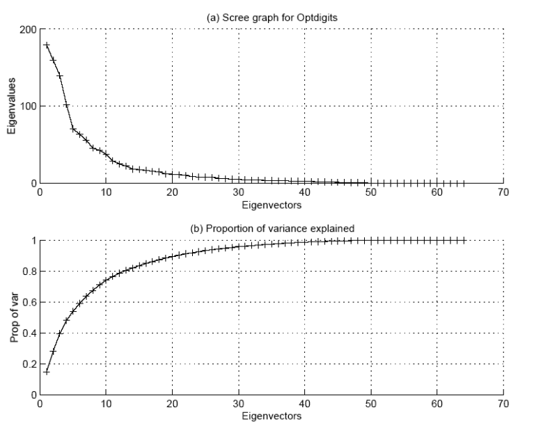
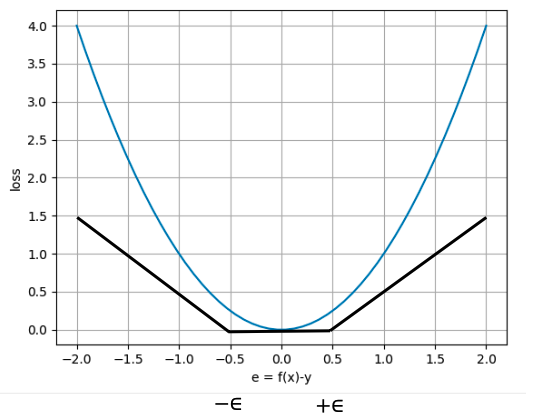
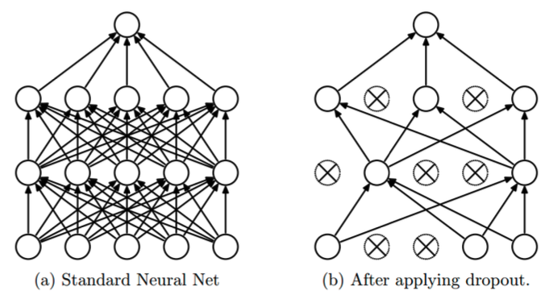

# CS429 Data Mining
# Linear Classifiers
### Linear Discriminants:
* Objective is to learn a function or, in the case of more than 2 classes, a set of functions from the training data which can separate the classes in the data
* Class label assignment: $c(\textbf{x}) = \underset{k \in \{1,...,M\}}\argmax f_k(\textbf{x})$
   * $f_k(\textbf{x})$ is a measure of how confident we are that $\textbf{x}$ is in class $k$
* If $M=2$, we choose class 1 if $f_1(\textbf{x}) \geq f_2(\textbf{x})$, i.e. $f_1(\textbf{x}) - f_2(\textbf{x}) \geq 0$, and class 1 if $f_1(\textbf{x}) - f_2(\textbf{x}) < 0$
   * We can thus replace the two functions with a single function $f(\textbf{x}) = f_1(\textbf{x}) - f_2(\textbf{x})$
   * Assign to positive class if $f(\textbf{x}) \geq 0$, otherwise negative
   * $f(\textbf{x}) = 0$ separates the two classes and is called the discriminant
   * If the functions are linear, the classifier is called a linear discriminant
* If data points can be separated by a linear discriminant then we say the problem is linearly separable
   * Mathematically, if there exists a function $f(\textbf{x};\textbf{w}) = w_1x^{(1)} + w_2x^{(2)} + ... + w_dx^{(d)} + b = 0$ such that if $y_i = 1$, $f(\textbf{x}_i;\textbf{w}) > 0$ and if $y_i = -1$, $f(\textbf{x}_i;\textbf{w}) < 0$
* Finding a linear discriminant:
   * Graphical approach: draw a straight line separating points and use equations of the points it crosses the axes to determine $\textbf{w}$ and $b$ 
   * Algebraic constraint satisfaction: use inequalities ($f(\textbf{x};\textbf{w}) > 0$ or $f(\textbf{x};\textbf{w}) < 0$) at each point in the dataset

### Classification Loss Function:
* We have an error whenever $yf(\textbf{x})<0$
* 0-1 loss:
   * $l(f(\textbf{x}),y) = \begin{cases} 0 & \text{if } yf(\textbf{x}) > 0 \\ 1 & \text{if } x = yf(\textbf{x}) \leq 0 \end{cases}$
* We want to find the parameters of the discriminant that minimise the loss for all training examples
* 0-1 loss is not differentiable and not convex - can't guarantee convergence of gradient descent
* We need an approximation of the loss:
   * Should be continuous, convex and an over-approximation of the 0-1 loss (generates at least as much error as the 0-1 loss would)
* Hinge loss:
   * $l(f(\textbf{x}),y) = \begin{cases} 0 & \text{if } yf(\textbf{x}) > 1 \\ 1 - yf(\textbf{x}) & \text{if } yf(\textbf{x}) \leq 1 \end{cases}$
   * Or $l(f(\textbf{x}),y) = \max(0,1-yf(\textbf{x}))$
* Optimisation problem:
   * $\underset{\textbf{w}} \min L(\textbf{X},\textbf{Y};\textbf{w}) = \sum_{i=1}\max(0,1-y_i f(\textbf{x}_i,\textbf{w}))$
* Solving using gradient descent:
   * $\frac{\partial L}{\partial \textbf{w}} = \frac{\partial}{\partial \textbf{w}}\max(0,1-y(\textbf{w}^T\textbf{x})) = \begin{cases} 0 & \text{if } yf(\textbf{x}) > 1 \\ -y\textbf{x} & \text{if } yf(\textbf{x}) \leq 1 \end{cases}$
* Algorithm:
   * Given training examples $\{(\textbf{x}_i,y_i)|i=1,...,N\}, y_i \in {-1,1}$
   * Initialise $\textbf{w}^{(0)}$ at random
   * For $i=1,...,N$:
      * Compute $f(\textbf{x}_i) = (\textbf{w}^{(k)})^T\textbf{x} + b$
      * If $y_i f(\textbf{x}_i) < 1$ then update weight vector: $\textbf{w}^{(k+1)} = \textbf{w}^{(k)} - \alpha \nabla L(\textbf{w}^{(k)}) = \textbf{w}^{(k)} - \alpha(-y_i\textbf{x}_i) = \textbf{w}^{(k)} + \alpha y_i\textbf{x}_i$
* Perceptron learning rule convergence theorem: if the data is linearly separable, the algorithm will converge to a correct discriminant

# Support Vector Machines 
### Empirical Risk Minimisation:
* So far, our machine learning models look like the following empirical error minimisation (ERM):
   * $f^* = \underset{f} \argmin L(\textbf{X}_{train}, \textbf{Y}_{train};f)$
   * $\textbf{w}^* = \underset{\textbf{w}} \argmin L(\textbf{X}_{train}, \textbf{Y}_{train};f)$
* They learn only from the training data
* There are a large number of lines (or in general, hyperplanes) separating the two classes
   * The boundary which lies at the maximum distance from data points of both classes gives better tolerance to noise and better generalisation

### Margin and Regularisation:
* The width by which the boundary of a linear classifier can be increased before hitting a data point is called the margin of the linear classifier
* Classifiers with a large margin have a property: small changes in $\textbf{x}$ should cause small changes in output
   * More accurately, what we want is 'non-causal' changes in input should not change the output (changes that are not linked to the label assignment)
   * For example, an ML model should be invariant to the rotation of an image (predicted class should not change)
* We can achieve this by having smaller weights

### Structural Risk Minisation: 
* In order to produce better generalisation, we need to do both ERM and structural risk minimisation (SRM)
* Minimising structural risk puts an upper bound on the generalisation error
* SVMs are linear classifiers that produce the optimal separating boundary (hyperplane)
   * Find $\textbf{w}$ and $b$ in a way so as to:
      * Minimise classification error over the training data (ERM)
      * Maximise the margin, or equivalently maximise regularisation or minimise the individual absolute weights
* We achieve this by minimising $R(f) = \frac{1}{2}(w_1^2 + w_2^2 + ... + w_d^2) = \frac{1}{2}\textbf{w}^T\textbf{w} = \frac{1}{2}||\textbf{w}||^2$

### Support Vector Machines:
* SVMs, in their basic from, are linear classifiers that give maximum margin
* They minimise the number of training errors, while maximising the margin to allow noise tolerance and regularisation
* The points that determine the margin are called support vectors
* They can also perform non-linear classification - through feature transformations/kernels

### SVM Optimisation:
* We optimise: $\underset{\textbf{w},b}P(\textbf{w}) = \underset{\textbf{w},b}\min R(f) + CL(\textbf{X},\textbf{Y};\textbf{w}) = \underset{\textbf{w},b}\min \frac{1}{2}\textbf{w}^T\textbf{w} + \frac{C}{N}\sum_{i=1}^N \max(0,1-y_if(\textbf{x}_i))$
   * $C > 0$ is a weighting factor that controls the relative contribution of both
* Gradient descent is performed as follows:
   * $\textbf{w}_k = \textbf{w}_{k-1} - \alpha\nabla P(\textbf{w}_{k-1})$
   * $\nabla P = \lambda\textbf{w} - \frac{\partial}{\partial\textbf{w}}\max(0,1-y(\textbf{w}^T\textbf{x}))$
   * $= \lambda\textbf{w} - 1(yf(\textbf{x}) < 1)(-y\textbf{x}) = \lambda\textbf{w} + \textbf{1}(yf(\textbf{x}) < 1)(y\textbf{x})$
   * $\textbf{w}_k = \textbf{w}_{k-1} - \alpha(\lambda\textbf{w}_{k-1} + \textbf{1}(yf(\textbf{x}) < 1)(y\textbf{x}))$

## Feature Transformations:
* Given a classification with a non-linear boundary, we can, at times, find a mapping or transformation $\phi$ of the feature space which makes the classification problem linearly separable in the transformed space 
* Feature transformations change the concept of distance or dot product between two points
* Consider: $d(\textbf{a},\textbf{b}) = ||\textbf{a}-\textbf{b}||^2 = (\textbf{a}-\textbf{b})^T(\textbf{a}-\textbf{b}) = \textbf{a}^T\textbf{a}+\textbf{b}^T\textbf{b}-2\textbf{a}^T\textbf{b}$
* After a transformation, $d_{\phi}(\textbf{a},\textbf{b}) = ||\phi(\textbf{a})-\phi(\textbf{b})||^2$
   * This corresponds to a change of the feature space: $d_{\phi}(\textbf{a},\textbf{b}) = ||\phi(\textbf{a})-\phi(\textbf{b})||^2 = (\phi(\textbf{a})-\phi(\textbf{b}))^T(\phi(\textbf{a})-\phi(\textbf{b})) = \phi(\textbf{a})^T\phi(\textbf{a})+\phi(\textbf{b})^T\phi(\textbf{b})-2\phi(\textbf{a})^T\phi(\textbf{b})$
   * $= k(\textbf{a},\textbf{a}) + k(\textbf{b},\textbf{b}) - 2k(\textbf{a},\textbf{b})$ where $k(\textbf{a},\textbf{b}) = \phi(\textbf{a})^T\phi(\textbf{b})$
* Suppose we have 2D data, then:
   * $\textbf{a}^T\textbf{b} = a_1b_1+a_2b_2$
   * $k(\textbf{a},\textbf{b}) = (\textbf{a}^T\textbf{b})^2 = (a_1b_1+a_2b_2)^2$
   * Our transformation $\phi$ is $\phi(\textbf{u}) = \begin{pmatrix} u_1 \\ u_2 \\ \sqrt{2}u_1u_2 \end{pmatrix}$
   * $\phi(\textbf{a})^T\phi(\textbf{b}) = \begin{pmatrix} a_1 & a_2 & \sqrt{2}a_1a_2 \end{pmatrix} \begin{pmatrix} b_1 \\ b_2 \\ \sqrt{2}b_1b_2 \end{pmatrix} = a_1b_2 + a_2b_2 + 2a_1a_2b_1b_2 = (a_1b_1 + a_2b_2)^2 = (\textbf{a}^T\textbf{b})^2 = k(\textbf{a},\textbf{b})$
* This is known as the kernel trick - the kernel function $k$ gives a mapping between the dot product of two vectors in the original feature space to the transformed feature space under $\phi$
   * The gram matrix $\textbf{K}$ is such that $K_{ij} = \phi(\textbf{x}_i)^T\phi(\textbf{x}_j)$
   * Changing the distance between points is, in effect, applying an (implicit) transformation
* We can change the definition of dot products to any other functions
   * Each kernel will have its own underlying feature representation (Moore-Aronszajin Theorem)
* We can make a non-linear SVM by changing the definition of the dot product so that the implicit transformation allows for non-linear classification
* Common kernel functions:
   * Linear - $K(\textbf{x},\textbf{y}) = \textbf{x}\cdot\textbf{y}$
   * Sigmoid - $K(\textbf{x},\textbf{y}) = \tanh(a\textbf{x}\cdot\textbf{y}+b)$
   * Polynomial - $K(\textbf{x},\textbf{y}) = (1+\textbf{x}\cdot\textbf{y})^d$
   * KMOD - $K(\textbf{x},\textbf{y}) = a(\exp(\frac{\gamma}{||\textbf{x}-\textbf{y}||^2+\sigma^2})-1)$
   * RBF - $K(\textbf{x},\textbf{y}) = \exp(-a||\textbf{x}-\textbf{y}||^2)$
   * Exponential RBF - $K(\textbf{x},\textbf{y}) = \exp(-a||\textbf{x}-\textbf{y}||)$

### Kernelised SVM:
* Representer Theorem: a SVM weight vector can be represented as a linear combination of input vectors, with each example's contribution being weighted by a factor $\alpha_i$ - $\textbf{w} = \sum_{i=1}^N\alpha_i\textbf{x}_i$
* We can write: $f(\textbf{x}) = \textbf{w}^T\textbf{x}+b = b+\sum_{j=1}^N\alpha_j\textbf{x}_j^T\textbf{x}$
* There is a dot product of the test example with every given example - we can denote the dot product as $k(\textbf{u},\textbf{v}) = \textbf{u}^T\textbf{v}$
* We can write $f(\textbf{x}) = b + \sum_{j=1}^N\alpha_j k(\textbf{x}_j,\textbf{x})$
* $\textbf{w}^T\textbf{w} = (\sum_{i=1}^N\alpha_i\textbf{x}_i)^T\sum_{j=1}^N\alpha_j\textbf{x}_j = \sum_{i,j=1}^N\alpha_i\alpha_j k(\textbf{x}_i,\textbf{x}_j)$
* The SVM objective function can be rewritten as: $\underset{\mathbf{\alpha},b}
\min\frac{1}{2}\sum_{i,j=1}^N\alpha_i\alpha_j k(\textbf{x}_i,\textbf{x}_j) + \frac{C}{N}\sum_{i=1}^N\max(0,1-y_i(b+\sum_{j=1}^N\alpha_j k(\textbf{x}_i,\textbf{x}_j)))$
   * The weight vector is not present
      * Thus, we do not need explicit feature representations
   * We know $k(\textbf{x}_i,\textbf{x}_j)$ for any two given training examples
   * The optimisation solution will be to obtain $\mathbf{\alpha}$ and $b$
* Once we solve the optimisation problem, we can calculate the prediction score for any example based only on its kernel function values with training examples
   * $f(\textbf{x}) = b + \sum_{i=1}^N \alpha_j k(\textbf{x}_j, \textbf{x})$
* An appropriately kernelised SVM can, in principle, memorise any training dataset
   * However, with SRM an SVM comes with a good regularisation control to help it generalise
   * Once we replace the dot product with a kernel function, the SVM formulation no longer requires any features - all we need is a definition of similarity between examples
* The name 'SVM' comes from the fact that the training examples for which the values of $\alpha_i$ are non-zero after optimisation are the only ones contributing to the decision
   * These examples are called support vectors

### Steps for Feature-based Classification:
* Prepare the pattern matrix $\textbf{X}
* Select the kernel function to use
   * Probably the trickiest part of training an SVM
   * In practice, a low degree polynomial or an RBF kernel with a reasonable width is a good initial try
* Select the parameters of the kernel function and the value of $C$ (e.g. through hyperparameter optimisation over a validation set)
   * If the data is imbalanced, can set an individual $C$ for each class (called class weighting) or even per-example weighting
   * Can also be used to reflect a priori knowledge
* Execute the training algorithm and obtain the $\alpha_i$
* Unseen data can be classified using the $\alpha_i$ and the support vectors

# Model Evaluation
* Accuracy evaluation: how good is the model in practice?
* Sensitivity analysis: is the classifier sensitive to:
   * Choice of parameters such that it will be useless in practice
   * Choice of data
   * Randomness
   * Round-off error
   * Other controllable and non-controllable factors
* Under no circumstances are testing **labels** to be used in training or the training data in evaluation of the generalisation performance
* All evaluation metrics have underlying assumptions and limitations which may or may not suffice 

### Accuracy:
* Percentage of correct predictions:
   * $accuracy = \frac{TP + TN}{TP + TN + FP + FN}$
* Assumptions:
   * The dataset is balanxed
   * Misclassification of any class is equally bad
   * The threshold used for classification is optimal

### Thresholding:
* A classifier can be viewed as a function $y = f(x|\theta)$ which generates an output $y$ given the input $x$ and a parameter set $\theta$
* The output of a classifier is typically a real-valued output which is then thresholded to yield classification labels, e.g. $f(x|\theta) > 0 \implies y = 1$ and $f(x|\theta) < 0 \implies y = -1$
   * Here, $0$ acts as the threshold
   * The accuracy of a classifier is parameterised by this threshold

### More Metrics:
* Precision/Positive Predictive Value:
   * $precision = \frac{TP}{TP + FP}$
   * Ratio of true positive to no. times the classifier predicts positive
* Recall/Sensitivity/True Positive Rate (TPR):
   * $recall = \frac{TP}{TP + FN}$
   * Ratio of true positive to no. times the actual class is positive
* F-score:
   * Harmonic mean of precision and recall
   * $F = 2 \times \frac{precision \times recall}{precision + recall}$
* False Positive Rate (FPR):
   * $FPR = \frac{FP}{FP + TN}$
* Specificity:
   * $specificity = \frac{TN}{FP + TN}$

### Receiver Operating Characteristic Curve:
* TPR and FPR will increase and eventually reach 100% for increasingly negative thresholds (everything is predicted as positive), and will decrease for increasingly positive thresholds (nothing is predicted as positive)
* Receiver Operating Characteristic (ROC) curve is a plot of TPR against FPR for varying thresholds
* A useful metric is the area under the ROC curve (AUC-ROC)
   * 1 for a perfect classifier, 0.5 for a random classifier
   * Measures the probability with which a randomly chosen positive example is ranked more highly than a randomly chosen negative example
* Most important part of the ROC curve is in the top left
* ROC curves can be vertically averaged
* Scores of two classifiers can be combined through a weighted combination to result in an optimal classifier
   * This can be done using the ROC convex hull (a convex overapproximation)
   
* When to use (AUC-)ROC:
   * When there isn't much class imbalance
      * When N >> P: a small FPR indicates a significant number of FPs
      * Classifier may be generating a small number of true positives for a large number of false positives, and hence may not be very precise
   * To compare classifiers across all operating points
* Can also have multi-class ROC curves: average vs rest
* Threshold selection: threshold on one dataset may not work for another
* Always plot histogram of prediction scores to identify potential bias
* AUC ROC-$N$: in cases with class imbalance or where high FPRs are unacceptable or it useless to evaluate TPR at high FPR values, we can determine the area under the ROC curve up to the first N false positives
   * E.g. $N = 50$, $N = 10\%$

### Precision-Recall Curves:
* Plot of precision against recall
* AUC-PR is a useful performance metric, especially in cases of class imbalance or where precision is a requirement

* One-to-one correspondence between the two curves
   * If a curve dominates in the ROC space then it dominates in the PR space, and vice versa

### $K$-Fold Cross Validation:
* Estimation of variation of generalisation performance
* Divide the data into $K$ folds:
   * Train on $K-1$ sets, leaving the $K$-th set for validation and performance metrics calculation
* Report the average and variation in performance across the folds
* If $K$ is equal to the number of examples then this extreme case is called Leave One Out CV (LOOCV)
   * Useful if the amount of data is small
* Stratification (stratified CV): make sure that each fold contains the same percentage of examples of each class as the overall class
   * Otherwise may end up with one validation fold being (nearly) all positive or negative examples
* Leave One Out CV (LOOCV) if $K$ is equal to the number of examples, validate on only one example for each example
   * Usually we compute one AUC-ROC/AUC-PR over all validation examples
   * Good for very small datasets as might otherwise have a very high variance across folds
* For a very large dataset, $K$-fold may take too long so split into training, validation and test sets and do hyperparameter selection on the validation set

### Bootstrapping:
* Uses random sampling with replacement
* For multiple iterations:
   * Take $N$ examples from the dataset of size $N$ with replacement (i.e. some examples may be there multiple times)
   * Then train on this set and test on the remaining examples to compute metrics
* Report the average of each metric and their standard deviations
* Should be stratified

### Hyperparameter Selection:
* Grid search - exhaustive search through cross-validation
* There can be a range of parameter values that yield optimal values and these equivalent points in the parameter space fall along a ridge
* Other approaches: gradient based, evolutionary, regularisation path finding

### Note on Performance Metrics:
* Metrics tell you what you ask of them - need to choose the appropriate metric
* Having a high performance metric is no guarantee that the classifier is good for use
   * A model may have hidden biases, be unfair or fail in other ways
   * May not be robust or transparent
   * A model may not be well-calibrated, i.e. its output can be interpreted probabilistically or used for uncertainty quantification
      * E.g. without careful calibration, cannot be assumed that if the prediction score of an example is 0.9 then the probability of it being positive is 0.9

# Principal Component Analysis
### Covariance and Correlation:
* Given two random variables, we can measure how linearly related they are to each other:
   * $cov(x,y) = \sigma_{xy} = \frac{1}{N}\sum_{i=1}^N (x_i-\mu_x)(y_i-\mu_y) = \frac{1}{N}(\textbf{x}-\mu_x)^T(\textbf{y}-\mu_y)$
   * Covariance is positive if, on average, both variables are either above or below their means
   * Covariance is negative if, on average, one variable is above its mean and the other is below its mean
* Assume that the means are zero: $cov(\textbf{x},\textbf{y}) = \frac{1}{N}\textbf{x}^T\textbf{y}$
   * Maximum when the vectors are colinear or parallel
* $cov(\textbf{x},\textbf{y}) = \mathbb{E}[(y-\mu_y)(x-\mu_x)]$
   * Thus, $var(z) = cov(z,z)$
* We can quantify the degree of linear association (correlation) between two variables through a correlation coefficient:
   * $corr(x,y) = \rho_{xy} = \frac{\mathbb{E}[(x-\mu_x)(y-\mu_y)]}{\sigma_x\sigma_y}$ 
   * If we standardise both variables to have 0 mean and unit standard deviation ($\frac{x-\mu_x}{\sigma_x}$), then the correlation between them is equal to variance
* Covariance matrix of a dataset:
   * $\textbf{C} = \begin{pmatrix} cov(x,x) & cov(y,x) \\ cov(x,y) & cov(y,y) \end{pmatrix}$

### Dimensionality Reduction:
* Project data onto canonical axes
   * Lose variance as a result
   * We want to reduce the amount of information loss
   * Find and project along a direction in which information loss is minimum (as much of the variance captured as possible)
* Principal Component Analysis (PCA) projects the data onto orthogonal vectors such that the variance of the projected data is maximum
   * Projection of $\textbf{x}$ on the direction of $\textbf{w}$: $z = \textbf{w}^T\textbf{x}$
   * Maximise $var(z)$, subject to $||\textbf{w}||^2 = \textbf{w}^T\textbf{w} = 1$

### Solving PCA:
* Can do it using gradient descent, but there is an analytical solution:
   * $var(z) = var(\textbf{w}^T\textbf{x}) = \frac{1}{N}\sum_{i=1}^N((\textbf{w}^T\textbf{x}_i-\textbf{w}^T\mu_x)^2)$
   * $= \frac{1}{N}\sum_{i=1}^N((\textbf{w}^T\textbf{x}_i-\textbf{w}^T\mu_x)(\textbf{w}^T\textbf{x}_i-\textbf{w}^T\mu_x))$
   * $= \frac{1}{N}\sum_{i=1}^N((\textbf{w}^T\textbf{x}_i-\textbf{w}^T\mu_x)(\textbf{x}_i^T\textbf{w}-\mu_x^T\textbf{w}))$
   * $= \frac{1}{N}\sum_{i=1}^N(\textbf{w}^T(\textbf{x}_i-\mu_x)(\textbf{x}_i-\mu_x)^T\textbf{w})$
   * $= \textbf{w}^T\frac{1}{N}\sum_{i=1}^N((\textbf{x}_i-\mu_x)(\textbf{x}_i-\mu_x)^T)\textbf{w}$
   * $= \textbf{w}^T\textbf{Cw}$ where $\textbf{C}$ is the $d \times d$ sized covariance matrix
* We want to find a unit vector $\textbf{w}$ that maximises the variance along the projection, whcih leads to the following constrained optimisation problem:
   * $\underset{\textbf{w}} \max \space var(z) = \textbf{w}^T\textbf{Cw}$ subject to $||\textbf{w}||^2 = \textbf{w}^T\textbf{w} = 1$
* Use the method of Lagrange multipliers to convert it to an unconstrained optimisation problem:
   * $\underset{u} \max f(u)$ s.t $g(u) = 0$ is equivalent to $\underset{u,\alpha} \max f(u) - \alpha g(u)$
   * We can therefore write the optimisation problem as $\underset{\textbf{w},\lambda} \max \space \textbf{w}^T\textbf{Cw} - \lambda(\textbf{w}^T\textbf{w} - 1)$
* Taking the derivative of this with respect to $\textbf{w}$ and substituting to zero, we get:
   * $\textbf{Cw} = \lambda\textbf{w}$
* The direction of maximum variance $\textbf{w}$ is given by the eigenvector corresponding to the covariance matrix $\textbf{C}$ with eigenvalue $\lambda$
   * Known as the principal direction
* If we desire to find the $k$-th principal direction, we solve:
   * $\underset{\textbf{w}} \max \space \textbf{w}_k^T\textbf{Cw}_k$ subject to $||\textbf{w}_k||^2 = \textbf{w}_k^T\textbf{w} = 1$ and $\textbf{w}_k^T\textbf{w}_j = 0 \space \forall j < k$ (orthogonality constraint to avoid information redundancy)
   * Similarly, the covariance matrix $\textbf{C}$ gives us all of these principal directions as its $d$ eigenvectors
* The ratio of the eigenvalue for a particular eigenvector to the sum of all eigenvalues of the covariance matrix is equal to the proportion of variance explained by the eigenvector

### Algorithm for PCA:
* Each of the $N$ samples is stored as a $d$-dimensional vector $\textbf{x}_i = [x_i^1 \space ... \space x_i^d]^T$
* The data matrix is formed as $\textbf{X} = [\textbf{x}_1 \space ... \space \textbf{x}_N]$
* Standardise each sample in the data as $\bar{\textbf{x}}_i = \textbf{x}_i - \mu_x$
* Compute covariance matrix $\textbf{C} = \frac{1}{N-1}\bar{\textbf{X}}\bar{\textbf{X}}^T$
* Find the eigenvalues $\lambda_1, \lambda_2, ..., \lambda_d$ and $d$-dimensional eigenvectors $\textbf{w}_1, \textbf{w}_2, ..., \textbf{w}_d$ of $\textbf{C}$ and sort the eigenvalues in order of decreasing magnitude. Normalise the eigenvectors to have unit norm
* Calculate the required dimension $k$ based on the proportion of variance approach
* Form $\textbf{W} = [\textbf{w}_1 \space ... \space \textbf{w}_k]_{(d \times k)}$
* A standardised vector $\textbf{x}'$ can be projected using $\textbf{z} = \textbf{W}^T\textbf{x}'$
* A projected vector can be used to reconstruct the standardised vector $\textbf{x}'$ using $\textbf{x}' = \textbf{Wz}$ followed by destandardisation $\textbf{x} = \textbf{x}' + \mu_x$

### PCA for Dimensionality Reduction:
* Eigenvectors of the covariance matrix with small eigenvalues have a small contribution to the total variance of the data and can be discarded without major loss of information
* We can thus calculate the Proportion of Variance (PoV) explained by the $k$ eigenvectors with the largest eigenvalues as follows: $PoV(k) = \frac{\lambda_1 + \lambda_2 + ... + \lambda_k}{\lambda_1 + \lambda_2 + ... + \lambda_k + ... + \lambda_d}$ where the $\lambda_i$ are sorted in descending order
* Typically, stop at PoV > 0.9
* Scree graph plots PoV vs $k$

### PCA Reconstruction:
* We know that $\textbf{z} = \textbf{W}^T(\textbf{x}-\mu_x)$, and therefore $\hat{\textbf{x}} = (\textbf{W}^T)^{-1}\textbf{z} + \mu_x$ with $\textbf{WW}^T = \textbf{I}$
* The reconstruction error is given by $E_{rec} = \sum_{i=1}^N||\hat{\textbf{x}}_i^i - \textbf{x}_i||$
* Another way of interpreting PCA is that it finds orthogonal direction vectors such that after projecting data onto them, the reconstruction error is minimal
   * There is a theoretical guarantee that this is the lowest possible error
* We can write the reconstruction as a linear combination of vectors as follows:
   * $\hat{\textbf{x}} = \mu_x + \textbf{Wz} = \mu_x + z_1\textbf{w}_1 + x_2\textbf{w}_2 + ... + z_k\textbf{w}_k$

### REO for PCA:
* Representation: $f(\textbf{x}_i) = \textbf{w}^T\textbf{x}_i$
* Evaluation: 
   * Regularisation: minimise the norm of $\textbf{w}$ or make sure $\textbf{w}^T\textbf{w} = ||\textbf{w}||^2 = 1$
   * Empirical loss term is the 'reconstruction error' or 'lost variance'
   * Letting $V$ be the total variance, we have $E(\textbf{X};\textbf{w}) = V - \textbf{w}^T\textbf{Cw}$
* Optimisation:
   * $\underset{\textbf{w}}\min \frac{\lambda}{2}\textbf{w}^T\textbf{w} + (V - \textbf{w}^T\textbf{Cw})$
   * We can kernelise leading to kernel PCA
* It's not always the first few principal components that are useful
   * PCs just show characteristics of the data
   * The first PC is along the direction of the biggest variance, but this might not necessarily communicate any information about the underlying difference between classes
   * For image data, the first principal component is associated with variation in lighting

### Dimensionality Reduction in General:
* A number of variables can be correlated in different datasets
* The effective dimensionality of the dataset can be lower than what we see in terms of number of features
* Thus, data lives on a 'manifold'
* Sometimes these manifolds may not be linear
* Taxonomy of dimensionality reduction methods:
   * Linear: PCA, Linear Discriminant Analysis, Canonical Component Analysis
   * Non-linear:
      * Manifold learning approaches: uncovering the low-dimensional structure hidden within high-dimensional data
         * Kernel PCA, MDS, Locally Linear Embeddings, t-SNE
      * Probabilistic approaches
         * Independent Component Analysis
      * Topological data analysis: preservation of the topological structure of the data
         * UMAP
   * Supervised dimensionality reduction

### Manifold Learning (MDS):
* Multi-dimensional Scaling (MDS)
* Representation:
   * Input is a pairwise distance matrix between examples based on $d$ features $d_{ij}$
   * Output is a $k$-dimensional of each example $\textbf{x}_i$ (as with all dimensionality reduction methods)
* Evaluation:
   * Reduce the number of dimensions in the data while preserving pairwise distances between the points
   * $\underset{x_1,...,x_M}\argmin\sum_{i < j}(||\textbf{x} - \textbf{x}_j||-d_{ij})^2$

### t-SNE:
* t-distributed stochastic neighbour embedding (t-SNE)
* Fundamental idea: the 'local' probability distributions of similarity between points before and after projection should be the same
* Evaluation:
   * Reduce data dimensionality while preserving the local probability of the data
   * For $i \neq j$, define:
      * $p_{j|i} = \frac{\exp(-||\textbf{x}_i-\textbf{x}_j||^2/2\sigma_i^2)}{\sum_{k \neq i}\exp(-||\textbf{x}_i-\textbf{x}_k||^2/2\sigma_i^2)}$
      * $p_{ij} = \frac{p_{j|i} + p_{i|j}}{2N}$ is the probability of similarity between points before projection
      * $q_{ij} = \frac{(1 + ||\textbf{y}_i - \textbf{y}_j||^2)^{-1}}{\sum_k\sum_{l \neq k}(1 + ||\textbf{y}_k - \textbf{y}_l||^2)^{-1}}$ is the probability of similarity between points after projection
      * $KL(P||Q) = \sum_{i \neq j}p_{ij}\log(\frac{p_{ij}}{q_{ij}})$ is the Kullback-Leibler divergence (aka relative entropy), measuring how different two probability distributions are

### Topological Data Analysis (UMAP):
* Uniform Manifold Approximationa and Projection (UMAP)
* Basic principle: preserve the topological structure (edges, 'faces', etc) of the data during dimensionality reduction
   * A 'fuzzy open set' representation is developed in which the local influence of each point extends to at least its immediate neighbour
   * A graph is developed in which the nodes are connected based on the local topological structure of the data and the weighted edges show the probability of connection between nodes
   
* Evaluation:
   * Minimise the cross-entropy between two 'fuzzy open set' representations of the original data and the reduced dimensionality data
   * Construct a high-dimensional data representing the manifold by connecting each point to its nearest neighbours
   * Then optimise a low-dimensional graph to be as structurally similar as possible, using cross-entropy between fuzzy set representations of the graphs
   * Intuitively: minimise how much information is lost when using one distribution to approximate another
   * $C(G_{high},G_{low}) = \sum_{i,j}(G_{high}(i,j)\log(\frac{G_{high}(i,j)}{G_{low}(i,j)}) + (1 - G_{high}(i,j))\log(\frac{1 - G_{high}(i,j)}{1 - G_{low}(i,j)}))$ where
      * $G_{high}(i,j)$ is the probability of connection between points $i$ and $j$ in the high-dimensional space
      * $G_{low}(i,j)$ is the probability of connection between points $i$ and $j$ in the low-dimensional space
* Unlike t-SNE which is focused on preservation of local structures, UMAP can balance preservation of global and local structures
* Hyperparameters: number of neighbours in the graph, minimum distance (more robust to hyperparameter values in comparison to t-SNE)
* Both unsupervised and supervised

### Supervised Dimensionality Reduction (LDA and UMAP):
* Most dimensionality reduction approaches are unsupervised in that they don't use any labels or other supervisory signals in their projection
* Linear Discriminant Analysis (LDA) aims to find the direction vector that maximally separates examples of two different classes while projecting the data of each class as as compactly as possible
* Evaluation:
   * $\underset{\textbf{w}} \max S = \frac{(\textbf{w}^T\textbf{m}_1 - \textbf{w}^T\textbf{m}_2)}{\textbf{s}_1^2 + \textbf{s}_2^2} = \frac{(\textbf{w}^T\textbf{m}_1 - \textbf{w}^T\textbf{m}_2)}{\textbf{w}^T\textbf{C}_1\textbf{w} + \textbf{w}^T\textbf{C}_2\textbf{w}}$
   * The difference between classes after projection divided by the variance within classes after projection
* Multi-class LDA produces a weight vector that is (no. classes - 1) in dimensionality
   * In essence, this tells us the direction of maximal separability under the assumption that the data is Gaussian distributed
* Supervised UMAP guides the embedding process so that the data points with the same label are closer to each other in the reduced space, enhancing the separation between different classes
   * Can be used for semi-supervised or transductive learning in which label information is only available for a few examples
   * Can also be used as a feature extractor

### Factor Analysis:
* Describes the variability among observed variables in terms of a potentially lower number of observed variables called factors
* Representation: $\textbf{X}_{(N \times d)} = \textbf{M} + \textbf{F}_{(N \times k)}\textbf{L}_{(K \times d)}$
   * Observations expressed relative to a mean
* Evaluation (no orthogonality requirement): $\underset{(\textbf{F},\textbf{L})}\min ||\textbf{X} - (\textbf{M} + \textbf{FL})||$
* $\textbf{F}$ is called the factors and $\textbf{L}$ is called the loadings
* If $\textbf{M} = \textbf{0}$, can think of it as matrix factorisation (essentially PCA but without orthogonality) so we can uncover what are the 'topics' in a given dataset
   * How can we describe each data item in terms of its topics?
   * Discovers the latent semantic structure in data

# Regression
* Mathematical formulation: $y = f(\textbf{x};\textbf{w}) = \textbf{w}^T\textbf{x} + b$
   * Or $f(\textbf{x};\textbf{w}) = \textbf{w}^T\textbf{x}$ with the last column of our $\textbf{X}$ matrix being all 1s and the last element of the $\textbf{w}$ vector being $b$
   * In terms of our $\textbf{X}$ matrix, we have $\textbf{y} = \textbf{Xw}$
* Loss function:
   * Squared loss
   * $L(\textbf{X},\textbf{Y};\textbf{w}) = \sum_{i=1}^N(f(\textbf{x}_i;\textbf{w}) - y_i)^2 = \sum_{i=1}^N(\textbf{w}^T\textbf{x}_i - y_i)^2 = ||\textbf{Xw}-\textbf{y}||^2 = (\textbf{Xw}-\textbf{y})^T(\textbf{Xw}-\textbf{y})$
* Optimisation:
   * Find $\textbf{w}^* = \argmin_\textbf{w}L(\textbf{X},\textbf{Y};\textbf{w})$
   * Differentiate $L(\textbf{X},\textbf{Y};\textbf{w}) = (\textbf{Xw}-\textbf{y})^T(\textbf{Xw}-\textbf{y})$ with respect to $\textbf{w}$ and set to 0
   * We obtain $\textbf{w} = (\textbf{X}^T\textbf{X})^{-1}\textbf{X}^T\textbf{y}$, or $\textbf{X}^T\textbf{y}$ where we denote by $\textbf{X}^+$ the pseudo-inverse $(\textbf{X}^T\textbf{X})^{-1}\textbf{X}^T$

### Statistical Inference:
* The goal of regression is to identify how a change in one variable changes the expected value of the other variable while keeping all the others the same
* $\mathbb{E}[y|\textbf{x}] = b + \textbf{w}^T\textbf{x}$
   * $\textbf{w}$ tells us if $x$ and $y$ have a linear association
   * We can get p-values for the regression coefficient and use this as a hypothesis test to test if the two variables are related

### Regularised Least Squares Regression:
* We want the output to change slightly with change in the input data
* Ridge regression imposes a penalty on the size of the coefficients by minimising a penalised residual sum of squares
   * $\underset{\textbf{w}}\min ||\textbf{Xw}-\textbf{y}||^2  + \alpha ||\textbf{w}||^2$
   * Hyperparameter $\alpha$ controls how much the coefficients are minimised
* Variance in the hyperplane is greatly reduced, in comparison to standard linear regression
* Issues:
   * Linear regression assumes that the relationship between independent and dependent variables is linear and the error residuals are normally distributed
      * Should check the residuals beforehand by plotting a histogram of them
      * Can transform the variable or use generalised linear models or other strategies
   * Due to squaring of each data point in the loss function, can be very sensitive to outliers
      * Reduce this impact by using softer penalties (linear penalty, $\epsilon$-insensitive loss)
         * $\epsilon$-insensitive loss: $l(f(\textbf{x}),y) = \max(0,|f(\textbf{x})-y| - \epsilon)$
         * 0 loss if absolute difference is less than $\epsilon$
         

### Support Vector Regression (SVR):
* Using representer theorem and kernel theorem and kernel trick:
   * $\underset{\textbf{w},b}\min\frac{1}{2}\textbf{w}^T\textbf{w} + \frac{C}{N}\sum_{i=1}^N\max(0,|f(\textbf{x}_i) - y_i| - \epsilon)$
   * Which can be rewritten as: $\underset{\alpha,b}\min\frac{1}{2}\sum_{i,j=1}^N\alpha_i\alpha_j\textbf{x}_i^T\textbf{x}_j + \frac{C}{N}\sum_{i=1}^N\max(0,|\sum_{j=1}^N\alpha_i\textbf{x}_i^T\textbf{x}_j + b - y_i| - \epsilon)$
   * $\underset{\alpha,b}\min\frac{1}{2}\sum_{i,j=1}^N\alpha_i\alpha_j k(\textbf{x}_i,\textbf{x}_j) + \frac{C}{N}\sum_{i=1}^N\max(0,|\sum_{j=1}^N k(\textbf{x}_i,\textbf{x}_j) + b - y_i| - \epsilon)$

### Performance Metrics:
* Measure error or correlation between true and predicted outputs across test set
* Mean Squared Error:
   * $MSE(y,\hat{y}) = \frac{1}{n}\sum_{i=1}^n (y_i-\hat{y}_i)^2$
* Mean Absolute Error:
   * $MSE(y,\hat{y}) = \frac{1}{n}\sum_{i=1}^n |y_i-\hat{y}_i|$
* Root Mean Squared Error:
   * $RMSE(y,\hat{y}) = \sqrt{MSE(y,\hat{y})}$
* $R^2$ Score:
   * $R^2(y,\hat{y}) = 1 - \frac{\sum_{i=1}^n(y_i-\hat{y}_i)^2}{\sum_{i=1}^n(y_i-\bar{y})^2}$
* Correlation Coefficient $r$:
   * $r = \frac{\sum_{i=1}^n(x_i - \bar{x})(y_i - \bar{y})}{\sqrt{\sum_{i=1}^n(x_i - \bar{x})^2}\sqrt{\sum_{i=1}^n(y_i - \bar{y})^2}}$

# Different Types of ML Problems
### $K$-means Clustering:
* Representation:
   * An example $\textbf{x}$ is assigned a cluster based on its closest centroid, where the $K$ centroids are denoted as $\textbf{M} = \{\textbf{m}_1, ..., \textbf{m}_K\}$
   * The cluster assignment for an example based on a distance metric $d(\cdot,\cdot)$ is given by the nearest neighbour rule: $c(\textbf{x}) = \argmin_{j=\{1,...,K\}} d(\textbf{x},\textbf{m}_j), c(\textbf{x}) \in \{1,...,K\}$
* Evaluation:
   * We would like to determine the cluster centroids $\textbf{M} = \{\textbf{m}_1,...,\textbf{m}_K\}$ and the assignments of training examples to clusters (non-overlapping) $\textbf{S} = \{\textbf{S}_1,...,\textbf{S}_K\}$ such that the within-cluster distance from centroids is minimised:
      * $\underset{S}\min \sum_{j=1}^K\sum_{x \in S_j}d(\textbf{x},\textbf{m}_j)$ with $\textbf{m}_j = \frac{1}{|\textbf{S}_j|}\sum_{x \in \textbf{S}_j}\textbf{x}$
* Optimisation Algorithm:
   * Initialise $\textbf{m}_i$, $i = 1,...,K$ to $K$ random $\textbf{x}^t$
   * For all $\textbf{x}^t \in \textbf{X}$:
      * $b_i^t = \begin{cases} 1 & \text{if} & ||\textbf{x}^t - \textbf{m}_i|| = \min_j ||\textbf{x}^t - \textbf{m}_j||\\ 0 & \text{otherwise} \end{cases}$
   * For all $\textbf{m}_i$, $i = 1,...,K$:
      * $\textbf{m}_i = \frac{\sum_t b_i^t\textbf{x}^t}{\sum_t b_i^t}$
   * Repeat until $\textbf{m}$ converges
* NP-hard problem but the above algorithm leads to a good local optimum
* Hyperparameters: $K$, initial cluster centres, distance metric
* Cluster assignment of an example should not change within a short distance: the choice of distance metric controls regularisation

### Hierarchical Clustering:
* Build a hierarchy of clusters
   * Bottom-up (agglomerative clustering) or top-down (divisive clustering)
* We can cutoff at any height to get a different number of clusters

* Hyperparameters:
   * Distance metric
   * Linkage: how do we define a distance between two sets of points (average, min, max, etc.)

### Support Vector Clustering:
* No assumptions on the shape and number of clusters
* Enclose all examples in a kernel feature space in a tight hypersphere centred at $\textbf{a}$ and with radius $R$
   * $\min_{R,\textbf{a}} R^2 + C\sum_{i=1}^N \max(0,||\phi(\textbf{x}_i)-\textbf{a}||^2 - R^2)$
* Two points belong to the same cluster if, for all points $\textbf{x}$ in between then, $||\phi(\textbf{x}) - \textbf{a}||^2 < R^2$
* No need to specify the number of clusters a priori

### One Class Classification:
* Examples for only one class (say normal)
* Identify those examples that differ from the given class
* We want to find a hypersphere with centre $\textbf{a}$ and radius $R$ so that the target examples lie within the hypersphere 
   * $\min_{R,\textbf{a}} R^2 + \frac{C}{N}\sum_{i=1}^N \max(0,|\textbf{x}_i-\textbf{a}||^2 - R^2)$
* Representation: $f(\textbf{x}) = \textbf{w}^T\textbf{x} + b$
   * All given target class examples should have $f(\textbf{x}) \geq 0$
   * Consider that the outliers are mapped to the origin: $f(\textbf{0}) = b < 0$
* Evaluation:
   * Error when:
      * A point of the target class produces $f(\textbf{x}) < 0$
      * Or the origin is classed as the target: $b > 0$
   * Loss function is $l(f(\textbf{x};\textbf{w},b)) = \max(0, -f(\textbf{x})) + b$
   * We minimise $\min_{\textbf{w},b} = \frac{1}{2}\textbf{w}^T\textbf{w} + \frac{C}{N}\sum_{i=1}^n\max(0,-(\textbf{w}^T\textbf{x}+b)) + b$

### Trees, Forests and Boosting:
* Split along different values of different features, picking the split with the most information gain
* In a random forest, create multiple decision trees by bootstrapping (selection with replacement) to create multiple training datasets
   * For each bootstrap sample, a decision tree is constructed using a subset of features 
   * At each node of the tree, a random subset of features is considered for splitting instead of all of the features to help decorrelate the trees and make the forest more robust
   * Majority voting/averaging is used for classification and regression respectively
   * Idea is that each learner makes uncorrelated errors on different examples
* XGBoost:
   * We can combine trees in series such that each tree boosts the decision of the previous one
   * Incrementally building an ensemble by training each new model instance to emphasise the training examples that previous models misclassified
   * XGBoost is an optimised gradient boosting algorithm (employs gradient descent to minimise errors in sequential models) through parallel processing, tree-pruning, handling missing values and regularisation to avoid overfitting
* REO view of decision trees:
   * Representation:
      * Output for a given $\textbf{x}$ is generated by following a tree structure, can be modelled as $f(\textbf{x};T)$ where $T$ is the representation of a tree structure
   * Evaluation:
      * For a given tree structure $T$, $f(\textbf{x};T)$ will generate a loss for each training example which can be minimised
      * We can further penalise based on the tree structure itself, for example if it is too complicated or if it uses too many features etc.
      * $\underset{T}\min R(T) + \lambda \sum_i l(f(\textbf{x}_i;T),y_i)$
   * Optimisation:
      * Can be done through gradient-biased optimisation (as in XGBoost)
      * Or can go through an optimisation process during the construction of the tree itself (e.g. by reduction of entropy or variance in each leaf)

### Ranking:
* Assign a rank to an input example, i.e. this is better or worse than that
* Also called ordinal regression
* Problem formulation:
   * Training examples as pairs such that one $\textbf{x}_i$ is to be ranked higher than another $\textbf{x}'_i$ by an amount $r_i$
   * $S = \{(\textbf{x}_1,\textbf{x}'_1,r_1),...,(\textbf{x}_m,\textbf{x}'_m,r_m)\}$
   * Goal: learn a ranking function $f : X \rightarrow \mathbb{R}$
* Representation $f(\textbf{x};\textbf{w})$
* Evaluation:
   * A misranking will occur if $f(\textbf{x}_i;\textbf{w}) - f(\textbf{x}'_i;\textbf{w}) < r_i$
   * Thus the loss becomes $l(\textbf{x}_i,\textbf{x}'_i,r;f) = \max(0,r_i-(f(\textbf{x}_i)-f(\textbf{x}'_i)))$
* Optimisation problem: $\min_{\textbf{w}} R(\textbf{w}) + \sum_i l(\textbf{x}_i,\textbf{x}'_i,r;f)$

### Recommendation Systems:
* Task: predict the rating a user would give an item
* Training data: matrix of items rated by users
* Here we discuss collaborative filtering 
* Representation:
   * Represent each item $m$ by its features $\textbf{x}_m$ (note that these features may not be known)
   * Represent the prediction score for this item for user $u$ as: $\textbf{w}^T_u\textbf{x}_m$
   * When a user $u$ rates an item $m$, we set a flag $s_{mu}$ to 1 (otherwise it's 0)
   * The rating for the item $m$ by user $u$ is $y_{mu}$
* Evaluation:
   * Prediction error for all labelled items: $E = \frac{1}{2}\sum_{u=1}^U\sum_{m=1}^M s_{mu}(\textbf{w}^T_u\textbf{x}_m - y_{mu})^2$
   * With regularisation terms: $\underset{\textbf{w}_u,\textbf{x}_m}\min \frac{\lambda_u}{2}\sum_{u=1}^U ||\textbf{w}_u||^2 + \frac{\lambda_m}{2}\sum_{m=1}^M ||\textbf{x}_m||^2 + \frac{1}{2}\sum_{u=1}^U\sum_{m=1}^M s_{mu}(\textbf{w}^T_u\textbf{x}_m - y_{mu})^2$
* When optimising, can alternate between finding user weights and item features

# Neural Networks
* $u_i = \sum_j w_{ij} x_j = \textbf{w}_i^T\textbf{x}$
* $y_i = a(u_i) = a(\sum_j w_{ij} x_j)$
* Can use any activation function $a$ - sigmoid, tanh, ReLU, Leaky ReLU, ELU, maxout, etc.
   * Some functions like softmax take a vector of 'logits' as input and produce a vector of pseudo-probability values as output
   * Adds non-linearity to the network
* Whenever the weights change, the output will change
   * Optimise the weights so that the output matches the target through gradient descent

### Multilayer Perceptron:
* Consists of multiple players of neurons (multi-input and multi-output)
* Unidirectional weight connections and biases (feed-forward)
* Activation function is generally the same for all neurons in the same layer - not a strict requirement though
* Input layer just passes on the signal without processing

* Compute the error between prediction and target (sum of squared errors loss)
   * Can use other loss terms, e.g. L1 loss, L2 loss, hinge loss, log loss, cross-entropy loss
* Non-convex optimisation, thanks to weighted conbination of non-linear activation functions
* In the example above:
   * $w_{jk} = w_{jk} - \alpha\frac{\partial l}{\partial w_{jk}}$
   * $v_{ij} = v_{ij} - \alpha\frac{\partial l}{\partial v_{ij}}$

### Neural Network Training:
* During training we are presented with input patterns and their targets
* At the output layer we can compute ehe error between the targets and the actual output and use it to compute weight updates
* The error cannot be calculated at the hidden input as their targets are not known
* Therefore, we propagate the error at the output units to the hidden units to find the required weight changes (backpropagation)
* 3 stages:
   * Feedforward the input training pattern
   * Calculate and backpropagate the associated error
   * Adjust weights
* We can do a full optimisation across all examples in each step or take a few examples at a time (mini-batches) to determine the gradient of
   * Stochastic gradient descent
   * Reduces memory consumption and faster convergence

### Non-Convex Optimisation:
* Unlike an SVM, which has a single global optimum due to its convex loss function, the error surface of a neural network is not as smooth
   * This complicates the optimisatiom
* A number of trickss can be used to make the network learn
* Don't let the network stop learning prematurely
   * If the input or gradient goes to zero, the learning stops (vanishing gradient problem)
   * We only want the weight update formula to be zero when all of the outputs equal the corresponding targets
* If other parts of the formula get close to zero, the learning can stall - can happen when:
   * $x_i = 0$ (the input is zero or too small)
   * Activation gradient $a'(\cdot)$ is too small for a given input (can happen e.g. for sigmoid)
   * Weights are close to zero ($w_jk = 0$)
   * When the weight updates become too large, the next weights are even larger leading to exploding gradients
* Also make sure that the output range can match the range of the target
* Good practices when training neural networks:
   * Don't use zero inputs or very large inputs (scale neuron inputs appropriately), and scale neuron outputs too as they become inputs to other neurons
   * Don't use 'saturating' activation functions (Leaky ReLU better than ReLU or sigmoid)
   * Each layer in a neural network introduces an addition product term of gradients in the activation function, which means the learning can stall as a product of small numbers tends towards zero
      * Don't use too many layers
   * Don't start with zero weights (use proper weight initialisation with small random weights - implicit regularisation)
   * Choose the learning rate and optimiser appropriately
   * Use gradient clipping
   * Choose an appropriate activation function in the output layer

### Improving MLPs:
* Improving optimisation:
   * Different optimisers (momentum, adaptive learning rate)
* Improving generalisation:
   * Use early stopping (gkeep track of generalisation and stop if the generalisation error does not improve enough even when the training error is going down)
      * Pick the weights that give us the best generalisation performance
   * Regularisation:
      * Explicit regularisation (weight norms, gradient clipping)
      * Data augmentation
      * Drop-off
      * Batch normalisation
* The loss function has a significant impact on learning (both optimisation and regularisation)
   * For example, cross-entropy loss and softmax work well for classification tasks

### Universal Function Approximation:
* A neural network with a single hidden layer is a universal approximator
* Any function $g(\textbf{x})$ with $x \in \mathbb{R}^m$ can be represented as: $h(\textbf{x}) = \sum_{i=1}^P \textbf{v}_i a(\textbf{w}_i^T\textbf{x} + b_i) + v_0 = \sum_{i=1}^P \textbf{v}_i z_i + v_0$
   * $a(\cdot)$ is a non-constant, bounded and monotonically-increasig continuous 'basis' function
   * $P$ is the number of functions
   * $h(\textbf{x})$ is an approximation of $g(\textbf{x})$, i.e. $|g(\textbf{x}) - h(\textbf{x})| < \epsilon$
* The universal approximation theorem means that regardless of the function we are trying to learn, we know that a large MLP will be able to represent this function
* However, we are not guaranteed that the training algorithm will be able to learn that function
   * Optimisation can fail
   * Learning is different from optimisation (the primary requirement for learning is generalisation)
   * Representability alone does not guarantee learning
* A neural network with one hidden layer can be used to represent any shape
   * A single hidden layer with a step activation is a combination of straight cuts
   * The approximation might require an exponential number of neurons

### Deep Networks:
* We can reduce the number of required cuts by folding, which is equivalent to:
   * Applying a transformation $\phi(\textbf{x})$
   * Changing the distance metric
   * Kernelisation
* Each layer is a transformation of the input data
   * We can implement a learnable feature transformation through neurons
* An MLP with a single hidden layer is sufficient to represent any function
   * The layer may be infeasibly large
   * May fail to learn and generalise correctly
* Using a deeper model can reduce the number of units required to represent the desired function and can reduce the amount of generalisation error
   * A deeper representation is more efficient
* For a shallow network, the representation power can only grow polynomially with respect to the number of neurons, but for a deep network the representation can grow exponentially with respect to the number of neurons
* Empirical results for some data shows that depth increases generalisation performance in a variety of applications
* However, adding layers leads to a more difficult optimisation problem
   * Vanishing and exploding gradients

# Convolutional Neural Networks
* Find a set of filters which, when convolved with the image, lead to the solution of the desired image recognition task
   * Invariant with respect to translation
   * Hierarchical:
      * Increasing feature complexity
      * Increasing globality
* Convolution operation:
   * $H(i,j) = \sum_{k=0}^{m-1}\sum_{l=0}^{n-1}I(i+k, j+l)K(k,l)$
   * $\textbf{H} = \textbf{I} * \textbf{K}$
* A convolution is a sum of products
   * Can be expressed as a dot product
* Basic CNN:

### Learning a Filter:
* Representation:
   * $H(i,j) = \sum_{k=0}^{m-1}\sum_{l=0}^{n-1}I(i+k, j+l)K(k,l)$
* Evaluation:
   * $E(\textbf{K}) = \frac{1}{MN}\sum_{k=0}^{m-1}(H(i,j) - T(i,j))^2$
* Optimisation:
   * Solve $\underset{\textbf{K}}\min E(\textbf{K})$

### CNN Basics:
* Input: a $k$-dimensional tensor $\textbf{x}$
   * $k=1$: signal of length $n$
   * $k=2$: greyscale image of size $l \times w$
      * RGB channel image has shape $l \times w \times 3$
   * $k=3$: $l \times w \times t$ video frame of frame size $l \times w$ with duration $t$
* Output: a decision score $y = f(\textbf{x};\theta)$
* Structure:

   * Layers of learnable filters, each of which is convolved with the input tensor in parallel followed by convolution with other filters
      * A single convolution is indicated by $\textbf{z} = a(\textbf{x} * \theta_t)$ where $\theta_t$ is the representation of a single filter and $a(\cdot)$ is an activation function
   * The convolution output is then pooled (optional)
   * Non-linear activation functions are applied
   * Aggregated to produce the final output

### CNNs for ML:
* If we want to use the output of convolution filters for classification, regression, ranking or any other task we can use an MLP but we need to flatten the output of the filters (aka feature/filter map)
* We will also need to reduce the dimensions of the output
   * Done through pooling and striding
* Pooling can be average or max
   * Adaptive pooling - produces a fixed sized output despite the size of the input by changing the window size adaptively
      * E.g. 'pool an image such that the output size is always 3x3' - allows us to have CNNs that take arbitrarily sized images as input
* Striding is how we move the convolution filter - i.e. 1, 2, 3 etc. along at a time

* Instead of training a single filter, we can train a bank of filters, each of which acting as a feature detector
* We can also use a deeper MLP
* Structure of a CNN: input -> convolution -> non-linearity -> subsampling -> ... -> fully connected layer(s) -> output

* Padding is used to allow the convolution to be calculated at the edges of the image
* Can have 3D filters (e.g. for RGB images), and multiple 3D filters to produce one layer for each filter

### Why CNNs Work:
* Local weight connectivity - in contrast to a fully connected network such as an MLP, a filter in a CNN operates over an image at a local level
* Shared weights - no separate weights for each pixel
* Hierarchical representations - multiple stages of non-linear feature transformations
   * Learn progressively higher-level features at each layer

# Risk Minimisation in Neural Networks
### Regularisation Methods:
* L2 penalty to weights - weight decay parameter
* Handling vanishing (or exploding) gradients:
   * Pre-training (old)
   * Layerwise training
   * Dropout
   * Batch Normalisation
   * Gradient clipping

### Dropout:
* Randomly drop units (along with their connections) from the network during training
* Average weights across all 'thinned' networks
* Replaces explicit regularisation and produces faster learning
* Helps the network not become overly dependent on a particular connection

* Quantifying uncertainty in neural network predictions - use dropout at test time and average the results (and compute error bounds)
   * The greater the variance, the less certain we are about the predictions

### Batch Normalisation:
* Given a batch of $N$ examples, the dimension of each example is normalised to zero mean and unit variance
* Scale and shift with learnable parameters $\gamma$ and $\beta$: $y_i = \gamma \hat{x}_i + \beta$ where $\hat{x}_i$ is the normalised example
* Minimises 'covariate shift'
   * A change in the distribution of a function's domain
   * Input changes and now the function cannot deal with it
* More effective than dropout
* No need for pre-training
* However, need a large enough batch size to calculate statistically significant mean and standard deviation

### Data Augmentation:
* Adding examples to the dataset by performing operations on the existing data (e.g. for images: flipping, rotating, cropping, colour shifting, blanking out parts of the image, changing the contrast and adding noise)
* Can also mix up examples together
* Idea is for the model to be able to learn what features exactly should cause a particular output (e.g. ears for a cat in a classification problem)

### Interpretability and Explainability:
* Intepretability: intepret why a certain model is producing a certain output for a given input
* Explainability: explaining the 'behaviour' of a model, or what it is actually learning

### Transfer Learning and Fine Tuning:
* Use a pre-trained network for one task, to transfer what has been learned for that task to another task
* Transfer learning: train the last layers on the new task, and/or add more layers as needed
   * Freeze the other layers
   * We can choose which layers to freeze depending on the application and the level of similarity between tasks
* Fine tuning: modify the weights of a few convolutional layers too

### Skip Connections:
* As we keep stacking more and more layers, we end up getting a higher training and test error than with a shallower network
* Main reason for this is optimisation failure
   * Additional layers introduce multiplicative factors to the gradient computation
   * End up with vanishing or exploding gradients
* Solution: allow the gradients to use skip connections as a 'shortcut'

   * The network learns fluctuations $F(x) = H(x) - x$ easier
   * Information learned in earlier layers is preserved
* Skip connections also have a regularisation effect

# Transformers
* Use an attention mechanism to integrate information from different components of an input in a weighted manner to produce an output representation
* This can then be passed to the predictor to generate predictions

* We have a set of features $\textbf{f}_i$ for an image (patches/visual tokens) or some text (word/textual tokens)
* We also have a set of positional embeddings $\textbf{t}_i$, describing where in a sequence a particular feature is
* Our input sequence is then $\textbf{x}_i = \phi(\textbf{f}_i, \textbf{t}_i)$ where $\phi$ is some function
   * $\phi$ can be simple, e.g. addition
* We build a patch/word 'embedding' representation as $S_x = \{\textbf{x}_i \in \mathbb{R}^d | i = 1,...,n\}$

### Attention:
* Input: 
   * A 'query' token $\textbf{x}_q \in \mathbb{R}^{d_q}$ representation of a component (patch or token)
      * In turn, all tokens will take the role of the query token in classical attention
   * A set of 'key' tokens $S_{\textbf{x}_k} = \{\textbf{x}_1, \textbf{x}_2, ..., \textbf{x}_m\}$
      * Can come from a different source (i.e. cross-attention)
* Output:
   * A transformed representation of $\textbf{x}_q$, $\textbf{x}'_q \in \mathbb{R}^{d'}$, which is based on the transformed representations of other tokens and the degree of association of $\textbf{x}_q$ to those tokens
* Attention function $A : \mathbb{R}^d \rightarrow \mathbb{R}^{d'}$ takes in each $\textbf{x}_q$

   * We also have a masking function $M(\textbf{x}_q, S_{\textbf{x}_k})$ which gives a subset of tokens from $S_{\textbf{x}_k}$ to which the given query can be compared, e.g. text up to a certain point
   * $A$ has a set of learnable parameters $\theta$
   * Kernel function $k(\textbf{x}_i, \textbf{x}_j)$ gives us the association/similarity between two tokens
      * Used to determine the attention scores that tells us how associated $\textbf{x}_q$ and $\textbf{x}_k$ are relative to the similarity of $\textbf{x}_q$ to all tokens
* Attention is computed as follows:
   * $\textbf{x}'_q = A(\textbf{x}_q; M(\textbf{x}_q, S_{\textbf{x}_k}); \theta)$
   * $= \sum_{\textbf{x}_k \in M(\textbf{x}_q, S_{\textbf{x}_k})} a(\textbf{x}_q, \textbf{x}_k; M(\textbf{x}_q, S_{\textbf{x}_k}), \theta_k) v(\textbf{x}_k; \theta_v)$
   * $= \sum_{\textbf{x}_k \in M(\textbf{x}_q, S_{\textbf{x}_k})} \frac{k(\textbf{x}_q, \textbf{x}_k ; \theta_k)}{\sum_{\textbf{x}_{k'} \in M(\textbf{x}_q, S_{\textbf{x}_k})} k(\textbf{x}_q, \textbf{x}_{k'}; \theta_k)} v(\textbf{x}_k; \theta_v)$
   * $v : \mathbb{R}^d \rightarrow \mathbb{R}^{d'}$ is a transformation function that produces a vector for a given token
   
   * Essentially computing how similar query is to every other token
   * Can treat it as a learnable kernel $k : \mathbb{R}^{d_q} \times \mathbb{R}^d \rightarrow \mathbb{R}_{\geq 0}$ that is used to transform every token (a set of 'values')
   
* Different formulations for $k(\textbf{x}_i, \textbf{x}_j)$, $M(\textbf{x}_q, S_{\textbf{x}_k})$ and $v(\textbf{x})$ give different 'flavours' of attention
* Attention graphically:
   * Input:
   
      * All circles are points in $S_{\textbf{x}_k}$
      * Filled circles are in $M(\textbf{x}_q, S_{\textbf{x}_k})$ and will be used in the layer
      * Thickness of solid lines indicates attention scores $a_{qk}$
   * After applying value transformation function $v(\textbf{x})$:
   
      * Note change in space (blue to red dotted arrows and shifting of the points)
   * Output:
   
      * The new representation of the token is based on the 'pull' (attention values $a_{qk}$) of different points on the query token
      * The same process can be applied for all tokens in the input one by one (if there are $n$ tokens in the input, there would be $n$ transformed tokens in the output)

### Attention as Learnable Kernels:
* We can introduce learnable parameters in the attention block
   * This makes the kernel, and consequently the attention values, learnable
   * We can learn which input tokens should associate more with other tokens
   * The original paper uses three learnable weight matrices $\textbf{W}_q$, $\textbf{W}_k$ and $\textbf{W}_v$
* Now $k(\textbf{x}_q, \textbf{x}_k) = \exp(\frac{1}{\sqrt{d}_k}\langle \textbf{x}_q\textbf{W}_q, \textbf{x}_k\textbf{W}_k \rangle)$ and $v(\textbf{x}_k) = \textbf{x}_k\textbf{W}_v$
* Attention is computed as:
   * $\textbf{x}'_q = A(\textbf{x}_q; M(\textbf{x}_q, S_{\textbf{x}_k}))$
   * $= \sum_{\textbf{x}_k \in M(\textbf{x}_k, S_{x_k})} \frac{\exp(\frac{1}{\sqrt{d_k}} \langle \textbf{x}_q\textbf{W}_q, \textbf{x}_k\textbf{W}_k \rangle)}{\sum_{\textbf{x}_{k'} \in M(\textbf{x}_q, S_{\textbf{x}_k})} \exp(\frac{1}{\sqrt{d}_k}\langle \textbf{x}_q\textbf{W}_q, \textbf{x}_{k'}\textbf{W}_k \rangle)} \textbf{x}_k \textbf{W}_v$
   * $=\mathrm{softmax}(\frac{1}{\sqrt{d_k}}\textbf{x}_q\textbf{W}_q(\textbf{x}_k\textbf{W}_k)^T)\textbf{x}_k\textbf{W}_v$
   * $=\mathrm{softmax}(\frac{1}{\sqrt{d_k}}\textbf{qK}^T)\textbf{V}$
* The representation of each patch/token at the output of attention is dependent on the representation of all other patches/tokens in an end-to-end learnable manner
* When this representation is used for a prediction task, the loss can be minimised
* Another way of looking at attention: $A(\textbf{x}_q; M(\textbf{x}_q, S_{\textbf{x}_k})) = \sum_{\textbf{x}_k \in S_{\textbf{x}_k}} a(\textbf{x}_q, \textbf{x}_k; \textbf{W})v(\textbf{x}_k; \textbf{W}')$
   * Learnable attention values and a learnable data transformation
* But a classical neural network layer also learns a 'transform': $F(\textbf{x};\theta) = a(\theta_{d' \times d}{\textbf{x}_{d \times 1}})$
* The extra information is coming from comparing against **all tokens** and using a supervisory signal to learn the transform
   * Weight sharing across all patches is still there like in a CNN

### Multi-Head Attention:
* Our input is a $d$-dimensional embedding representation of $n$ tokens
* We have $M$ attention heads, each of which produces a $d'$-dimensional representation
* These are then concatenated together to produce a $M \times d'$ representation of each token
* Finally, a weight layer is used to produce a $d''$-dimensional output

### Overall Transformer Architecture:
* Consists of multiple layers of multi-head attention blocks
* Layer normalisation before each multi-head attention block, and the output is also added to a skip connection from the original input
* There is another layer normalisation after each multi-head attention block
* The output is passed through an MLP, and another skip connection is also used to add the output before the MLP to it
* Positional encoding is added to the embedding of the input before it is passed to the transformer
* 'Class' tokens - add global features to each example to enable global sharing of information across examples
* A full transformer typically has an encoder and a decoder - we perform cross-attention with the output from the encoder and the input to the decoder

* As we compare each token against every other one, transformers can be quite complex
   * Performer architecture - uses kernel approximation to reduce complexity

### GPT:
* Trained to predict the next word
* Take each 'document' as a set of tokens $S_{\textbf{x}_k} = \{\textbf{x}_1, \textbf{x}_2, ..., \textbf{x}_m\}$
* For each token in the input, apply the attention layers to a single token:
   * Take a single query token $\textbf{x}_q$ in the input for which we want to generate a representation
   * For the given example input, mask the next token - i.e. set $M(\textbf{x}_q, S_{\textbf{x}_k})$ to be a subset of only those tokens that are available as inputs
   * Pass $\textbf{x}_q$ and $M(\textbf{x}_q, S_{\textbf{x}_k})$ to the attention layer to generate $\textbf{x}'_q$
* Pass the updated representation through other downstream layers until the output probability of the target token is generated
* Maximise the probability of the target token while minimising the probability of all other (non-target) tokens

# Graph Neural Networks
* Input:
   * Graph consisting of node set (each node has a feature representation) and an edge set (each edge can have a feature representation but at the very least we know what nodes are connected by an edge)
* Output: graph prediction, can also have node and edge-level prediction problems

### GNN Layer:
* Goal of a graph layer is to transform the representation of the input to a new representation in a learnable fashion so we can optimise our loss function
* Suppose $\textbf{x}_i^{(l-1)}$ is the feature representation of node $i$ at layer $l-1$
* Then, for each $j \in N(i)$, we pass $\textbf{x}_i^{(l-1)}$ and $\textbf{x}_j^{(l-1)}$ (along with the edge feature representation $\textbf{e}_{j,i}$ if it exists) through an MLP and aggregate over all $j$ using a function $\oplus$: $\oplus_{j \in N(i)} \phi^{(l)}(\textbf{x}_i^{(l-1)}, \textbf{x}_j^{(l-1)}, \textbf{e}_{j,i})$
* Finally, we pass the output of the aggregation and $\textbf{x}_i^{(l-1)}$ through another MLP $\gamma^{(l)}$
* Our representation at layer $l$ of node $i$ is computed as:
   * $\textbf{x}_i^{(l)} = \gamma^{(l)}(\textbf{x}_i^{(l)}, \oplus_{j \in N(i)} \phi^{(l)}(\textbf{x}_i^{(l-1)}, \textbf{x}_j^{(l-1)}, \textbf{e}_{j,i}))$
* Architecture of a GNN layer:

* Essentially, each layer does the following:
   * Where am I? Generate context for each input node:
      * Transform features of each node connected to an input node while taking pairwise edge information into account, and then aggregate information across neighbours to provide the local context in the form of a fixed-dimension feature vector
   * What should I become? Transform each node in the context of its neighbours
* Each GNN layer incorporates information from one hop away of each node, thus multiple GNN layers can be used to incorporate information from multiple layers
* Edge Convolution Layer:

   * Concatenates feature representation of input node $\textbf{x}_i$ with difference of feature representations between $\textbf{x}_i$ and $\textbf{x}_j$ for each $j \in N(i)$, summed across all $j$
* Graph Convolution Layer:

   * Uses a simple linear layer with parameters $\textbf{W}$ and $\textbf{b}$ for all $j \in N(i)$, and no final neural network after the sum
   * Similar to a CNN in that weights are shared across nodes

### Attention is a Special Case of a GNN Layer:
* Assume:
   * We have a set of 'nodes' $S_{\textbf{x}_k}$ and for a given query node $\textbf{x}_q$, we have a masking set $M(\textbf{x}_q, S_{\textbf{x}_k})$ 
   * Each node is connected to the nodes in its masking set, i.e. $N(\textbf{x}_q) = M(\textbf{x}_q, S_{\textbf{x}_k})$
* Now consider a specific GNN layer in which:
   * $\gamma^{(k)}(a,b) = b$
   * $\phi^{(l)}(\textbf{x}_i^{(l-1)}, \textbf{x}_j^{(l-1)}, \textbf{e}_{j,i}) = a(\textbf{x}_i^{(l-1)}, \textbf{x}_j^{(l-1)}; \theta_k) v(\textbf{x}_j^{(l-1)}; \theta_v)$
   * $\oplus_{j \in N(q)}(\cdot) = \sum_{\textbf{x}_k \in M(\textbf{x}_q, S_{\textbf{x}_k})}(\cdot)$
* Then the output of the GNN layer is:
   * $\textbf{x}_i^{(l)} = \gamma^{(l)}(\textbf{x}_i^{(l-1)}, \oplus_{j \in N(i)}\phi^{(l)}(\textbf{x}_i^{(l-1)}, \textbf{x}_j^{(l-1)}, \textbf{e}_{j,i}))$
* Setting $\textbf{x}_i^{(l-1)} = \textbf{x}_q$, $\textbf{x}_j^{(l-1)} = \textbf{x}_k$ and $\textbf{x}_i^{(l)} = \textbf{x}'_q$, we have:
   * $\textbf{x}'_q = \sum_{x_k \in M(\textbf{x}_q, S_{\textbf{x}_k})} a(\textbf{x}_q, \textbf{x}_k; \theta_k) v(\textbf{x}_k; \theta_v)$
* This is an attention layer! (assuming position encoding is  built into node features)
   * Attentions scores can be viewed as pairwise weights of edges between nodes

# Generative Machine Learning
### Autoencoders:
* Goal: output an embedding of a data sample such that the embedding can be used for reconstruction of data
* Unsupervised approach for learning a lower-dimensional feature representation from unlaballed training data
* Used for dimensionaltiy, reduction, feature extraction, compression, visualisation and generative learning

* Representation:
   * Input $\textbf{x} \in \mathbb{R}^d$, output $\hat{\textbf{x}} = D(E(\textbf{x};\theta_E);\theta_D)$
      * Encoder $E(\textbf{x};\theta_E) : \mathbb{R}^d \rightarrow \mathbb{R}^e$ (usually $e < d$)
      * Decoder $D(\textbf{x};\theta_D) : \mathbb{R}^e \rightarrow \mathbb{R}^d$
* Evaluation:
   * MSE Loss: $\min{\theta_d, \theta_d} \frac{1}{N}\sum_i ||\textbf{x}_i - \hat{\textbf{x}}_i||^2 = \frac{1}{N}\sum_i ||\textbf{x}_u - D(E(\textbf{x};\theta_E);\theta_D)$
* Equivalent to PCA (under the assumptions that the data is mean-centred and MSE is used as a loss function along with the orthogonality constraint $\textbf{W}_E\textbf{W}_D = \textbf{I}$)
   * We want lower-dimensional features that can be used to reconstruct the original data
* The autoencoder can be deep
   * A deep autoencoder will generally give a better reconstruction of the original input
* If we add some noise to the embedding we can generate new data - this is a (very basic) generative model!

### Sampling:
* Empirical distribution modelling: making a distribution from observations (density estimation)
   * Example: observations $\{H,T,H,T,H\}$ 
   * $P(H) = \frac{3}{5} = 0.6$, $P(T) = \frac{2}{5} = 0.4$
* Sampling from a distribution: assume we are given a probability distribution $p(x)$, then if we sample it we will be generating examples $x$ which when observed will give $p(x)$
   * Example: given $P(H) = 0.6$, $P(T) = 0.4$
   * Generated samples: $\{H,T,H,T,H,T,H,H,T,H\}$
* Our goal is to generate samples $z$ of a target distribution $T(z)$ using samples $x$ from a source distribution $S(x)$ as input

### Generative Models Fundamentals:
* Fundamental aim of a discriminative model: learn a model $p(y|x)$ from observations
* Fundamental aim of a generative model: learn a model of $p(x)$ or $p(x|y)$ from observations to generate samples from a random noise input
   * Since $y$ is a class, $p(x|y)$ is called conditional generation where we only generate data for that specific class
* Given training data $\sim p_{data}(x)$, we want to generate data $\sim p_{model}(x)$ such that $p_{model}(x)$ is similar to $p_{data}(x)$
* Density modelling - a core problem in unsupervised learning:
   * Modelling the probability of observing a given point $p(x)$
   * Once we have an explicit or implicit $p(x)$, we can sample from that distribution to generate an example
   * Instead of partitioning the feature space like in discriminative models, we are sampling from it
   * Random noise input determines the sample
   * Several 'flavours' of density estimation:
      * Explicit density estimation: explicitly define and solve for $p_{model}(x)$
      * Implicit density estimation: learn model that can sample from $p_{model}(x)$ without explicitly defining it
* REO for generative models:
   * Representation: $x = f(z;\theta)$ where $z$ is random noise
      * We denote the distribution of examples generated by the model as $p_{\theta}(x)$
      * The model may not have an explicit internal formula for this distribution
   * Evaluation:
      * Differences between the probability distribution of $x$ in nature $p(x)$ and of the generated samples $p_{\theta}(x)$

### Generative Adversarial Networks (GANs):
* Train a generator and a discriminator simultaneously

* Generator generates fake samples from noise
* Discriminator classifies whether an example is real or generated
* The goal in training is to:
   * Train the discriminator to be good at detecting generated examples
      * Weights of the generator are adjusted so the examples it generates are harder for the discriminator to detect
   * Train the generator to generate examples that are classified as real by the discriminator
      * Weights of the discriminator are adjusted so that it is better at correctly classifying examples generated by the generator
* Assume we want to generate images using a GAN:
   * We have a distribution of pixel values across all images in a given location, and we would like our GAN to generate data according to this distribution
   * We can train the GAN to generate a multi-dimensional probability distribution by using a multi-output generator

### Performance Assessment of Generative Models:
* Measure the difference in the probability distributions of generated and real examples
* Diversity: evaluate whether the model can generate a wide variety of outputs
* Coverage: measure how well the generated examples cover the variety of the dataset
* Stability and robustness (consistency of good results, adversarial robustness measures)
* Quality of generated examples (e.g. SSIM for images)
* Task-specific metrics (e.g. BLEU and ROUGE for NLP)