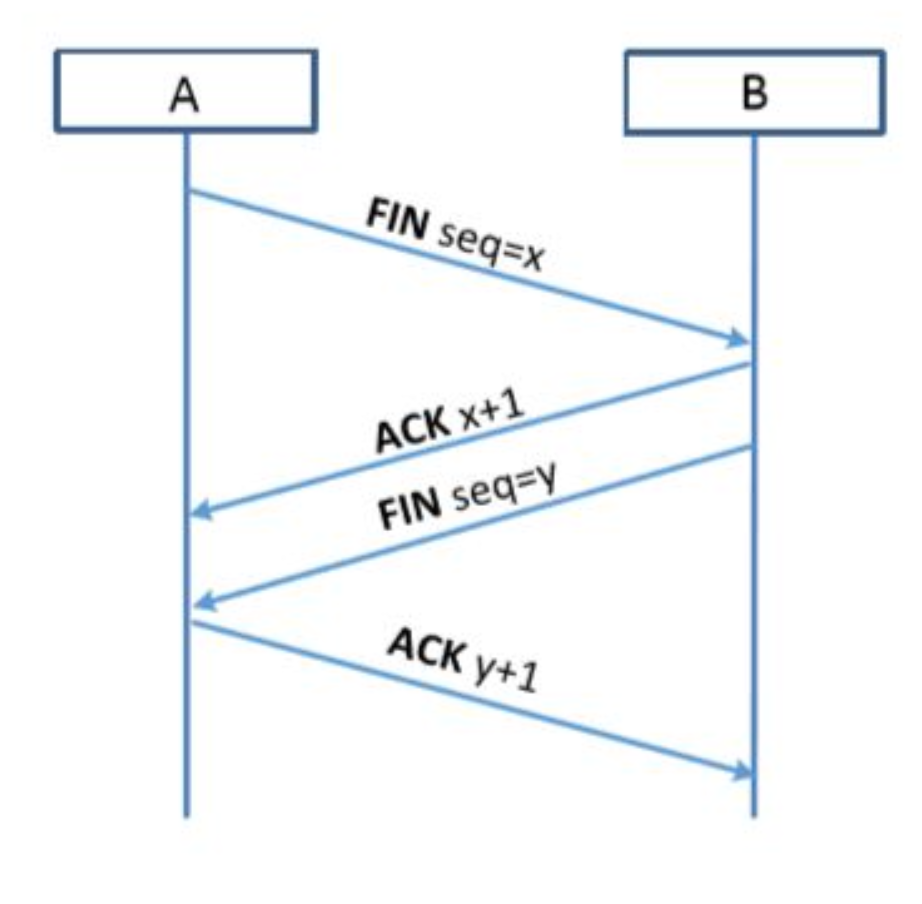
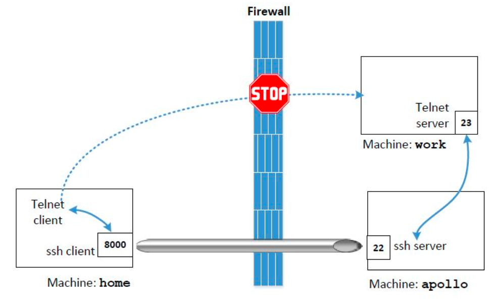
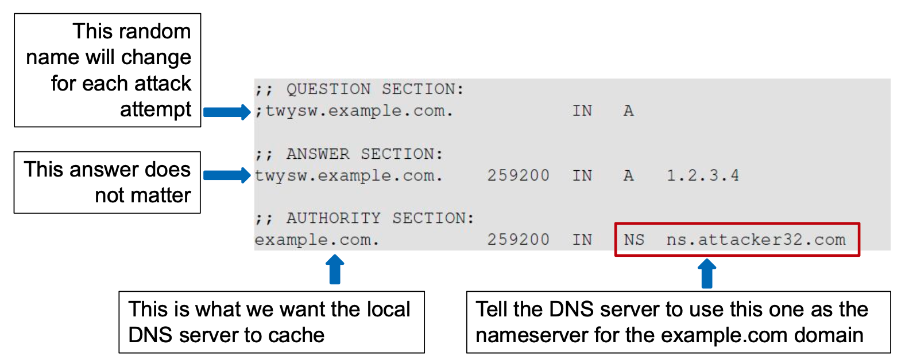

# CS435 Advanced Computer Security
# Introduction
* Computer security is the protection of items of value, called assets
   * Hardware
   * Software
   * Data
* Assets may be off-the-shelf and easily replacable (e.g. computer, network devices, operating system) or unique and irreplacable (e.g. documents, photos, projects)
* A vulnerability is a weakness in the system that could be exploited to cause harm
* A threat is a set of circumstances that has the potential to cause loss or harm
* We use controls or countermeasures to prevent threats from exercising vulnerabilities
* CIA triad - confidentiality, integrity, availability
* Authentication - something you know, something you have, something you are
* Non-repudation - guarantee that no one has forged something, often used in the context of digital signature

### Types of Threats:


### Security Engineering:
* Building systems to remain dependable in the face of malice, error or mischance
* A security system is only as strong as its weakest link
   * We must assume that our opponent is extremely smart, patient, wealthy, creative and has no moral standards
   * The 'enemy' is completely unpredictable
* The challenge is to deal with a changing environment and requirements
   * Need to switch roles between the defender and attacker, i.e. can have an extremely secure system but then how easy is it to use?
   * An adversarial setting
* Challenges for security engineers:
   * Security vs. efficiency:
   * Optimising efficiency is important, but comes second
      * Many failures are caused by over-optimisation
   * Security vs. usability:
      * An unusable system can't be secure
   * Security vs features:
      * Complexity is the worst enemy of security

### Principles of Security:
* There is no such thing as perfect security
* Secure systems can be expensive
* Principle of least privilege
   * Need-to-know (only giving permission to what you need) and separation of duty
* Minimise the number of trusted components
* Keep it simple
* Be skeptical
   * Don't believe big security claims, unless you can verify them
* Be professionally paranoid
   * Think as an attacker would

# Users and Security
* Asymmetry in usability: good use should be easy while bad use is difficult
* Many real attacks exploit psychology as much as technology
   * Capture error: a kind of error where a more frequent and more practiced behaviour takes place when a similar but less familiar action was intended (e.g. just clicking 'yes' or 'confirm' by default)
   * Post completion error: once people have accomplished the immediate goal, they are easily distracted from tidying-up actions (the card is released from the ATM before the money)

### Phishing:
* Phishing emails are sent to thousands of users, hoping to reach the clients of an online company like PayPal, banks, etc.
* The email tries to convince the user that something is wrong with their account and asks the user to confirm their data (e.g. password, credit card number)
* There is a link in the email that points to a spoof site that resembles the legitimate one
   * Creates an illusion of security
   * Disguise the URL by:
      * Typejacking (using a hostname similar to the real hostname)
         * Simple solution is for the legitimate company to buy these hostnames
      * Replacing the URL with an IP address
      * Containing the legitimate site's URL as a substring
   * A spoof site is usually online for a few hours or days, and the HTML code is usually copied from the legitimate site
   * Spoof sites rarely use SSL (expensive to buy a certificate) - may try to give the impression that encryption is being used by using various tricks
   * Some spoof sites have inconsistencies, grammatical errors, etc.
* Phishing exploits the human tendency to trust brands, logos and trust indicators
   * Cannot reliably distinguish legitimate email and website content from illegitimate content that has the same 'look and feel'
   * Nor can distinguish actual hyperlinks from images of hyperlinks, or an image of a window in the content of a web page from an actual browser window
   * Also difficult for most users to reliably parse domain names (e.g. hsbc.mybank.com)
* Cannot reliably and correctly determine the sender identity in emails
* Users may not understand SSL certificates or the meaning of the SSL lock icon
* Security failures:
   * Social engineering attacks:
      * Everything predictable can be spoofed
   * Authentication failure:
      * Cannot reliably authenticate a bank site
      * Public Key Infrastructure (PKI) is theoretically perfect, however breaking one CA means breaking the entire PKI
* Phishing defences:
   * Anti-spam filters
      * No perfect solution yet - may let in false negatives
      * False positives could lead users to miss out on important emails and they might disable the software completely
   * Security toolbar plug-in - if the website is trusted, display it on the browser toolbar
      * Plug-in has to stay updated to stay one step ahead
   * Trusted path - user chooses a background image that is easy to recognise for the user, but hard to predict for phishers
      * User may forget which image they chose for each website
   * Two factor authentication
      * Doesn't solve the problem - only pushes the attack from offline to online
   * The best defence is for the company to not be a soft touch
      * Pursue phishers viciously and relentlessly
      * Won't solve the problem per se, but will push the phishing towards other companies
* Emails are now dominated by a few providers
   * Allows the better use of ML to detect spam emails
* Attackers are changing tactics - random to targeted attacks (spear phishing) and SMS phishing (smishing)
* Smishing:
   * People tend to act on links quicker on phones
   * Attacker can spoof an arbitrary string as the SMS sender (e.g. the police)
   * Companies are moving away from SMS authentication and using authenticator apps instead

### CAPTCHA:
* Humans are much better at computers at, for example, recognising faces and voices
   * Can make use of this asymmetry to improve security
* We want to tell if a particular user is a human or a bot 
* CAPTCHA - Completely Automated Public Turing test to tell Computers and Humans Apart
   * Makes use of a hard, open problem in AI such as optical character recognition or speech recognition
   * Turing test - if the responses from the computer were indistinguishable from that of a human, the computer could be said to be thinking (intelligent)
   * Main difference - Turing test has a human judge, and CAPTCHA has a computer judge
* Possible CAPTCHA challenges: sound-based (recognising human speech with a noisy background), text-based (reading distorted text), image-based (recognising a visual pattern) 
* Critical flaw with text-based CAPTCHAs (from Captchaservice.org) - no matter how distorted the letters are, the pixel counts for each letter remains the same
   * Scheme is very easy to break - without solving any AI problem
   * Predictable patterns weaken security
   * There are more creative ways to distort the text, but this makes it more difficult for a human
      * There is a sweet spot where a CAPTCHA balances strong security and good usability
* Fundamental problem for using CAPTCHA for authentication - man-in-the-middle or outsourcing attack
   * Bot users outsource the task for solving CAPTCHA challenges to people in low-paying countries
* reCAPTCHA v2:
   * Uses risk analysis that is heavily based on Google cookies
   * Many users just need to tick a box (often if using Chrome or signed into a Google account) 
   * Others need to solve an image recognition problem
   * Can be attacked using ML to perform image recognition
* reCAPTCHA v3:
   * Unlike v2, v3 is invisible to website visitors
   * The burden is now shifted onto website administrators
   * v3 Returns a score between 0 and 1, and the admin needs to decide a threshold and what to do:
      * Grant access
      * Ask the user a challenge (downgrading to v2)
      * Block access
   * Difficult decision even for expert admins
* v2 and v3 are strongly tied to Google, and free only up to 1 million API calls per month

# Cryptography - Classical
### Basic Terminology:
* Cipher - a cryptographic algorithm
* Key - used in the algorithm for encryption and decryption
   * Kerckhoff's Principle - the secrecy must rely entirely on the key, not the cipher
* Keyspace - the range of the key

### Cryptanalysis:
* The art and science of analysing weaknesses in cipher algorithms
* Cryptology = cryptography + cryptanalysis
* 4 general types of attack:
   1. Ciphertext-only attack
   2. Known-plaintext attack
   3. Chosen-plaintext attack - choose plaintext, encrypt it, work out the key
   4. Chosen-ciphertext attack
* To store all 256-bit keys - need $2^{264}$ bits and would take $2^{192}$ years to brute force (assuming 1 billion keys per ms)
   * Doesn't make sense to have a key longer than 256 bits - security is in the cipher, not the key length

### Classical Cryptography:
* Based on human characters (26 elements)
* Modern cryptography is based on binary inputs (2 elements)

### Confusion and Diffusion:
* Two basic principles to obscure redundancies in a plaintext message
* Confusion - obscures the relationship between the plaintext and ciphertext (e.g. by substituting characters)
* Diffusion - dissipates the redundancy of the plaintext by spreading it out over the ciphertext (e.g. by transposing the plaintext)

### Substitution Cipher:
* Caesar cipher - shift every letter $K$ positions to the right
   * ROT13 - commonly found on UNIX systems, $K=13$
   * Formal definition:
      * Let $P=C=K=\mathbb{Z}_{26}$. For $0 \leq K \leq 25$, define:
      * $e_K(x) = (x + K) \mod 26$
      * $d_K(y) = (y - K) \mod 26$
      * $x, y \in \mathbb{Z}_{26}$
   * Can be easily broken by exhaustive search - only 26 possible keys
   * On average, a plaintext can be computed after 13 tries
      * Lesson: for a cipher to be secure, the keyspace must be very large
* General substitution cipher definition:
   * Let $P=C=\mathbb{Z}_{26}$. $K$ consists of all possible permutations of the 26 symbols. For each permutation $\pi \in K$, define:
   * $e_\pi(x) = \pi(x) \mod 26$
   * $d_\pi(y) = \pi^{-1}(y) \mod 26$
   * $x, y \in \mathbb{Z}_{26}$, and $\pi^{-1}$ is the inverse permutation to $\pi$
   * Keyspace $|K| = 26!$
   * Can be broken by frequency analysis - certain letters of the English alphabet appear much more frequently than others, so look to see which letters appear more frequently in the ciphertext
   * A large keyspace is not sufficient to ensure a secure cipher - output is not uniformly distributed
      * Substitution only provides confusion
      * Lesson: a secure cipher should combine both confusion and diffusion

### Polyalphabetic Substitution Cipher:
* Vigenere cipher: a polyalphabetic cipher based on the idea of combining a few Caesar ciphers into one
* Have a repeating key that defines how many characters to shift by for each letter of the key
   * E.g. key of ABC means first character is shifted by one, second is shifted by two, third is shifted by three and then it repeats so that the fourth is shifted by one and so on
* Cryptanalysis of Vigenere:
   * Two steps: find out the key length, find out each letter in the key
   * First method for finding the key length: Kasiski test
      * Search for identical segments and count how many positions they are apart
      * There is a chance that the input and key are the same at these points
      * E.g. identical segments are 15 positions apart - key has a length of 3 or 5
   * Second method: index of coincidence
      * Suppose $\textbf{x}=x_1x_2...x_n$ is a string of $n$ alphabetic characters
      * The index of coincidence of $\textbf{x}$ is defined to be the probability that two random elements of $\textbf{x}$ are identical
      * Suppose no. occurrences of $A$ is $f_0$, no. occurrences of $B$ is $f_1$, ..., and no. occurrences of $Z$ is $f_{25}$
      * Index of coincidence is calculated as: $I_c(x) = \frac{\sum_{i=0}^{25} \binom{f_i}{2}}{\binom{n}{2}} = \frac{\sum_{i=0}^{25} f_i(f_i-1)}{n(n-1)} \approx \sum_{i=0}^{25}p_i^2$ where $p_i = \frac{f_i}{n}$
      * In normal English text, index of coincidence is $0.065$ and in a completely random string of letters it is $\frac{1}{26} = 0.038$
         * In English text that has been shifted by a number of positions, it is still $0.065$
      * Try different key lengths $m$ and feed the ciphertext into an $n \times m$ matrix 
         * Work out the index of coincidence for each column and find what $m$ gives a result close to $0.065$

# Stream Cipher
* One-time pad
   * Simplest cipher with perfect security
* Synchronous stream cipher
   * Unable to recover from loss of synchronisation
   * This means we can't decrypt - loss of availability in the CIA triad
* Self-synchronising stream cipher
   * Able to recover from loss of synchronisation

### One-time Pad:
* $c_i = k_i \oplus m_i$ for $i = 1,2,3,...$
* Has the property of 'perfect secrecy'
   * Definition: a cryptosystem has perfect secrecy if $P(m|c) = P(m)$ for all $m \in M$, $c \in C$
   * Theorem: the one-time pad has perfect secrecy. Proof:
      * From Bayes' theorem $P(m|c)=\frac{P(c|m)P(m)}{P(c)}$. It suffices to show that $P(c|m)=P(c)$
      * $P(c|m) = P(m \oplus k|m) = P(k) = \frac{1}{|K|}$
      * $P(c) = \sum_i P(m_i)P(k_i) = \frac{1}{|K|}\sum_i P(m_i) = \frac{1}{|K|}$
* Theorem: perfect secrecy requires $|K| \geq |M|$
   * Key length must be at least equal in length to the message length
   * As a result, the cipher is perfect but impractical

### Stream Ciphers: Making OTP Practical:
* Basic idea: use a short secret key to generate a very long key stream
* Suppose we start with $m$ bits $k_1,k_2,...,k_m$
   * We can generate the key stream using a linear recurrence of degree $m$
   * $k_{i+m} = \sum_{j=0}^{m-1}c_j k_{i+j} \mod 2$
   * $c_0,...,c_{m-1}$ are constants
* After a period, the same key stream will occur
   * This will be after $2^{m-1}$ bits
* Another example: suppose $m=4$ with the following linear reccurrence for $i \geq 1$:
   * $k_{i+4} = (k_i + k_{i+1}) \mod 2$
   * For any non-zero vector, we can obtain a key stream of period $15$
   * This kind of key stream can be efficiently produced in hardware by a linear feedback shift register (LFSR)
   
* Attacks on a stream cipher:
   * Two-time pad:
      * The mistake of using the same key - could happen if the same seed is used twice
      * $c_1 = m_1 \oplus f(k)$
      * $c_2 = m_2 \oplus f(k)$
      * Eavesdropper does $c_1 \oplus c_2 = m_1 \oplus m_2 \implies \{m_1,m_2\}$
   * Doesn't guarantee integrity:
      * Can XOR the ciphertext with part of the plaintext to get back to the plaintext, and then replacing it with something else 
         * E.g. message is 'Transfer £10,000 to Alice', XOR out Alice and replace with Eve
   * Weaknesses in the algorithm:
      * Example: Content Scramble System (CSS)
         * 40 bit security
         * Used to restrict DVDs to only licensed users
         * Only 17 bits of the key used for security
         
         * Every movie has a prefix that we know the content of
         * Try all possible 17-bit LFSR to get 20 output
         * Subtract from the first 20 bytes of stream output
         * If consistent with 25-bit LFSR, we have found the key
 
# Block Cipher


* $R(K,.)$ is called a round function
   * DES - 16 rounds, 3DES - 48 rounds, AES-128 - 10 rounds
   * Too many rounds - cipher becomes inefficient
      * We have to find a tradeoff

### PRF and PRP:
* Pseudo Random Function (PRF) $F : K \times X \rightarrow Y$ defined such that:
   1. There exists an efficient algorithm to evaluate $F(k,x)$
* Pseudo Random Permutation (PRP) $E: K \times X \rightarrow X$ defined such that:
   1. There exists an efficient deterministic algorithm to evaluate $E(k,x)$
   2. The function $E(k,\cdot)$ is one-to-one
   3. There exists an efficient inversion algorithm $D(k,\cdot)$
* A PRP is a PRF where $X=Y$ and it is invertible

### Data Encryption Standard (DES):
* Feistel Network - uses the same circuit for both encryption and decryption, cutting the cost in half
   * For $i=0, 1, ..., 15$:
      * $L_{i+1} = R_i$
      * $R_{i+1} = L_i \oplus F(K_i, R_i)$
   * 64 bit block, 32 bits each side
   * Key is 56 bits, with 48 bits being used in keys $K_0$ to $K_15$
   
   * Decryption is as follows:
      * $R_i = L_{i+1}$
      * $L_i = R_{i+1} \oplus F(K_i, R_i) = R_{i+1} \oplus F(K_i, L_{i+1})$
      * On the last round, don't swap the left and right sides so that decryption can be applied without swapping them
* $F(K_i, x)$ definition:

   * 32 bit input $x$ padded to 48 bits
   * Padded input added to the key $K_i$
   * Input divided into 8 groups of 6 bits of input sent to S boxes (look-up table)
      * $S_i : \{0,1\}^6 \rightarrow \{0,1\}^4$
      
      * Take the row corresponding to the outer 2 bits and the column corresponding to the inner 4 bits, and find where they intersect
      * This provides confusion
   * P-box defines permutation over 32 bits - $P: \{0,1\}^{32} \rightarrow \{0,1\}^{32}$
      
      * Suppose $C = (c_1,c_2,c_3...,c_{31},c_{32})$
      * Then $P(C) = (c_{16},c_7,c_{20},...,c_4,c_{25})$
      * This provides diffusion
   * Choosing the S-boxes and P-box:
      * Choosing at random would result in an insecure block cipher
      * No output bit should be close to a linear function of the input bits
      * S-boxes are a 4-to-1 mapping
* DES can be brute forced - 56-bit key is too weak
* Double DES:
   * Use double key (112-bit) and encrypt twice - $c = E(K_2, E(K_1, m))$
   * Not secure - if we know a few $(m,c)$ pairs, can build two lookup tables ($E(K_1, m)$ and $D(K_2, c)$ and find matching pairs (meet in the middle attack)
      * Time taken will be $2^{56} \times 2 = 2^{57}$ encryptions rather than $2^{112}$
* Triple DES:
   * $c = E(K_3, D(K_2, E(K_1, m)))$
   * Variants:
      * $K_1 \neq K_2 \neq K_3$: key size 168 bits, security 112 bits (meet in the middle for $K_1$ and $(K_2, K_3)$)
      * $K_1 = K_3$: key size 112 bits, security 80 bits - considered inadequate
      * $K_1 = K_2 = K_3$: key size and security 56 bits
   * Considered secure by today's standards, but inefficient
   * Mainly used for backwards compatibility

### Advanced Encryption Standard (AES):
* AES-128 has a 128-bit key
* A substitution-permutation network (not Feistel)

   * Mix together all the bits rather than just half at each round
   * Needs fewer rounds as a result
* Schematic is as follows:

   * SubBytes:
      * A substitution cipher
      * $a$ is an element of $GF(2^8)$
      * For $i = 0,1,...7$:
         * $b_i = (a_i + a_{i+4} + a_{i+5} + a_{i+6} + a_{i+7} + c_i) \mod 2$
         * Can be proved that it is a one-to-one mapping
      * Not random, unlike the DES S-box
         * Defined in a finite field
      * Doesn't have to be hard-coded - allows for a very compact software implementation
      * Tradeoff between the code size and performance
   * ShiftRows:
      
      * Each row is shifted along by a number of bytes
   * MixColumns:
      * Each byte in a column is replaced by 2 times that byte, plus three times the next byte, plus the byte that comes next, plus the byte that follows
      * $u_i = f(s_0, s_1, s_2, s_3)$
* Key schedule:
   * 16 byte key is expanded 11 times to 176 bytes so that each round has a unique round key
   * AES defines a word as consisting of 4 bytes
   
   * The function $g$:
      * Rotate a byte to the left
      * Substitute each byte with a new byte based on some S-box
      * XOR the result with some constant
* Variants:
   * Block sizes are all 128 bits
   * Key sizes are different: 128, 192, 256 with varying number of rounds too
   * Key scheduling algorithms are different
      * AES-128 considered more secure due to its key scheduling algorithm

### Modes of Operation:
* Defines how a block cipher is applied to encrypt data
* Mode 1: Electronic Codebook (ECB)
   * Simplest mode of operation
   
   * Deterministic operation - same plaintext input leads to the same output
   * Problematic in practice since blocks of the plaintext that are similar encrypt similarly
* Mode 2: Cipher Block Chaining (CBC)
   * One of the most widely used methods
   
   * $c = E(k, IV \oplus m) \implies m = IV \oplus D(k, c)$
   * An $n$ byte pad of $n,n,...,n$ is added to make the plaintext a multiple of the block size
      * If the plaintext is already this, then a pad as big as the block size is added
   * Because of a random IV, the same message input can give different outputs
   * If a plaintext block is changed, all the subsequent ciphertext blocks will be affected
   * If a whole block ciphertext is lost, CBC can synchronise by itself (but not if a byte is lost)
   * Cannot be parallelised
   * If the decrypted padding is found to be invalid, the server rejects data with an invalid-padding error
   * Invalid padding error attack:
   
      * Feed modified ciphertext: $IV, C_1, C_2 \oplus R, C_3$ where $R = \{r_0, r_1, ..., r_{15}\}$ 
      * $r_0, ..., r_{14}$ are random, try $r_{15}$ from $0$ to $255$
      * 255 times decryption fails except once when $P_3$ ends with $01$
         * $LB(P_3) = 01 = LB(D(k, C_3)) \oplus (LB(C_2) \oplus r_{15})$
         * $01 \oplus r_{15} = LB(D(k, C_3)) \oplus LB(C_2)$
      * Hence, the last byte of $P_3$ is $r_{15} \oplus 01$
      * For the second to last byte of $P_3$:
         * Fix last byte of $R$: $r_{15} \oplus 01 \oplus 02$
         * Try $r_{14}$ from $0$ to $255$
         * 255 failures except when $P_3$ ends with $0202$
         * Hence the second to last byte of $P_3$ is $r_{14} \oplus $r_{14}$
      * Repeat to recover all bytes of $P_3$
      * The total number of calls to decryption oracle is $16 \times 256$ (instead of $2^{128}$)
      * Once $P_3$ has been worked out, remove the last round of decryption and do the same for $P_2$
      * Countermeasures:
         * Remove the padding-error
            * Show a generic error for decryption failure
            * May still be subject to a timing attack, e.g. if invalid padding causes a quicker rejection
            * Consistent time rejection can be hard to implement
         * Use authenticated encryption
* Mode 3: Cipher Feedback Mode (CFB)
   * Turning a block cipher into a stream cipher
   
   * If a whole block size of ciphertext is lost, CFB will synchronise by itself
   * But if a byte or a bit is lost, CFB will lose synchronisation
   * Only encryption operation is used for ENC/DEC
   * Encryption cannot be parallelised, but decryption can
* Mode 4: Output Feedback Mode (OFB)
   * Also a stream cipher
   
   * Encryption and decryption operations are exactly the same as OTP 
* Mode 5: Counter Mode (CRT)
   * Getting increasingly popular (to replace CBC)
   
   * Like OFB, CRT is essentially a stream cipher
   * Encryption and decryption are the same
   * Both encryption and decryption can be parallelised 

# Hash
* Compress an arbitrary message into an output of fixed length
* To facilitate detecting errors or data compression
* Cryptographic hash function invented for digital signature
   * Provide assurance of integrity
* Ideally we want the output to be completely randomly distributed (each output represents only one input message), but this is theoretically impossible
   * Message space size is much larger than the output space size
* Practical solution - ensure that it is computationally infeasible to find two messages with the same output

### Security Requirements of Hash:
1. Pre-image Resistance:
   * Given $H(m)$, can't find $m$
2. Second Pre-image Resistance:
   * Given $m_1$, can't find $m_2$ such that $H(m_1) = H(m_2)$
3. Collision Resistance:
   * Can't find $m_1, m_2$ such that $H(m_1) = H(m_2)$
   * This is the most difficult to satisfy
   * Collision could result in a malicious document being able to use the same digital signature as a real one

### Birthday Paradox Attack:
* Assume a hash function with $n$ bits output
* Birthday attack algorithm:
   1. Select $2^{\frac{n}{2}}$ random input messages
   2. Compute the hash of each message
   3. Look for a collision among the output
   4. If not found, go back to step 1 
* For $n$-bit security, output of the hash must be at least $2n$ bits long
   * Standard is 128 bits - output must be at least 256 bits

### Hash Function Design:
* A typical hash function involves three components in the design:
   * Operation mode
   * Compression function structure
   * Confusion-diffusion operations
* Merkle-Damgard Construction:

   * Theorem: if the compression is collision resistant, then the hash function is collision resistant. Proof (sketch):
   
* Compression functions:

   * $E$ is a block cipher
   * Use message as key
   * $h(H, m) = E(m, H) \oplus H$
   * Input size: key size + block size
   * Output size: block size

### Password Authentication:
* Compute hash of the password and compare it against a database
* Add salt to password before hashing it to prevent lookup attack
   * Only a best practice - makes it difficult but not impossible for an attacker to recover the password
* Dictionary attack:
   * Given $H(p,s)$ and $s$ an attacker can exhaustively try out all passwords $p$
   * The attack is feasible because passwords have low entropy

# Message Authentication Code (MAC)
* Goal: integrity, not confidentiality
* Examples:
   * Protecting binaries of an OS
   * Protecting banner ads on web pages 
* Definition: MAC $I = (S,V)$ defined over $(K,M,T)$

   * $S(k,m)$ outputs $t \in T$
   * $V(k,m,t)$ outputs 'yes' or 'no'
   * Integrity requires a key - otherwise attacker can easily modify message $m$ and recompute MAC

### Secure MACs:
* Attacker's power: chosen message attack
   * For $m_1,m_2,...,m_q$ the attacker is given $t_i \leftarrow S(k,m_i)$
* Attacker's goal: existential forgery
   * Find a new valid message/tag pair $(m,t)$ such that $(m,t) \notin \{(m_1,t_1),...,(m_q,t_q)\}$
* Example: protecting system files
   * Suppose a system has a set of files each with a corresponding MAC
   * A virus infects the system and modifies system files
      * If the MAC is secure, the virus cannot forge a valid tag for itself
   * User reboots into a clean OS, and all modified files will be detected

### Constructing a MAC:
* Block cipher (example: CBC-MAC):

   * Always use a fixed IV - otherwise attacker can modify the first part of the message to produce a new (message, tag) pair, violating the secure MAC definition
* Hash function (example: HMAC):
   * Assume a key $k$ and message $m$
   * Construct a MAC by using $H(k,m)$
      * Suppose MAC tag is $H(k,m[0]||m[1]||m[2])$
      * An attacker can easily append another block $m[3]$ and compute $H(k,m[0]||m[1]||m[2]||m[3])$ - a new (message, tag) pair
   * Intuition: need to have a secret key to protect the front, and a secret key to protect the end
   * Example of a secure construction: $H(k_1, H(k_2,m))$ where $k_1 \neq k_2$
   * HMAC:
   
      * Uses only one secret key (hence efficient)
      * Define constants $ipad$ and $opad$
      * $HMAC(k,m) = H(k \oplus opad || H(k \oplus ipad || m))$

### Verification Timing Attack on HMAC:
* Example:
```python
def verify(key, msg, sig_bytes):
    return HMAC(key, msg) == sig_bytes
```
* The problem: `==` is implemented as a byte-by-byte comparison
   * Comparator returns false whent the first inequality is found
* Timing attack:
   * Step 1: Query server with random tag
   * Step 2: Loop over all possible first bytes and query server. Stop when verification takes a little longer than step 1
   * Step 3: Repeat for all tag bytes until a valid tag is found
* Defence 1: make string comparator always take the same time
```python
def verify(key, msg, sig_bytes):
    result = 0
    for x, y in zip(HMAC(key, msg), sig_bytes)
        result |= ord(x) ^ ord(y)
    return result == 0
```
* Can be difficult to ensure due to compiler optimising
* Defence 2: as above
```python
def verify(key, msg, sig_bytes):
    mac = HMAC(key, msg)
    return HMAC(key, mac) == HMAC(key, sig_bytes)
```
* Attacker doesn't know values being compared
* Lesson: an attacker often bypasses cryptography and exploits weaknesses in the implementation
* In the real world, encryptions are often done in authenticated mode
   * Produce a MAC as part of the encryption process
   * Provides both confidentiality and integrity
* Examples of authenticated encryption: CBC mode encryption + CBC-MAC, Counter mode encryption + CBC-MAC

# Key Agreement
### Merkle Puzzles (1974):
* E.g. Consider $E(k,m)$ - a symmetric cipher with a 32-bit $k$
* Puzzle $P = E(k,m)$ (where $m$ is known)
   * Goal: find $k$ by trying all $2^{32}$ possibilities
* Alice: prepares $2^{32}$ puzzles
   * For $i=1,...,2^{32}$ choose random 32-bit $k_i$ and 128-bit $x_i, m_i$ (where $x_i$ is an index and $m_i$ is a potential key)
   * Send all $2^{32}$ puzzles to Bob
* Bob: chooses a random puzzle and solve it, obtaining $(x_j,m_j)$
   * Send $x_j$ to Alice
* Alice: looks up puzzle with number $x_j$
   * Use $m_j$ as the shared key
* Alice's work: $O(n)$ (prepare $n$ puzzles)
* Bob's work: $O(n)$ (solve one puzzle)
* Eve's work: $O(n^2)$ (solve $n$ puzzles)
* Although inefficient, this showed for the first time that key exchange in the open air was possible

### Diffie-Hellman Key Exchange:
* A primitive root modulo $p$ is a number whose powers generate all the nonzero numbers $\mod p$
   * The reverse of this - the discrete logarithm - is a very hard problem
* Let $p$ be a prime and $g$ be a primitive root modulo $p$
   * Alice selects $x$ from the range $[1,p-1]$ and Bob selects $y$ from $[1,p-1]$
   * Alice computes $A = g^x \mod p$ and sends it to Bob, while Bob computes $B = g^y \mod p$ and sends it to Alice
   * Alice computes $K = H(B^x) \mod p = H(g^{xy}) \mod p$
   * Bob computes $K = H(A^y) \mod p = H(g^{xy}) \mod p$
* Eve sees: $p, g, g^x \mod p, g^y \mod p$
   * It is a hard problem to compute $g^{xy} \mod p$
   * Computationally infeasible if $p$ is a large prime
* Slowly transitionign away from $\mod p$ to elliptic curve (more efficient)
* Man-in-the-middle attack:
   * Suppose Mallory selects $z$ from $[1,p-1]$
   * He then sends $A' = g^z \mod p$ to Bob and $B' = g^z \mod p$ to Alice
   * Both compute $K = H(g^{xz}) \mod p$
   * Since $g^x \mod p$ and $g^y \mod p$ are out in the open, Mallory can also compute $K$
* Fundamental issue is that the protocol is unauthenticated
   * Solution appears simple - let's add authentication
   * Not a trivial problem - over 40 years of research with a very large amount of authenticated key protocols proposed and broken
   * Authentication used on public key certificate or password

### Encrypted Key Exchange (EKE):
* Each player uses a password $s$ to encrypt the key exchange process
* Alice: $A = E(s,g^x \mod p)$
* Bob: $B = E(s,g^y \mod p)$
* Information leakage:
   * Eve captures $A, B$. She can narrow down the password range
   * For $s$ in passwords dictionary, decrypt $A,B$
   * If $D(s,A) \geq p$ or $D(s,B) \geq p$, eliminate $s$ as a possible password
* Implicit assumption in EKE is that the content in the encryption is random
   * But it's not - for $A = g^x \mod p$, the value falls in the range $[0,p-1]$
   * In practice, $A$ is represented as $\{0,1\}^n$, e.g. $n=2048$
   * If the decrypted password falls into $[p,s^{2048}]$, the candidate password can be ruled out

### Simple Password Exponential Key Exchange (SPEKE):
* Use password $s$ as the generator instead
* Use a safe prime $p=1+2q$ where $q$ is prime
* Alice: $A = (s^2)^x \mod p$
* Bob: $B = (s^2)^y \mod p$
* Attack on SPEKE:
   * Some passwords are exponentially related, e.g. $pw_1 = pw_2^r$ where $r$ is an arbitrary integer
   * An attacker may perform an online dictionary attack
   * Each time, the attacker can rule out not only one password, but all other passwords that are exponentially related
   * Patch - use $H(s)$ instead of $s$
      * But other flaws have been reported later
* Problem here is heuristic design without any proofs
   * Crypto community motivated towards 'provabe security'
   * However, many 'provably' secure protocols turn out to be insecure or broken as well

# Public Key Encryption
* Bob generates a pair of keys $(pk,sk)$ where $pk$ is a public key and $sk$ is a private key. He gives $pk$ to Alice

* Definition: a public key encryption system is a triple of algorithms $(G,E,D)$:
   * $G()$: randomised algorithm outputs a key pair $(pk,sk)$
   * $E(pk,m)$: randomised algorithm that takes $m \in M$ and outputs $c \in C$
   * $D(sk,c)$: decryption algorithm that takes $c \in C$ and outputs $m \in M$ or $\bot$
   * Consistency: $\forall (pk,sk)$ output by $G$: $\forall m \in M$: $D(sk,E(pk,m)) = m$

### RSA - Number Theory Background:
* One way functions:
   * Modular exponentiation: given $y$, find $x$ such that $y = g^x \mod p$
   * Prime factoring: Given $y$, find primes $p, q$ such that $y = pq$
* Fermat's Little Theorem:
   * For any prime $p$ not dividing $a$, we have $a^{p-1} = 1 \mod p$
* Euler's Theorem:
   * Euler's phi (or totient) function: $\phi(n)$ is the number of positive integers less than $n$ with which it has no divisor in common
      * E.g. $\phi(n) = (p-1)(q-1)$ if $n=pq$
   * Euler's Theorem (more general than Fermat's): for any modulus $n$ and any integer $a$ coprime to $n$ we have $a^{\phi(n)} = 1 \mod n$
* Euclidean Algorithm:
   * Finds the GCD $r$ of $a$ and $b$
* Extended Euclidean Algorithm:
   * Finds GCD but also finds $s$ and $t$ such that $sa+tb=r$
* Finding the Multiplicative Inverse:
   * For RSA we are interested when $r=1$ - i.e. when $a$ and $b$ are coprime
      * $sa + bt = 1 \implies sa = 1 - bt \implies sa = 1 \mod b$, i.e. $s$ is the multiplicative inverse of $a$ modulo $b$
   * Facts: 
      * $x \in \mathbb{Z}_N$ is invertible $\iff gcd(x,N)=1$
      * Number of invertible elements of $\mathbb{Z}_n$ is $\phi(n) = (p-1)(q-1)$
      * $\mathbb{Z}_N^*$ denotes the set of non-invertible integers modulo $N$
* Chinese Remainder Theorem:
   * A method of solving systems of congruences:
      * $x \equiv a_1 \mod m_1$
      * $x \equiv a_2 \mod m_2$
      * ...
      * $x \equiv a_r \mod m_r$
   * There is a unique solution $x = m_1m_2...m_r$
   * A special case:
      * $x \equiv a \mod p$
      * $x \equiv a \mod q$
      * We must have $x \equiv a \mod pq$

### RSA - Key Generation:
* Input key length $n$
* Generate two large $n$-bit distinct primes $p$ and $q$ 
* Compute $N = pq$ and $\phi(N) = (p-1)(q-1)$
* Chose a random integer $e$ such that $gcd(e,\phi(N)) = 1$
* Compute inverse $d$ of $e$, that is $de = 1 \mod \phi(N)$
* Output: $pk = (N,e)$, $sk = (N,d)$ (essentially secret key is only $d$)
* Very slow algorithm
* Security of RSA:
   * Semantic security: ciphertext indistinguishable from random
   * Textbook RSA is not semantically secure - many attacks exist

### RSA Encryption:
* Encryption: given $pk = (N,e)$ and message $m \in \mathbb{Z}_N$: $c = m^e \mod N$
* Decryption: kiven $sk = (N,d)$ and ciphertext $c$: $m = c^d \mod N$
* Correctness proof:
   * Need to show $Dec_{sk}(Enc_{pk}(m)) = m$
   * Key: $gcd(e,\phi(N)) = 1$ and $ed = 1 \mod(\phi(N))$
   * If $m$ is relatively prime to $N$: $c^d = (m^e)^d = m^{de} = m^{de \mod \phi(N)} = m \mod N$
   * Else:
      * $c^d = (m^e)^d = m^{de} = m^{de \mod p-1} = m \mod p$
      * $c^d = (m^e)^d = m^{de} = m^{de \mod q-1} = m \mod q$
   * Hence $c^d = m \mod pq = m \mod N$ by Chinese Remainder Theorem

### Meet-in-the-Middle Attack
* Suppose we use RSA in a web browser to encrypt a session key $k$ for the web server (key transport)
* Suppose $k$ is 64 bits: $k \in \{0,...,2^{64}\}$. Eve sees $c = k^e$ in $\mathbb{Z}_N$
* If $k = k_1k_2$ where $k_1, k_2 < 2^{34}$ (20% probability) then $\frac{c}{k_1^e} = k_2^e$ in $\mathbb{Z}_N$
* Step 1: build table $\frac{c}{1^e}, \frac{c}{2^e}, ..., \frac{c}{(2^{34})^e}$
* Step 2: for $k_2 = 0, ..., 2^{34}$ test if $k_2^e$ is in the table
* Output matching $(k_1, k_2)$
* Classic tradeoff between computation and storage

### Mangling Ciphertexts:
* Example: Alice sends bid $m=1000$ in an auction. $c = m^e \mod N$
* Eve can change this to: $c^* = 2^e c\mod N$
* Then: $(c^*)^d = (2^e m^e)^d = (2m)^{de} = 2m = 2000$
* RSA doesn't provide integrity

### Common Modulus Attack:
* Assume organisation uses common modulus $N$ for all employees
* Each employee receives key pair $(pk=e, sk=d)$
* Knowledge of $d \iff$ factorisation of $N$

### RSA with Padding:
* Padding is to randomise the encryption
* Public Key Cryptography Standards (PKCS) #1 v1.5:
   * Choose random byte-string $r$ 
   * $(00000000||00000010||r||00000000||m)^e \mod N$ (16-bit 2, followed by $r$, followed by 8-bit 0, followed by $m$)
   
   * When decrypting, check that the padding is ok
   * Has no security proofs
* Optimal Asymmetric Encryption Padding (OAEP):
   * $H$ and $G$ are hash functions
   * Padding dependent on plaintext
   * Hash functions allow for proof of properties of the scheme - this is the preferred method of padding
* RSA in practice:
   * Almost never use RSA to encrypt a document - it's slow and dependent on the structure of the message
   * Instead encrypt a symmetric key that is used to encrypt the document
      * Known as hybrid encryption
   * Symmetric key is encrypted with padding
   

# Digital Signature
* Sign with a private key to generate a signature which is attached to the document
* Verifier decrypts with the public key to decide whether to accept or reject
   * Is there a valid mathematical relationship between the signature and the document?
* Definition: a signature scheme is a triple $(Gen, S, V)$:
   * $Gen()$ is a randomised algorithm that outputs a key pair $(sk,pk)$
   * $S(sk,m)$ outputs signature $\sigma$
   * $V(pk,m,\sigma)$ outputs 'accept' or 'reject'
   * Consistency: $\forall (pk,sk)$ output by $Gen$: $\forall m \in M$:
      * $V(pk,m,S(sk,m)) =$ 'accept'

### Security of Digital Signatures:
* Attacker's power: chosen message attack
   * For $m_1,m_2,...,m_q$, attacker is given $\sigma \leftarrow S(sk,m_i)$
* Attacker's goal: existential forgery
   * Produce some new valid message/sign pair $(m,\sigma)$ such that $m \notin \{m_1,...,m_q\}$
* For a secure digital signature, an attacker must noe be able to produce a valid signature for a new message

### RSA Signature:
* KeyGen: $pk=(N,e)$, $sk=(N,d)$
* Sign: given $sk=(N,d)$ and message $m$: $\sigma = m^d \mod N$
* Verify: given $pk=(N,e)$ and signature $\sigma$: $m = \sigma^e \mod N$

### Attacks on RSA Signature:
* No-message attack:
   * Adversary $A$ only has access to $pk=(N,e)$
   * $A$ chooses some element $\sigma$ in $\mathbb{Z}_N$
   * $A$ computes $m = \sigma^e \mod N$
   * Output is $(m,\sigma)$
   * Attacker cannot choose a fake document and generate a signature - $m$ is just a random string with no meaning
* Selected-message attack:
   * $A$ has access to $pk=(N,e)$ and can obtain two signatures from the signer
   * Possible to forge a signature on any chosen message $m$
   * $A$ chooses target message $m$, a random $m_1$ in $\mathbb{Z}_N^*$, and sets $m_2 = \frac{m}{m_1} \mod N$
   * $A$ obtains signatures $\sigma_1$ and $\sigma_2$ on $m_1$ and $m_2$
   * $\sigma = \sigma_1 \cdot \sigma_2 \mod N$ is a valid signature on $m$
* Hashed RSA:
   * Combines RSA with secure encoding, e.g. RSA-PSS
   

### Digital Signature Algorithm:
* Based on discrete logarithm instead
* Adopted as a standard
   * However, controversial
   * Schnorr signature widely considered better
* Schnorr Signature:
   * Simpler than DSA
   * Has well-understood security proofs - DSA has no proofs

### Zero Knowledge Proof:
* Schnorr signature scheme design closely related to the notion of zero knowledge proof
   * A zero knowledge proof proves that the prover knows the secret without them revealing the secret
* Requirements for ZKP:
   * Completeness: if the statement is true, the prover will be able to convince the verifier of this
   * Soundness: if the statement is false, no cheating prover can convince the verifier that it is true except with a small probability
   * Zero knowledge: a verifier learns nothing other than the fact that the statement is true
* ZKP is widely used in cryptographic protocols to ensure participants follow the specification honestly

### Schnorr Scheme:
* Group parameters:
   * Let $p$ and $q$ be two large primes such that $q | p-1$
   * $G_q$ is the subgroup of $\mathbb{Z}_p^*$ of prime order $q$
   * $g$ is a generator for the subgroup
* User identification:
   * Alice holds the private key $x$ to a given public key $X = g^x$
   * Alice wishes to prove to Bob that she knows $x$
* Interactive ZKP:
   * Alice chooses a random $v$ from $[0,q-1]$, computes $V = g^v \mod p$, and sends $V$ to Bob
   * Bob chooses a random challenge $c$ from $[0,2^{t}-1]$ and sends this to Alice
   * Alice computes $b = v-(xc \mod q)$ and sends this to Bob
   * Bob checks if $V = g^b(g^x)^c\mod p$
      * $g^{v-xc}(g^x)^c = g^v = V$
* Designed to be vary fast an efficient
   * Alice computation: one exponentiation - can be precomputed offline before the scheme is executed
   * Bob computation: one exponentiation using a simultaneous exponentiation technique
   * This is as efficient as you can possibly achieve for a public key scheme
* Consider a typical group setting: 2048-bit $p$, 224-bit $q$
   * We can further reduce the bits by setting $V' = \mathrm{SHA224}(V)$ in the first flow. Then Bob checks if $V' = \mathrm{SHA224}(g^b(g^x)^c)\mod p$
* Completeness: if Alice knows the private key, she can pass the identification protocol successfully
* Soundness: if Alice doesn't know the private key, then the probability she can pass the identification protocol successfully is $2^{-t}$ ($t$ is the bit length of $c$)
   * If Alice guessed the correct value of $c$, she can pass the identification by choosing an arbitrary value $b$ and precomputing $V = g^b(g^x)^c$
   * Proof of soundness (sketch):
      * Assume Alice can guess more than one $c$ value to pass the identification, i.e. she knows $c_1,c_2$ and $b_1,b_2$ such that $V=g^{b_1}(g^x)^{c_1}=g^{b_2}(g^x)^{c_2}$ 
      * It follows that $g^{b_1-b_2}=(g^x)^{c_2-c_1}$, and so $b_1-b_2=x(c_2-c_1)$
      * We can conclude that Alice knows $x$, since $x=\frac{b_1-b_2}{c_2-c_1}$
* Zero knowledge: Alice proves her knowledge of $x$, without revealing any information about $x$
   * Proof of zero knowledge (sketch):
      * Assume an honest verifier, who chooses $c$ at random
      * A transcript of a session consists of $(V,c,b)$. For any fixed challenge $c$, there is a one-to-one correspondence between $V$ and $b$
      * Alice (or anyone else) can generate simulated transcripts as follows:
         * Choose $c$ uniformly at random from $[0,2^t-1]$
         * Choose $b$ uniformly at random from $[0,2^t-1]$
         * Compute $V=g^b(g^x)^c\mod p$
      * The simulated transcript is indistinguishable from a real transcript - and no private key is needed to simulate a transcript, only a challenge
* Non-interactive ZKP:
   * Replace the verifier with the results of a cryptographic hash function
   * Naturally fulfills the honest verifier requirement
   * A technique called the Fiat-Shamir heuristic
   * Alice chooses a random $v$ from $[0,q-1]$, computes $V=g^v\mod p$ and sends $V$ to Bob
   * Bob (not needed) computes $c=H(Alice,g,g^v,g^x)$
   * Alice computes $b=v-xc\mod q$ and sends this to Bob
   * Bob checks if $V=g^b(g^x)^c\mod p$
* Schnorr signature:
   * Derived from Schnorr non-interactive proof
   * Key pair: private key $x$, public key $X = g^x\mod p$
   * Signing a message $m$:
      * Choose a random $v$, compute $V = g^v\mod p$
      * Let $h = H(V||m)$, $s=v-xh$
      * Signature is the pair $(V,s)$

# Buffer Overflow
### Memory Allocation:
* Code and data are separated
* Heap grows upwards, while stack grows downwards
* Writing over length in heap will cause overwriting the stack (stack smashing)

* The same hex value in the same spot memory can be interpreted different depending on whether the computer treats it as code or data

### Buffer Overflows:
* Occurs when data is written beyond the space allocated for it, such as the 10th byte in a 9-byte array
* An attacker's inputs are expected to go into regions of memory allocated for data but are instead allowed to overwrite memory allocated for executable code

### Program Memory Stack:
* Text - executable code (usually read-only)
* Data - static/global variables that are initialised by the programmer
* BSS (block started by symbol) Segment - Uninitialised static/global variables
* Heap - dynamic memory allocation
* Stack - local variables defined inside functions as well as storing data related to function calls such as return addresses, arguments, etc


### Stack Memory Layout:

* All values relative to the current frame pointer (ebp register)
* Attacker wants to rewrite return address to where malware is stored in memory
* In this example, `a` is stored in `%ebp + 8` and `b` is stored in `%ebp + 12`

### Buffer Overflow Using strcpy():
* `strcpy(buffer, str)` stops copying `str` to `buffer` when it sees the number zero, represented by `\0`
* If we make `str` longer than `buffer`, it will cause a buffer overflow

   * The stack above `buffer` will be overwritten, which could include the return address
   * The overflow may just corrupt the stack, causing program failure
* Overwriting the return address with some other address can point to:
   * Invalid instruction
   * Non-existing address
   * Access violation
   * Malicious code

### Performing a Buffer Overflow Attack:
* Attacker needs to:
   * Find the offset distance between the base of the buffer and the return address
   * Find the address to place the malicious code (e.g. shellcode)
* Neither task is trivial (attacker doesn't know ebp)
   * A random guess will take $2^{n}$ tries on an $n$-bit machine
   * Many early systems used fixed memory addresses for the stack
   * We can also substantially improve our chances with various techniques
* Technique 1: `NOP` filling

   * `NOP` does nothing - it just moves onto the next instruction
   * Try to get the return address to jump to one of these `NOP`s, from which it eventually reaches the malicious code
* Technique 2: return address spraying
   * Assume we know thew address of the buffer is `A = 0xbffea8c`
   * We know the size of the buffer is 100
   * Hence the address for `RT` should be `A` plus a small value (compiler may add some space after the buffer)
   * We simply spray 120 bytes with `RT`, and one of them should overwrite the return address field

### Shellcode:
* Aim of the malicious code: allow the running of more commands (i.e. gain access to the system)
* C Program to run a shell script:
```c
#include <stddef.h>

void main() {
    char *name[2];
    name[0] = "/bin/sh";
    name[1] = NULL;
    execve(name[0], name, NULL);
}
```
* Challenges:
   * Loader issue
   * Zeros in the code
* Assembly code to run `execve("/bin/sh", argv, 0)`:
   * Registers used:
      * `eax = 0x0000000b` - value of system call `execve()`
      * `ebx` - address of `/bin/sh`
      * `ecx` - address of the argument array
         * `argv[0]` - address of `/bin/sh`
         * `argv[1]` - 0 (i.e. no more arguments)
      * `edx` - 0 (no environment variables are passed)
      * `int 0x80` - invoke `exevce()`
   * Code:
   
   * Stack:
   

### Countermeasures:
* Developer approaches:
   * Use of safer functions like `strncpy()` and `strncat()` that check the length of data before copying
* Address Space Layout Randomisation (ASLR):
   * Randomise the start location of the stack so that every time the code is loaded into memory, the stack address changes
   * Difficult to guess the stack address in memory
   * Difficult to guess the ebp address and find where to put the malicious code
* Stack-Guard:
   * Guard is a secret value written into the stack
   * If the attacker overwrites it, the program exits
   
* Non-executable stack:
   * NX bit, standing for No-eXecute feature in the CPU marks certain areas of the memory as non-executable
   * Can simply mark the stack as this
   * Can be defeated by another attack (called a return-to-libc attack) - the attacker doesn't run any code on the stack, but simply makes the program return to a function in an existing library

# Race Condition
* Happens when:
   * Multiple processes access and manipulate the same data concurrently
   * The outcome of execution depends on a particular order
      * E.g. two processes withdrawing money from a bank
* If a privileged program has a race condition, an attacker may be able to affect its output by influencing uncontrollable events

### Time-of-Check to Time-of-Use (TOCTTOU):
* A special type of race condition
* Occurs when checking for a condition before using a resource
   * E.g. while checking while access rights to modify a byte in `my_file`, change the filename to `your_file` and the action to delete
* In some cases when the action is done with a higher privilege, more damage can be done

### Privileged Programs:
* Compromising a user program may allow an attacker to gain root access
* There are special user programs that are executed with a higher privilege behind the scenes
   * These are called privileged programs
   * For example, Set-UID programs
   * Needed so, for example, a user can change their password
* Set-UID:
   * Allows a user to run a program with the program owner's privilege
   * Widely implemented in UNIX systems
   * `chmod u+s` - make program a Set-UID program
   * Every program has 2 user IDs
      * Real UID (RUID) - identifies real owner of process
      * Effective UID (EUID) - identifies privilege of process, access control is based on this
      * When a normal program is executed, RUID = EUID
      * When a Set-UID program is executed, RUID =/= EUID as EUID is equal to the program owner's ID

### Race Condition Vulnerability:
```c
if (!access("/tmp/X", W_OK)) {
    f = open("/tmp/X", O_WRITE);
    write_to_file(f);
} else {
    fprintf(stderr, "Permission denied\n");
}
```
* Here, EUID is root and RUID is seed
* The program writes to a file in `/tmp`
* As the root can write to any target file, the program ensures that the real user has write permissions to the target file
* `access()` system call checks if the RUID has write access to `/tmp/X`
* After the check, the file is opened for writing
* `open()` checks the EUID (which is 0) and the file will be opened
* An attacker can make `/etc/passwd` the target file without changing the file name in the program
   * Symbolic links (symlink) are used to achieve this
   * It is a special type of file that points to another file
* Attack process:

   * As the program runs billions of instructions per second, the window between the time to check and the time of use lasts for a very small time, making it impossible to change to a symbolic link at the right moment
      * If the change is too early, `access()` will fail
      * If the change is too late, the target file will not be used
   * To win the race condition, we need two processes:
   
      * Run vulnerable program in a loop
      * Run the attack program
   * Attack program runs:
      * A1: Make `/tmp/X` point to a file owned by us
      * A2: Make `/tmp/X` point to `/etc/passwd`
   * Vulnerable program runs:
      * V1: Check user's permission on `/tmp/X`
      * V2: Open the file
   * As the programs are running simultaneously on a multi-core machine, the instructions will be interleaved
      * Need the order A1, V1, A2, V2
```c
#include <unistd.h>

int main() {
    while(1) {
        unlink("/tmp/X");
        // Create a symlink to a file owned by us in order to allow access() to pass
        symlink("/home/seed/myfile", "/tmp/X");
        // Sleep to allow the vulnerable process to run
        usleep(10000);
        
        // Unlink the symlink
        unlink("/tmp/X");
        // Create a symlink to the file we want to open
        symlink("/etc/passwd", "/tmp/X");
        usleep(10000);
    }
}
```
* If the attacker writes to the file a user with UID 0 and an empty password, can gain access to a root shell

### Countermeasures:
* Atomic operations:
   * Eliminate the window between check and use
   * `f = open(file, O_CREAT|O_EXCL);`
      * These two options when combined together will not open the specified file if it already exists
* Sticky symlink protection:
   * When this is enabled, symbolic links inside a sticky world-writable can only be followed when the owner of the symlink matches either the follower or the directory owner
   * In our vulnerable program (EID is root), the program will not be allowed to follow the symlink unless the link is also created by root
* Principle of least privilege:
   * A program should not use more privilege than what is needed by the task
   * Vulnerable program has more privileges than required while opening the file
   * `seteuid()` - this is used to temporarily enable/disable the privilege (by changing the EUID)

# Cross-Site Request Forgery (CSRF)
### Cross-Site Requests:
* Same-site request - a page from a website sends a HTTP request back to the same website
* Cross-site request - a page from a website sends a HTTP request to a different website
   * E.g. a Facebook like button shown on a website other than Facebook

### Cookies:
* A cookie is a packet of information sent from the server to the client, and then sent back to the server each time it is accessed by the client
* Used for authentication - cookie contains session ID which uniquely identifies the authenticated user

### Problems with Cross-Site Requests:
* When a request is sent to example.com from a page on example.com, the browser attaches all the cookies belonging to example.com
* When a request is sent to example.com from a page on another site, the browser will still attach the cookies
* Server cannot distinguish between same-site and cross-site requests
* It is possible for third-party websites to forge requests that are exactly the same as same-site requests
   * Assume the victim has been logged into the targeted website
   * The attacker crafts a web page that can send a cross-site request to the targeted website
   * The attacker tricks the victim user to visit the malicious website
   * When the victim sends the request to the targeted website, the browser attaches the cookie and the server will think that the request has been authenticated

### CRSF on HTTP GET Requests:
* Data is attached in the URL. Example:
```
GET /post_form.php?foo=hello&bar=world HTTP/1.1
Host: www.example.com
Cookie: SID=...
```
* The attacker can place the piece of code to trigger requests in the form of JavaScript code in the attacker's web page
* HTML tags like `img` and `iframe` can trigger GET requests to the URL specified in the `src` attribute
   * ``
   * Image can be very small to not arouse suspicion 
### CRSF on HTTP POST Requests:
* Data is placed inside the data field of the request. Example:
```
POST /post_form.php HTTP/1.1
Host: www.example.com
Cookie: SID=...
Content-Length: 19
foo=hello&bar=world
```
* POST requests can be generated using HTML forms:
   * `<form action="http://www.example.com/action_post.php" ... <input type="submit" value="Submit"></form>`
* When the user clicks on the submit button, the POST request will be sent to the URL specified in the action field with the field values included in the body
* Attacker's job is to click on the button without the help from the user:
```javascript
function forge_post() {
    var fields;
    fields += "<input type='hidden' name='to' value='3220'>";
    fields += "<input type='hidden' name='amount' value='500'>";

    var p = document.createElement("form");
    p.action = "http://www.example.com/action_post.php";
    p.innerHTML = fields;
    p.method = "post";
    document.body.appendChild(p);
    p.submit();
}

window.onload = function() { forge_post(); }
```
   * Form is created dynamically, and the request type is set to 'POST'
   * The fields in the form are hidden
   * The `forge_post()` function will be invoked when the page is loaded and the form will be submitted automatically

### Countermeasures:
* The server cannot distinguish whether a request is cross-site or same-site
   * Cannot treat same-site and cross-site requests as the same
* However, the browser knows from which page a request is generated
* Referer header:
   * HTTP header field identifying the address of the web page from where the request is generated
   * This field reveals part of the browsing history, causing privacy concerns
   * As a result, it is mostly removed from the header
   * The server cannot use this unreliable source
* Same-site cookies:
   * A special type of cookie in some browsers which provide a special attribute to cookies called `SameSite`
   * This attribute is set by the servers and it tells the browser whether a cookie should be attached to a cross-site request or not
   * Cookies with this attribute are always sent along with same-site requests, but whether they are sent along with cross-site requests depends on the value of the attribute
   * Values: strict (not sent along with cross-site requests) or lax (sent with cross-site requests)
* Secret token:
   * The server embeds a random secret value inside each web page
   * When a request is initiated from this page, the secret value is included with the request
   * The server checks this value to see whether a request is cross-site or not
   * Pages from a different origin will not be able to access the secret value. This is guaranteed by browsers (same origin policy)
   * The secret is randomly generated and is different for each user, so there is no way for attackers to find it out

# Cross-Site Scripting (XSS)
* In XSS, an attacker injects their malicious code to the victim's browser via the target website
* When code comes from a website, it is considered as trusted with respect to the website
   * It can access and change the content on the page, read cookies belonging to the website and send out requests on behalf of the user
* Damages caused by XSS:
   * Web defacing - JavaScript code can use the DOM API to access and make arbitrary changes to the DOM nodes in the web page
   * Spoofing requests - the code can send HTTP requests to the server on behalf of the user
   * Stealing information - the code can also steal victims' private data including session cookies, personal data displayed on the web page and data stored locally by the web application
* Types of XSS:
   * Non-persistent (reflected)
   * Persistent (stored)

### Attack Surfaces for XSS:
* Input fields are potential attack surfaces where attackers can put JavaScript code
* If the web application doesn't remove the code, it can be triggered on the browser and cause damage

### Non-Persistent (Reflected) XSS:
* If a website with reflective behaviour takes user inputs, then:
   * An attacker can put JavaScript code in the input, so that when the input is reflected back the JavaScript code will be injected into the web page from the website
   * Code is not stored by the server - attack is carried out only in the current browser session
* Assume a vulnerable service on a website: `http://www.example.com/search?input=word`, where `word` is provided by the user
   * Attacker can set `word` to `<script>alert('attack');</script>` for example
   * When the victim clicks on the link, the web page page will be returned with the original input in the page

### Persistent (Stored) XSS:
* An attacker directly sends their data to the target website which stores the data in persistent storage
* If the website later sends the stored data to other users, it creates a channel between the users and the attacker
* These channels are supposed to be data channels, but the data can contain HTML markup and JavaScript code
* If the input is not sanitised properly by the website, it is sent to other users' browsers through the channel and gets executed by the browsers

### XSS Attack Example:
* Sending a request to a server to modify a user's profile:
   * Can access secret tokens for defending against CSRF attacks since the code runs on the victim's browser and can access JavaScript variables inside the page
   * Session cookie is automatically sent by browser
   * Constructing a request:
```javascript
window.onload = function() {
   var Ajax = null;

   var ts = ...;
   var token = ...;
   var sendurl = ...;

   Ajax = new XMLHttpRequest();
   Ajax.open("GET", sendurl, true);
   Ajax.setRequestHeader("Host", "www.xsslabelgg.com");
   Ajax.setRequestHeader("Content-Type", "application/x-www-form-urlencoded");
   Ajax.send():
}
```
* Self-propagating XSS worm:
   * Not only will the vistors of the profile be modified, but their profiles can also be made to carry a copy of the code
   * Two typical approaches:
      * DOM approach: JavaScript can get a copy of itself directly from the DOM API
      * Link approach: JavaScript code can be included in a web page via a link using the `src` attribute of the `script` tag
   * DOM approach:
      * If a page contains JavaScript contains JavaScript code, it will be stored as an object in the DOM tree
      * If we know the DOM node that contains the code, we can use the DOM API to retrieve it
      * Every node can be given a name and accessed using `document.getElementByID()`
```javascript
window.onload = function() {
   // innerHTML does not include the script tag
   var headerTag = "<script id=\"worm\" type=\"text/javascript\">";
   var jsCode = document.getElementById("worm").innerHTML;
   var tailTag = "</" + "script>";
   
   // Put all pieces together, and apply the URI encoding
   var wormCode = encodeURIComponent(headerTag + jsCode + tailTag);
   
   /// Set the contents of the description field
   var desc = "..." + wormCode;
   ...
}
```
   * Link approach:
      * The JavaScript code `xssworm.js` will be fetched from the URL
      * Hence, we do not need to include all the worm code in the profile
      * One drawback is that this approach needs a server to store the code - this can be blocked by the website
```javascript
window.onload = function() {
   var wormCode = encodeURIComponent("<script id=\"worm\" type=\"text/javascript\">" + "id=\"worm\" " + "src=\"http://www.example.com/xssworm.js\">" + "</" + "script>");

   var desc = "..." + wormCode;
   ...
}
```

### Countermeasures:
* The filter approach:
   * Removes code from user inputs
   * Difficult to implement as there are many ways to embed code other than the `<script>` tag
   * There exist open-source libraries for filtering out JavaScript code, such as jsoup
* The encoding approach:
   * Replace HTML markup with alternate representations
   * If data containing JavaScript code is encoded before being sent to the browser, the embedded code will be displayed by browsers rather than executed by them
   * E.g. convert `<script>alert('XSS');</script>` to `&lt'script&gt;alert('XSS')`
* Content security policy:
   * Fundamental problem: mixing data and code (code is inlined)
   * Solution: force data and code to be sepearated
      * Don't allow the inline approach
      * Only allow the link approach (e.g. `<script src=...>`)
   * Policy can be based on the origin of the code
      * E.g. `Content-Security-Policy: script-src 'self' example.com https://apis.google.com`
      * Disallow all inline JavaScript, or only allow JavaScript from own site/Google/etc.
* Nonce:
   * Securely allowing inline JavaScript
   * Nonce is a randomly generated use one-time code
   * Example: `Content-Security-Policy: script-src 'nonce-34fo3er92d` would only allow `<script nonce='34fo3er92d'>`

# SQL Injection
* Channel between the user and the database creates a new attack surface
* It is possible to change the meaning of an SQL statement by injecting code where there have been blank spaces left in the statement for user input
* Assume we have the following statement:
```sql
SELECT Name, Salary, SSN
FROM Employee
WHERE eid='...' AND password='...'
```
* If the user types `EID5002'--` in the input field for EID, the statement becomes
```sql
SELECT Name, Salary, SSN
FROM Employee
WHERE eid='EID5002'--'AND password='...'
```
* Since anything after the `--` is treated as a comment, the statement will output the name, salary and SSN for the employee with ID EID5002 even if the password is incorrect
* We can also find all of the records in the database as follows:
```sql
SELECT Name, Salary, SSN
FROM Employee
WHERE eid='EID5002' OR 1=1--AND password='...'
```
* Input for EID would be `EID5002' OR 1=1--`

### Modifying the Database:
* If the sattement is `UPDATE` or `INSERT INTO`, we have the chance to change the database
* Suppose we have the following `UPDATE` statement:
```sql
UPDATE Employee
SET password='...'
WHERE eid='...' AND password='...'
```
* Alice can change Bob's password and set his salary to 0 by doing:
```sql
UPDATE Employee
SET password='123', salary=0--'
WHERE eid='EID5001'--AND password='...'
```
* Here the input to EID would be `EID5001'--`, new password would be `123', salary=0--` and old password could be anything

### Multiple SQL Statements:
* So far, the damage is bounded because we cannot change everything in the existing SQL statement
* To append a new SQL statement `DROP TABLE Employee` to the existing statement, we can type in the input field `a'; DROP TABLE Employee;--`
* Using the original `SELECT` query, the statement becomes:
```sql
SELECT Name, Salary, SSN
FROM Employee
WHERE eid='a'; DROP TABLE Employee;--'
```
* May not work if the database connection API used doesn't allow multiple queries to run at once

### Countermeasures:
* Fundamental cause is mixing data and code together
* Filtering/encoding:
   * Filter out any character from the input that may be interpreted as code
   * Encode special characters 
      * E.g. `aaa' OR 1=1--` becomes `aaa\' OR 1=1--`
   * Assumption about users - developer is incompetent, if they forget to do this for just one query then the system is vulnerable
* Prepared statements:
   * Idea: send code and data in separate channels to the database server, so that it knows not to treat any of the data as code
   * We send an SQL statement template to the database, with certain parameter values left unspecified
   * The database parses, compiles and performs query optimisation on the SQL statement template and stores the result without executing it
   * Data is later bound to the prepared statement
   * This way the database clearly knows the distinction between code and data, and does not parse data receievd from the data channel

# Packet Sniffing and Spoofing
* Machines are connected to networks through Network Interface Cards (NICs)
* Each NIC has a MAC address
* Every NIC on the network will hear all the frames on the wire
   * If a match is found (destination address in the header), the frame is copied into a buffer and dispatched to user-space programs
   * The frames that are not destined to a given NIC are discarded
* However, when operating in promiscuous mode, the NIC passes every frame from the network to the kernel
   * Normally, enabling promiscuous mode requires root privilege
* If a sniffer program is registered with the kernel, it will be able to see all the packets
* Promiscuous mode is also available in a wireless network, in which it is called monitor mode
   * Due to interference, a WiFi card can't capture all packets
   * WiFi cards work with different channels (slices of the spectrum)
   * May miss information if on a different channel

### BSD Packet Filter (BPF):
* Normally, sniffers are only interested in certain types of packets, e.g. TCP, DNS queries
* The system can give all the captured packets to the sniffer program for it to filter out, but this is inefficient
* It is better to filter unwanted packets as early as possible
* BPF allows a user to attach a filter to the socket, which tells the kernel to discard unwanted packets

   * For example, a filter only allows packets on port 22
   * It is possible to have a combination of filters

### Packet Sniffing:
* Packet sniffing describes the process of capturing live data as it flows across a network
* Can create a socket to receive packet in C, however:
   * Program is not portable across different operating systems
   * Setting filters is not easy
* PCAP library:
   * Uses raw sockets internally, but its API is standard across all platforms
   * OS specifics are hidden by PCAP's implementation
   * Allows programmers to specify filtering rules using human-readable boolean expressions

### Packet Spoofing:
* When some critical information in the packet is forged, we refer to it as packet spoofing
* Many network attacks rely on it
* Spoofing is non-standard, which means we need to go one step below the standard socket interface
   * Header fields such as source IP and packet length are set by the OS
   * We use a special type of socket called a raw socket, in which we construct the entire packet in a buffer including the IP header before sending it out via the socket 
* In many situations, we need to capture packets first and then spoof a response based on the captured packets
* Procedure (using UDP asn example):
   * Use PCAP API to capture the packets of interest
   * Make a copy from the captured packet
   * Replace the UDP data field with a new message and swap the source and destination fields
* Packet Spoofing: C vs Python (Scapy):
   * Easier to construct packets in Scapy, but much slower than C code
   * Hybrid approach:
      * Using Scapy to construct packets
      * Using C to slightly modify packets and send them

### Endianness:
* A term that refers to the order in which a multi-byte data item is stored in memory
* Little Endian: put the small end (LSB) in memory first
* Big Endian: put the big end (MSB) in memory first
* Computers with different byte orders will misundertand each other
   * Solution: agree on a common order for communication
   * This is called 'network order', which is is the same as big endian order
* All computers need to convert data between 'host order' and 'network order'
   * `{h/n}to{n/h}{s/l}()` - convert unsigned short/long integer from host/network order to network/host order

# TCP Attacks
* TCP is a core protocol of the IP suite
* Provides host-to-host communication services for applications
* Two transport layer protocols: TCP and UDP
   * TCP: reliable and ordered communication
   * UDP: lightweight protocol with lower overhead, does not guarantee reliability or ordering

### TCP Server:
* First creates a socket for listening for connections
* It binds socket to a port number, so when a packet arrives the OS knows which application is a receiver
* After the socket is set up, TCP programs listen for connections with a set limit in a queue
   * Once a connection request is received, the OS will go through the 3-way handshake to establish the connection
   * The established connection is placed in the queue, waiitng for the application to take it 
* After the connection is established, an application needs to accept the connection before being able to access it
   * System call extracts the first connection request from the queue, creates a new socket (original socket is busy listening) and returns the file descriptor referring to the socket
* Once a connection is established and accepted, both sides can send and receive data using the new socket
* To accept multiple connections:
   * `fork()` system call creates a new process by duplicating the calling process
   * On success, the process ID of the child process is returned in the parent process and 0 in the child process

### Data Transmission:

* Once a connection is established, the OS allocates two buffers at each end, one for sending data (send buffer) and one for receiving data (receive buffer)
* When an application needs to send data out, it places data into the TCP send buffer
* Normally TCP waits for 200ms or until the data are enough to put in one packet to avoid IP fragmentation
* Each packet in the send buffer has a sequence number field in the header
   * At the receiver end, these sequence numbers are used to place data in the right order
* Applications read from the read buffer
   * If no data is available, application is typically blocked until there is enough data to read
* The receiver informs the sender about receiving data through the use of ACK packets - telling the sender the next sequence number it expects to receive

### TCP Header:

* Acknowledgement number: expected next sequence number, valid only if ACK is set
* Header length: number of words
* Reserved: not used
Code bits: URG, ACK, PSH, RST, SYN, FIN
* Window size: number of bytes the sender is willing to accept for flow control

### 3-way Handshake Protocol:

* SYN packet: the client sends a SYN packet to the server using a randomly generated number $x$ as its sequence number
* SYN-ACK packet: on receiving it, the server sends a reply packet using its own randomly generated number $y$ as its sequent number
* ACK packet: client sends out ACK packet to conclude the handshake
* When the server receives the initial SYN packet, it uses a TCB (Transmission Control Block) to store the information about the connection (connection is stateful)
   * This is called a half-open connection as only the client-server connection is confirmed
   * The server stores the TCB in a queue that is only for the half-open connection
* Ater the server gets the ACK packet, it will take this TCB out of the queue and store it in a different places
* If the ACK doesn't arrive, the server will resend SYN+ACK and the TCB will eventually be discarded after a certain time period

### SYN Flooding Attack:
* Idea: to fill the queue storing the half-open connections so that there will be no space to store the TCB for any further half-open connections
* Attacker continuously sends a lot of SYN packets to the server, consuming the space in the queue
   * Do not finish the 3rd step in the handshake
* May need to use random source IP addresses, otherwise the attack may be blocked by a firewall
* SYN+ACK packets sent by the server may be dropped because the forged IP address may not be assigned to any machine
   * If it does reach an actual machine, a RST packet will be sent and the TCB will be dequeued
   * However, this is less likely to happen
* Countermeasure: SYN Cookies:
   * After the server receives a SYN packet, it calculates a keyed hash $H$ from the information in the packet using a secret key that is only known to the server
   * $H$ is sent to the client as the initial sequence number from the server. $H$ is called the SYN cookie
      * $t$ (5 bits) - timestamp mod 32, here timestamp is slowly increasing every 64s
      * $m$ (3 bits) - middle 3 bits of 32-bit Maximum Segment Size
      * $s$ (24 bits) - secret function computed over inputs (server IP/port, client IP/port, $t$). Secret function can be HMAC with truncated output
      * $t$ and $s$ are the security-sensitive parts
      * Server performs the following operations:
         * Check $t$ is fresh
         * Check $s$ is valid
         * Decode $m$ to reconstruct the SYN queue entry
      * Small tradeoff on performance - server usually only uses when it detects a possible attack
   * The server will not store half-open connections in its queue
   * If the client is an attacker, $H$ will not reach the attacker
   * If the client is not an attacker, it sends $H+1$ in the acknowledgement field
   * The server checks if the number in the acknowledgement field is valid or not by recalculating the cookie

### Closing TCP Connections:
* 'Civilised' FIN protocl:

   * A sends FIN to B
   * B replies with ACK, ending the A-B connection
   * B sends a FIN packet to A and A replies with ACK, closing the entire TCP connection
* 'Uncivilised' reset flag:
   * One of the parties sends RST packet to immediately break the connection
   * For cases of emergency or error

### TCP Reset Attack:
* Goal: to break up a TCP connection between A and B
* Attacker just needs to send (i.e. spoof) a single RST packet
   * Source IP address/port, destination IP address/port are all known
   * Attacker just needs the correct sequence number (within the receiver's window)
* Sequence number can be calculated by Wireshark based on data length
* If the encryption is done at the network layer, the entire TCP packet including the header is encrypted, making sniffing or spoofing impossible
* As SSH conducts encryption at the transport layer, the TCP header remains unencrypted
* Reset attack on video-streaming connections:
   * Sequence numbers increase very fast
   * Respond to any request from the user machine with a RST packet
   * Attack works by either sending the RST packet to the user machine or the server
   * If packets are sent continuously to the server, the behaviour will be seen as suspicious

### TCP Session Hijacking Attack:

* Goal: to inject data in an established connection
* If the receiver has already received some data up to the sequence number $x$, the next sequence number is $x+1$


* If the spoofed packet uses $x+\delta$ as the sequence number out of order:
   * The data in this packet will be stored in the receiver's buffer at position $x+\delta$
   * If $\delta$ is large, it may fall out of the boundary
* By hijacking a Telnet connection, we can run an arbitrary command on the server
   * Suppose there is a secret file on the server `secret.txt`. If the attacker uses the `cat` command, the results will be displayed on the server's machine
   * In order to display the contents of the file to the attacker, we run a TCP server program so we can send it from the server machine to the attacker's machine
* What happens to the hijacked TCP connection?
   * User program freezes
   * Deadlock inside TCP:
      * Client regards packets as out of order and tries retransmission
      * Server discards retransmission packets as duplicates
* Reverse shell:
   * Shell program uses one end of the TCP connection for its input/output and the other end of the connection is controlled by the attacker's machine
   * Reverse shell is a shell process running on a remote machine connecting back to the attacker

### Countermeasures:
* Make it difficult for attackers to spoof packets:
   * Randomise source port number and initial sequence number
   * Not effective against local attacks
* Encrypting payload:
   * Can mitigate TCP session hijacking
   * Not effective against SYN flooding and TCP reset attacks

# Firewalls
* A firewall is a part of a computer system or network designed to stop unauthorised traffic flowing from one network to another
* Main goal is to separate trusted and untrusted components of a network
* Also used to differentiate networks within a trusted network
* Main functionalities are filtering data, redirecting traffic and protecting against network attacks

### Requirements of a Firewall (1994):
1. All the traffic between trust zones should pass through a firewall
2. Only authorised traffic, as defined by the security policy, should be allowed to pass through
3. The firewall itself must be immune to penetration - it should use a hardened system

### Firewall Policy:
* User control: controls access to the data based on the role of the user who is trying to access it - applies to users inside the firewall perimeter
* Service control: controls access by the type of service offered by the host - applied on the basis of network address, connection protocol and port number
* Direction control: determines the direction in which requests may be initiated and are allowed to flow through the firewall (inbound or outbound)

### Firewall Actions:
* Accepted: allowed to enter the connected network/host through the firewall
* Denied: not permitted to enter the other side of the firewall
* Rejected: similar to denied, but tells the source about this decision through an ICMP packet

### Firewall Filtering:
* Ingress filtering: inspects the incoming traffic to safeguard an internal network and prevent attacks from the outside
* Egress filtering: inspects the outgoing traffic to prevent users in the internal network from reaching the outside network

### Packet Filter Firewall:

* Controls traffic based on information in the packet headers, without looking into the payload that contains application data
* Doesn't pay attention to if the packet is part of an existing stream of traffic
* Doesn't maintain any form of packets state - also called a stateless firewall

### Stateful Firewall:

* Tracks the state of traffic by monitoring all of the connections until they are closed
   * Records attributes such as IP address, port numbers, sequence numbers - collectively known as connection states
   * Each incoming packet is marked with a connection state:
      * NEW: the connection is starting and a packet is a part of a valid sequence - only exists if the firewall has only seen traffic in one direction
      * ESTABLISHED: the connection has been established and is a two-way communication
      * RELATED: special state that helps to establish relationships along different connections, e.g. FTP control traffic and FTP data traffic are related
      * INVALID: used for packets that do not follow the expected behaviour of a connection
* A connection state table is maintained to understand the context of packets
* Example: only allowing packets that belong to an existing connection, hence reducing the chances of spoofing

### Application/Proxy Firewall:

* Controls input, output and access from/to an application or service
* Acts as an intermediary by impersonating the intended recipient
* The client's connection terminates at the proxy and a separate connection is initiated from the proxy to the destination host
* Data on the connection is analysed up to the application layer to determine if the packet should be allowed or rejected
* Web proxy: a widely used proxy firewall to control web browsing
   * Criitical challenge is to ensure that all web traffic goes through the proxy server
   * Have to configure each host computer to redirect all web traffic to the proxy, but some users may change the configuration to bypass the restriction
   * Place web proxies on a network bridge that connects internal and external networks - if users change configuration, they lose web access
* Anonymising proxy: can also use proxies to hide the origin of a network request from servers
* A proxy can also be used to evade egress filtering
   * If a firewall conducts packet filtering based on a destination address, we can evade this firewall by browsing using a web proxy
   * Destination address will be the proxy instead of the web server

### SSH Tunneling:
* Consider the following scenario:
   * We want to establish a telnet connection to a machine called `work` from a machine called `home`. However, the company's firewall blocks all incoming traffic to `work`. It does allow ssh traffic to reach its internal machine `apollo`
   * We can use `apollo` to evade the firewall
* Establish an ssh tunnel between `home` and `apollo`
* On the `home` end, the tunnel receives TCP packets from the telnet client
* It forwards the TCP data to the `apollo` end, from where the data is sent in another TCP packet to `work`
* The firewall can only see the traffic between `home` and `apollo`, and not from `apollo` to `work`


### Dynamic Port Forwarding:
* The previous solution is also called static port forwarding, but doing this for many websites will be tedious
* Dynamic port forwarding redirects all web requests to a proxy machine, which can communicate with a blocked site
* Web requests will need to be redirected to the port on our local machine

### Reverse SSH Tunneling:
* A firewall may block any incoming ssh connections
* If it doesn't block outgoing ssh connections, the remote machine can initiate a connection to the local machine
* This is known as reverse ssh tunneling, and can be used to access an internal website


### VPNs:
* Using a VPN, it is possible to create a tunnel between a computer inside the network and another one outside
   * IP packets can be sent using this tunnel
   * Since the tunnel traffic is encrypted, firewalls are not able to see what is inside the tunnel and cannot conduct filtering
* A typical setup:

   * The `client` machine wants to connect with machine `V` on the private network
   * `client` uses the VPN server to get authenticated on the private network
   * Reply packets from `V` will be routed to the VPN server, and sent back to `client` via the tunnel

* Two types of IP Tunneling:

   * IPSec Tunneling:
      * Uses the IP security protocol
      * IPSec has a tunneling mode, where the original IP packet is encapsulated and placed into a new IP packet
   * TLS/SSL Tunneling:
      * Tunneling done outside the kernel, at the application level
      * Idea is to put each VPN-bound IP packet inside a TCP or UDP packet
      * The other end of the tunnel will extract the IP packet from the TCP/UDP payload
      * To secure the packets, both ends use the TLS/SSL protocol on top of TCP/UDP

# DNS Attacks
### DNS Domain Hierarchy:
* DNS translates between IP addresses and domain names
* Domain namespace is organised in a hierarchical tree-like structure

* Each node is called a domain, or subdomain
* The root of the domainn is called ROOT, denoted as `.`
* Below the root, we have top-level domains (TLD) - maintained by IANA
* The next level of the hierarchy is second-level domain names - usually assigned to specific entities such as organisations, managed by registrars

### DNS Zones:
* DNS is organised according to zones
* A zone groups contiguous domains and subdomains of the domain tree and assigns management authority to an entity

   * In this case, there are multiple DNS zones - one for each country
   * The zone keeps records of who the authority is for each of its subdomains
   * The zone for `example.com` contains only the DNS records for the hostnames that do not belong to any subdomain, such as `mail.example.com`
* A DNS zone only contains a portion of the DNS data for a domain
* If a domain is not divided into subdomains, the zone and domain are essentially the same since the zone contains all of the DNS for the domain
   * When a domain is divided into subdomains, their DNS data can still be put in the same zone
   * Subdomains can have their own zones, however
      * E.g. `usa.example.com` is a domain with subdomains `boston`, `nyc` and `chicago`. Two zones are created for the domain - one contains `usa`, `chicago` and `boston` and the other contains `nyc`

### Authoritative Name Servers:
* Each DNS zone has at least one authoritative name server that publishes information about the zone
* It provides the original and definitive answer to DNS queries
* An authoritative name server can be a master server (primary) or slave server (secondary)
   * A master server stores the master copies of all zone records whereas a slave server uses an automatic updating mechanism to maintain an identical copy of the master records
* A zone can have multiple authoritative name servers (redundancy) and an authoritative name server can manage more than one zone

### Organisation of Zones:
* The root zone is called ROOT
* There are 13 authoritative name servers (DNS root servers) for this zone - they provide the name server information about all TLDs
   * They are the starting point for DNS queries, and the most critical infrastructure on the Internet
* TLDs:
   * Infrastructure: `.arpa`
   * Generic: `.com`, `.net`
   * Sponsored: proposed and sponsored by private agencies or organisations that establish and enforce rules restricting the eligibility to use the TLD: `.edu`, `.gov`, `.mil`, etc.
   * Country Code
   * Reserved: `.localhost`, `.invalid`

### DNS Query Process:

* Local DNS files:
   * `/etc/host` - stores IP addresses some for hostnames. Before machine contacts the local DNS server, it first looks in this file
   * `/etc/resolv.conf` - stores the IP address of the local DNS server for the machine's DNS resolver (can be anywhere on the Internet). IP address of the local DNS server provided by DHCP is also stored here
* Iterative query process:

   * Starts from the ROOT server
   * If it doesn't know the IP address, it sends back the IP address of the name server of the next level server (e.g. .net server)

### DNS Response:

* 4 types of section:
   * Question section: describes a question to a name server
   * Answer section: records that answer the question
   * Authority section: records that point towards authoritative name servers
   * Additional section: records that related to the query (i.e. IP addresses of the name servers)
* If no answer section given, ask all of the servers in the authority section

### DNS Cache:
* When the local DNS server gets information from other DNS servers, it caches the information
* Each piece of information in the cache has a time-to-live value, so it will eventually time out and be removed from the cache
* If the query is a subdomain such as `mail.example.net`, the local DNS server will query `example.net`

### DNS Attacks:
* Denial-of-Service Attacks (DoS): when the local DNS servers and the authoritative name servers do not respond to DNS queries, machines cannot retrieve IP addresses
* DNS Spoofing: goal is to provide a fraudulent IP address to victims, tricking them into communicating with an attacker's machine
* If attackers have gained root privileges on a machine:
   * Modify `/etc/resolv/conf` - use a malicious DNS server as the machine's local DNS server
   * Modify `/etc/hosts/` - add new records to the file, providing addresses for some selected domains (e.g. address for `www.bank32.com` directs to the attacker's machine)
   * But gaining root privilege is difficult to do in practice

### Local DNS Cache Poisoning Attack:

* Attacker spoofs a DNS reply from the local DNS server
* Essentially a race condition - machine takes whatever reply gets ther first
* Usually the attack requires local network access, but it can also be launched remotely

### Remote DNS Cache Poisoning Attack:
* Spoofing replies is much more difficult because the attcker needs to guess two random numbers used by the query packet:
   * Source port number (16-bit)
   * Transaction ID (16-bit)
* Random guess takes $2^{32}$ tries
* Cache effect: if one attempt fails, the actual reply will be cached by the local DNS server and the attacker will need to wait for the cache to timeout before making another attempt
* Kaminsky Attack (2008):

   * How can we keep forging replies without worrying about the cache effect?
   * Kaminsky's idea: ask a different question every time, so caching the answer does not matter and the local DNS server will send out a new query each time
   * Provide forged answer in the authority section (contents of answer section does not matter)
   

### Attacks from a Malicious DNS Server:
* When a user visits a website, such as `attacker32.com`, a DNS query will eventually come to the authoritative name server of the `attacker32.com` domain
* In addition to providing an IP address in the answer section of the response, the DNS server can also provide information in the authority and additional sections
   * Attacker can use these sections to provide fraudulent information
* Out of zone information (e.g. `facebook.com` for a `example.net` query) will be discarded
   * Can have out of zone as the server to go to in the authority section, but will not be allowed in the additional section and the DNS server will get the IP address of the hostname by itself

### Reverse DNS Lookup:
* A DNS query tries to find out the hostname for a given IP address
* Example: given an IP address, `128.230.171.184`, the DNS resolver constructs a 'fake name' `184.171.230.128.in-addr.arpa` and sends queries through an iterative process where the IP address is added to the name server in reverse order
   * Step 1 - Ask a root server. We get name servers for the `in-addr.arpa` zone
   * Step 2 - Ask a name server for the `in-addr.arpa` zone. We get name servers for the `128.in-addr.arpa` zone
   * Step 3 - Ask a name server for the `128.in-addr.arpa` zone. We get mame servers for the `230.128.in-addr.arpa` zone
   * Step 4 - Ask a name server for the `230.128.in-addr.arpa` zone. We get the final result
* Using the hostname obtained as the basis for access control is not reliable
   * If a packet comes from the attacker, the reverse DNS lookup will go back to the attacker's name server
   * Attackers can reply with whatever hostnames they want

### DNS Rebinding Attack:
* A malicious DNS server `ns.attacker32.com` can provide a fake IP address to a queried domain (e.g. `www.attacker32.com`)
* There is a scenario in which an attacker can use this to bypass the same-origin policy in a browser

   1. Victim is tricked into opening a web page. DNS reply states a short expiration time (2 seconds)
   2. Victim fetches a HTTP page containing malicious JavaScript code
   3. JavaScript code sends a HTTP request to `www.attacker32.com` (allowed due to same-origin policy). When the browser queries the DNS again, it gets a different IP address which points to an internal machine
   4. JavaScript can send requests to and receive responses from the internal machine
   

### Countermeasures for DNS Cache Poisoning:
* Domain Name System Security Extensions (DNSSEC) is a set of extension to DNS, aiming to provide authentication and integrity checking on DNS data
* With DNSSEC, all answers from DNSSEC protected zones are digitally signed
* DNS resolver is able to check if the information is authentic or not
* DNS cache poisoning will be defeated as any fake data will fail the signature checking

### Denial of Service Attack:
* If the attackers can bring down the servers of the root zone, they can bring down the entire Internet. However:
   * The root name servers are highly distributed - there are 13 root name servers consisting of a large number of redundant computers to provide reliable services
   * As the name servers for the TLDs are usually cached in the local DNS servers, the root servers might not be queried until the cache expires (48 hpurs)
* Name servers for the TLDs are easier to attack
   * TLDs such as `.gov`, `.com`, `.net` etc. have resilient infrastructure against DoS attacks
   * Certain obscure country-code TLDs do not have this

# Hardware Security Module (HSM)
* Security is all about trust, but where does trust come from?
   * A trusted third party is someone who can break your security policy
   * A completely trustworthy third party doesn't exist
   * Common sources of trust: number theory (e.g. factorisation, discrete log), tamper resistance (basis for trusted computing)
* Tamper evident - detectable upon tamper
* Tamper resistant - robust against tamper
* Hardware Security Module (HSM):
   * Main functions:
      * Onboard secure generation
      * Onboard secure storage
      * Use of cryptographic and sensitive data
      * Offloading application servers for crypto operations
   * Fulfills two aims:
      * Isolate the defined code which is security-relevant and physically separate it into a device not under the control of the system administrator
      * Minimise the amount of security-relevant code and keep the rules governing it as simple as possible, so it is easier to avoid bugs
   * Secure erasure of secret data upon tamper
   * Disaster recovery with smart cards

### Attacks on Cryptoprocessors:
* Master key:
   * Used to unlock all other keys
   * In early banking systems, the master key was stored in programmable ROM (PROM)
      * However, contents of PROM can be easily read
   * Solution was shared control: two or three PROMs were combined to derive the master key
   * To maintain the cryptoprocessor:
      * Custodians open lid and erase live keys (automatically occurs when power is shut off)
      * Maintenance engineers load test keys
      * Custodians reload live keys, but in practice they just handed keys over to engineers
* Casing:
   * Early devices were vulnerable to attackers cutting through the casing
   * Lid switch added to provide tamper evidence
   * Harder problem is to prevent attacks by maintenance staff
   * Modern products separate components that need servicing (batteries) from core (tamper sensor, cryptoprocessor, memory)
   * Core components potted in epoxy
* Epoxy:
   * Potting the device is not perfect
   * Possible to scrape away the potting with a knife, and then use a probe to tab the (usually unencrypted) bus lines in the core
   * Solution: tamper-sensing membrane whose penetration will trigger destruction of the secrets inside
* Memory remanence:
   * All computer memory retains some traces of data, especially in low temperature
* Frozen memory:
   * RAM content can be frozen below -20C for a few seconds to several minutes
   * An attack may break the tamper resistance:
      * Freeze a device
      * Remove the power
      * Cut through the membrane
      * Take random chips
   * Still a good chance of extracting the keys if the temperature is sufficiently low
   * Using thermite charge can ensure secure erasure of secret data
* Logic interface:
   * Most effective attacks on HSM are logical rather than physical
   * Known as API attacks
* Implementation error:
   * The cause of many security failures
   * PS3 private key extracted from 'tamper-resistant' hardware - attack exploited a fatal error in the implementation of ECDSA (DSA but using elliptic curve instead of discrete logarithm) signing algorithm 
      * Allowed for the signing of arbitrary (pirated) games as legitimate
      * Attack exploited code that did not generate a truly random number
      * To sign a message $m$ using DSA private key $x$:
         * Select a random $k$ in $[0,q-1]$
         * Calculate $r = (g^k \mod p) \mod q$
         * Calculate $s = (k^{-1}(H(m)+xr)))\mod q$
         * Signature is $\{r,s\}$
      * Attacker notices that $r$ is always the same, and generates multiple equations for $s$
         * It is then easy to work out $k$, $x$ and $r$ 
* Side channel attacks:
   * Monitor the RF, power, timing to deduce secret keys (RF analysis, power analysis, timing analysis)
   
   * Integrated circuits are built out of individual transistors, which are voltage-controlled
      * The motion of electric charge consumes power and produces EM radiation, which follows predictable patterns
   * Power analysis example:
      * Computing $g^x \mod p$ efficiently where $x$ is $w$ bits:
         * Convert $x$ to $w$ bits
         * Repeated squaring either from the left or from the right
         * Example: $2^{133} \mod 11 = 2^{128+4+1} \mod 11$
      * In the code below:
         * If `x[i]=1` this consumes more power - we can use this to work out the secret key
         * To fix - add an `else` clause: `res' = res' * base` where `res'` is a useless dummy variable

```
res = 1
base = 2
for i = 0...w-1
    if x[i] = 1
        res = res * base
    base = base * base
return res
```
 
### Smartcards and Microcontrollers:
* Smartcards are often called chip cards or IC cards
* Early smartcards were memory cards - simply storing data
   * Contain a memory chip
   * Cannot be reprogrammed
   * Discarded after use
* Microprocessor cards are much more secure
   * Contain a processor
   * Feature built-in cryptographic support
   * Can be reprogrammed
   * 'Smartcard' normally refers to a microprocessor card
* Smartcard hardware:
   * CPU
      * 8 bit microcontroller
   * Cryptographic processor
      * Expedites modular calculations
   * Memory systems
      * ROM: burned during the masking process
      * EEPROM: persistent storage, 100000 write cycles and data retention for 10 years. Reading is fast, but writing is 1000 times slower than RAM
      * RAM
* Smartcard communication
   * Master-slave model
   * A smartcard always plays the passive slave
* Hacking a smartcard
   * Physical attack - expensive and very difficult
   * Logical attack - often far more effective
   * No PIN attack:
      * Card digitally signs which is verified by bank
      * Terminal then performs holder verification with card * Man-in-the-middle (MITM) can spoof 9000 PIN OK (unauthenticated static value) response to terminal
      * Terminal thinks PIN is correct
      * Card never receives PIN and assumes magnetic stripe mode, which means verification is by holder signature
      * It can therefore authorise the transaction

### Best Practices:
* Use standard algorithms if possible
   * Security by obscurity should be abandoned
* Extensive public scrutiny
   * This did not happen with chip and PIN cards
* Defence in depth
   * Increase a potential attack's effort and time
* Tamper resistance is hard to achieve
   * Need to be logically secure as well as physically secure
* Don't put all the eggs in one basket
   * Don't load the same master key for all smartcards

# API Security
* A security API is an API that uses cryptography to enforce a security policy between two entities
* For example, APIs for a tamper resistant device provide crypto functions that are enforced by some security policy:
   * Generate a key on certain conditions (returns index of where key is stored)
   * Encrypt with the key on certain conditions
   * Decrypt with the key on certain conditions

### API Attacks:
* Many banks calculated customer PINs by encrypting the customer's Primary Account Number (PAN) with a secret key
   * Resulting ciphertext is converted into a four digit number, which is the default PIN
   * If the customer wanted to change their PIN, the bank stored an offset
   * PINs stored in HSM 
   
* Basic idea of API attacks: an unexpected sequence of transactions which tricks a security module into revealing a secret in a way the designers did not intend
* PIN offset attack:
   * One bank wished to restructure the customer PANs, but this would change all of the PINs so the offsets were adjusted in the HSM
   * HSM manufacturer added a transaction API:
      * `Host -> HSM: old_PAN, new_PAN, offset`
      * `HSM -> Host: new_offset`
   * Manufacturer added warning that the above API was dangerous and should be removed after use, but it was never removed
   * API could be abused by feeding the attacker's PAN:
      * `Host -> HSM: attacker_PAN, victim_PAN, attacker_offset`
      * `HSM -> Host: new_offset`
      * Since the final PIN must remain unchanged, we have:
         * `attacker_PAN = new_offset + decimalised_PIN`
         * Hence `victim_PIN = decimalised_PIN + offset = attacker_PIN - new_offset + offset`
* Decimalisation table attack:
   * Decimalisation table is not fixed
   * An insider attacker can exploit this flaw to find out any customer's PIN in 15 attempts rather than 10000
   * For example, use:
      * `0123456789ABCDEF -> 0100000000000000`
   * A trial pin of `0000` will confirm the default PIN doesn't contain the number 1, so one trial takes the number of possible PINs down to $10^4-9^4=3439$
   * It's possible to optimise the search so that it takes 15 guesses to find out the PIN
* XOR-to-Null attack:
   * Visa Security Module (VSM) introduced in 1980s and widely adopted
   * Member banks form a network of VSMs
   * Visa's goal was to have banks hook up their ATMs with the VSM network, so customers of one bank could withdraw cash from another bank's ATM
   * The trust is rooted to the tamper resistance of the VSM (and the correctness of the APIs)
   * One problem was how to set up shared keys among ATMs
   * No single employee of any bank in the network should learn the value of any customer's PIN
   * The solution was to enforce a policy of shared/dual control
      * VSM stores master key $KM$ and generates two key shares $KMT_1$ and $KMT_2$
         * $KMT = KMT_1 \oplus KMT_2$
      * $KMT_1$ and $KMT_2$ sent to secure printer and taken separately (by two different employees, along two different routes) to an ATM 
      * `HSM -> Printer:` $KMT_1, KMT_2$
      * `HSM -> Host:` $\{KMT_1\}_{KM}, \{KMT_2\}_{KM}$
      
   * Attack:
      * Combine key share API:
         * `Host -> VSM:` $\{KMT_1\}_{KM}, \{KMT_2\}_{KM}$
         * `VSM -> Host:` $\{KMT_1 \oplus KMT_2\}_{KM}$
      * Attacker does:
         * `Host -> VSM:` $\{KMT_1\}_{KM}, \{KMT_1\}_{KM}$
         * `VSM -> Host:` $\{KMT_1 \oplus KMT_1\}_{KM} = \{0\}_{KM}$
      * Key wrapping API:
         * `Host -> VSM:` $\{KMT\}_{KM}, \{KPIN\}_{KM}$
         * `VSM -> Host:` $\{KPIN\}_{KMT}$
      * Attacker does:
         * `Host -> VSM:` $\{0\}_{KM}, \{KPIN\}_{KM}$
         * `VSM -> Host:` $\{KPIN\}_0$
         * And now the attacker can decrypt the PIN
* Man-in-the-middle attack:
   * VSM had an API to generate the check value for a terminal master key, which allows the correct entry of the master key at the ATM:
      * `Host -> HSM:` $\{KMT_1\}_{KM}$
      * `HSM -> Host:` $\{0000000000000000\}_{KMT_1}$
   * The decryption of $\{0000000000000000\}_{KMT_1}$ can be brute forced, but it will take $2^{55}$ operations to break DES on average
   * Attacker is an insider who has access to the HSM
      * Goal is to break one terminal master key, and then can break the other keys (simply call the HSM API to wrap the other keys under the cracked key)
   * Attack works as follows:
      * Attacker uses HSM to generate $2^{16} = 65536$ keys and obtain $65536$ check values
      * Goal is to crack any one of the keys
      * Exhaustive search performed:
         * Put all $65536$ check values in a hash table
         * Perform a brute force search, by guessing a key and computing its check value
         * Compare the check value against the hash table
      * This is repeated $2^{40}$ times to find a hit: one week on a normal PC
      * Bank's estimate was $2^{16}$ weeks, or 1000 years
      * Problem lies with the DES key being only 56 bits, which is considered weak by today's standards
         * MITM attack reduces it to 40 bits
         * Speed-memory trade-off - a common attack technique 
         * Attack doesn't target a specific key, but instead a large group of keys